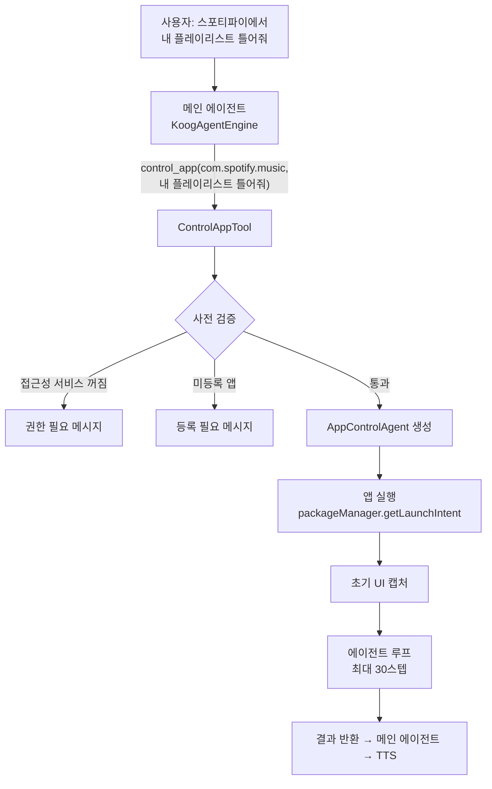
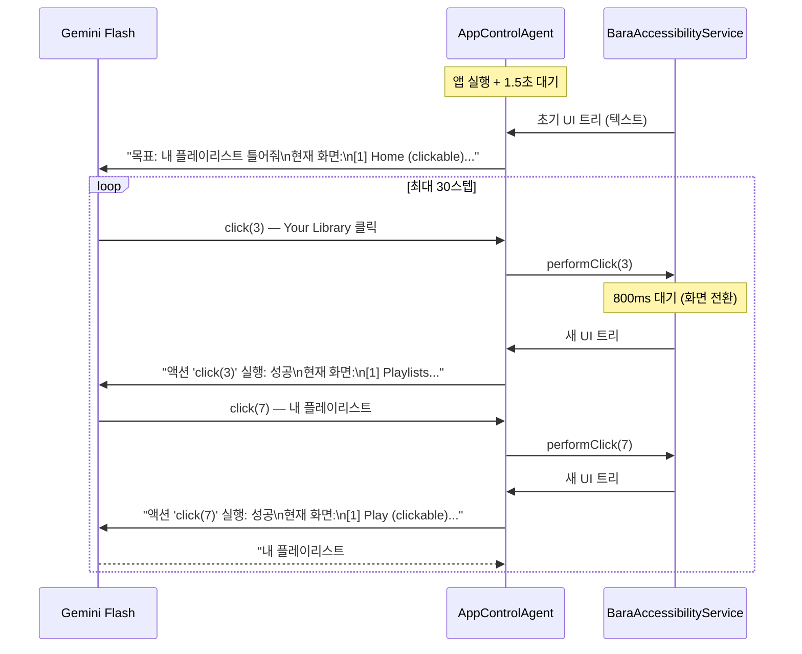
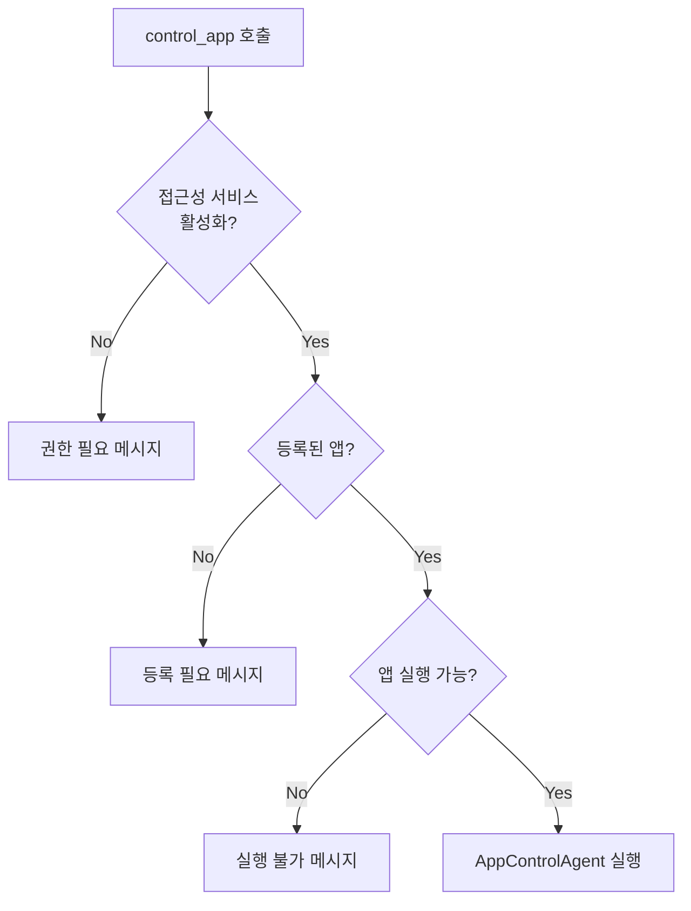

# "스포티파이에서 내 플레이리스트 틀어줘"

음성 비서가 전화를 걸고, 일정을 추가하고, 문자를 보내는 건 API 호출이면 됩니다. 그런데 "스포티파이에서 내 플레이리스트 틀어줘"는? Spotify API가 없으면 불가능할까요? Hey Bara는 AccessibilityService로 화면의 UI 트리를 텍스트로 캡처하고, LLM이 이 텍스트를 분석해 click/type/scroll 액션을 결정하는 방식으로, **API 없이도 아무 앱이나 조작**할 수 있는 에이전트를 만들었습니다.

## 아키텍처: 2단계 에이전트 위임

일반적인 Tool은 한 번의 함수 호출로 끝납니다. 하지만 앱 조작은 다릅니다. "플레이리스트 틀어줘"라는 목표를 달성하려면 앱 실행 → 탭 전환 → 리스트 탐색 → 재생 버튼 클릭까지 여러 단계가 필요합니다. 이 문제를 **2단계 에이전트 위임**으로 해결했습니다.



메인 에이전트(`KoogAgentEngine`)는 15개 도구 중 하나로 `control_app`을 호출할 뿐입니다. 실제 앱 조작은 별도의 `AppControlAgent`가 독립된 LLM 세션에서 처리합니다. 메인 에이전트의 컨텍스트가 UI 트리 텍스트로 오염되지 않습니다.

## AccessibilityService: UI 트리를 텍스트로 변환

Android의 AccessibilityService는 원래 시각 장애인을 위한 API입니다. 화면의 모든 UI 요소를 트리 형태로 접근할 수 있고, 클릭/입력/스크롤 같은 액션을 프로그래밍적으로 실행할 수 있습니다. Hey Bara는 이 API를 LLM의 "눈"과 "손"으로 사용합니다.

`captureUiTree()`는 `rootInActiveWindow`에서 시작해 재귀적으로 UI 트리를 순회합니다. 라벨이 있거나 상호작용 가능한(clickable, editable, scrollable) 노드만 필터링해서 인덱싱된 텍스트로 변환합니다. 출력은 이런 형태입니다:

```
현재 앱: com.spotify.music
[1] TextView: 'Home' (clickable)
[2] TextView: 'Search' (clickable)
[3] TextView: 'Your Library' (clickable)
[4] ImageView: '' (clickable)
[5] TextView: '최근 재생한 항목'
[6] TextView: 'Daily Mix 1' (clickable)
[7] TextView: '내 플레이리스트 #1' (clickable)
[8] RecyclerView: '' (scrollable)
```

핵심 설계 결정 두 가지:

1. **인덱싱**: 각 노드에 `[1]`, `[2]` 번호를 부여. LLM이 "7번 클릭"이라고 말하면 해당 노드를 정확히 찾을 수 있음
2. **필터링**: `hasLabel || hasInteraction`인 노드만 포함. UI 트리 전체를 넘기면 토큰이 폭발하므로, LLM이 판단에 필요한 노드만 추출

## AppControlAgent: LLM이 UI를 조작하는 루프



AppControlAgent의 핵심은 **각 Tool이 액션 실행 후 새 UI 상태를 반환**한다는 점입니다.

```kotlin
private fun actionResult(action: String, success: Boolean): String {
    val status = if (success) "성공" else "실패"
    val uiTree = BaraAccessibilityService.captureUiTree() ?: "UI 캡처 실패"
    return "액션 '$action' 실행: $status\n\n현재 화면:\n$uiTree"
}
```

LLM은 매 스텝마다 "현재 화면이 어떤 상태인지" 볼 수 있습니다. 눈을 감고 클릭하는 게 아니라, 클릭 후 화면이 어떻게 바뀌었는지 확인하고 다음 행동을 결정합니다.

## 8개 액션 도구

AppControlAgent는 8개의 도구를 LLM에 제공합니다.

| 도구 | 동작 | 용도 |
|---|---|---|
| `click(id)` | UI 요소 클릭 | 버튼 탭, 리스트 항목 선택 |
| `long_click(id)` | 길게 누르기 | 컨텍스트 메뉴 열기 |
| `type_text(id, text)` | 텍스트 입력 | 검색창, 메시지 입력 |
| `scroll_down` | 아래로 스크롤 | 리스트 탐색 |
| `scroll_up` | 위로 스크롤 | 이전 항목으로 이동 |
| `press_enter` | 엔터키 | 검색 실행 |
| `press_back` | 뒤로가기 | 이전 화면 복귀 |
| `wait_and_get_screen(ms)` | 대기 후 화면 캡처 | 로딩 대기, 현재 상태 확인 |

모든 도구가 동일한 패턴을 따릅니다: **액션 실행 → 800ms 대기 → UI 캡처 → 결과 반환**.

```kotlin
object ClickTool : SimpleTool<ClickTool.Args>(...) {
    override suspend fun execute(args: Args): String {
        val result = BaraAccessibilityService.performClick(args.id)
        delay(ACTION_DELAY_MS)  // 800ms — 화면 전환 대기
        return actionResult("click(${args.id})", result)
    }
}
```

800ms 딜레이가 중요합니다. 클릭 직후에 UI를 캡처하면 아직 화면이 전환되지 않은 상태를 읽게 됩니다. 너무 길면 전체 작업이 느려집니다.

| 딜레이 | 문제 |
|---|---|
| 0ms | 이전 화면을 읽음 → LLM이 같은 버튼을 반복 클릭 |
| 300ms | 빠른 앱은 OK, 느린 앱은 아직 전환 안 됨 |
| **800ms** | **대부분의 앱에서 화면 전환 완료** |
| 2000ms | 안전하지만 30스텝 × 2초 = 60초 → 사용자 이탈 |

## 시스템 프롬프트: 규칙 기반 에이전트

```
너는 Android 앱을 조작하는 에이전트야.
사용자의 목표를 달성하기 위해 제공된 도구들을 사용해 앱을 조작해.

도구를 호출하면 액션이 실행되고, 실행 결과와 함께 현재 화면의 UI 상태가 반환돼.
UI 상태를 분석하고 다음 액션을 결정해.

규칙:
- 한 번에 하나의 도구만 호출해
- 목표를 달성하면 결과를 텍스트로 응답해 (도구 호출 없이)
- 달성 불가능하면 이유를 텍스트로 응답해
- 현재 UI에 보이는 요소의 id만 사용해
```

"한 번에 하나의 도구만 호출해"가 핵심 규칙입니다. 병렬 도구 호출을 허용하면 두 클릭이 동시에 실행되어 예측 불가능한 상태가 됩니다. UI 조작은 본질적으로 순차적입니다.

## 안전장치: 등록 앱 화이트리스트

ControlAppTool은 아무 앱이나 조작하지 않습니다. 3단계 사전 검증을 거칩니다:



| 검증 단계 | 이유 |
|---|---|
| 접근성 서비스 확인 | 꺼져 있으면 UI 캡처/클릭 불가 |
| 화이트리스트 확인 | 은행 앱, 인증 앱 등 민감한 앱 조작 방지 |
| 실행 가능 확인 | 패키지명이 잘못되었거나 미설치된 앱 방어 |

## 메인 에이전트와의 컨텍스트 격리

AppControlAgent는 메인 에이전트와 완전히 독립된 LLM 세션을 사용합니다.

```kotlin
// ControlAppTool.execute() 내부
return AppControlAgent(key).execute(ctx, args.packageName, args.goal)
```

매 호출마다 새로운 `AppControlAgent`를 생성합니다. 이전 앱 조작의 UI 트리가 다음 조작에 영향을 미치지 않습니다. 메인 에이전트도 AppControlAgent의 중간 과정(30스텝의 UI 캡처, 클릭, 스크롤)을 전혀 모릅니다. 최종 결과 문자열("내 플레이리스트 #1 재생을 시작했습니다")만 받을 뿐입니다.

| 항목 | 메인 에이전트 | AppControlAgent |
|---|---|---|
| 모델 | gemini-3.1-flash-lite | gemini-3.1-flash-lite |
| 최대 스텝 | 15 | 30 |
| 도구 수 | 14개 (범용) | 8개 (UI 조작 전용) |
| 시스템 프롬프트 | 음성 비서 전반 | 앱 조작 규칙만 |
| 컨텍스트 | 대화 히스토리 포함 | UI 트리만 |

## 한계와 트레이드오프

이 접근법의 한계를 정직하게 기록합니다.

| 한계 | 설명 | 완화 방안 |
|---|---|---|
| 토큰 비용 | 매 스텝마다 UI 트리 전체 전송 (평균 ~1K 토큰) | 필터링으로 필요한 노드만 포함 |
| 속도 | 5스텝 작업 ≈ 5~8초 | 800ms 딜레이 최적화, flash-lite 모델 사용 |
| 동적 UI | 애니메이션/지연 로딩 중 캡처 시 불완전 | 800ms 딜레이 + wait_and_get_screen 도구 |
| WebView | 웹 콘텐츠는 접근성 트리에 제한적 노출 | 네이티브 앱 위주로 등록 유도 |
| 30스텝 제한 | 복잡한 작업 시 스텝 부족 가능 | 목표를 구체적으로 지정하도록 프롬프트 유도 |

## 핵심 인사이트

- **AccessibilityService + LLM = 범용 앱 자동화 에이전트**: API가 없어도 화면을 "읽고" UI를 "조작"할 수 있다. 시각 장애인용 API를 AI의 감각기관으로 전용한 발상의 전환
- **UI 트리의 텍스트 변환에서 필터링이 핵심이다**: 전체 UI 트리를 넘기면 토큰이 폭발하고 LLM이 혼란스러워한다. `hasLabel || hasInteraction` 필터 하나로 불필요한 노드를 제거하고, 인덱싱으로 LLM이 명확하게 참조할 수 있게 한다
- **2단계 에이전트 위임으로 컨텍스트 오염을 방지한다**: 메인 에이전트가 30스텝의 UI 조작 과정을 직접 처리하면 컨텍스트가 폭발한다. 별도 에이전트에 위임하고 최종 결과만 받으면 메인 에이전트의 컨텍스트가 깨끗하게 유지된다
- **800ms 딜레이는 정밀하게 튜닝된 값이다**: 화면 전환을 기다리되 전체 작업 시간(30스텝 기준 최대 24초)을 억제하는 타협점. 0ms면 이전 화면을 읽고, 2초면 사용자가 이탈한다
- **화이트리스트는 기술이 아니라 신뢰의 문제다**: 접근성 서비스는 화면의 모든 것을 읽을 수 있으므로 은행 앱 비밀번호까지 볼 수 있다. 사용자가 명시적으로 등록한 앱만 조작하는 것은 기술적 제약이 아니라 윤리적 설계
- **"한 번에 하나의 도구만 호출" 규칙이 안정성의 열쇠다**: UI 조작은 본질적으로 순차적이다. 두 클릭을 동시에 실행하면 예측 불가능한 상태가 된다. 이 규칙 하나로 에이전트의 행동이 결정적(deterministic)이 된다
