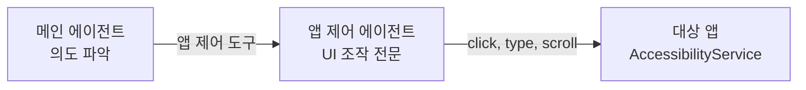

# "스포티파이에서 내 플레이리스트 틀어줘"

음성 비서가 전화를 걸고, 일정을 추가하고, 문자를 보내는 건 API 호출이면 된다. 그런데 "스포티파이에서 내 플레이리스트 틀어줘"는? Spotify API가 없으면 불가능할까. AccessibilityService로 화면의 UI 트리를 읽고, LLM이 어떤 버튼을 누를지 판단하는 방식으로, **API 없이도 앱을 조작**하는 에이전트를 만들었다.

## 에이전트가 에이전트를 부른다

메인 에이전트가 직접 앱을 조작하지 않는다. "앱 제어"라는 도구를 호출하면, 그 안에서 **별도의 에이전트**가 생성되어 앱 조작을 담당한다. 2단계 위임 구조다.

메인 에이전트는 "스포티파이에서 플레이리스트를 틀어라"라는 **목표**만 전달한다. 앱 제어 에이전트가 화면을 읽고, 어디를 클릭하고, 뭘 입력할지를 스스로 판단한다. 두 에이전트의 컨텍스트는 완전히 격리된다. 메인 에이전트의 대화 히스토리가 앱 제어 에이전트에 영향을 주지 않고, 역도 마찬가지다.

## 화면을 텍스트로 읽는다

AccessibilityService가 현재 화면의 **UI 트리를 텍스트로 변환**한다. 각 UI 요소에 인덱스를 부여하고, 요소의 타입(버튼, 텍스트, 입력란), 표시 텍스트, 클릭 가능 여부를 텍스트로 나열한다. LLM은 이 텍스트를 읽고 "3번 버튼을 클릭해라"같은 판단을 내린다.

앱 제어 에이전트에게 8개의 조작 도구가 있다. 클릭, 롱클릭, 텍스트 입력, 위/아래 스크롤, 엔터, 뒤로가기, 화면 새로고침. 에이전트가 도구를 하나 실행하면, 800ms 후에 화면이 갱신된 것을 확인하고 다음 판단을 내린다. 이 루프를 최대 30번 반복한다.

800ms 대기가 중요하다. UI 전환(애니메이션, 데이터 로딩)이 끝나기 전에 다음 액션을 실행하면 엉뚱한 화면에서 동작한다. 실험적으로 800ms가 대부분의 UI 전환을 커버하는 값이었다.

## 아무 앱이나 조작하면 안 된다

보안이 중요하다. 접근성 서비스가 모든 앱에 접근할 수 있다는 건, 뱅킹 앱이나 비밀번호 관리자도 조작할 수 있다는 뜻이다.

세 겹의 안전장치를 뒀다. 첫째, **화이트리스트**. 사용자가 직접 등록한 앱만 조작 가능하다. 등록하지 않은 앱은 에이전트가 열 수 없다. 둘째, **접근성 서비스 상태 확인**. 서비스가 비활성화되어 있으면 앱 제어 자체를 거부한다. 셋째, **앱 실행 확인**. 대상 앱이 실제로 설치되어 있고 실행 가능한지 확인한다.

## 한계도 명확하다

솔직하게 한계를 정리한다. LLM이 매 단계마다 화면을 분석하고 판단하기 때문에 **느리다.** 한 단계에 수 초가 걸리고, 복잡한 작업은 30단계까지 갈 수 있다. 동적으로 변하는 UI(로딩 스피너, 애니메이션)에서 타이밍이 어긋나는 경우도 있다. WebView 안의 요소는 접근성 트리에 제대로 노출되지 않아 조작이 어렵다.

그럼에도 이 접근의 가치는 **범용성**이다. 새로운 앱을 지원하기 위해 코드를 한 줄도 추가할 필요 없다. 사용자가 화이트리스트에 앱을 등록하면 에이전트가 알아서 화면을 읽고 조작한다.

## 돌이켜보면

앱 제어 에이전트의 핵심은 **"API가 없어도 화면을 읽으면 된다"**는 발상이다. AccessibilityService가 화면을 텍스트로 변환하고, LLM이 텍스트를 읽고 행동을 결정한다. 느리고 완벽하지 않지만, API 통합 없이 아무 앱이나 조작할 수 있다는 범용성은 다른 방식으로 얻기 어렵다.
