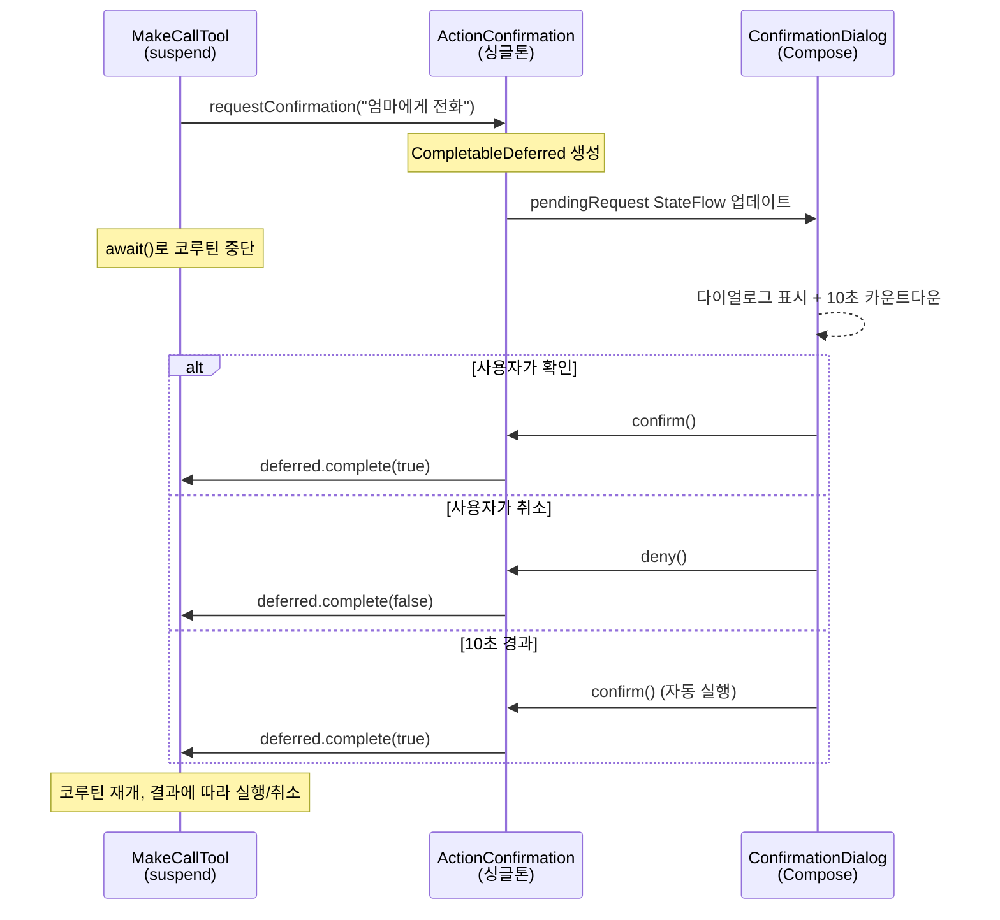

# Kotlin Channel 하나로 Agent와 UI를 이어붙이다

AI Agent가 "엄마한테 전화를 겁니다"라고 판단했을 때, 곧바로 실행하면 안 됩니다. 전화, 문자, 카카오톡 — 되돌릴 수 없는 액션은 반드시 사용자 확인을 거쳐야 합니다. 문제는 Agent의 Tool 실행이 코루틴 안에서 돌아가고, 사용자 확인은 Compose UI에서 일어난다는 것입니다. 서로 다른 세계를 어떻게 이어붙일 것인가.

## 문제 — Tool은 suspend, UI는 Compose

Koog의 `SimpleTool.execute()`는 `suspend fun`입니다. Agent가 Function Calling으로 `make_call`을 호출하면, 이 코루틴 안에서 전화를 걸어야 합니다. 하지만 "정말 전화를 걸까요?" 다이얼로그를 띄우고 사용자 응답을 받아야 합니다.

일반적인 접근법은 콜백입니다. Tool이 UI에 콜백을 등록하고, UI가 응답하면 콜백을 호출합니다. 하지만 이렇게 하면 Tool의 실행 흐름이 끊깁니다. `execute()`가 리턴된 후 콜백에서 이어가야 하므로 상태 관리가 복잡해집니다.

## 해결 — CompletableDeferred로 코루틴을 멈추고 재개한다

핵심 아이디어는 `CompletableDeferred<Boolean>` 하나입니다. Tool이 Deferred를 만들어 UI에 건네고, `await()`로 코루틴을 중단합니다. UI가 `complete(true)` 또는 `complete(false)`를 호출하면 Tool의 코루틴이 재개됩니다.



## 구현 — ActionConfirmation 싱글톤

브릿지 역할을 하는 것은 `ActionConfirmation` 싱글톤입니다. Tool 쪽과 UI 쪽 각각에게 단 하나의 메서드만 노출합니다.

```kotlin
object ActionConfirmation {
    private val _pendingRequest = MutableStateFlow<ConfirmationRequest?>(null)
    val pendingRequest: StateFlow<ConfirmationRequest?> = _pendingRequest

    // Tool에서 호출 — 코루틴이 여기서 멈춤
    suspend fun requestConfirmation(description: String, type: ActionType): Boolean {
        val deferred = CompletableDeferred<Boolean>()
        _pendingRequest.value = ConfirmationRequest(description, type, deferred)
        return try {
            deferred.await()  // 사용자 응답까지 suspend
        } finally {
            _pendingRequest.value = null  // 다이얼로그 닫기
        }
    }

    // UI에서 호출 — 코루틴 재개
    fun confirm() { _pendingRequest.value?.deferred?.complete(true) }
    fun deny() { _pendingRequest.value?.deferred?.complete(false) }
}
```

`requestConfirmation()`은 `suspend fun`이므로 Tool의 `execute()` 안에서 자연스럽게 호출됩니다. `deferred.await()`가 코루틴을 중단하고, UI에서 `confirm()` 또는 `deny()`가 호출되면 재개됩니다. `finally` 블록이 요청을 정리해서 다이얼로그가 자동으로 닫힙니다.

## Tool 쪽 — 한 줄 확인

Tool에서는 `requestConfirmation()` 한 줄로 HITL을 적용합니다.

```kotlin
object MakeCallTool : SimpleTool<MakeCallTool.Args>(...) {
    override suspend fun execute(args: Args): String {
        val confirmed = ActionConfirmation.requestConfirmation(
            "${args.contact}님에게 전화를 겁니다", ActionType.CALL
        )
        if (!confirmed) return "사용자가 취소했습니다."
        // 확인된 경우에만 전화 실행
        appContext?.startActivity(callIntent)
        return "${args.contact}에게 전화를 걸었습니다."
    }
}
```

`MakeCallTool`, `SendSmsTool`, `SendKakaoTool` — 위험 액션 3개 Tool이 모두 같은 패턴을 씁니다. 확인이 필요 없는 `SearchContactsTool`이나 `ListEventsTool`은 그냥 실행합니다.

## UI 쪽 — 10초 카운트다운 자동 승인

```kotlin
@Composable
fun ActionConfirmationDialog(...) {
    var remainingSeconds by remember { mutableIntStateOf(10) }

    LaunchedEffect(Unit) {
        while (remainingSeconds > 0) {
            delay(1000)
            remainingSeconds--
        }
        onConfirm()  // 10초 후 자동 실행
    }

    // "엄마님에게 전화를 겁니다"
    // "7초 후 자동 실행"
    // [취소] [실행]
}
```

음성 비서의 특성상 사용자가 화면을 보고 있지 않을 수 있습니다. 10초 카운트다운 후 자동 승인하는 이유입니다. 운전 중이라면 "취소"라고 말할 여유는 있지만, 버튼을 누를 수는 없습니다. 급히 취소하고 싶으면 뒤로가기(dismiss)로 즉시 취소됩니다.

## 왜 Channel이 아니라 CompletableDeferred인가

처음에는 `Channel<Boolean>`을 고려했습니다. Tool이 `channel.receive()`로 대기하고, UI가 `channel.send(true)`로 응답하는 방식입니다. 하지만 Channel은 여러 메시지를 주고받는 스트림에 적합하고, 이 경우는 **요청 1개에 응답 1개**의 단발성 통신입니다. `CompletableDeferred`가 정확히 이 시맨틱에 맞습니다 — 한 번만 완료될 수 있고, 완료되면 값을 반환합니다.

`StateFlow`는 UI 쪽의 구독에 사용합니다. `pendingRequest`가 `null`이 아니면 다이얼로그가 나타나고, `null`이면 사라집니다. Compose의 `collectAsState()`와 자연스럽게 연결됩니다.

## 핵심 인사이트

- **CompletableDeferred는 "요청-응답" 일회성 브릿지의 정답**: Channel은 스트림, Deferred는 단발성. suspend + await 패턴으로 Tool의 실행 흐름을 끊지 않고 UI 응답을 기다림
- **싱글톤 브릿지로 Tool과 UI의 결합도를 제거**: Tool은 `ActionConfirmation.requestConfirmation()`만 알면 되고, UI는 `pendingRequest` StateFlow만 구독하면 됨. 서로의 존재를 모름
- **10초 자동 승인은 음성 비서 UX의 필수 요소**: 화면을 볼 수 없는 상황에서도 동작해야 함. 카운트다운 + 음성 안내로 사용자에게 취소 기회를 주되, 무응답이면 실행
