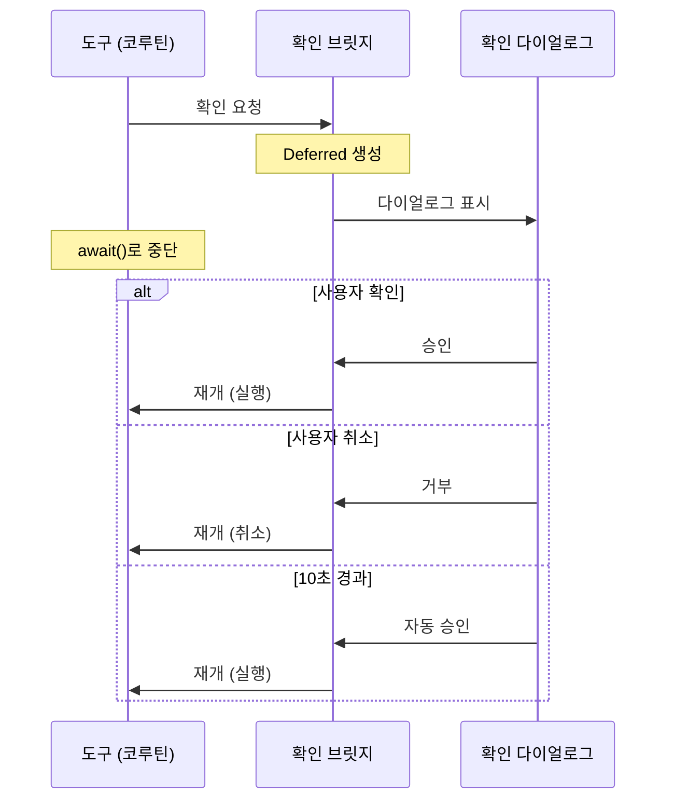

# AI가 멋대로 전화를 걸면 안 되잖아

"엄마한테 전화해줘." 음성 비서가 이 말을 듣고 바로 전화를 걸어버리면? 만약 인식이 잘못되어 다른 사람에게 전화가 간다면? AI가 실제 세계에 영향을 미치는 행동을 할 때, 사용자 확인 없이 실행하는 것은 위험하다.

## 되돌릴 수 없는 행동이 있다

에이전트의 도구는 위험도에 따라 세 등급으로 나뉜다.

| 등급 | 도구 예시 | 확인 필요 |
|---|---|---|
| 읽기 전용 | 연락처 검색, 일정 조회, 알림 읽기 | 불필요 |
| 되돌릴 수 있음 | 일정 생성, 태스크 추가/삭제 | 불필요 |
| **되돌릴 수 없음** | 전화 걸기, SMS, 카카오톡 | **필수** |

전화가 한번 걸리면 상대방에게 부재중 전화가 남고, 문자는 회수가 불가능하다. 이런 행동에는 반드시 사용자 확인이 필요하다.

## 두 세계를 연결해야 한다

문제의 핵심은 **도구와 UI가 다른 세계에서 동작한다**는 점이다. 도구의 실행 함수는 코루틴 안에서 돌아가고, 확인 다이얼로그는 Compose UI에서 렌더링된다. 도구가 "사용자에게 물어보고 답을 받을 때까지 기다린다"를 하려면, 코루틴을 중단하고 UI 응답이 오면 재개하는 **브릿지**가 필요하다.

일반적인 접근법은 콜백이다. 도구가 UI에 콜백을 등록하고, UI가 응답하면 콜백을 호출한다. 하지만 이렇게 하면 도구의 실행 흐름이 끊긴다. 실행 함수가 리턴된 후 콜백에서 이어가야 하므로 상태 관리가 복잡해진다.

## 코루틴을 멈추고 UI가 재개한다

Kotlin의 `CompletableDeferred`가 이 브릿지 역할을 한다. 도구가 Deferred를 만들어 UI에 건네고 `await()`로 코루틴을 중단한다. UI가 확인 다이얼로그를 표시하고, 사용자가 응답하면 `complete()`로 코루틴을 재개한다.

핵심은 도구의 코드가 **동기적 흐름처럼 읽힌다**는 점이다. "확인 요청 → 결과에 따라 실행 또는 취소" — 콜백 지옥 없이, 코루틴의 suspend/resume으로 깔끔하게 처리된다.

## 10초 자동 실행의 이유

확인 다이얼로그에 10초 카운트다운이 있다. 시간이 지나면 자동으로 실행된다. 이상해 보일 수 있지만, 음성 비서의 맥락에서는 합리적이다.

사용자가 "엄마한테 전화해줘"라고 말한 건 **이미 의도를 표현한 것**이다. 확인은 "정말 맞아?"를 묻는 최후의 안전장치이지, 새로운 의사결정을 요구하는 게 아니다. 10초 동안 취소하지 않았다면 원래 의도대로 진행하는 게 자연스럽다. 운전 중이거나 손이 자유롭지 않을 때, 매번 "확인" 버튼을 눌러야 한다면 음성 비서의 의미가 퇴색된다.

## Channel이 아니라 Deferred인 이유

Kotlin에는 `Channel`도 있다. 왜 `CompletableDeferred`를 선택했을까.

확인 요청은 **요청 하나에 응답 하나**다. Channel은 여러 메시지를 주고받는 스트림에 적합하고, Deferred는 한 번의 요청에 한 번의 응답을 기다리는 패턴에 정확히 맞는다. 의미론적으로 정확한 도구를 선택한 것이다. Channel을 쓰면 동작은 하지만, "이 Channel에 메시지가 하나만 온다"는 제약을 코드로 강제해야 한다.

## 도구가 확인 로직을 소유한다

확인이 필요한지 아닌지를 에이전트가 판단하는 게 아니라, **도구가 스스로 판단**한다. 전화 걸기 도구는 내부에서 확인 요청을 보내고, 에이전트는 도구가 확인 과정을 거치는지 모른다. 이렇게 하면 에이전트 로직을 건드리지 않고도 어떤 도구에 확인을 붙일지 자유롭게 조절할 수 있다.

## 돌이켜보면

핵심은 **코루틴과 UI라는 두 세계를 Deferred 하나로 연결한 것**이다. 콜백 없이, 상태 머신 없이, 도구의 코드가 동기적 흐름을 유지하면서 사용자 확인을 거친다. 되돌릴 수 없는 행동에만 확인을 걸되, 10초 자동 실행으로 음성 비서의 자연스러운 흐름을 보존한다.
