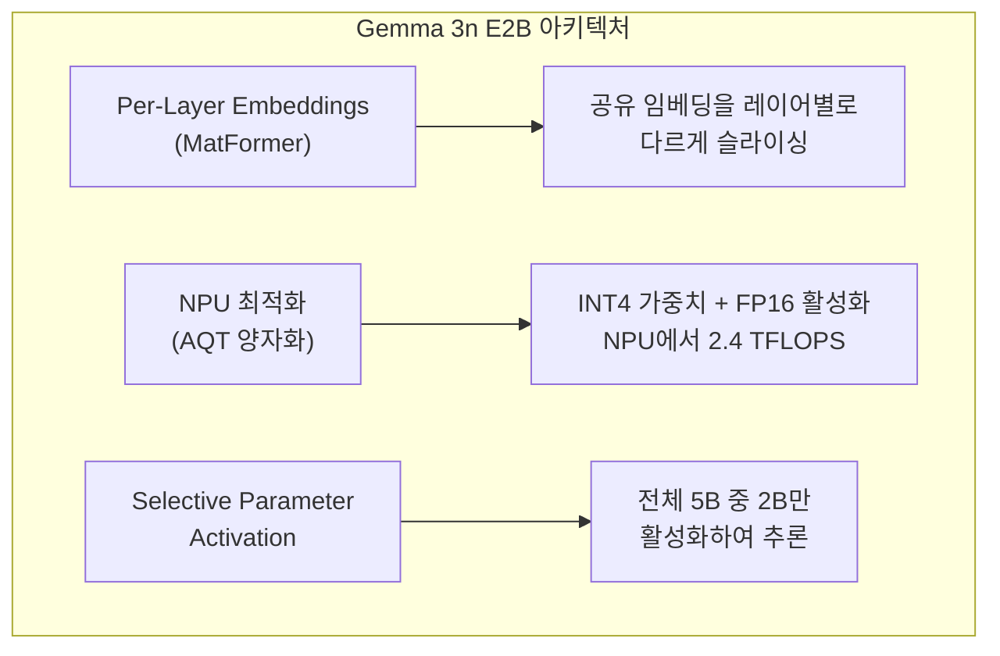
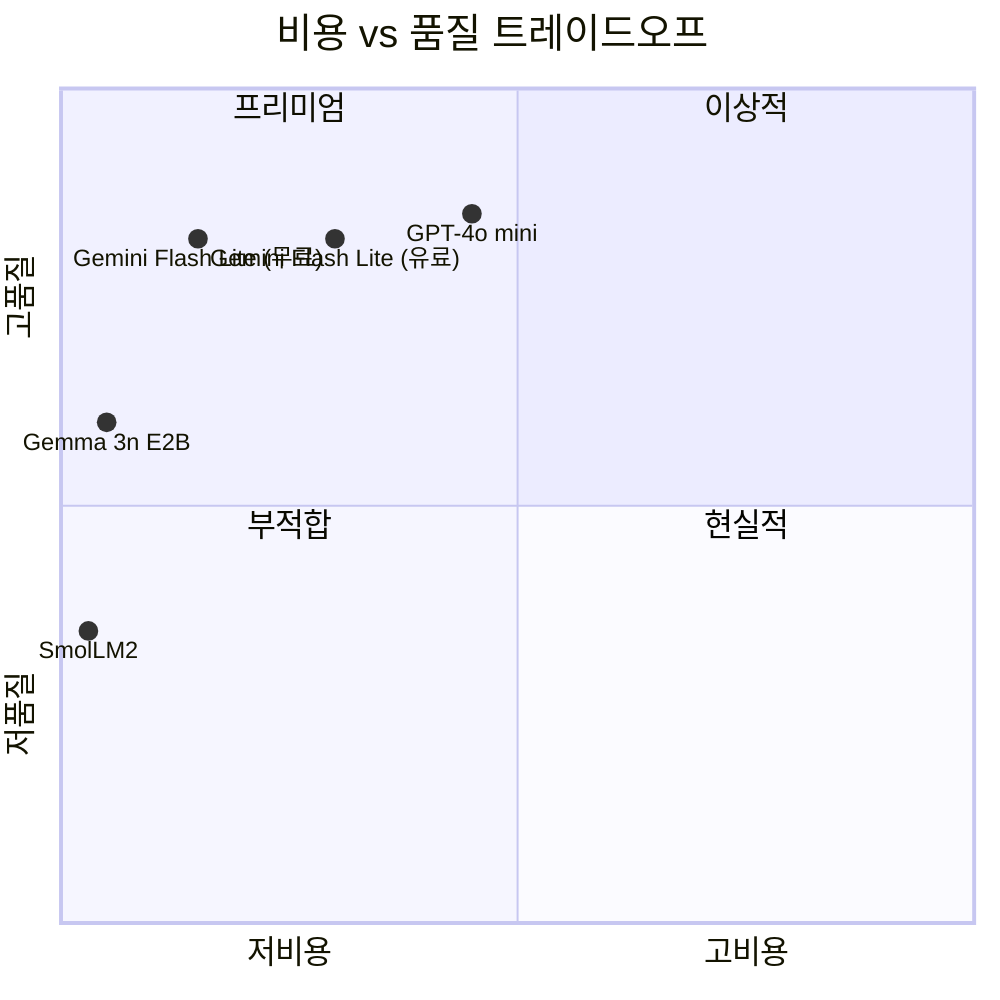
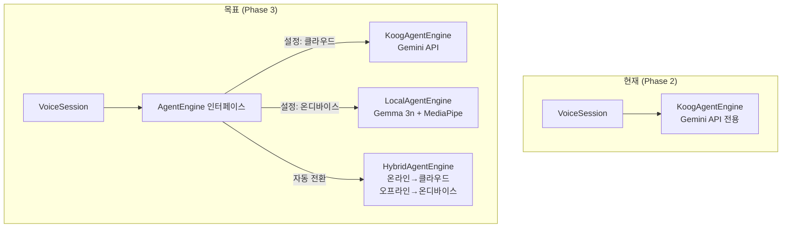
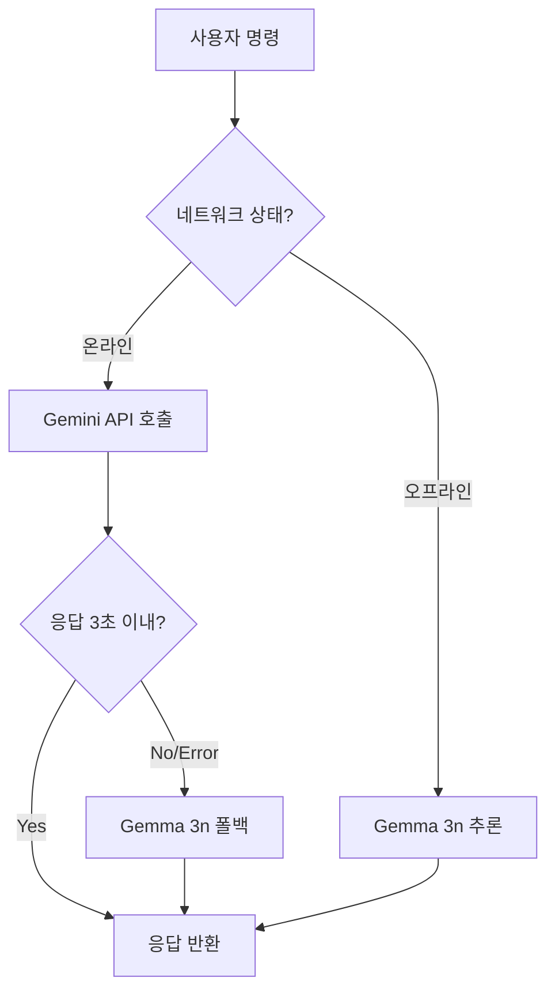
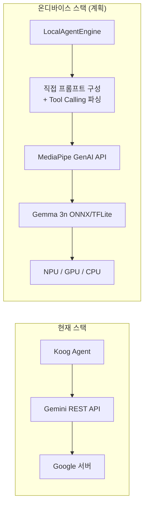
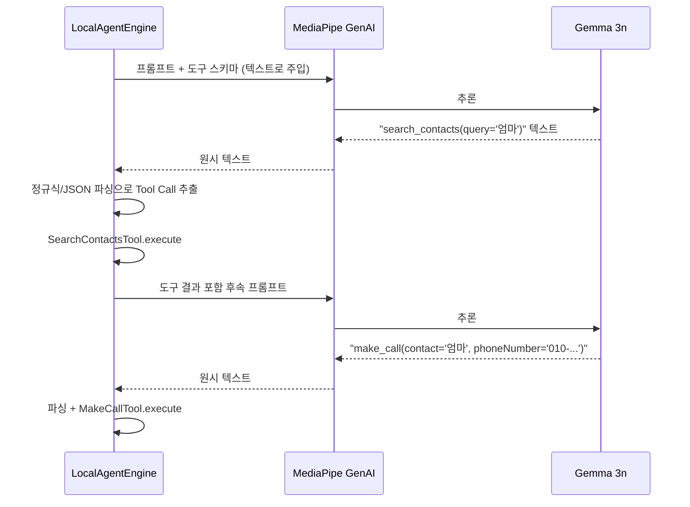
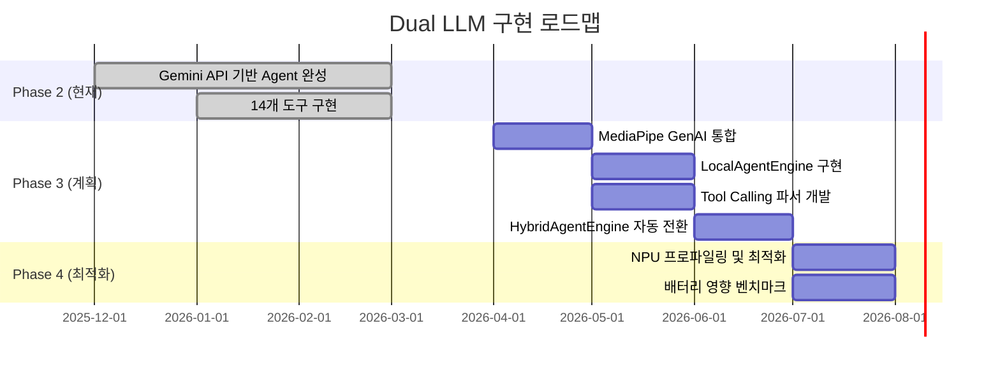

# 클라우드가 안 되면? 폰이 직접 생각한다

지하철 터널, 비행기 안, 해외 로밍 꺼진 상태. 인터넷이 없으면 AI 비서가 먹통이 됩니다. Hey Bara는 클라우드 LLM(Gemini API)을 기본으로 사용하되, 온디바이스 LLM(Gemma 3n)으로 전환할 수 있는 이중 구조를 설계했습니다. 비용, 지연시간, 품질, 프라이버시 — 네 가지 축의 트레이드오프를 분석하고, 전환 전략을 정리합니다.

## 현재 구현: Gemini API (클라우드)

Hey Bara의 현재 NLP 엔진은 `KoogAgentEngine`이 Gemini 3.1 Flash Lite를 호출하는 구조입니다.

```kotlin
companion object {
    private const val MODEL_ID = "gemini-3.1-flash-lite-preview"
}

private val executor = simpleGoogleAIExecutor(apiKey)
private val model = LLModel(
    provider = LLMProvider.Google,
    id = MODEL_ID,
    capabilities = listOf(
        LLMCapability.Completion,
        LLMCapability.Tools,
        LLMCapability.ToolChoice,
        LLMCapability.Temperature,
    ),
)
```

### Gemini 3.1 Flash Lite를 선택한 이유

| 모델 | 입력 비용 | 출력 비용 | Tool Calling | 응답 속도 |
|---|---|---|---|---|
| GPT-4o mini | $0.15/1M | $0.60/1M | O | ~800ms |
| Claude 3.5 Haiku | $0.80/1M | $4.00/1M | O | ~600ms |
| **Gemini 3.1 Flash Lite** | **무료 티어 15 RPM** | **무료 티어 15 RPM** | **O** | **~400ms** |
| Gemini 2.0 Flash | 무료 티어 10 RPM | 무료 티어 10 RPM | O | ~500ms |

결정적 요인은 **무료 티어**입니다. 개인 프로젝트에서 API 비용은 진입 장벽입니다. Gemini 3.1 Flash Lite는 분당 15회 요청까지 무료이고, 음성 비서의 사용 패턴(간헐적, 짧은 대화)에서 이 한도를 초과할 일이 거의 없습니다.

## 온디바이스 후보: Gemma 3n E2B

Google이 2025년 발표한 Gemma 3n은 모바일 최적화 LLM입니다. E2B(Efficient 2 Billion) 변형은 5B 파라미터를 가지면서도 ~2GB RAM으로 구동됩니다.

### Gemma 3n의 핵심 기술



| 항목 | Gemma 3n E2B | Phi-4 mini | SmolLM2 1.7B |
|---|---|---|---|
| 총 파라미터 | 5B (활성 2B) | 3.8B | 1.7B |
| 필요 RAM | ~2GB | ~3GB | ~1.5GB |
| NPU 지원 | O (AQT) | X | X |
| 한국어 성능 | 양호 (multilingual) | 제한적 | 제한적 |
| Tool Calling | O (Function Calling) | O | X |
| 통합 방식 | MediaPipe GenAI | llama.cpp | llama.cpp |

Gemma 3n을 선택한 이유는 세 가지입니다. (1) **NPU 가속**: Qualcomm/MediaTek의 NPU를 활용해 CPU 대비 3~5배 빠른 추론. (2) **Function Calling 지원**: 14개 도구를 온디바이스에서도 호출 가능. (3) **MediaPipe GenAI 통합**: Google의 공식 Android AI 추론 프레임워크로 배포 간편.

## 클라우드 vs 온디바이스 — 정량 비교



| 지표 | Gemini 3.1 Flash Lite (클라우드) | Gemma 3n E2B (온디바이스) |
|---|---|---|
| **응답 지연** | ~400ms (네트워크 포함) | ~800ms (NPU) / ~2s (CPU) |
| **비용** | 무료 (15 RPM) / $0.075/1M 초과 시 | 완전 무료 |
| **Tool Calling 정확도** | 95%+ (14개 도구) | ~75% (복잡한 도구 체인에서 하락) |
| **한국어 자연스러움** | 자연스러움 | 간헐적 어색함 |
| **오프라인** | X | O |
| **프라이버시** | 서버 전송 | 디바이스 내 처리 |
| **모델 크기** | 0 (서버) | ~2GB (디스크 + RAM) |
| **최대 컨텍스트** | 1M tokens | 32K tokens |

### Tool Calling 정확도 차이의 원인

클라우드 Gemini의 Function Calling은 대규모 학습 데이터로 도구 선택과 인자 생성이 정확합니다. Gemma 3n은 "엄마한테 전화해"처럼 단순한 명령은 잘 처리하지만, "내일 오후 3시에 회의 일정 잡고, 철수한테 문자로 알려줘"처럼 **두 개 이상의 도구를 연쇄 호출**해야 하는 경우 정확도가 떨어집니다.

| 명령 유형 | 클라우드 정확도 | 온디바이스 정확도 |
|---|---|---|
| 단일 도구 ("전화해") | ~98% | ~90% |
| 2단계 체인 ("검색 → 전화") | ~95% | ~75% |
| 3단계 이상 ("검색 → 일정 생성 → 문자") | ~90% | ~55% |
| 상대 날짜 계산 ("다음 주 수요일") | ~95% | ~70% |

## 전환 전략 설계

### 설정 UI — 사용자 선택

현재 설정 화면에 AI 엔진 토글이 이미 구현되어 있습니다.

```kotlin
// SettingsActivity.kt
SettingsSection(label = "AI 엔진") {
    Column(verticalArrangement = Arrangement.spacedBy(0.dp)) {
        SettingsOptionRow(
            title = "온디바이스 (Gemma 3n)",
            subtitle = "오프라인, 무료, 프라이버시 보호",
            enabled = false  // Phase 3+에서 활성화 예정
        )
        HorizontalDivider(color = BaraColors.Background, thickness = 1.dp)
        SettingsOptionRow(
            title = "클라우드 (Gemini API)",
            subtitle = "더 정확, 인터넷 필요, 무료 티어",
            enabled = true
        )
    }
}
```

### 계획된 아키텍처: AgentEngine 인터페이스 활용



`AgentEngine` 인터페이스가 이미 추상화되어 있습니다.

```kotlin
interface AgentEngine {
    suspend fun process(text: String): String
    fun release()
}
```

`KoogAgentEngine`이 이 인터페이스를 구현하고 있으므로, `LocalAgentEngine`을 같은 인터페이스로 구현하면 `VoiceSession`의 코드 변경 없이 엔진을 교체할 수 있습니다.

### 자동 전환 전략 (HybridAgentEngine)



계획된 `HybridAgentEngine`은 세 가지 모드를 지원합니다.

| 모드 | 동작 | 대상 사용자 |
|---|---|---|
| **클라우드 우선** | 온라인이면 Gemini, 오프라인이면 Gemma 3n | 대부분의 사용자 |
| **온디바이스 전용** | 항상 Gemma 3n | 프라이버시 중시 사용자 |
| **클라우드 전용** | Gemini만 사용, 오프라인 시 에러 | API 키 보유 사용자 |

## MediaPipe GenAI 통합 계획

Google의 MediaPipe GenAI는 Android에서 LLM을 실행하는 공식 프레임워크입니다. Gemma 3n의 NPU 가속을 활용하려면 MediaPipe를 통해야 합니다.



### 온디바이스 Tool Calling 구현 과제

Koog의 `AIAgent`는 내부적으로 Gemini API의 Function Calling 프로토콜에 의존합니다. 온디바이스 Gemma 3n은 이 프로토콜을 직접 지원하지 않으므로, `LocalAgentEngine`에서 자체적으로 구현해야 합니다.



핵심 과제는 **LLM 출력 텍스트에서 Tool Call을 정확히 파싱**하는 것입니다. 클라우드 API는 구조화된 JSON으로 반환하지만, 온디바이스 모델은 자유 텍스트로 응답하므로 파싱 실패 가능성이 있습니다.

## 비용 시뮬레이션

음성 비서의 일반적 사용 패턴을 기준으로 월간 비용을 추정합니다.

| 사용량 | Gemini Flash Lite (무료) | Gemini Flash Lite (유료) | Gemma 3n |
|---|---|---|---|
| 하루 10회 명령 | 무료 (15 RPM 이내) | ~$0.02/월 | 무료 |
| 하루 30회 명령 | 무료 (대부분) | ~$0.06/월 | 무료 |
| 하루 100회 명령 | 일부 제한 | ~$0.20/월 | 무료 |
| **디바이스 비용** | **0** | **0** | **~2GB 스토리지** |
| **배터리 영향** | 네트워크 사용 | 네트워크 사용 | NPU ~50mW 추가 |

일반 사용자(하루 10~30회)는 Gemini 무료 티어로 충분합니다. 온디바이스는 비용이 아니라 **오프라인/프라이버시** 관점에서의 가치입니다.

## 리스크와 완화 전략

| 리스크 | 영향 | 완화 |
|---|---|---|
| Gemma 3n Tool Calling 정확도 부족 | 잘못된 도구 호출, 사용자 불만 | 단순 명령만 온디바이스, 복잡한 건 클라우드 유도 |
| 2GB RAM 부족 디바이스 | OOM 크래시 | `ActivityManager.getMemoryInfo()`로 사전 체크, 메모리 부족 시 비활성화 |
| MediaPipe GenAI API 변경 | 온디바이스 엔진 깨짐 | 인터페이스 추상화로 교체 비용 최소화 |
| 온디바이스 텍스트 파싱 실패 | Tool Call 미인식 | 폴백: 파싱 실패 시 일반 대화로 응답 |

## 로드맵



## 핵심 인사이트

- **무료 티어가 개인 프로젝트의 현실적 선택지**: Gemini Flash Lite의 15 RPM 무료 티어는 음성 비서의 간헐적 사용 패턴에 완벽히 부합. 하루 30회 명령까지 비용 0원
- **온디바이스 LLM의 가치는 비용 절감이 아니라 가용성**: Gemma 3n이 필요한 진짜 이유는 오프라인 동작과 프라이버시. 비용은 클라우드도 이미 무료 수준
- **AgentEngine 인터페이스가 이중 구조의 기반**: `process(text): String` 단일 메서드 인터페이스 덕분에 `KoogAgentEngine`과 `LocalAgentEngine`을 VoiceSession 변경 없이 교체 가능. 설계 초기의 추상화가 미래 확장을 결정
- **Tool Calling 정확도가 온디바이스의 최대 병목**: 단일 도구 호출은 90%지만, 2단계 체인은 75%, 3단계 이상은 55%로 급락. 온디바이스에서는 단순 명령 중심으로 유도하는 UX 설계가 필요
- **NPU 가속이 모바일 LLM의 실용성을 결정**: CPU에서 Gemma 3n 추론은 ~2초로 음성 비서에 부적합. NPU(~800ms)를 활용해야 실시간 대화가 가능. MediaPipe GenAI가 이 NPU 접근을 추상화
- **자동 전환보다 사용자 선택이 먼저**: 네트워크 상태 기반 자동 전환은 이상적이지만, 현실에서는 "Wi-Fi인데 느린" 같은 엣지 케이스가 많음. Phase 3에서는 수동 토글 우선, Phase 4에서 자동 전환 도입 계획
