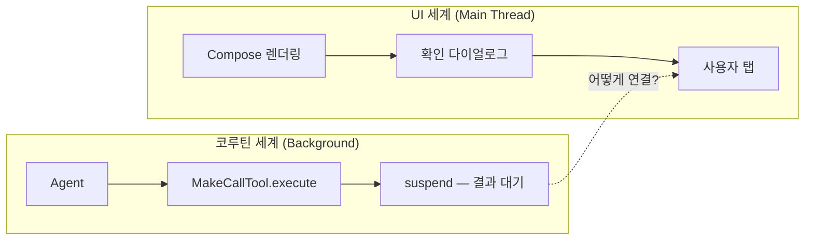
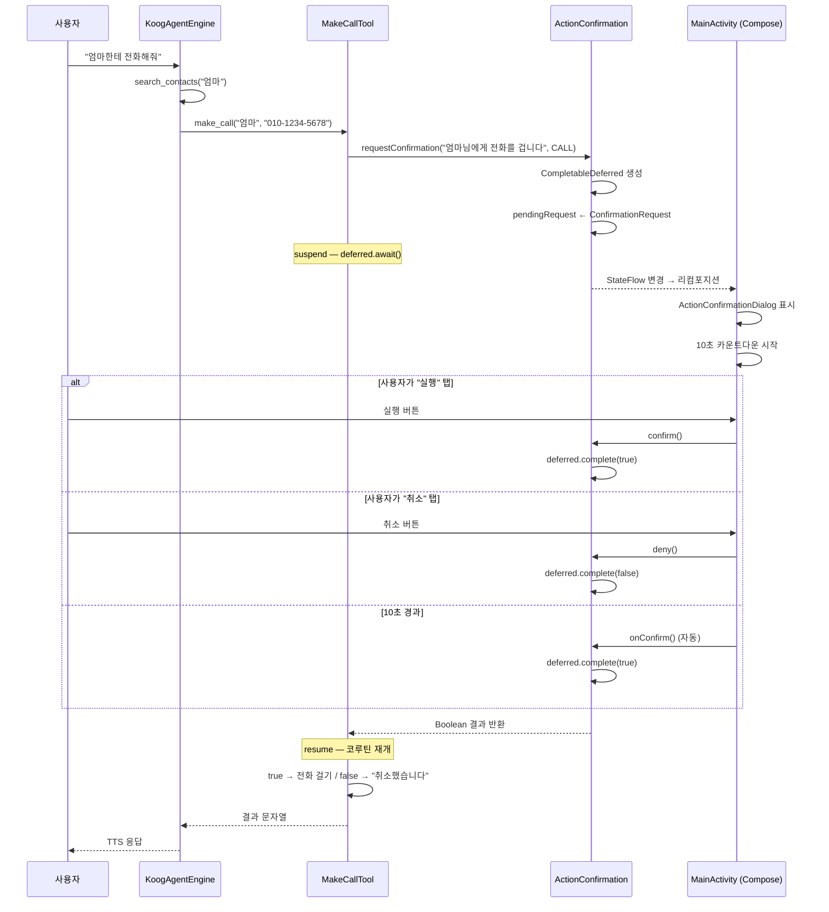
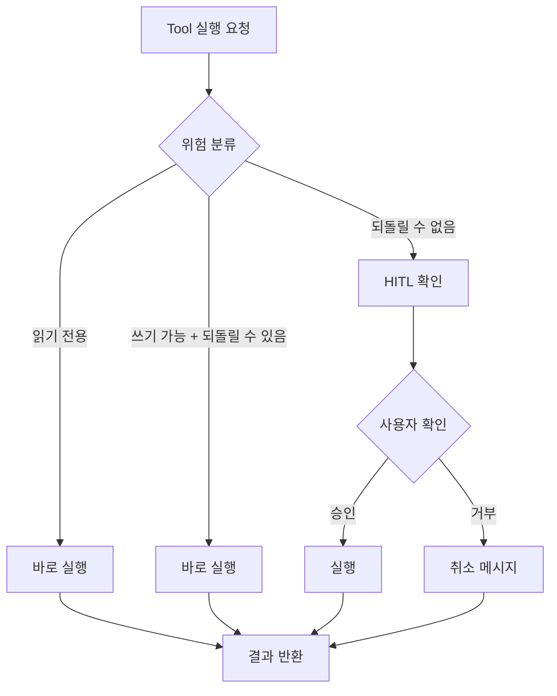

# AI가 멋대로 전화를 걸면 안 되잖아

"엄마한테 전화해줘." 음성 비서가 이 말을 듣고 바로 전화를 걸어버리면? 만약 인식이 잘못되어 "엄마" 대신 "아빠"에게 전화가 간다면? AI가 실제 세계에 영향을 미치는 행동을 할 때, 사용자 확인 없이 실행하는 것은 위험합니다. Hey Bara는 CompletableDeferred 기반의 Human-in-the-Loop(HITL) 확인 시스템으로 이 문제를 해결했습니다.

## 문제: Tool이 직접 행동하면 안 된다

AI 에이전트의 도구는 크게 두 종류로 나뉩니다.

| 분류 | 도구 | 위험도 | 확인 필요 |
|---|---|---|---|
| **읽기 전용** | search_contacts, list_events, list_tasks, list_notifications | 낮음 | 불필요 |
| **부작용 있음 (되돌릴 수 있음)** | create_event, create_task, delete_event | 중간 | 불필요 |
| **부작용 있음 (되돌릴 수 없음)** | make_call, send_sms, send_kakao | 높음 | **필수** |

전화 걸기와 문자 전송은 되돌릴 수 없습니다. 한번 전화가 걸리면 상대방에게 부재중 전화가 남고, 문자는 회수가 불가합니다. 이런 행동에는 반드시 사용자 확인이 필요합니다.

## 설계 제약: Tool은 suspend, UI는 Composable

문제의 핵심은 **두 세계가 다른 스레드에서 다른 패러다임으로 동작한다**는 점입니다.



Tool의 `execute()` 함수는 `suspend` 함수입니다. 사용자 확인을 받으려면 UI에 모달을 표시하고, 사용자가 응답할 때까지 Tool 실행을 중단(suspend)해야 합니다. 그런데 Tool은 코루틴 세계에 있고, UI는 Compose 세계에 있습니다. 이 두 세계를 연결하는 브릿지가 필요합니다.

## 해결: CompletableDeferred를 채널처럼 사용

Kotlin의 `CompletableDeferred<Boolean>`이 정확히 이 역할을 합니다. 한쪽에서 `await()`로 결과를 기다리고, 다른 쪽에서 `complete()`로 결과를 전달하는 일회성 채널입니다.

```kotlin
// UI에 표시할 확인 요청
data class ConfirmationRequest(
    val description: String,  // "마루타1님에게 '안녕하세요'라고 문자를 보냅니다"
    val type: ActionType,
    val deferred: CompletableDeferred<Boolean>
)

enum class ActionType { CALL, SMS, KAKAO }

// Tool ↔ UI 사이의 확인 브릿지 (싱글톤)
object ActionConfirmation {
    private val _pendingRequest = MutableStateFlow<ConfirmationRequest?>(null)
    val pendingRequest: StateFlow<ConfirmationRequest?> = _pendingRequest

    // Tool에서 호출: UI에 확인 요청 후 결과 대기
    suspend fun requestConfirmation(description: String, type: ActionType): Boolean {
        val deferred = CompletableDeferred<Boolean>()
        _pendingRequest.value = ConfirmationRequest(description, type, deferred)
        return try {
            deferred.await()
        } finally {
            _pendingRequest.value = null
        }
    }

    // UI에서 호출: 사용자 응답 전달
    fun confirm() {
        _pendingRequest.value?.deferred?.complete(true)
    }

    fun deny() {
        _pendingRequest.value?.deferred?.complete(false)
    }
}
```

핵심 설계 포인트:

1. **싱글톤 object**: 앱 전역에서 하나의 인스턴스만 존재. Tool과 UI가 같은 객체를 참조
2. **StateFlow**: Compose가 `collectAsState()`로 자동 구독. 요청이 들어오면 UI가 리컴포지션
3. **CompletableDeferred**: `await()`에서 코루틴이 중단되고, `complete()`가 호출되면 재개
4. **finally 블록**: 확인/거부 후 반드시 `pendingRequest`를 null로 초기화

## 전체 흐름



## Tool 내부: 확인 → 실행 패턴

MakeCallTool과 SendSmsTool은 동일한 패턴을 따릅니다. `execute()` 첫 줄에서 확인을 요청하고, 거부되면 즉시 반환합니다.

```kotlin
override suspend fun execute(args: Args): String {
    // 1단계: 사용자 확인 (여기서 suspend)
    val confirmed = ActionConfirmation.requestConfirmation(
        "${args.contact}님에게 전화를 겁니다", ActionType.CALL
    )
    if (!confirmed) return "사용자가 취소했습니다."

    // 2단계: 실제 실행
    return try {
        val intent = Intent(Intent.ACTION_CALL).apply {
            data = Uri.parse("tel:${args.phoneNumber}")
            addFlags(Intent.FLAG_ACTIVITY_NEW_TASK)
        }
        appContext?.startActivity(intent)
        "${args.contact}(${args.phoneNumber})에게 전화를 걸었습니다."
    } catch (e: Exception) { "전화 걸기에 실패했습니다: ${e.message}" }
}
```

이 패턴의 장점은 **Tool이 확인 로직을 직접 소유**한다는 것입니다. 확인이 필요 없는 도구(list_events, search_contacts)는 이 줄이 없을 뿐, 나머지 구조는 동일합니다. 에이전트 엔진은 확인 로직을 전혀 모릅니다.

## UI: 10초 자동 확인 다이얼로그

Compose UI에서 `ActionConfirmation.pendingRequest`를 `collectAsState()`로 구독합니다. 요청이 들어오면 다이얼로그가 자동으로 렌더링되고, `LaunchedEffect`로 10초 카운트다운 후 자동 실행합니다.

자동 확인 타임아웃을 10초로 설정한 이유가 있습니다.

| 타임아웃 | 장점 | 단점 |
|---|---|---|
| 5초 | 빠른 응답 | 사용자가 읽기 전에 실행될 수 있음 |
| **10초** | **충분한 확인 시간** | **적당한 대기** |
| 30초 | 안전함 | 음성 비서의 "빠른 실행" 가치 상실 |
| 무제한 | 가장 안전 | 사용자가 확인을 깜빡하면 영원히 대기 |

음성 비서의 핵심 가치는 **핸즈프리**입니다. 운전 중에 "엄마한테 전화해줘"라고 말했는데, 화면을 터치해야만 실행된다면 음성 비서의 의미가 없습니다. 10초 자동 확인은 안전성과 편의성의 타협점입니다.

## 왜 Channel이 아니라 CompletableDeferred인가

| 비교 항목 | Channel | CompletableDeferred |
|---|---|---|
| 객체 수 | 2개 (요청 + 응답) | 1개 |
| 생명주기 | 수동 close 필요 | 자동 (GC) |
| 다중 소비자 | 경합 발생 가능 | 한 번만 complete 가능 |
| StateFlow 통합 | 별도 구현 필요 | ConfirmationRequest에 포함 |
| 복잡도 | 높음 | **낮음** |

CompletableDeferred는 "정확히 한 번의 요청-응답"이라는 확인 플로우의 의미론에 딱 맞습니다. Channel은 스트림 처리에는 좋지만, 일회성 확인에는 과도합니다.

## 위험 분류 체계

Hey Bara의 14개 도구는 위험도에 따라 확인 정책이 다릅니다.



| 위험도 | 도구 | 이유 |
|---|---|---|
| 안전 | search_contacts, list_events, list_tasks, list_notifications | 데이터 조회만 함 |
| 중간 | create_event, create_task, delete_event, delete_task, complete_task, update_event | 되돌릴 수 있음 (삭제해도 복구 가능) |
| **위험** | **make_call, send_sms, send_kakao** | **되돌릴 수 없음** |
| 특수 | control_app | 접근성 서비스 기반, 등록된 앱만 허용 |

이 분류에서 흥미로운 점은 **캘린더 일정 생성은 확인 없이 바로 실행**한다는 것입니다. "내일 3시에 치과 추가해줘"에 매번 확인을 거치면 음성 비서의 편의성이 크게 떨어집니다. 잘못 추가해도 삭제할 수 있으니, 위험을 감수하고 바로 실행합니다.

## 에이전트는 확인 로직을 모른다

가장 중요한 설계 원칙입니다. `KoogAgentEngine`의 시스템 프롬프트에는 이렇게 적혀 있습니다:

> make_call과 send_sms 호출 시 반드시 전화번호를 사용해
> 도구가 "사용자가 취소했습니다"를 반환하면 "알겠어요, 취소할게요"라고 답해

에이전트는 확인 과정이 있다는 것을 모릅니다. Tool을 호출하면 결과가 올 뿐입니다. "사용자가 취소했습니다"가 오면 취소 응답을 하고, 성공 메시지가 오면 완료 응답을 합니다. 확인 로직은 Tool 내부에 캡슐화되어 있으므로, 에이전트의 판단 로직이 단순해집니다.

```mermaid
flowchart LR
    Agent[에이전트] -->|"make_call(엄마, 010-...)"| Tool[MakeCallTool]
    Tool -->|내부에서 확인 처리| AC[ActionConfirmation]
    AC -->|UI 모달| User[사용자]
    User -->|승인/거부| AC
    AC -->|결과| Tool
    Tool -->|"전화를 걸었습니다" or "취소했습니다"| Agent
    Note over Agent: 확인 과정을 전혀 모름
```

## 핵심 인사이트

- **CompletableDeferred는 일회성 코루틴-UI 브릿지의 최적 도구다**: Channel보다 단순하고, 콜백보다 구조적이며, "정확히 한 번의 응답"이라는 확인 의미론에 정확히 부합한다
- **10초 자동 확인은 안전성과 편의성의 계산된 타협이다**: 음성 비서의 핵심 가치(핸즈프리)를 유지하면서도 잘못된 실행을 막을 수 있는 구간. 5초는 너무 짧고, 무제한은 비서의 의미를 무너뜨린다
- **확인 로직은 Tool이 소유해야 한다**: 에이전트가 확인 여부를 판단하면 프롬프트가 복잡해지고 실수할 여지가 생긴다. Tool 내부에 캡슐화하면 에이전트는 결과만 처리하면 되므로 판단 로직이 단순해진다
- **위험 분류는 "되돌릴 수 있는가"가 기준이다**: 전화/문자는 되돌릴 수 없으므로 확인 필수, 일정 생성은 삭제 가능하므로 확인 생략. 이 기준이 없으면 모든 쓰기 작업에 확인을 걸게 되고, 음성 비서가 쓸모없어진다
- **싱글톤 StateFlow + Compose collectAsState로 반응형 UI 연동이 0-코드 접착제를 달성한다**: Tool이 StateFlow를 변경하면 Compose가 자동으로 다이얼로그를 렌더링. 이벤트 버스, 콜백 체인, BroadcastReceiver 없이 Kotlin의 동시성 기본 요소만으로 구현
- **에이전트와 확인 UI의 결합도가 0이다**: 에이전트 코드에 확인 관련 코드가 단 한 줄도 없다. 확인이 필요한 도구를 추가하려면 Tool 내부에 `requestConfirmation()` 한 줄만 추가하면 된다
