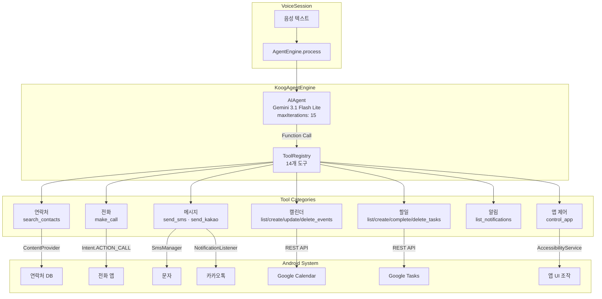
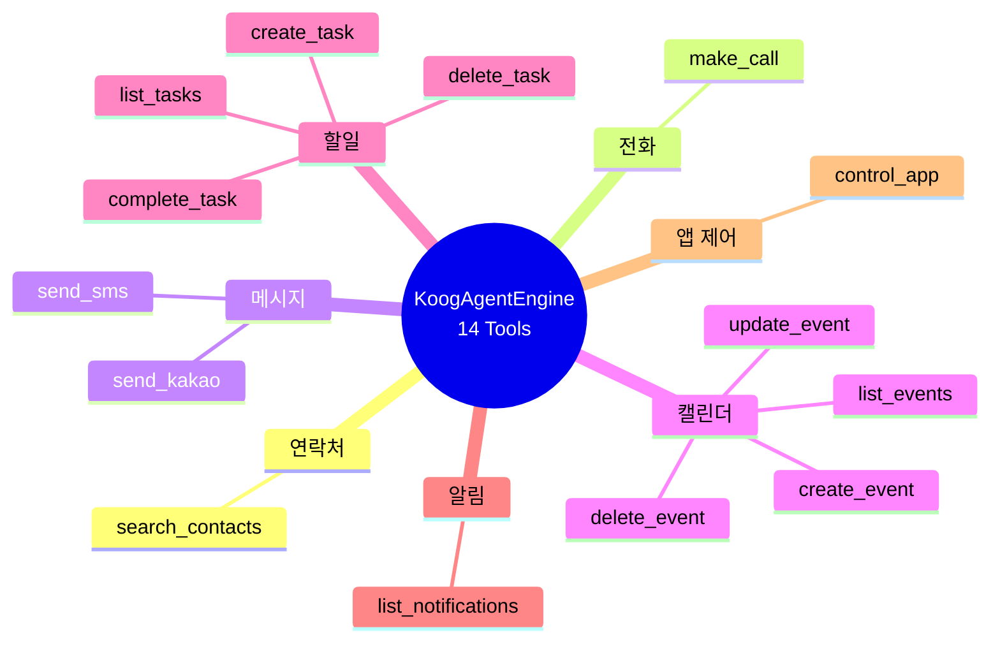
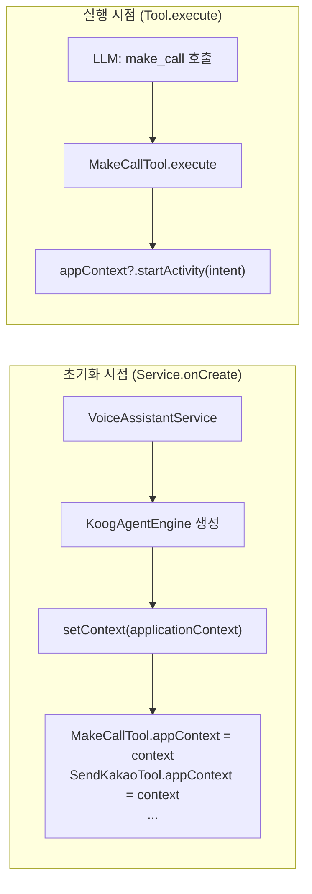
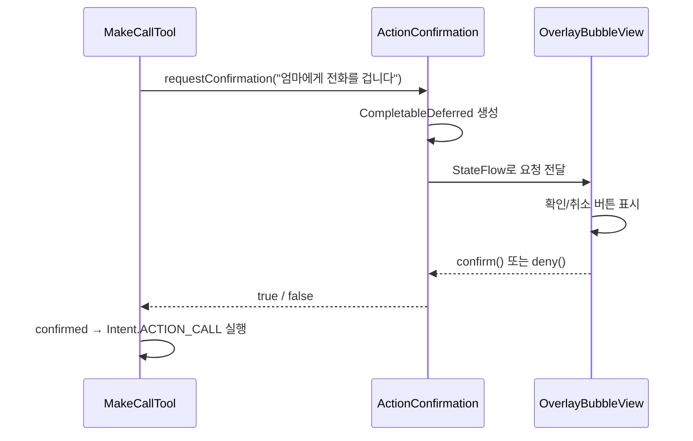
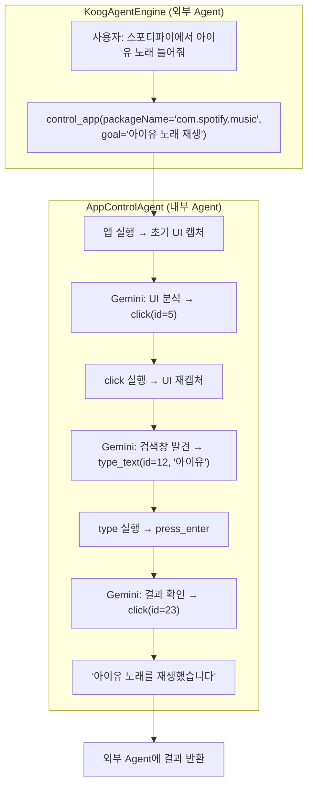

# 음성 한마디에 14가지 행동 — Koog Agent와 Tool Calling

"내일 오후 3시에 회의 일정 잡아줘." 이 한마디가 실제로 Google Calendar에 일정을 생성하려면 어떤 구조가 필요할까요? LLM이 사용자의 의도를 파악하고, 적절한 도구를 선택하고, 인자를 채워서 실행해야 합니다. Hey Bara는 JetBrains의 Koog 프레임워크로 14개의 `SimpleTool`을 등록하고, Gemini API의 Function Calling으로 이 과정을 자동화합니다. 그 설계 과정을 정리합니다.

## 왜 Koog인가

Android 환경에서 AI Agent 프레임워크를 선택할 때 고려한 후보들입니다.

| 프레임워크 | 언어 | 장점 | Hey Bara에 부적합한 이유 |
|---|---|---|---|
| LangChain (Python) | Python | 생태계 최대, 도구 풍부 | Android 네이티브 불가, 서버 필요 |
| Semantic Kernel | C#/Java | Microsoft 지원, 엔터프라이즈 | Java API 무겁고 Android 최적화 부족 |
| LangChain4j | Java | Java 생태계, 다양한 LLM | Kotlin DSL 미지원, 보일러플레이트 과다 |
| **Koog** | **Kotlin** | **Kotlin-first, SimpleTool DSL, 경량** | **—** |

Koog를 선택한 결정적 이유는 **Kotlin-first 설계**입니다. `SimpleTool`의 `@Serializable` args, `ToolRegistry` DSL, `AIAgent` 빌더가 모두 Kotlin 관용구로 작성되어 있어 Android 프로젝트와 자연스럽게 통합됩니다.

## 아키텍처



## 14개 도구 카탈로그



| # | 도구 | 카테고리 | Android API | 확인 필요 |
|---|---|---|---|---|
| 1 | `search_contacts` | 연락처 | ContentProvider | X |
| 2 | `make_call` | 전화 | Intent.ACTION_CALL | O |
| 3 | `send_sms` | 메시지 | SmsManager | O |
| 4 | `send_kakao` | 메시지 | NotificationListener reply | O |
| 5 | `list_events` | 캘린더 | Google Calendar REST | X |
| 6 | `create_event` | 캘린더 | Google Calendar REST | X |
| 7 | `update_event` | 캘린더 | Google Calendar REST | X |
| 8 | `delete_event` | 캘린더 | Google Calendar REST | X |
| 9 | `list_tasks` | 할일 | Google Tasks REST | X |
| 10 | `create_task` | 할일 | Google Tasks REST | X |
| 11 | `complete_task` | 할일 | Google Tasks REST | X |
| 12 | `delete_task` | 할일 | Google Tasks REST | X |
| 13 | `list_notifications` | 알림 | NotificationListener | X |
| 14 | `control_app` | 앱 제어 | AccessibilityService | X |

전화, 문자, 카카오톡 — 실제 비용이 발생하거나 되돌릴 수 없는 행동에만 사용자 확인을 요구합니다.

## SimpleTool 패턴 — Kotlin Serialization + LLM Description

Koog의 `SimpleTool`은 도구의 입력을 `@Serializable` data class로 정의하고, `@LLMDescription` 어노테이션으로 LLM에게 각 파라미터의 의미를 설명합니다.

```kotlin
object MakeCallTool : SimpleTool<MakeCallTool.Args>(
    argsSerializer = Args.serializer(),
    name = "make_call",
    description = "전화번호로 전화를 건다. search_contacts로 번호를 먼저 확인한 후 호출해야 한다."
) {
    var appContext: Context? = null
    @Serializable
    data class Args(
        @property:LLMDescription("전화할 사람 이름") val contact: String,
        @property:LLMDescription("전화번호 (예: 010-1234-5678)") val phoneNumber: String
    )
    override suspend fun execute(args: Args): String {
        val confirmed = ActionConfirmation.requestConfirmation(
            "${args.contact}님에게 전화를 겁니다", ActionType.CALL
        )
        if (!confirmed) return "사용자가 취소했습니다."
        return try {
            val intent = Intent(Intent.ACTION_CALL).apply {
                data = Uri.parse("tel:${args.phoneNumber}")
                addFlags(Intent.FLAG_ACTIVITY_NEW_TASK)
            }
            appContext?.startActivity(intent)
            "${args.contact}(${args.phoneNumber})에게 전화를 걸었습니다."
        } catch (e: Exception) { "전화 걸기에 실패했습니다: ${e.message}" }
    }
}
```

이 패턴의 핵심은 **LLM이 JSON Schema를 통해 도구의 인터페이스를 이해**한다는 점입니다. `@LLMDescription("전화번호 (예: 010-1234-5678)")`이라는 어노테이션이 Gemini에게 "이 필드에는 전화번호 형식의 문자열을 넣어야 한다"고 알려줍니다. Koog가 이를 OpenAI 호환 Function Calling 스키마로 자동 변환합니다.

## Stateless Singleton + Mutable Static — Android Context 문제

Android에서 가장 까다로운 설계 제약이 여기에 있습니다. Koog의 `SimpleTool`은 **object(싱글톤)**으로 정의해야 합니다. 그런데 `MakeCallTool`이 전화를 걸려면 `Context`가 필요합니다. 싱글톤에 Context를 넣으면 메모리 누수가 발생합니다.



해결책은 **Application Context를 mutable static 필드에 주입**하는 것입니다.

```kotlin
object MakeCallTool : SimpleTool<...>(...) {
    var appContext: Context? = null  // Application Context만 주입
    // ...
}

// KoogAgentEngine에서 주입
fun setContext(context: Context, apiKey: String? = null) {
    MakeCallTool.appContext = context.applicationContext
    SendKakaoTool.appContext = context.applicationContext
    ListNotificationsTool.appContext = context.applicationContext
    ControlAppTool.appContext = context.applicationContext
    ControlAppTool.geminiApiKey = apiKey
}
```

`context.applicationContext`를 사용하므로 Activity 누수는 발생하지 않습니다. 같은 패턴으로 `GoogleCalendarClient`, `GoogleTasksClient`도 별도 setter로 주입합니다.

```kotlin
fun setGoogleClients(calendarClient: GoogleCalendarClient?, tasksClient: GoogleTasksClient?) {
    ListEventsTool.calendarClient = calendarClient
    CreateEventTool.calendarClient = calendarClient
    // ... 4개 캘린더 도구, 4개 할일 도구에 주입
}
```

## 사용자 확인 — CompletableDeferred 브릿지

전화, 문자, 카카오톡은 실행 전 사용자 확인이 필요합니다. 문제는 Tool의 `execute()`가 suspend 함수인 반면, 확인 UI는 Compose에서 표시된다는 점입니다.



```kotlin
object ActionConfirmation {
    private val _pendingRequest = MutableStateFlow<ConfirmationRequest?>(null)
    val pendingRequest: StateFlow<ConfirmationRequest?> = _pendingRequest

    suspend fun requestConfirmation(description: String, type: ActionType): Boolean {
        val deferred = CompletableDeferred<Boolean>()
        _pendingRequest.value = ConfirmationRequest(description, type, deferred)
        return try {
            deferred.await()  // UI가 confirm()/deny()를 호출할 때까지 대기
        } finally {
            _pendingRequest.value = null
        }
    }
}
```

`CompletableDeferred`가 Tool(코루틴)과 UI(StateFlow) 사이의 브릿지 역할을 합니다. Tool은 `deferred.await()`에서 일시 중단되고, 사용자가 확인 버튼을 누르면 `deferred.complete(true)`로 재개됩니다.

## 시스템 프롬프트 — 도구 사용 규칙 주입

LLM이 14개 도구를 올바르게 사용하려면 명확한 규칙이 필요합니다. 시스템 프롬프트에 도구 간 의존성과 사용 순서를 명시합니다.

```kotlin
private const val BASE_SYSTEM_PROMPT = """
너는 "바라"라는 이름의 한국어 음성 비서야.
사용자의 음성 명령을 이해하고 적절한 도구를 호출해.
응답은 짧고 자연스러운 한국어로 해.

전화를 걸거나 문자를 보내라는 요청이 오면:
1. 먼저 search_contacts로 연락처를 검색해
2. 검색 결과가 1개면 바로 make_call 또는 send_sms를 호출해
3. 검색 결과가 여러 개면 사용자에게 누구인지 물어봐
4. 검색 결과가 없으면 연락처를 찾을 수 없다고 말해
"""
```

시스템 프롬프트에 현재 시각과 타임존도 동적으로 주입합니다. "내일 오후 3시"를 ISO 8601로 변환하려면 LLM이 현재 시각을 알아야 하기 때문입니다.

```kotlin
private fun buildSystemPrompt(): String {
    val now = SimpleDateFormat("yyyy-MM-dd HH:mm (E)", Locale.KOREAN).format(Date())
    return """
    $BASE_SYSTEM_PROMPT
    현재 시각: $now
    타임존: Asia/Seoul (KST, +09:00)
    """.trimIndent()
}
```

## 대화 히스토리 — 10턴 슬라이딩 윈도우

멀티턴 대화를 지원하기 위해 최근 10턴의 대화를 시스템 프롬프트에 포함합니다.

```kotlin
private val conversationHistory = mutableListOf<Pair<String, String>>()

override suspend fun process(text: String): String {
    val result = createAgent().run(text)
    conversationHistory.add(text to result)
    if (conversationHistory.size > 10) conversationHistory.removeAt(0)  // FIFO
    return result
}
```

매 턴마다 새 `AIAgent`를 생성합니다(`createAgent()`). Koog의 `AIAgent`는 stateless이므로 이전 대화 컨텍스트를 시스템 프롬프트에 직접 넣어야 합니다. 10턴 제한은 Gemini API의 토큰 비용과 응답 품질 사이의 트레이드오프입니다.

| 히스토리 크기 | 추정 토큰 | 장점 | 단점 |
|---|---|---|---|
| 0턴 (매번 새 대화) | ~500 | 비용 최소 | 문맥 유지 불가 |
| 5턴 | ~1,500 | 기본 문맥 유지 | 복잡한 대화 끊김 |
| **10턴** | **~3,000** | **충분한 문맥** | **비용 증가** |
| 전체 유지 | 무제한 | 완벽한 문맥 | 토큰 폭발, 품질 저하 |

## control_app — Agent 안의 Agent

`control_app`은 다른 도구와 구조적으로 다릅니다. 이 도구 내부에 **또 다른 Koog AIAgent가 있습니다**. 접근성 서비스로 앱의 UI 트리를 읽고, click/type/scroll 같은 액션을 반복 실행하는 에이전트입니다.



내부 에이전트는 `maxIterations = 30`으로 최대 30번의 UI 조작을 수행합니다. 8개의 UI 조작 도구(click, long_click, type_text, scroll_down, scroll_up, press_enter, press_back, wait_and_get_screen)를 가지고 있습니다.

## 핵심 인사이트

- **Kotlin-first 프레임워크가 Android 통합을 결정**: LangChain은 Python 서버가 필요하고, LangChain4j는 보일러플레이트가 과다. Koog의 `SimpleTool` + `@Serializable` + `ToolRegistry` DSL이 Android 네이티브에서 가장 자연스러운 Agent 구현을 가능하게 함
- **Object Singleton + Mutable Static은 안티패턴이지만 현실적 타협**: Koog `SimpleTool`이 object를 요구하는 상황에서, `applicationContext`를 mutable static으로 주입하는 것이 메모리 누수 없는 유일한 해법. DI 프레임워크(Hilt 등)를 도입하면 해결 가능하지만 현재 규모에서는 과잉
- **CompletableDeferred가 코루틴-UI 브릿지의 핵심**: Tool의 suspend 함수가 UI의 사용자 확인을 기다려야 할 때, StateFlow + CompletableDeferred 조합으로 양방향 통신 구현. 콜백 지옥 없이 깔끔한 비동기 흐름
- **시스템 프롬프트에 도구 간 의존성을 명시해야 정확도가 올라감**: "먼저 search_contacts로 검색 → 결과로 make_call 호출" 같은 순서를 프롬프트에 넣지 않으면, LLM이 전화번호 없이 make_call을 호출하는 오류 빈발
- **Agent-in-Agent 구조로 범용 앱 제어 달성**: 14개 도구로 커버 못하는 앱은 control_app의 내부 에이전트가 접근성 서비스로 직접 UI를 조작. 등록된 앱에 한해 "아무 앱이나 조작" 가능
- **10턴 슬라이딩 윈도우가 비용과 문맥의 균형점**: 전체 히스토리 유지는 토큰 폭발, 매턴 초기화는 문맥 상실. 10턴(~3,000 토큰)이 음성 비서 시나리오에서 충분한 문맥을 유지하면서 Gemini Flash Lite 무료 티어 내에서 동작하는 최적점
