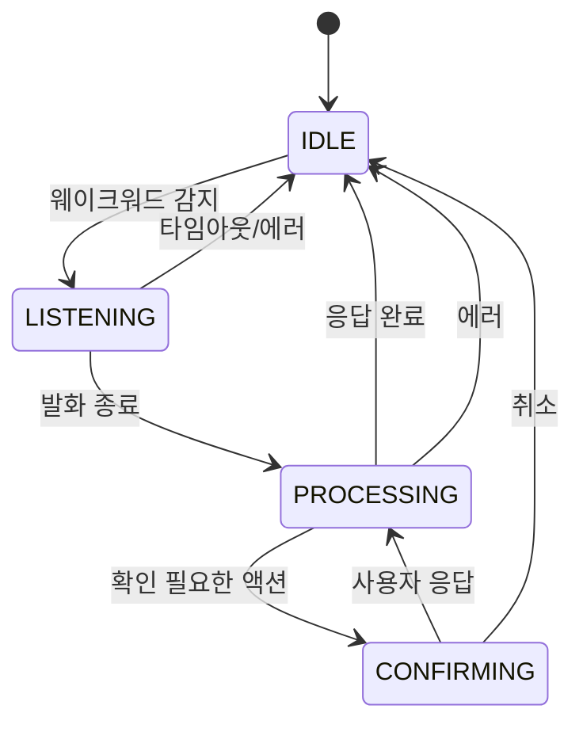

# IDLE → LISTENING → PROCESSING → CONFIRMING

음성 비서의 상태 관리를 잘못하면 어떤 일이 벌어질까. 웨이크워드를 듣고 있는데 동시에 STT가 돌아가거나, AI가 응답 중인데 또 다른 명령을 받기 시작한다. 마이크, STT 모델, LLM API, TTS 엔진이 동시에 경합하면 메모리가 폭발하고 앱이 죽는다.

## 4개 상태로 모든 것을 제어한다

| 상태 | 활성 리소스 | 역할 |
|---|---|---|
| IDLE | 웨이크워드 엔진만 | 대기. "헤이 바라"만 감지 |
| LISTENING | 웨이크워드 + STT | 음성 인식. 발화를 텍스트로 변환 |
| PROCESSING | 에이전트 + TTS | AI 처리. 명령 실행 + 음성 응답 |
| CONFIRMING | 확인 UI | 사용자 확인 대기. 전화/문자 같은 위험 액션 |

핵심 규칙은 **모든 상태 전환에 가드가 있다**는 것이다. "현재 상태가 IDLE이 아니면 웨이크워드를 무시한다", "현재 상태가 LISTENING이 아니면 발화 종료를 무시한다" — 이 가드가 동시 실행을 원천 차단한다.

## 모든 에러는 IDLE로 수렴한다

어떤 상태에서 에러가 발생하든 최종 목적지는 IDLE이다. STT가 실패하면 IDLE, 에이전트가 실패하면 IDLE, TTS가 실패하면 IDLE. 에러 경로가 복잡해지면 "에러 후 어떤 상태에 있는지 모르는" 상황이 생기는데, 모든 에러를 IDLE로 수렴시키면 이 문제가 없다.

IDLE 전환 시 **리소스 정리가 보장**된다. STT 모델 해제, 마이크 릴리즈, 진행 중인 TTS 중단 — 이 정리가 빠지면 다음 세션에서 리소스 충돌이 생긴다.

## 온디맨드 로딩과 맞물린다

상태 머신이 음성 파이프라인의 온디맨드 로딩 전략과 맞물린다. IDLE에서는 웨이크워드 엔진만 메모리에 있고, LISTENING 진입 시 STT를 로드하고, IDLE 복귀 시 해제한다. 상태 전환이 곧 리소스 라이프사이클이다.

STT 모델 로딩에 약 500ms가 걸리는데, IDLE → LISTENING 전환 시 비프음을 재생해서 이 시간을 마스킹한다. 사용자는 비프 소리를 듣고 "이제 말해도 된다"고 인지하고, 그 사이에 STT가 준비된다.

## Foreground Service와 연동된다

음성 비서는 앱이 백그라운드에 있어도 동작해야 한다. Android의 Foreground Service로 구현했다. 상태 머신의 상태가 바뀔 때마다 알림(Notification)의 텍스트도 함께 업데이트된다. "대기 중", "듣는 중", "처리 중" — 사용자가 알림만 봐도 현재 상태를 알 수 있다.

에이전트가 아직 초기화되지 않은 상태에서도 세션이 동작할 수 있다. 이 경우 에이전트 대신 **에코 모드**로 전환해서 인식된 텍스트를 그대로 읽어준다. 디버깅이나 온보딩에 유용하다.

## 돌이켜보면

4개 상태, 명시적 전환, 가드 조건, 에러 수렴 — 단순한 상태 머신이지만 이게 음성 비서의 안정성을 지탱한다. 상태가 명확하면 "지금 뭐 하고 있는지"를 항상 알 수 있고, 가드가 있으면 "동시에 두 가지가 일어나는" 상황을 원천 차단할 수 있다.
