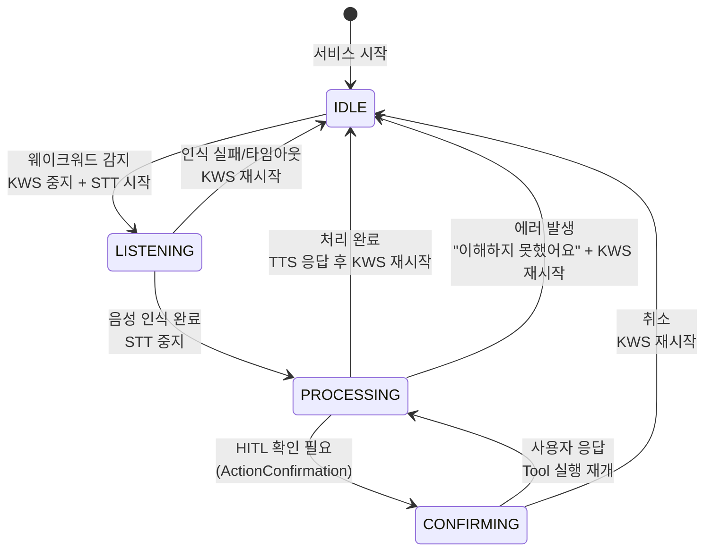
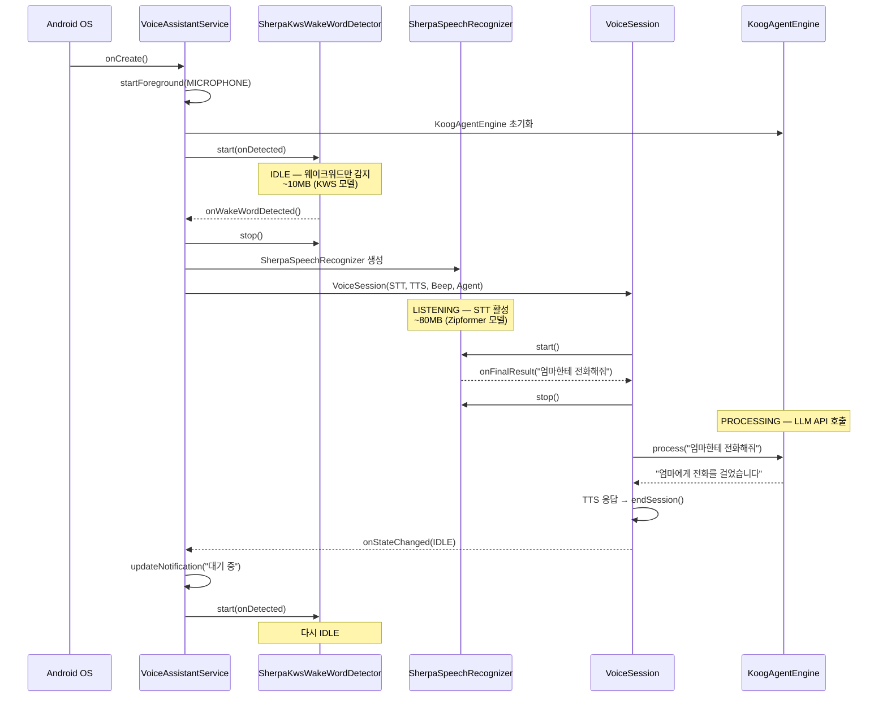
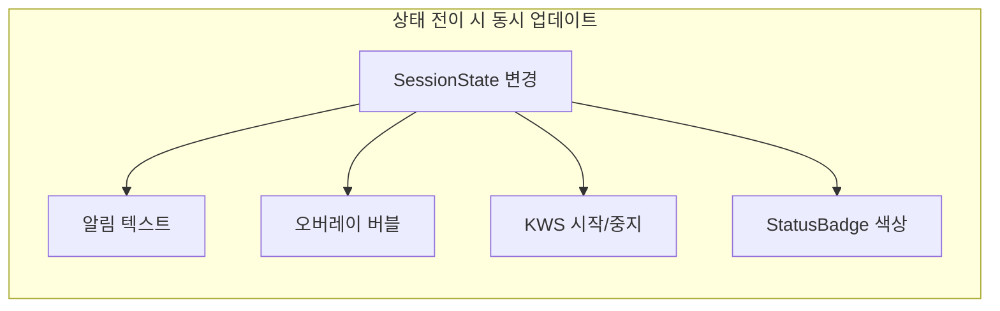
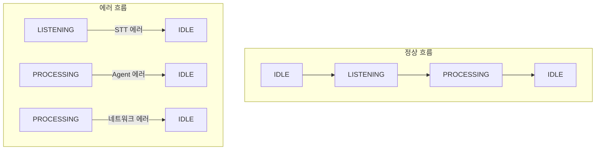

# IDLE → LISTENING → PROCESSING → CONFIRMING

음성 비서의 상태 관리를 잘못하면 어떤 일이 벌어질까요? 웨이크워드를 듣고 있는데 동시에 STT가 돌아가거나, AI가 응답 중인데 또 다른 명령을 받기 시작합니다. 마이크, STT 모델, LLM API, TTS 엔진이 동시에 경합하면 메모리가 폭발하고 앱이 죽습니다. Hey Bara는 4개 상태로 이루어진 상태 머신으로 이 혼란을 제어합니다.

## 4개 상태, 4개 역할

```kotlin
enum class SessionState {
    IDLE,       // Porcupine only, low power
    LISTENING,  // STT active, waiting for speech
    PROCESSING, // AI parsing command
    CONFIRMING  // Waiting for user confirmation
}
```

각 상태에서 활성화되는 컴포넌트가 정확히 정의되어 있습니다.

| 상태 | 활성 컴포넌트 | 비활성 컴포넌트 | 메모리 | 알림 텍스트 |
|---|---|---|---|---|
| **IDLE** | KWS (웨이크워드 감지) | STT, Agent, TTS | ~10MB | "대기 중 — 헤이 바라로 호출" |
| **LISTENING** | STT (음성 인식) | KWS, Agent | ~80MB | "듣고 있어요..." |
| **PROCESSING** | Agent + LLM API | KWS, STT | ~20MB+네트워크 | "처리 중..." |
| **CONFIRMING** | UI 모달 (ActionConfirmation) | KWS, STT | ~5MB | "확인 대기 중..." |

핵심은 **동시에 두 개의 무거운 컴포넌트가 활성화되지 않는다**는 것입니다. KWS와 STT가 동시에 마이크를 잡지 않고, STT 모델과 Agent가 동시에 메모리를 차지하지 않습니다.

## 상태 전이 다이어그램



모든 비정상 경로가 IDLE로 돌아갑니다. STT가 실패하든, Agent가 에러를 던지든, 결국 IDLE로 복귀해서 웨이크워드 감지를 재시작합니다. 복구 불가능한 상태가 없습니다.

## VoiceSession: 상태 전이의 게이트키퍼

VoiceSession은 상태 전이를 엄격하게 통제합니다. 각 함수의 첫 줄에서 현재 상태를 검사하고, 허용되지 않는 이벤트는 무시합니다.

```kotlin
fun onWakeWordDetected() {
    if (currentState != SessionState.IDLE) return  // IDLE에서만 전이 허용
    transitionTo(SessionState.LISTENING)
    beep.playBeep {
        recognizer.start(
            onPartialResult = { /* UI 업데이트 */ },
            onFinalResult = { text -> onSpeechRecognized(text) },
            onError = { endSession() }
        )
    }
}

fun onSpeechRecognized(text: String) {
    if (currentState != SessionState.LISTENING) return  // LISTENING에서만 전이
    lastRecognizedText = text
    recognizer.stop()
    transitionTo(SessionState.PROCESSING)
    onSpeechResult?.invoke(text)
}
```

`if (currentState != SessionState.IDLE) return` 이 한 줄이 동시성 버그를 방지합니다. STT가 돌아가는 중(LISTENING)에 웨이크워드가 다시 감지되더라도 무시됩니다. 상태 검사 없이 STT를 두 번 시작하면 마이크 리소스 경합이 발생합니다.

## VoiceAssistantService: ForegroundService 생명주기

VoiceSession은 상태 로직만 담당합니다. 실제 컴포넌트의 생성/해제/알림 업데이트는 VoiceAssistantService가 처리합니다.



### OnDemand 컴포넌트 로딩

가장 중요한 최적화는 **STT와 TTS를 웨이크워드 감지 시점에 생성**한다는 것입니다.

```kotlin
private fun onWakeWordDetected() {
    wakeWordDetector?.stop()  // KWS 중지

    // STT 모델을 이 시점에 로드
    val recognizer = SherpaSpeechRecognizer(getModelDir())

    // TTS도 이 시점에 로드
    val tts = if (ModelInstaller.isTtsInstalled(this)) {
        SupertonicTtsEngine(File(filesDir, "models/tts").absolutePath)
            .also { it.loadModels() }
    } else {
        AndroidTtsEngine(this)
    }

    session = VoiceSession(recognizer, tts, beep, agentEngine)
    // ...
}
```

IDLE 상태에서는 KWS 모델(~10MB)만 메모리에 있습니다. 웨이크워드가 감지되면 그때 STT 모델(~70MB)을 로드합니다. 세션이 끝나면 `recognizer.release()`로 메모리를 해제합니다.

| 전략 | IDLE 메모리 | LISTENING 메모리 | 장점 | 단점 |
|---|---|---|---|---|
| 모두 사전 로드 | ~160MB | ~160MB | 즉시 반응 | 메모리 상주 |
| **OnDemand 로드** | **~10MB** | **~90MB** | **IDLE 메모리 최소** | **로드 지연 ~500ms** |
| 완전 지연 로드 | ~0MB | ~90MB | 최소 메모리 | 첫 호출 느림 |

OnDemand 전략에서 ~500ms 로드 지연은 비프음 재생 시간으로 마스킹됩니다. 사용자는 "삐-" 소리 후에 말하기 시작하므로, 비프음이 끝날 때쯤 STT가 이미 준비되어 있습니다.

```kotlin
fun onWakeWordDetected() {
    // ...
    beep.playBeep {
        // 비프음이 끝난 후 STT 시작 → 이 시점에 모델 로드 완료
        recognizer.start(...)
    }
}
```

## 알림 상태 동기화

ForegroundService는 항상 알림을 표시해야 합니다. `onStateChanged` 콜백 하나로 상태 전이마다 네 가지를 동시에 업데이트합니다.



IDLE 복귀 시에는 오버레이 dismiss + "대기 중" 알림 + KWS 재시작이 한 번에 처리됩니다. LISTENING에서는 오버레이 애니메이션 업데이트 + "듣고 있어요" 알림이 동기화됩니다. StatusBadge는 앱 내 헤더에서 IDLE=초록, 듣는 중=코랄, 처리 중=인디고로 색상이 변합니다.

## 에러 복구: 모든 길은 IDLE로 통한다

상태 머신에서 가장 중요한 설계 원칙은 **모든 에러 경로가 IDLE로 복귀**한다는 것입니다.



```kotlin
suspend fun processWithAgent() {
    if (currentState != SessionState.PROCESSING) return
    try {
        val result = agent.process(lastRecognizedText)
        tts.speak(result) { endSession() }  // 성공 → TTS → IDLE
    } catch (e: Exception) {
        tts.speak("이해하지 못했어요") { endSession() }  // 에러 → TTS → IDLE
    }
}

fun endSession() {
    recognizer.release()       // STT 메모리 해제
    transitionTo(SessionState.IDLE)
    lastRecognizedText = ""
}
```

`endSession()`은 반드시 `recognizer.release()`를 호출하고 IDLE로 전이합니다. STT 모델의 메모리(~70MB)가 해제되고, `VoiceAssistantService`의 `onStateChanged` 콜백에서 KWS가 재시작됩니다. 어떤 에러가 발생하든 "웨이크워드 대기" 상태로 복구됩니다.

## AgentEngine 없는 폴백 모드

API 키가 없거나 네트워크가 불가능한 상황에서도 VoiceSession은 동작합니다.

```kotlin
suspend fun processWithAgent() {
    if (currentState != SessionState.PROCESSING) return
    if (agent == null) {
        speakAndEnd("${lastRecognizedText}라고 하셨나요?")
        return
    }
    // ...
}
```

`agent`가 null이면 인식한 텍스트를 에코백(echo-back)합니다. STT가 올바르게 동작하는지 확인하는 디버그 모드이자, API 키 설정 전 사용자가 앱을 체험할 수 있는 데모 모드 역할을 합니다.

## 핵심 인사이트

- **상태 머신의 게이트 검사 한 줄이 동시성 버그를 원천 차단한다**: `if (currentState != SessionState.IDLE) return` 이 한 줄이 웨이크워드 중복 감지, STT 이중 시작, Agent 이중 호출을 모두 방지한다. 락이나 세마포어 없이 단일 enum 비교로 달성
- **OnDemand 로딩 + 비프음 마스킹으로 IDLE 메모리를 ~10MB로 유지한다**: STT 모델(~70MB)을 상시 로드하면 백그라운드 킬 확률이 높아진다. 웨이크워드 감지 시점에 로드하고, 비프음(~500ms)으로 로딩 지연을 사용자에게 숨긴다
- **"모든 에러 경로는 IDLE로 복귀" 원칙이 복구 불가능한 상태를 제거한다**: STT 에러, 네트워크 에러, Agent 에러 — 어떤 에러든 endSession()을 호출하면 리소스 해제 → IDLE → KWS 재시작으로 깨끗하게 복구된다
- **ForegroundService + 오버레이 조합이 시스템 수준의 음성 비서를 만든다**: Activity가 아닌 Service에서 동작하므로 다른 앱 위에서도 웨이크워드를 감지한다. 오버레이 버블로 현재 상태를 피드백하고, 알림으로 상시 상태를 표시한다
- **상태 전이 콜백 하나로 4가지 UI를 동기화한다**: onStateChanged 콜백 하나에 알림 텍스트, 오버레이 버블, KWS 재시작, StatusBadge 색상을 모두 연결. 상태 하나만 관리하면 나머지가 자동으로 따라온다
- **agent == null 폴백은 디버그 모드이자 온보딩 체험이다**: API 키 없이도 "헤이 바라" → 비프 → 말하기 → 에코백이 동작하므로, 사용자가 STT 품질을 확인하고 앱을 신뢰한 후 API 키를 입력하게 된다
