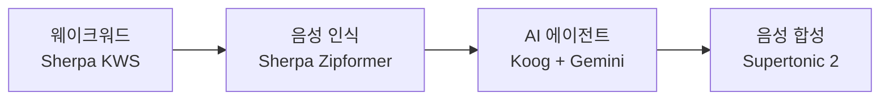

# "헤이 바라" — 한마디로 시작되는 4단계 음성 파이프라인

"헤이 바라, 엄마한테 전화해줘." 이 한마디가 처리되려면 네 단계를 거쳐야 한다. 웨이크워드 감지 → 음성 인식(STT) → AI 에이전트 처리(NLP) → 음성 합성(TTS). 각 단계가 독립적인 엔진으로 돌아가고, 전체가 하나의 파이프라인으로 엮인다.

## 1단계: "헤이 바라"를 알아듣는다

상시 대기 상태에서 "헤이 바라"라는 웨이크워드만 감지한다. Sherpa-ONNX의 KWS(Keyword Spotting) 엔진이 마이크 스트림을 실시간으로 분석하면서 특정 발화 패턴을 감지한다. 모델 크기가 약 5MB 수준이라 메모리 부담이 작다.

"헤이 바라"를 등록할 때 영어 음소(CMU Phoneme) 체계로 한국어 발음을 매핑한다. 한국어 전용 웨이크워드 모델을 학습시키는 대신, 영어 음소 기반 모델에 한국어 발음을 근사하는 실용적 접근이다. 감도 설정으로 오탐/미탐 비율을 조절할 수 있다.

## 2단계: 말을 텍스트로 바꾼다

웨이크워드가 감지되면 STT 엔진이 활성화된다. Sherpa-ONNX Zipformer 한국어 모델이 **실시간 스트리밍**으로 음성을 텍스트로 변환한다. 사용자가 말하는 동안 부분 결과가 계속 나타나서, "듣고 있다"는 피드백을 준다.

발화가 끝나면 최종 텍스트가 확정된다. 무음 감지로 발화 종료를 판단하고, 일정 시간 동안 음성이 없으면 자동으로 다음 단계로 넘어간다.

## 3단계: AI가 명령을 이해하고 실행한다

텍스트가 Koog AI Agent에게 전달된다. 에이전트가 의도를 파악하고, 적절한 도구를 선택해서 실행한다. "엄마한테 전화해줘"라면 연락처를 검색하고, 확인을 거쳐, 전화를 건다.

에이전트는 Gemini API를 통해 추론하지만, 도구 실행은 앱 안에서 직접 이루어진다. 서버를 거치지 않는다.

## 4단계: 결과를 음성으로 전달한다

에이전트의 응답 텍스트를 Supertonic 2 TTS 엔진이 음성으로 변환한다. 한국어에 최적화된 온디바이스 TTS로, 2단계 디퓨전 방식으로 자연스러운 발화를 생성한다. 텍스트 → 멜 스펙트로그램 → 오디오 파형, 이 과정이 모두 폰에서 처리된다.

Supertonic이 사용 불가능한 경우 Android 시스템 TTS로 자동 폴백한다.

## 메모리는 쓸 때만 올린다

네 단계의 엔진이 전부 메모리에 상주하면 앱이 무겁다. **온디맨드 전략**으로 해결했다.

평소에는 웨이크워드 엔진만 메모리에 올라간다. "헤이 바라"가 감지되면 STT 모델을 로드하고, 에이전트 처리가 끝나면 TTS 모델을 로드한다. 세션이 끝나면 STT와 TTS를 메모리에서 해제한다.

| 상태 | 메모리 사용 |
|---|---|
| 대기 (웨이크워드만) | ~10MB |
| 세션 활성 (전체 로드) | ~320MB |

STT 모델 로딩에 약 500ms가 걸리는데, 이 시간을 **비프음으로 마스킹**한다. 사용자가 "삐" 소리를 듣는 동안 STT가 준비된다. 로딩 지연을 UX로 숨긴 것이다.

## 모델은 APK에 넣지 않는다

세 모델의 총 크기가 568MB다. APK에 번들하면 앱 설치가 현실적이지 않다. 사용자가 앱을 설치한 뒤, 설정에서 모델을 개별적으로 다운로드하는 방식을 택했다. 모델별로 설치/삭제가 가능하고, TTS 없이 시스템 TTS로 동작하는 것도 가능하다.

## 돌이켜보면

음성 파이프라인의 핵심은 **4단계가 독립적이면서 하나의 흐름으로 엮인다**는 것이다. 각 엔진이 인터페이스로 추상화되어 있어 교체 가능하고, 온디맨드 로딩으로 대기 시 메모리를 최소화하고, 비프음으로 로딩 지연을 UX로 숨긴다.
