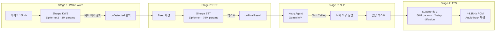
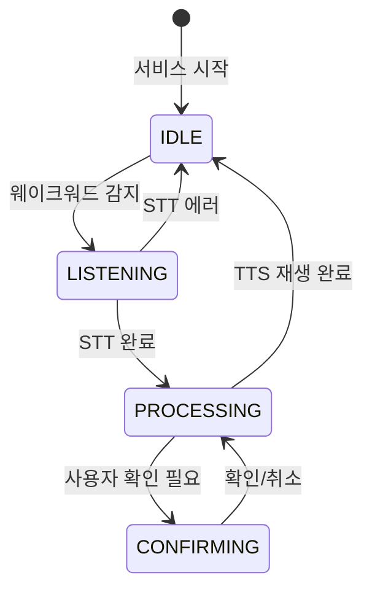
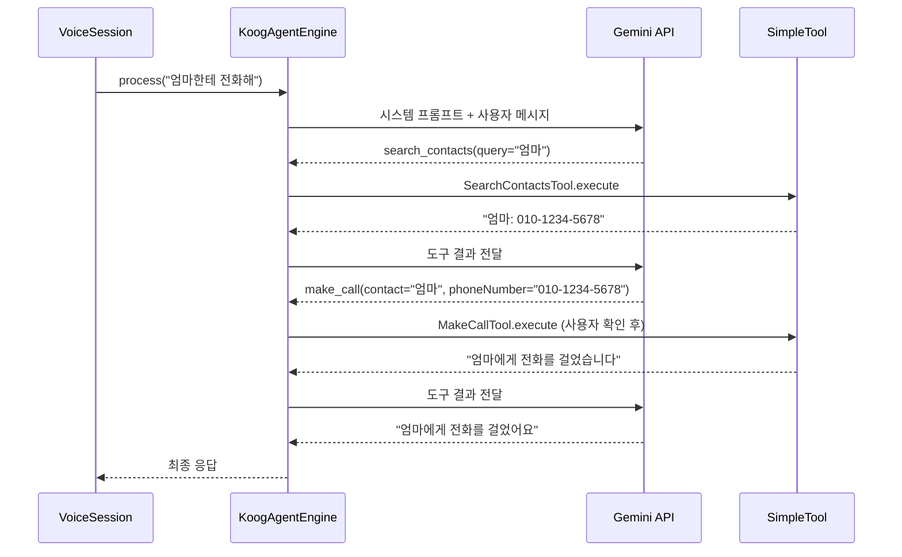
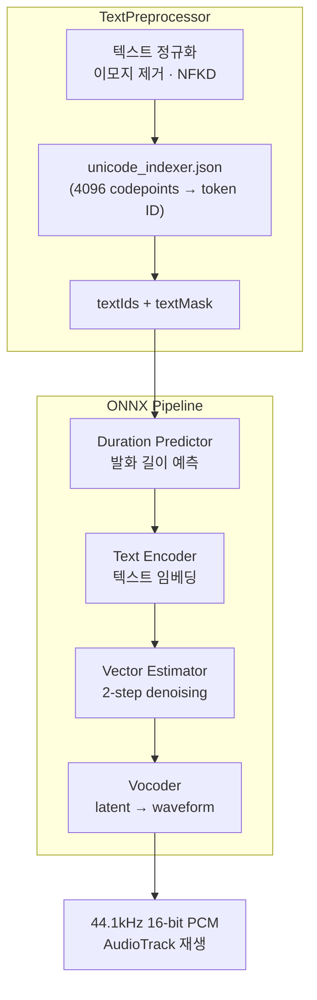

# "헤이 바라" — 한마디로 시작되는 4단계 음성 파이프라인

"헤이 바라, 엄마한테 전화해." 이 한마디가 실행되려면 4개의 AI 모델이 순차적으로 동작해야 합니다. Wake Word 감지, 음성 인식, 자연어 이해, 음성 합성. 각 단계마다 온디바이스 ONNX 모델이 돌아가고, 대기 시 메모리는 ~10MB로 유지됩니다. 안드로이드 폰 위에서 이 파이프라인을 설계한 과정을 정리합니다.

## 파이프라인 전체 구조



4단계 모두 완료되면 다시 Stage 1로 돌아가 웨이크워드를 대기합니다. 핵심은 **각 단계의 모델이 필요할 때만 로드되는 OnDemand 패턴**입니다. 대기 상태에서는 KWS 모델(~5MB)만 메모리에 상주합니다.

## 상태 머신 — VoiceSession

파이프라인의 흐름을 제어하는 것은 `VoiceSession` 클래스입니다. 4개의 상태를 순환하며, 각 상태 전이마다 다음 모듈을 활성화합니다.



```kotlin
class VoiceSession(
    private val recognizer: SpeechRecognizer,
    private val tts: TtsEngine,
    private val beep: BeepPlayer,
    private val agent: AgentEngine? = null
) {
    var currentState: SessionState = SessionState.IDLE
        private set

    fun onWakeWordDetected() {
        if (currentState != SessionState.IDLE) return
        transitionTo(SessionState.LISTENING)
        beep.playBeep {
            recognizer.start(
                onPartialResult = { /* UI 업데이트 */ },
                onFinalResult = { text -> onSpeechRecognized(text) },
                onError = { endSession() }
            )
        }
    }
}
```

`VoiceSession`은 인터페이스에만 의존합니다. `SpeechRecognizer`, `TtsEngine`, `BeepPlayer`, `AgentEngine` 모두 인터페이스이므로, 구현체를 교체해도 세션 로직은 변하지 않습니다. Supertonic TTS가 미설치된 기기에서는 `AndroidTtsEngine`(시스템 TTS)으로 폴백하는 식입니다.

## Stage 1: Wake Word — CMU Phoneme으로 커스텀 키워드 만들기

### 왜 Porcupine이 아닌가

| 항목 | Picovoice Porcupine | Sherpa-ONNX KWS |
|---|---|---|
| 라이선스 | 상용, 디바이스당 과금 | Apache 2.0, 무료 |
| 커스텀 키워드 | 콘솔에서 학습 필요 (~24시간) | CMU phoneme 텍스트 파일 1줄 |
| 모델 크기 | ~2MB | ~5MB (int8 양자화) |
| 한국어 지원 | 공식 미지원 | 영중 모델 + CMU 발음 매핑 |
| 오프라인 | O | O |

Porcupine은 업계 표준이지만, "헤이 바라"라는 커스텀 웨이크워드를 만들려면 Picovoice 콘솔에서 학습시켜야 합니다. Sherpa-ONNX KWS는 **CMU 발음 사전 형식의 텍스트 한 줄**로 키워드를 정의합니다.

### CMU Phoneme 매핑

```
HH EY1 B AA1 R AH0 @HEY_BARA
```

"헤이 바라"를 영어 발음 기호로 분해한 것입니다. `HH`(h), `EY1`(에이), `B`(ㅂ), `AA1`(아), `R`(ㄹ), `AH0`(아). 이 한 줄을 `keywords.txt`에 넣으면 웨이크워드 감지가 작동합니다.

### 감도 조절 메커니즘

```kotlin
val config = KeywordSpotterConfig(
    modelConfig = OnlineModelConfig(
        transducer = OnlineTransducerModelConfig(
            encoder = "$modelDir/encoder.onnx",
            decoder = "$modelDir/decoder.onnx",
            joiner = "$modelDir/joiner.onnx",
        ),
        tokens = "$modelDir/tokens.txt",
        modelType = "zipformer2",
    ),
    keywordsFile = "$modelDir/keywords.txt",
    // sensitivity 0.0~1.0 → score, threshold 변환
    keywordsScore = 0.5f + sensitivity * 2.5f,
    keywordsThreshold = 0.5f - sensitivity * 0.45f,
)
```

사용자가 설정에서 감도 슬라이더를 조절하면, `keywordsScore`(높을수록 민감)와 `keywordsThreshold`(낮을수록 민감)가 연동됩니다. 감도 0.5(기본값)일 때 score=1.75, threshold=0.275입니다.

## Stage 2: STT — Sherpa-ONNX Zipformer Korean

| 항목 | 수치 |
|---|---|
| 모델 | sherpa-onnx-streaming-zipformer-korean-2024-06-16 |
| 아키텍처 | Zipformer Transducer (encoder + decoder + joiner) |
| 파라미터 | ~79M |
| CER (Character Error Rate) | 9.91% |
| 모델 크기 (디스크) | ~300MB (3개 ONNX 파일) |
| 샘플레이트 | 16kHz mono |
| 스트리밍 | O (실시간 부분 결과) |

STT는 **OnDemand 로딩**을 적용합니다. 웨이크워드가 감지되면 그때 `OnlineRecognizer`를 초기화하고, 세션이 끝나면 참조를 해제합니다.

```kotlin
class SherpaSpeechRecognizer(
    private val modelDir: String
) : SpeechRecognizer {

    private var recognizer: OnlineRecognizer? = null

    private fun initRecognizer() {
        val config = OnlineRecognizerConfig(
            modelConfig = OnlineModelConfig(
                transducer = OnlineTransducerModelConfig(
                    encoder = "$modelDir/encoder-epoch-99-avg-1.onnx",
                    decoder = "$modelDir/decoder-epoch-99-avg-1.onnx",
                    joiner = "$modelDir/joiner-epoch-99-avg-1.onnx",
                ),
                tokens = "$modelDir/tokens.txt",
                modelType = "zipformer",
            ),
            enableEndpoint = true,
        )
        recognizer = OnlineRecognizer(null, config)
    }

    override fun start(...) {
        if (recognizer == null) initRecognizer()  // 최초 호출 시에만 로드
        stream = recognizer?.createStream()
        isListening = true
    }
}
```

`enableEndpoint = true`로 설정하면 사용자가 말을 멈춘 시점을 자동 감지합니다. 별도의 silence detection 로직이 필요 없습니다.

## Stage 3: NLP — Koog Agent

STT가 텍스트를 반환하면 `VoiceSession`은 `AgentEngine.process(text)`를 호출합니다. 내부적으로는 JetBrains Koog 프레임워크의 `AIAgent`가 Gemini API를 통해 Function Calling을 수행합니다. 이 부분은 별도 노트에서 상세히 다룹니다.



## Stage 4: TTS — Supertonic 2 (2-Step Diffusion)

### 아키텍처

Supertonic 2는 4개의 ONNX 모델로 구성된 한국어 TTS 엔진입니다.



| 항목 | 수치 |
|---|---|
| 총 파라미터 | ~66M (4개 모델 합산) |
| 모델 크기 (디스크) | ~263MB |
| 디노이징 스텝 | 2 (일반적인 diffusion TTS의 20~50 대비) |
| 샘플레이트 | 44,100Hz |
| 보이스 스타일 | F1 (여성 화자) |
| 속도 보정 | 1.05x |

### 2-Step Diffusion의 의미

일반적인 diffusion 기반 TTS(예: Grad-TTS)는 20~50 스텝의 디노이징이 필요합니다. Supertonic 2는 **단 2스텝**으로 동일한 품질을 달성합니다. 이것이 모바일에서 diffusion TTS를 실용적으로 만드는 핵심입니다.

```kotlin
// 3. Vector Estimator (2스텝 루프)
var latent = FloatArray(LATENT_DIM * latentLen) { Random.nextFloat() * 2 - 1 }

for (step in 0 until DENOISE_STEPS) {  // DENOISE_STEPS = 2
    val veResult = vectorEstimator!!.run(mapOf(
        "noisy_latent" to noisyLatentTensor,
        "text_emb" to textEmbTensor,
        "style_ttl" to styleTtlTensor,
        "latent_mask" to latentMaskTensor,
        "text_mask" to textMaskTensor,
        "current_step" to currentStepTensor,
        "total_step" to totalStepTensor
    ))
    latent = /* 업데이트된 latent */
}
```

### 싱글톤 모델 캐싱

TTS 모델은 4개의 ONNX 세션을 동시에 메모리에 올려야 합니다. 매번 로드하면 수 초가 걸리므로, `SupertonicTtsEngine`의 companion object에서 싱글톤으로 캐싱합니다.

```kotlin
companion object {
    private var sharedInference: SupertonicInference? = null

    @Synchronized
    private fun getOrLoadModels(modelDir: String): Pair<TextPreprocessor, SupertonicInference>? {
        if (sharedInference != null && loadedModelDir == modelDir) {
            return sharedPreprocessor!! to sharedInference!!
        }
        // 최초 호출 시에만 로드
        val inference = SupertonicInference(modelDir)
        inference.load()
        sharedInference = inference
        return sharedPreprocessor!! to sharedInference!!
    }
}
```

한 번 로드되면 앱이 살아있는 동안 재사용됩니다. `release()`에서도 싱글톤 모델은 해제하지 않습니다.

## OnDemand 로딩 — 메모리 전략

| 상태 | 메모리에 있는 모델 | 추정 메모리 |
|---|---|---|
| IDLE (대기) | KWS (~3M params, int8) | ~10MB |
| LISTENING (음성 인식 중) | KWS + STT (~79M params) | ~320MB |
| PROCESSING (Agent 처리 중) | STT + Koog (네트워크만) | ~310MB |
| TTS 재생 중 | TTS (~66M params, 4 세션) | ~280MB |

대기 상태에서 ~10MB, 최대 부하 시 ~320MB. 2GB RAM 디바이스에서도 안정적으로 동작합니다.

### 모델 설치 — 사용자가 선택하는 다운로드

모델은 APK에 포함하지 않습니다. 총 ~568MB의 모델을 앱에 번들링하면 설치 허들이 너무 높습니다. 대신 설정 화면에서 각 모델을 개별 다운로드합니다.

| 모델 | 소스 | 크기 |
|---|---|---|
| KWS (Wake Word) | GitHub Releases tar.bz2 | ~5MB |
| STT (음성 인식) | HuggingFace 개별 파일 | ~300MB |
| TTS (음성 합성) | HuggingFace Supertonic 2 | ~263MB |

TTS가 미설치된 경우 Android 시스템 TTS(`AndroidTtsEngine`)로 폴백합니다. 품질은 떨어지지만 기능은 동작합니다.

```kotlin
val tts = if (ModelInstaller.isTtsInstalled(this)) {
    SupertonicTtsEngine(File(filesDir, "models/tts").absolutePath)
        .also { it.loadModels() }
} else {
    AndroidTtsEngine(this)  // 시스템 TTS 폴백
}
```

## Foreground Service — 항상 듣는 귀

파이프라인은 `VoiceAssistantService`라는 Foreground Service 위에서 돌아갑니다. Android에서 백그라운드 마이크 접근은 Foreground Service + `FOREGROUND_SERVICE_TYPE_MICROPHONE`이 필수입니다.

```kotlin
startForeground(
    1,
    buildNotification("대기 중 — \"헤이 바라\"로 호출"),
    ServiceInfo.FOREGROUND_SERVICE_TYPE_MICROPHONE
)
startWakeWordDetection()
```

서비스가 시작되면 KWS 감지를 시작하고, 웨이크워드가 감지되면 KWS를 멈추고 STT 세션을 열고, 세션이 종료되면 다시 KWS를 시작합니다. 이 사이클이 서비스가 살아있는 동안 반복됩니다.

## 핵심 인사이트

- **OnDemand 로딩이 모바일 AI의 핵심**: 4개 모델(KWS 3M + STT 79M + TTS 66M)을 동시에 올리면 ~600MB. 대기 시 KWS만 유지하고 필요 시 로드하는 패턴으로 idle 메모리를 ~10MB로 제어
- **CMU Phoneme 한 줄로 커스텀 웨이크워드**: Porcupine처럼 별도 학습 없이 `HH EY1 B AA1 R AH0 @HEY_BARA` 텍스트 파일 하나로 "헤이 바라" 감지. 새 키워드 추가도 발음 사전 편집만으로 가능
- **2-Step Diffusion이 모바일 TTS를 실용화**: 일반 diffusion TTS의 20~50 스텝 vs Supertonic 2의 2스텝. 10~25배 빠른 추론으로 모바일에서 실시간 음성 합성이 가능해짐
- **인터페이스 의존성이 폴백을 가능하게 함**: `TtsEngine` 인터페이스 덕분에 Supertonic 2 미설치 시 `AndroidTtsEngine`으로 즉시 전환. 모델 교체가 세션 로직에 영향 없음
- **상태 머신이 파이프라인의 안전장치**: IDLE/LISTENING/PROCESSING/CONFIRMING 4상태 FSM으로 "STT 중에 웨이크워드 재감지" 같은 레이스 컨디션 방지. 각 상태에서 허용되는 전이만 수행
- **APK에 모델을 넣지 않는 전략**: 568MB 모델을 번들링하면 Play Store 150MB 제한 초과. 설정에서 개별 다운로드 + 폴백 조합으로 설치 허들을 낮추면서 기능 보장
