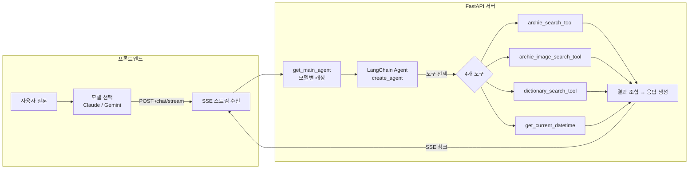
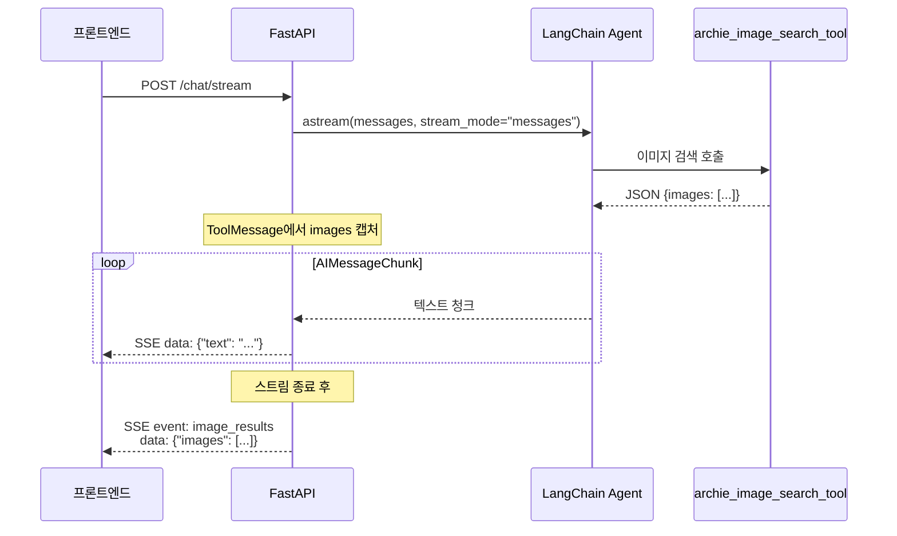

# 에이전트에게 문화재 전문가의 도구를 쥐어주면

"청동기시대 주거지 특징이 뭐야?" 이 질문에 단순 키워드 검색으로 답할 수도 있습니다. 하지만 발굴조사보고서 텍스트를 시맨틱 검색하고, 관련 이미지를 벡터로 찾고, 전문 용어의 정의를 사전에서 확인한 뒤, 이 모든 결과를 종합해 답변을 구성하려면? LLM이 직접 도구를 선택하고 조합하는 에이전트가 필요합니다. Bonda의 AI 에이전트 "아키(Archie)"는 LangChain `create_agent`로 4개의 특화 도구를 쥐고, Claude Sonnet과 Gemini Pro를 전환하며, SSE 스트리밍으로 실시간 응답합니다. 이 구조를 설계한 과정을 정리합니다.

## 에이전트 아키텍처



핵심은 **에이전트가 질문을 분석하고 어떤 도구를 어떤 순서로 호출할지 스스로 결정**한다는 점입니다. "경기도 청동기시대 주거지에서 출토된 토기 사진"이라는 질문이 들어오면, 에이전트는 `archie_search_tool`로 보고서를 먼저 검색하고, `archie_image_search_tool`로 관련 이미지를 찾고, `dictionary_search_tool`로 "송국리형 주거지" 같은 용어 정의를 확인한 뒤, 세 결과를 종합해 답변합니다.

## 4개 특화 도구

### archie_search_tool — 문서 시맨틱 검색 + 필터

발굴조사보고서와 UNESCO SOC 보고서를 3가지 모드로 검색합니다.

| 모드 | 용도 | 검색 방식 |
|---|---|---|
| `rag` | 자연어 질문 답변 | Qdrant 벡터 유사도 → 관련 청크 반환 |
| `filter` | 보고서 목록 조회 | 메타데이터 필터링 (지역, 시대, 유형) |
| `hybrid` | 조건부 시맨틱 검색 | 필터 + 벡터 유사도 조합 |

```python
@tool
def archie_search_tool(
    query: str,
    mode: str = "rag",
    source_type: str | None = None,
    province: str | None = None,
    periods: str | None = None,
    site_types: str | None = None,
    limit: int = 5,
) -> str:
    """한국 발굴조사보고서와 UNESCO 세계유산 보존현황보고서(SOC)를 검색합니다."""
    service = _get_search_service()
    periods_list = [p.strip() for p in periods.split(",")] if periods else None
    site_types_list = [s.strip() for s in site_types.split(",")] if site_types else None

    result = service.search(
        query=query, mode=mode,
        source_type=source_type, province=province,
        periods=periods_list, site_types=site_types_list,
        limit=limit,
    )
```

에이전트가 `mode`를 직접 선택합니다. "경기도 보고서 목록 보여줘"에는 `filter`, "청동기시대 주거지 구조"에는 `rag`, "전남 지역 삼국시대 고분"에는 `hybrid`를 사용합니다. 필터 파라미터(`province`, `periods`, `site_types`)는 쉼표 구분 문자열로 받아 내부에서 리스트로 변환합니다. LLM이 리스트보다 문자열을 안정적으로 생성하기 때문입니다.

### archie_image_search_tool — 이미지 듀얼 벡터 검색

발굴 도면, 유물 사진 등을 텍스트 또는 유사 이미지로 검색합니다.

```python
@tool
def archie_image_search_tool(
    mode: Literal["by_text", "similar"],
    query: str = "",
    point_id: str = "",
    limit: int = 12,
) -> str:
    """발굴조사보고서 이미지를 검색합니다."""
```

| 모드 | 입력 | 벡터 | 예시 |
|---|---|---|---|
| `by_text` | 텍스트 질의 | 텍스트 임베딩 → 이미지 벡터 매칭 | "청동기 출토 이미지" |
| `similar` | 기존 이미지 ID | 이미지 벡터 → 이미지 벡터 매칭 | 사용자가 선택한 이미지와 유사한 것 |

반환값은 JSON 문자열로, `images` 배열에 각 이미지의 `point_id`, `gcs_path`, `description`, `score`가 포함됩니다. SSE 스트리밍에서 이 JSON을 파싱해 별도의 `image_results` 이벤트로 발행하는 구조입니다(후술).

### dictionary_search_tool — 고고학 용어 사전 (13K+ 항목)

13,000개 이상의 고고학 용어와 유적 정의를 듀얼 벡터로 검색합니다.

```python
@tool
def dictionary_search_tool(
    query: str,
    mode: str = "both",
    category: str | None = None,
    limit: int = 5,
) -> str:
    """고고학 전문 용어 사전을 검색합니다."""
```

| 모드 | 검색 대상 | 사용 시점 |
|---|---|---|
| `both` | 용어명 + 정의 동시 검색 | 기본값, 범용 검색 |
| `term` | 용어명 벡터만 | 정확한 용어를 알 때 |
| `definition` | 정의 벡터만 | 설명으로 용어를 찾을 때 |

`category` 필터로 "용어"(학술 용어)와 "유적"(유적/유물)을 구분할 수 있습니다. 에이전트는 답변에 전문 용어를 사용할 때 이 도구로 정의를 확인하고, 출처 사전명까지 함께 인용합니다.

### get_current_datetime — 시간 컨텍스트

```python
@tool
def get_current_datetime(timezone: str = "Asia/Seoul") -> str:
    """현재 날짜와 시간을 반환합니다."""
    now = datetime.now(ZoneInfo(timezone))
    return now.strftime("%Y년 %m월 %d일 %A %H:%M:%S (%Z)")
```

단순하지만 필요한 도구입니다. "오늘 날짜가 언제야?" 같은 질문에 응답하고, 시스템 프롬프트에서 "현재 시점" 맥락을 제공하는 데 사용됩니다.

## 멀티모델 전환

하나의 에이전트 코드로 Claude Sonnet과 Gemini Pro를 전환합니다.

```python
# 모델 키 → (provider, model) 매핑
SUPPORTED_MODELS: dict[str, tuple[str, str]] = {
    "claude-sonnet-4-6": (Provider.ANTHROPIC, AnthropicModel.CLAUDE_SONNET_4_6),
    "gemini-3.1-pro-preview": (Provider.GOOGLE, GoogleModel.GEMINI_3_1_PRO),
}

# 모델별 에이전트 캐시
_agent_cache: dict[str, "MainAgent"] = {}

def get_main_agent(model_key: str = DEFAULT_MODEL) -> MainAgent:
    """모델별 에이전트 인스턴스 반환 (캐싱)"""
    if model_key not in _agent_cache:
        _agent_cache[model_key] = MainAgent(model_key)
    return _agent_cache[model_key]
```

### LLMFactory 패턴

`LLMFactory.create()`가 프로바이더별 LangChain 클래스를 반환합니다.

```python
class LLMFactory:
    @staticmethod
    def create(provider: Provider | str, model: GoogleModel | str, **kwargs) -> BaseChatModel:
        match provider_str:
            case Provider.GOOGLE.value:
                return ChatGoogleGenerativeAI(model=model_str, google_api_key=settings.GEMINI_API_KEY, **kwargs)
            case Provider.ANTHROPIC.value:
                return ChatAnthropic(model=model_str, api_key=settings.ANTHROPIC_API_KEY, **kwargs)
```

### 모델별 에이전트 캐싱

`_agent_cache` 딕셔너리가 모델 키별로 에이전트 인스턴스를 캐싱합니다. 첫 요청에서 에이전트를 생성하고, 이후 같은 모델 요청은 캐시된 인스턴스를 재사용합니다. LLM 클라이언트 초기화 비용을 매 요청마다 지불하지 않기 위한 설계입니다.

### 프론트엔드 모델 전환

프론트엔드에서 `ChatRequest.model` 필드로 모델을 지정합니다.

```python
class ChatRequest(BaseModel):
    message: str
    thread_id: str | None = None
    messages: list[MessageItem] = []   # 이전 대화 히스토리
    model: str | None = None           # "claude-sonnet-4-6" | "gemini-3.1-pro-preview"
```

사용자가 UI에서 모델을 바꾸면, 다음 요청부터 해당 모델의 에이전트가 사용됩니다. 대화 히스토리는 프론트엔드가 관리하므로(Stateless 방식), 모델을 중간에 전환해도 맥락이 유지됩니다.

## SSE 스트리밍

`/chat/stream` 엔드포인트가 SSE(Server-Sent Events)로 에이전트 응답을 실시간 전송합니다.

```python
@app.post("/chat/stream")
async def chat_stream(request: ChatRequest):
    async def event_generator():
        main_agent = get_main_agent(model_key)
        full_response = ""
        images_to_emit: list = []

        async for chunk in main_agent.agent.astream(
            {"messages": all_messages},
            stream_mode="messages",
        ):
            msg, metadata = chunk
            if isinstance(msg, AIMessageChunk) and msg.content:
                text = extract_text(msg.content)
                full_response += text
                yield {"data": json.dumps({"text": text}, ensure_ascii=False)}
            elif isinstance(msg, ToolMessage):
                try:
                    tool_result = json.loads(msg.content)
                    if "images" in tool_result:
                        images_to_emit = tool_result["images"]
                except (json.JSONDecodeError, TypeError):
                    pass

        # 스트림 종료 후 image_results 이벤트 발행
        if images_to_emit:
            yield {
                "event": "image_results",
                "data": json.dumps({"images": images_to_emit}, ensure_ascii=False),
            }

    return EventSourceResponse(event_generator())
```

### 스트리밍 이벤트 흐름



텍스트는 `AIMessageChunk` 단위로 즉시 스트리밍하고, 이미지 결과는 `ToolMessage`에서 캡처해 뒀다가 **스트림 종료 후** 별도 `image_results` 이벤트로 발행합니다. 텍스트 스트리밍 중간에 이미지 JSON이 끼어들면 프론트엔드 렌더링이 복잡해지기 때문입니다.

## LangSmith 트레이싱

에이전트의 도구 호출 체인을 LangSmith로 모니터링합니다.

```python
def _setup_langsmith():
    """LangSmith 트레이싱 설정"""
    settings = get_settings()
    if settings.LANGSMITH_TRACING and settings.LANGSMITH_API_KEY:
        os.environ["LANGSMITH_TRACING"] = "true"
        os.environ["LANGSMITH_ENDPOINT"] = settings.LANGSMITH_ENDPOINT
        os.environ["LANGSMITH_API_KEY"] = settings.LANGSMITH_API_KEY
        os.environ["LANGSMITH_PROJECT"] = settings.LANGSMITH_PROJECT
```

앱 시작 시 `lifespan`에서 환경 변수를 설정하면, LangChain이 자동으로 모든 에이전트 실행을 트레이싱합니다. 각 실행에서 다음을 추적할 수 있습니다:

- 에이전트가 어떤 도구를 어떤 순서로 호출했는지
- 각 도구 호출의 입력 파라미터와 반환값
- LLM 호출별 토큰 사용량과 지연 시간
- 도구 재시도(최대 3회) 패턴과 쿼리 변경 이력

## 핵심 인사이트

- **에이전트가 도구 조합을 결정**: 4개 도구의 호출 여부, 순서, 파라미터를 LLM이 판단. "경기도 청동기 주거지 토기 사진"이라는 하나의 질문에 문서 검색 → 이미지 검색 → 용어 사전 3단계가 자동으로 실행
- **모델별 에이전트 캐싱으로 전환 비용 제거**: `_agent_cache` 딕셔너리가 Claude/Gemini 에이전트를 각각 한 번만 초기화. 프론트엔드에서 모델을 바꿔도 재초기화 없이 즉시 전환
- **Stateless 대화 관리**: 서버에 세션 상태를 두지 않고 프론트엔드가 `messages` 배열로 히스토리를 전달. 모델 전환, 서버 재시작에도 대화 맥락이 유실되지 않음
- **이미지 결과의 지연 발행**: 텍스트 스트리밍 중간에 이미지 JSON을 끼우지 않고, 스트림 종료 후 별도 `image_results` SSE 이벤트로 분리. 프론트엔드가 텍스트와 이미지를 독립적으로 렌더링 가능
- **LLM 친화적 파라미터 설계**: 도구의 필터 파라미터를 리스트가 아닌 쉼표 구분 문자열로 정의. LLM이 `"삼국시대,백제시대"` 형태로 안정적으로 생성하고, 내부에서 파싱
