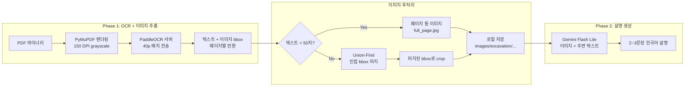
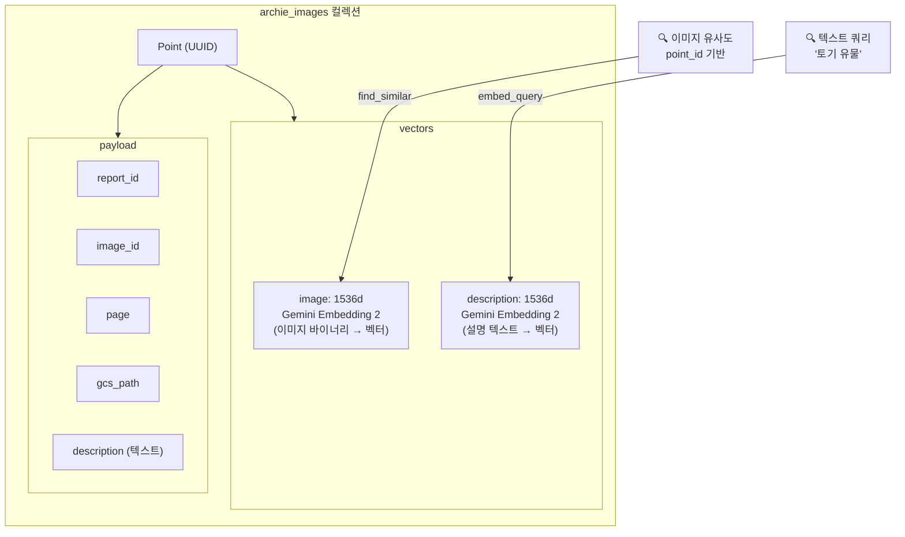

# 유물 사진을 텍스트로도, 이미지로도 찾는다

발굴조사보고서는 수백 페이지의 PDF이고, 그 안에 유물 사진, 유구 도면, 현장 전경 등 수십~수백 장의 이미지가 포함되어 있습니다. 텍스트는 벡터 검색이 가능하지만, 이미지는 어떻게 검색 가능하게 만들 것인가? "토기"라고 입력하면 토기 사진이 나오고, 특정 토기 사진을 클릭하면 비슷한 모양의 토기를 찾아주는 시스템. 이를 위해 하나의 이미지에 2개의 벡터를 부여하는 듀얼 벡터 설계를 적용했습니다.

## 이미지 처리 파이프라인

PDF에서 이미지를 추출하는 과정은 4단계로 이루어집니다.



OCR 서버(PaddleOCR 기반)는 텍스트와 함께 이미지 블록의 bounding box를 반환합니다. 이때 단순히 개별 bbox를 crop하면 하나의 유물 사진이 여러 조각으로 분리되는 문제가 발생합니다. 이를 해결하기 위해 **Union-Find 알고리즘으로 인접/겹치는 bbox를 그룹핑**한 뒤, 그룹별로 합쳐진 bbox로 crop합니다.

```python
@staticmethod
def _merge_adjacent_bboxes(
    images: list[dict], page_height: int
) -> list[list[int]]:
    n = len(images)
    threshold = page_height * 0.02  # 페이지 높이의 2%

    parent = list(range(n))

    def find(x):
        while parent[x] != x:
            parent[x] = parent[parent[x]]
            x = parent[x]
        return x

    def union(a, b):
        ra, rb = find(a), find(b)
        if ra != rb:
            parent[ra] = rb

    for i in range(n):
        for j in range(i + 1, n):
            if bboxes_adjacent(images[i]["bbox"], images[j]["bbox"], threshold):
                union(i, j)

    # 그룹핑 → [[0,1], [2], [3,4,5], ...]
    groups = {}
    for i in range(n):
        groups.setdefault(find(i), []).append(i)
    return list(groups.values())
```

텍스트가 거의 없는 페이지(순수 텍스트 50자 미만)는 사진 도판 페이지로 판단하여 개별 crop 대신 **페이지 전체를 하나의 이미지로 저장**합니다. 이렇게 하면 도판 페이지에서 불필요한 조각화를 방지할 수 있습니다.

## 듀얼 벡터 설계

하나의 이미지에 대해 2가지 검색 시나리오가 있습니다.

| 시나리오 | 쿼리 타입 | 검색 대상 벡터 |
|---|---|---|
| "토기 사진 보여줘" | 텍스트 | description (설명 텍스트 임베딩) |
| "이 토기랑 비슷한 거 찾아줘" | 이미지 | image (이미지 자체 임베딩) |

텍스트 검색과 이미지 유사도 검색을 하나의 컬렉션에서 처리하기 위해, Qdrant의 **named vectors**를 사용합니다. 하나의 포인트에 `image`와 `description` 두 개의 벡터를 저장하고, 검색 시 `using` 파라미터로 어떤 벡터를 대상으로 검색할지 지정합니다.



## Gemini Vision 설명 생성

이미지 벡터만으로는 "토기", "고분", "철기" 같은 텍스트 검색이 불가능합니다. 각 이미지에 대해 **Gemini Flash Lite로 2~3문장의 한국어 설명을 자동 생성**하고, 이 설명을 임베딩하여 텍스트 검색을 가능하게 합니다.

```python
DESCRIBE_IMAGE_PROMPT_SINGLE = """이 이미지는 한국 발굴조사보고서에 수록된 이미지입니다.
이미지의 내용을 2~3문장으로 간결하게 설명하세요.
유적, 유물, 도면, 지도 등 고고학적 맥락에 맞게 설명하세요.
설명만 작성하고, 다른 텍스트는 포함하지 마세요.

아래는 이 이미지가 포함된 보고서의 주변 텍스트입니다. 참고하여 더 정확한 설명을 작성하세요:
---
{context}
---"""
```

핵심은 **주변 텍스트 컨텍스트를 함께 제공**하는 것입니다. 이미지 플레이스홀더 위치를 기준으로 앞뒤 500자의 본문 텍스트를 추출하여 프롬프트에 포함합니다. 텍스트 없는 도판 페이지의 경우 인접 페이지(앞/뒤)에서 텍스트를 가져옵니다. 이렇게 하면 단순히 "토기 사진"이 아니라 "OO 유적 3호 주거지에서 출토된 경질무문토기"처럼 맥락이 포함된 설명이 생성됩니다.

대량 처리 시에는 **Gemini Batch API**를 사용합니다. 이미지별 1개 request를 JSONL로 묶어 비동기 job으로 제출하고, 폴링으로 결과를 수집합니다. 500개 단위 청크로 분할하며, 첫 번째 청크 성공 후 나머지를 세마포어 기반 5개 병렬로 실행합니다.

## Qdrant archie_images 컬렉션

컬렉션 생성 코드에서 듀얼 벡터 구조가 명확하게 드러납니다.

```python
# 컬렉션 생성 (듀얼 named vector)
qdrant.create_collection(
    collection_name="archie_images",
    vectors_config={
        "image": VectorParams(
            size=1536,           # Gemini Embedding 2, 이미지 바이너리 임베딩
            distance=Distance.COSINE,
        ),
        "description": VectorParams(
            size=1536,           # Gemini Embedding 2, 설명 텍스트 임베딩
            distance=Distance.COSINE,
        ),
    },
)
```

포인트 업로드 시 이미지 바이너리와 설명 텍스트를 각각 임베딩하여 두 벡터를 동시에 저장합니다.

```python
# 듀얼 벡터 포인트 생성
for img_meta, desc_vec, img_vec in zip(images_with_desc, desc_vectors, image_vectors):
    payload = ImagePayload(
        report_id=report_id,
        image_id=img_meta["image_id"],    # "p3_image_0"
        page=img_meta["page"],             # 3
        gcs_path=img_meta["gcs_path"],     # "archie/images/excavation/..."
        description=img_meta["description"],  # "경질무문토기 저부 편..."
    )
    image_points.append(PointStruct(
        id=str(uuid.uuid4()),
        vector={
            "image": img_vec,        # 이미지 바이너리 → 1536d
            "description": desc_vec,  # 설명 텍스트 → 1536d
        },
        payload=payload.model_dump(),
    ))
```

이미지 임베딩은 `gemini-embedding-2-preview`가 멀티모달을 지원하여 **이미지 바이너리를 직접 임베딩**합니다. 요청당 최대 6개 이미지를 배치로 처리하고, ThreadPoolExecutor로 5개 배치를 동시에 전송합니다.

## 검색 UX

AI 서비스 레이어에서 두 검색 모드를 분리합니다.

```python
class ArchieSearchService:
    def search_images_by_text(self, query: str, limit: int = 12) -> list[ArchieImage]:
        """텍스트 → description 벡터 검색"""
        query_vector = self.qdrant.embed_query(query)
        response = self.qdrant.query_points(
            collection_name="archie_images",
            query_vector=query_vector,
            using="description",   # 설명 벡터로 검색
            limit=limit,
        )
        return [self._point_to_archie_image(hit) for hit in response.points]

    def find_similar_images(self, point_id: str, limit: int = 12) -> list[ArchieImage]:
        """이미지 → image 벡터 유사도 검색"""
        response = self.qdrant.find_similar(
            collection_name="archie_images",
            point_id=point_id,
            using="image",         # 이미지 벡터로 검색
            limit=limit,
        )
        return [self._point_to_archie_image(p) for p in response.points]
```

LangChain 도구로 노출되어 LLM이 직접 호출합니다. `by_text` 모드는 사용자의 텍스트 질문을 description 벡터로 검색하고, `similar` 모드는 사용자가 선택한 이미지의 point_id로 image 벡터 유사도 검색을 수행합니다. 결과는 JSON으로 직렬화되어 SSE 스트리밍으로 프론트엔드에 전달되며, 프론트엔드는 GCS signed URL로 이미지를 렌더링합니다.

```python
@tool
def archie_image_search_tool(
    mode: Literal["by_text", "similar"],
    query: str = "",
    point_id: str = "",
    limit: int = 12,
) -> str:
    """발굴조사보고서 이미지를 검색합니다."""
    if mode == "by_text":
        images = service.search_images_by_text(query=query, limit=limit)
    elif mode == "similar":
        images = service.find_similar_images(point_id=point_id, limit=limit)

    return json.dumps({"summary": ..., "images": image_dicts}, ensure_ascii=False)
```

## 핵심 인사이트

- **듀얼 벡터가 2가지 검색 시나리오를 하나의 컬렉션에서 해결**: 텍스트 검색(description 벡터)과 이미지 유사도 검색(image 벡터)을 named vectors로 분리. 별도 컬렉션이나 인덱스 없이 `using` 파라미터 하나로 검색 대상을 전환
- **Gemini Embedding 2의 멀티모달 임베딩이 파이프라인을 단순화**: 이미지 바이너리를 CLIP 등 별도 모델 없이 동일한 Gemini API로 임베딩. 텍스트와 이미지가 같은 1536차원 공간에 매핑되므로 크로스모달 검색도 가능
- **Union-Find로 인접 bbox를 머지하여 이미지 품질 확보**: OCR이 하나의 사진을 여러 블록으로 분리하는 문제를 페이지 높이 2% 임계값의 Union-Find로 해결. 도판 페이지는 통 이미지로 저장하여 불필요한 조각화 방지
- **주변 텍스트 컨텍스트가 설명 품질을 결정**: Gemini Vision에 이미지만 보내면 "토기 사진"이지만, 보고서 본문 500자를 함께 보내면 "OO 유적 3호 주거지 출토 경질무문토기". 도판 페이지는 인접 페이지에서 텍스트를 추출하는 폴백 적용
- **Batch API + Sync 폴백으로 대량 처리 안정성 확보**: 수천 장의 이미지 설명을 Batch API(비동기 job)로 처리하되, 429 발생 시 세마포어 기반 Sync API로 자동 폴백. 100개 단위 중간 저장으로 장애 시 재시작 가능
