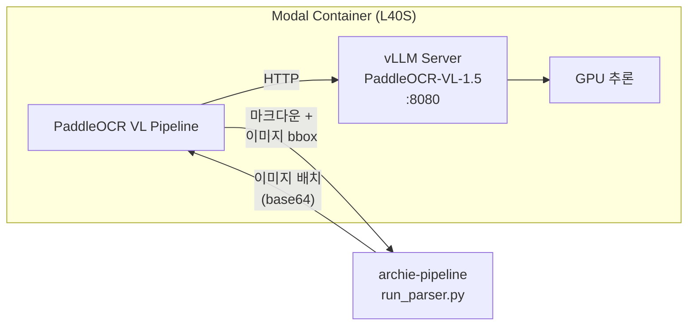

# 서버리스 GPU로 수천 페이지 OCR 돌리기

발굴조사보고서는 대부분 스캔 PDF입니다. 한 보고서가 200~500페이지, 처리 대상이 수백 건이면 수만 페이지를 OCR로 읽어야 합니다. 로컬 GPU로는 시간이 너무 오래 걸리고, 상시 GPU 서버를 두기엔 비용이 과합니다. Modal 서버리스 GPU가 답이었습니다.

## 왜 Modal인가

Modal은 "코드 한 파일이 곧 인프라"입니다. Dockerfile 없이 Python 데코레이터로 GPU 타입, 이미지, 볼륨, 오토스케일링을 선언합니다. 배포는 `modal deploy app.py` 한 줄이면 됩니다.

Bonda에서 Modal을 사용하는 서비스는 두 가지입니다.

| 서비스 | GPU | 용도 | 동시 처리 |
|---|---|---|---|
| `bonda-doc-parser` | L40S (48GB VRAM) | PaddleOCR VL-1.5 — PDF OCR | max_inputs=1 |
| `bonda-clip` | T4 (16GB VRAM) | jina-clip-v2 — 이미지 임베딩 | max_inputs=10 |

OCR에 L40S를 사용하는 이유는 PaddleOCR-VL-1.5 모델이 vLLM 서버로 구동되기 때문입니다. VLM(Vision-Language Model) 추론은 VRAM을 많이 소비하고, `gpu_memory_utilization=0.9`로 48GB 중 43GB를 활용합니다. 반면 CLIP 임베딩은 모델 크기가 ~4GB 수준이라 T4로 충분합니다.

## PaddleOCR + vLLM 아키텍처

핵심 설계는 vLLM을 서브프로세스로 띄우고, PaddleOCR가 그 위에서 동작하는 구조입니다.



컨테이너가 시작되면 `@modal.enter()` 훅에서 두 단계를 거칩니다.

1. **vLLM 서버 기동**: `PaddleOCR-VL-1.5` 모델을 OpenAI-compatible API로 서빙. `--kv-cache-dtype fp8`로 KV 캐시 메모리를 절반으로 줄이고, `--max-num-batched-tokens 16384`로 배치 처리량을 확보합니다.
2. **PaddleOCR 파이프라인 초기화**: `PaddleOCRVL` 인스턴스가 vLLM 서버를 백엔드로 사용. 레이아웃 분석은 CPU에서, VLM 추론만 GPU에서 처리합니다.

```python
@app.cls(
    image=image,
    gpu="L40S",
    scaledown_window=2 * MINUTES,    # 2분 유휴 시 자동 종료
    timeout=10 * MINUTES,
    volumes={"/root/.cache": model_cache},
)
@modal.concurrent(max_inputs=1)
class DocParserService:
    @modal.enter()
    def load_model(self):
        # 1. vLLM 서버 시작 (서브프로세스)
        self.vllm_proc = subprocess.Popen([
            sys.executable, "-m", "vllm.entrypoints.openai.api_server",
            "--model", "PaddlePaddle/PaddleOCR-VL-1.5",
            "--gpu-memory-utilization", "0.9",
            "--kv-cache-dtype", "fp8",
            "--port", "8080",
        ])
        # 2. PaddleOCR 파이프라인 (vLLM 서버를 백엔드로)
        self.pipeline = PaddleOCRVL(
            device="cpu",
            vl_rec_backend="vllm-server",
            vl_rec_server_url="http://127.0.0.1:8080/v1",
            vl_rec_max_concurrency=8,
        )
```

## 배치 처리와 파이프라인

호출자(archie-pipeline)는 PDF를 PyMuPDF로 페이지별 이미지로 렌더링한 뒤, base64 배열로 Modal에 전송합니다. PaddleOCR 내부에서 3단계 파이프라인(입력 준비 -> 레이아웃 분석 -> VLM 추론)이 큐 기반으로 동작하며, VLM 요청을 자동 미니배칭합니다.

결과는 페이지별로 마크다운 텍스트와 이미지 bbox 좌표를 반환합니다. 이미지 영역은 `` 형태로 마크다운에 삽입되고, bbox 좌표는 나중에 원본 PDF에서 이미지를 크롭할 때 사용됩니다.

```python
# 반환 형태
[
    {
        "markdown": "## 제3장 조사내용\n\n1호 주거지는...\n\n\n\n...",
        "images": [{"id": "image_0", "bbox": [72, 340, 520, 680]}]
    },
    # ... 페이지별 반복
]
```

## 비용 최적화

Modal의 `scaledown_window=2 * MINUTES` 설정이 핵심입니다. 마지막 요청 후 2분간 유휴 상태가 지속되면 컨테이너가 자동 종료됩니다. vLLM 모델 로딩에 약 60초가 걸리지만, 대량 처리 시에는 컨테이너가 warm 상태를 유지하므로 초기 로딩은 한 번만 발생합니다.

모델 가중치는 `modal.Volume`에 캐시하여 재배포 시에도 다운로드를 건너뜁니다. L40S 시간당 비용이 ~$1.2인데, 500페이지 보고서 하나를 OCR하는 데 약 10분이 걸리므로 보고서당 ~$0.2입니다. 상시 GPU 인스턴스 대비 수십 배 저렴합니다.

## 배운 점

- **vLLM을 서브프로세스로 띄우는 패턴이 유효하다**: PaddleOCR처럼 VLM을 내부적으로 호출하는 라이브러리에서, vLLM 서버를 별도 프로세스로 띄우면 배칭·KV캐시 최적화를 공짜로 얻음
- **`max_inputs=1`은 제약이 아니라 안전장치**: VLM 추론은 GPU 메모리를 거의 전부 사용하므로 동시 요청을 1로 제한. 대신 PaddleOCR 내부 파이프라인이 페이지 단위 미니배칭을 처리
- **서버리스 GPU의 진짜 가치는 "안 쓸 때 0원"**: 보고서 500건을 일괄 처리할 때만 GPU를 쓰고, 평소에는 비용이 0. 상시 서버 대비 TCO가 압도적으로 낮음
