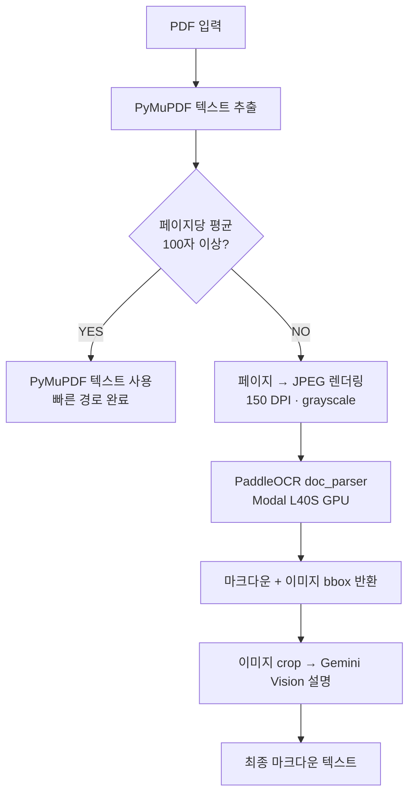
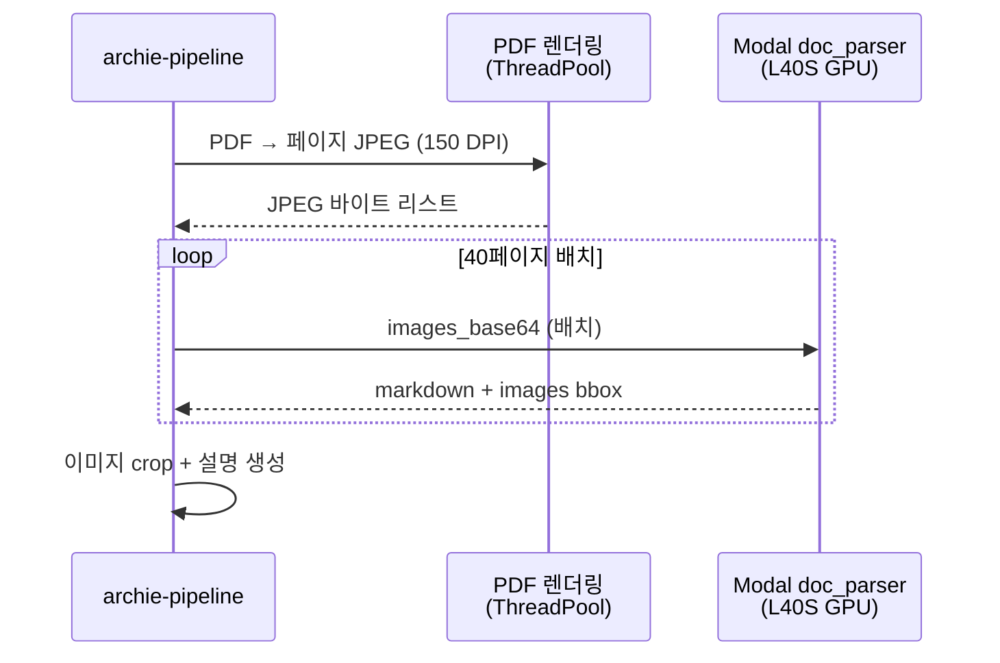

# 텍스트가 없는 PDF를 어떻게 읽을까

발굴조사보고서 PDF에는 두 종류가 있습니다. 디지털로 생성된 PDF는 텍스트를 바로 추출할 수 있지만, 스캔된 PDF나 이미지 기반 PDF는 텍스트 레이어가 없어서 `page.get_text()`를 호출해도 빈 문자열만 돌아옵니다. Bonda의 archie-pipeline은 수천 건의 보고서를 처리해야 하므로, 두 경우를 모두 커버하는 2단계 폴백 전략을 설계했습니다.

## 2단계 폴백 전략



핵심은 **조건부 폴백**입니다. 모든 PDF에 OCR을 돌리면 GPU 비용이 불필요하게 증가하고, 반대로 PyMuPDF만 사용하면 스캔 PDF에서 텍스트를 전혀 얻지 못합니다. 페이지당 평균 100자라는 임계값으로 두 경로를 분기합니다.

```python
class PdfParseService:
    OCR_THRESHOLD_CHARS_PER_PAGE = 100

    def _needs_ocr(self, pages: list[dict], file_key: str = "") -> bool:
        if not pages:
            return True
        total_chars = sum(len(p.get("content", "")) for p in pages)
        avg_chars = total_chars / len(pages)
        return avg_chars < self.OCR_THRESHOLD_CHARS_PER_PAGE
```

## PyMuPDF 빠른 경로

텍스트 레이어가 있는 PDF는 PyMuPDF(`fitz`)로 직접 추출합니다. GPU가 필요 없고, 수백 페이지 PDF도 수 초 안에 처리됩니다.

```python
def _extract_text_pymupdf(self, pdf_bytes: bytes, file_key: str = "") -> list[dict]:
    doc = fitz.open(stream=pdf_bytes, filetype="pdf")
    pages = []
    for page_num in range(len(doc)):
        page = doc[page_num]
        text = page.get_text().strip()
        pages.append({"page": page_num + 1, "content": text})
    doc.close()
    return pages
```

| 항목 | 수치 |
|---|---|
| 라이브러리 | PyMuPDF (fitz) |
| 처리 방식 | 텍스트 레이어 직접 추출 |
| 속도 | 수백 페이지 PDF → 수 초 |
| GPU 필요 | X |
| 스캔 PDF 지원 | X (빈 문자열 반환) |

PyMuPDF는 빠르고 정확하지만, 스캔 PDF에서는 아무 텍스트도 얻지 못합니다. 이때 OCR 폴백이 작동합니다.

## PaddleOCR doc_parser

OCR이 필요한 PDF는 Modal 서버리스 GPU 위의 PaddleOCR-VL-1.5로 처리합니다. 단순 텍스트 OCR이 아니라 **문서 구조 인식(Document Parsing)**을 수행합니다.


### 블록 타입별 처리

PaddleOCR doc_parser는 페이지를 의미 단위 블록으로 분류합니다.

| block_label | 처리 방식 |
|---|---|
| `text`, `abstract`, `references` | 마크다운 텍스트로 변환 |
| `table` | 마크다운 표로 변환 |
| `chart` | 차트 → 표 변환 |
| `image`, `header_image`, `footer_image` | bbox 좌표만 추출, 플레이스홀더 삽입 |
| `header`, `footer`, `page_number` | 무시 (skip) |

이미지 블록은 텍스트로 변환하지 않고 `` 형태의 플레이스홀더를 마크다운에 삽입합니다. 실제 이미지 설명은 bbox 좌표로 원본에서 crop한 뒤 Gemini Vision이 생성합니다.

```python
# Modal OCR 서비스 — PaddleOCR-VL-1.5 + vLLM
VLLM_MODEL = "PaddlePaddle/PaddleOCR-VL-1.5"
IMAGE_LABELS = {"image", "header_image", "footer_image"}
SKIP_LABELS = {"header", "footer", "page_number"}

def _build_page_result(self, page_res) -> dict:
    markdown_parts = []
    images = []
    for block in parsing_list:
        label = block.get("block_label", "")
        content = block.get("block_content", "")
        bbox = block.get("block_bbox", None)

        if label in SKIP_LABELS:
            continue
        if label in IMAGE_LABELS:
            image_id = f"image_{image_counter}"
            images.append({"id": image_id, "bbox": bbox})
            markdown_parts.append(f"\n\n")
        else:
            if content:
                markdown_parts.append(content)

    return {"markdown": "\n\n".join(markdown_parts), "images": images}
```

## Modal 서버리스 GPU

OCR 서비스는 Modal 위에서 서버리스로 실행됩니다. PDF 파싱 요청이 없으면 GPU 인스턴스가 자동으로 종료되어 비용이 발생하지 않습니다.

| 항목 | 설정 |
|---|---|
| GPU | NVIDIA L40S (48GB VRAM) |
| VLM 추론 | vLLM 서버 (내부 localhost:8080) |
| 모델 | PaddleOCR-VL-1.5 (0.9B params) |
| 동시 요청 | `max_inputs=1` (VLM 메모리 제약) |
| 자동 종료 | `scaledown_window=2분` |
| 요청 타임아웃 | 10분 |
| 모델 캐시 | Modal Volume (`bonda-model-cache`) |

```python
@app.cls(
    image=image,
    gpu="L40S",
    scaledown_window=2 * MINUTES,
    timeout=10 * MINUTES,
    volumes={"/root/.cache": model_cache},
)
@modal.concurrent(max_inputs=1)
class DocParserService:
    @modal.enter()
    def load_model(self):
        # 1. vLLM 서버 시작 (PaddleOCR-VL-1.5)
        # 2. 서버 준비 대기 (최대 300초)
        # 3. PaddleOCRVL 파이프라인 초기화
        self.pipeline = PaddleOCRVL(
            device="cpu",
            vl_rec_backend="vllm-server",
            vl_rec_server_url=f"http://127.0.0.1:{VLLM_PORT}/v1",
            vl_rec_max_concurrency=8,
            use_chart_recognition=True,
        )
```

`@modal.enter()`로 컨테이너 시작 시 vLLM 서버와 파이프라인을 미리 로드합니다. 이후 요청은 warm 상태에서 처리되어 모델 로딩 오버헤드가 없습니다. Modal Volume에 모델 가중치를 캐시하므로, 콜드 스타트 시에도 HuggingFace에서 다시 다운로드할 필요 없습니다.

### 파이프라인 배치 처리

호출자(archie-pipeline)는 PDF를 페이지별 JPEG로 렌더링한 뒤, 40페이지 단위 배치로 OCR 서비스에 전송합니다. 여러 PDF가 동시에 처리될 때는 글로벌 세마포어로 동시 OCR 요청 수를 제한합니다.

```python
# archie-pipeline 측 설정
OCR_BATCH_SIZE = 40          # 배치당 페이지 수
OCR_DPI = 150                # 렌더링 해상도 (grayscale)
RENDER_WORKERS = 6           # 병렬 렌더링 워커
OCR_CONCURRENT_REQUESTS = 10 # 동시 OCR 요청 수 (글로벌 세마포어)
CONCURRENT_PDFS = 5          # 동시 처리 PDF 수
```



## 정확도와 비용 트레이드오프

| 항목 | PyMuPDF (빠른 경로) | PaddleOCR doc_parser (폴백) |
|---|---|---|
| 텍스트 정확도 | 100% (원본 텍스트 레이어) | VLM 기반 OCR (높지만 완벽하지 않음) |
| 문서 구조 인식 | X | O (표, 수식, 이미지 블록 분리) |
| 이미지 위치 추출 | X | O (bbox 좌표) |
| 처리 속도 | 수백 페이지/수 초 | ~3.1초/페이지 (warm) |
| GPU 비용 | $0 | L40S ~$0.83/시간 |
| 적합한 PDF | 디지털 생성 PDF | 스캔 PDF, 이미지 기반 PDF |

실측 성능 기준으로, 40페이지 PDF는 warm 상태에서 약 124초(3.1초/페이지), 117페이지 PDF는 약 394초(3.4초/페이지)가 소요됩니다. 텍스트가 있는 PDF를 PyMuPDF로 수 초 만에 처리하는 것과 비교하면 느리지만, 텍스트를 전혀 얻을 수 없는 스캔 PDF에서는 유일한 선택지입니다.

비용 측면에서는 Modal의 `scaledown_window=2분` 설정이 핵심입니다. 2분간 요청이 없으면 GPU 인스턴스가 자동 종료되어, 대량 배치 처리 시에만 비용이 발생합니다. 보고서 수백 건을 한 번에 처리하는 초기 인제스션 이후에는 신규 보고서가 등록될 때만 간헐적으로 GPU가 켜집니다.

## 핵심 인사이트

- **조건부 폴백이 비용을 제어한다**: 모든 PDF에 GPU OCR을 돌리면 불필요한 비용. 페이지당 100자 임계값으로 PyMuPDF(무료)와 OCR(GPU)을 분기하여, 텍스트가 있는 PDF는 GPU 없이 처리
- **Document Parsing > 단순 OCR**: PaddleOCR doc_parser는 텍스트뿐 아니라 표, 수식, 이미지 블록을 구조적으로 분리. 이미지 bbox 좌표를 반환하므로, 호출자가 crop해서 VLM 설명을 생성할 수 있음
- **vLLM 서버 패턴으로 VLM 효율 극대화**: PaddleOCR-VL-1.5를 vLLM 서버로 띄우고, PaddleOCR 파이프라인이 내부적으로 HTTP로 호출. VLM 추론의 배칭과 KV 캐시를 vLLM이 자동 관리
- **서버리스 GPU의 경제성**: Modal의 자동 스케일링 + 2분 scaledown으로 유휴 시 비용 $0. 대량 인제스션 후에는 간헐적 요청만 발생하므로 상시 GPU 인스턴스 대비 비용 절감
- **파이프라인 병렬화가 처리량을 결정**: PDF 렌더링(ThreadPool 6워커), OCR 배치(세마포어 10), PDF 동시 처리(5개)를 조합하여 단일 GPU에서 최대 처리량 확보. 글로벌 세마포어로 GPU 과부하 방지
