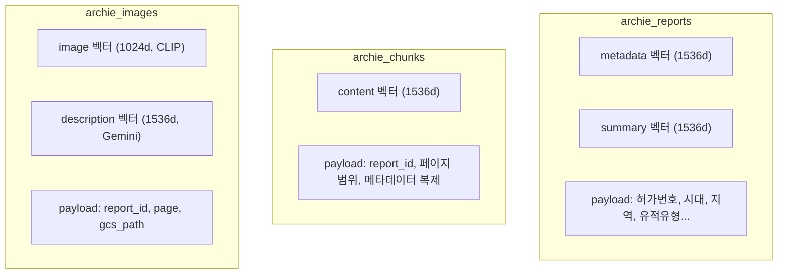

# 보고서, 텍스트 청크, 이미지를 왜 따로 저장하는가

Bonda의 Qdrant에는 3개 컬렉션이 있습니다. `archie_reports`, `archie_chunks`, `archie_images`. 처음에는 "하나의 컬렉션에 다 넣으면 안 되나?"라는 질문에서 시작했는데, 검색 시나리오를 하나씩 정리하다 보니 자연스럽게 3개로 분리되었습니다.

## 3개 컬렉션의 역할



| 컬렉션 | Named Vectors | 차원 | 검색 시나리오 |
|---|---|---|---|
| `archie_reports` | `metadata` + `summary` | 1536 x 2 | "경기도 청동기시대 보고서" -> 보고서 단위 매칭 |
| `archie_chunks` | `content` | 1536 x 1 | "주거지 내부에서 출토된 토기의 특징" -> 본문 구간 반환 |
| `archie_images` | `image` + `description` | 1024 + 1536 | "빗살무늬토기 사진" -> 유사 이미지 검색 |

핵심은 **검색 단위가 다르다**는 것입니다. 보고서를 찾을 때와 보고서 안의 특정 문단을 찾을 때, 요구하는 granularity가 다릅니다.

## 왜 하나의 컬렉션으로 통합하지 않았는가

Qdrant의 Named Vector를 쓰면 하나의 컬렉션에 여러 벡터를 넣을 수 있습니다. 실제로 `archie_reports`는 `metadata`와 `summary` 두 벡터를 하나의 컬렉션에 저장합니다. 그렇다면 왜 reports와 chunks를 합치지 않았을까요?

**포인트 수의 차이** 때문입니다. 보고서 1건 = 포인트 1개이지만, 같은 보고서의 청크는 수십~수백 개입니다. 이 둘을 같은 컬렉션에 넣으면 스크롤/필터 검색에서 "보고서 목록만 가져오기"가 어려워집니다. 타입 필드로 구분할 수는 있지만, 페이로드 스키마가 완전히 다른 데이터를 한 컬렉션에 넣는 것은 관리 복잡도만 높입니다.

이미지는 더 명확합니다. `image` 벡터는 CLIP 모델(1024차원)로 생성되고, 텍스트 벡터는 Gemini Embedding(1536차원)으로 생성됩니다. 임베딩 모델과 차원이 다른 벡터를 같은 컬렉션에 넣으면 검색 로직이 불필요하게 복잡해집니다.

## Named Vector 활용

같은 컬렉션 안에서의 분리는 Named Vector로 해결합니다.

`archie_reports`의 `metadata` 벡터에는 허가번호, 유적명, 지역 등 구조화된 메타데이터를 텍스트로 이어붙여 임베딩한 값이 들어갑니다. `summary` 벡터에는 AI가 생성한 보고서 요약의 임베딩이 들어갑니다. 검색 시 어떤 벡터를 쿼리할지 `using` 파라미터로 선택합니다.

```python
# 메타데이터 시맨틱 매칭: "경기도 청동기시대"
qdrant.query_points(
    collection_name="archie_reports",
    query=query_vector,
    using="metadata",     # 메타데이터 벡터로 검색
)

# 요약 기반 검색: "주거지 화재 흔적에 대한 보고서"
qdrant.query_points(
    collection_name="archie_reports",
    query=query_vector,
    using="summary",      # 요약 벡터로 검색
)
```

RAG 모드에서는 3개 벡터(content, metadata, summary)를 동시에 검색한 뒤, 점수순으로 통합 정렬합니다.

## 3가지 검색 모드

컬렉션 구조가 결정되면 검색 모드는 자연스럽게 도출됩니다.

| 모드 | 동작 | 예시 |
|---|---|---|
| `rag` | 3개 벡터 시맨틱 검색 -> 점수순 통합 | "청동기시대 주거지의 특징은?" |
| `filter` | 메타데이터 필터링만 (벡터 검색 없음) | 경기도 보고서 목록 |
| `hybrid` | 시맨틱 검색 + 메타데이터 필터 동시 적용 | "전남 삼국시대 토기 출토" |

`filter` 모드는 `archie_reports`에서 payload 필터만으로 결과를 반환합니다. 벡터 검색 없이 `scroll` API를 사용하므로 빠릅니다. `hybrid` 모드는 벡터 검색에 `MatchAny`, `MatchValue` 필터를 결합합니다.

```python
# hybrid 검색: 시맨틱 + 필터
search_filter = Filter(must=[
    FieldCondition(key="province", match=MatchValue(value="전라남도")),
    FieldCondition(key="periods", match=MatchAny(any=["삼국시대"])),
])
qdrant.query_points(
    collection_name="archie_chunks",
    query=query_vector,
    using="content",
    query_filter=search_filter,
)
```

`periods`와 `site_types`는 배열 필드이므로 `MatchAny`로 "하나라도 일치하면" 매칭합니다.

## 페이로드 인덱스 전략

필터 검색 성능을 위해 자주 사용되는 필드에 인덱스를 설정합니다.

- **KEYWORD 인덱스**: `source_type`, `permit_number`, `province`, `city`, `periods`, `site_types` 등 정확 매칭 필터용
- **INTEGER 인덱스**: `survey_year`, `report_year` — 연도 범위 검색용
- **MULTILINGUAL 텍스트 인덱스**: `metadata_text` — 한국어 형태소가 포함된 메타데이터의 키워드 검색용 (`min_token_len=2`, `max_token_len=20`)

청크 페이로드에 보고서의 메타데이터(허가번호, 시대, 지역)를 중복 저장하는 것도 의도적입니다. 데이터 정규화 관점에서는 낭비지만, 검색 시 JOIN 없이 청크 레벨에서 바로 필터링할 수 있습니다. 벡터 DB에는 JOIN이 없으므로, 비정규화가 오히려 정답입니다.

## 배운 점

- **검색 단위가 컬렉션을 결정한다**: "무엇을 찾고 싶은가"에 따라 granularity가 달라지고, 이것이 자연스럽게 컬렉션 분리로 이어짐
- **Named Vector는 "같은 대상, 다른 관점"에 적합**: 하나의 보고서를 메타데이터로도, 요약으로도 검색할 수 있는 것은 Named Vector 덕분
- **벡터 DB에서 비정규화는 안티패턴이 아니다**: JOIN이 없는 환경에서 메타데이터 복제는 검색 성능과 구현 단순성을 동시에 확보하는 실용적 선택
