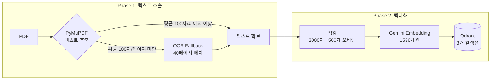
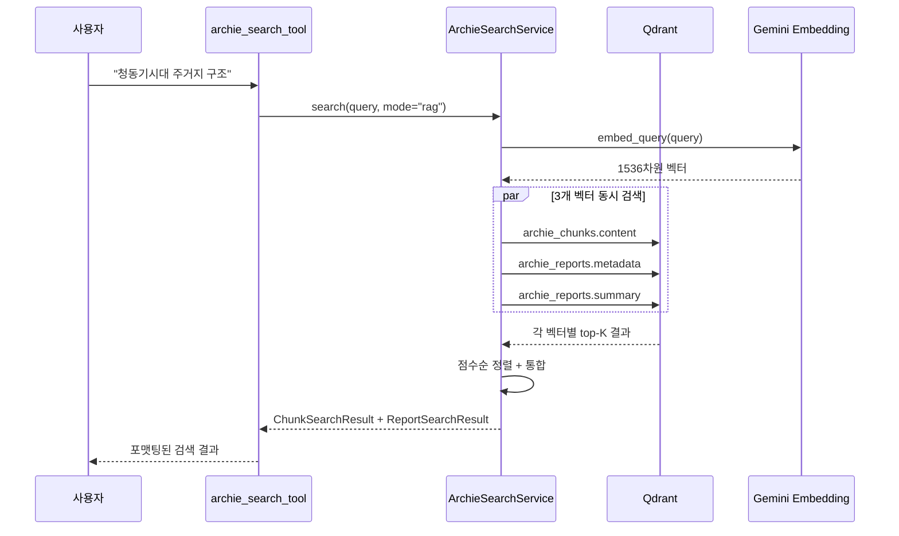

# 발굴보고서 PDF가 검색 가능해지기까지

한국의 발굴조사보고서는 수만 건이 PDF로만 존재합니다. 허가번호, 시대, 지역 같은 메타데이터가 구조화되어 있지 않고, 본문은 스캔 이미지인 경우가 많아 텍스트 검색 자체가 불가능합니다. Bonda의 Archie 파이프라인은 이 PDF를 텍스트 추출 → 청킹 → 임베딩 → Qdrant 저장까지 End-to-End로 처리하여, 자연어 질문으로 보고서를 검색할 수 있게 만듭니다.

## 파이프라인 전체 구조



발굴조사보고서(excavation)는 대부분 스캔 PDF이므로 PyMuPDF를 건너뛰고 바로 OCR로 진입합니다. UNESCO SOC 보고서는 PyMuPDF로 먼저 시도하고, 페이지당 평균 문자 수가 100자 미만이면 OCR로 폴백합니다.

```python
# pdf_parse_service.py — OCR 필요 여부 판단
OCR_THRESHOLD_CHARS_PER_PAGE = 100

def _needs_ocr(self, pages: list[dict], file_key: str = "") -> bool:
    total_chars = sum(len(p.get("content", "")) for p in pages)
    avg_chars = total_chars / len(pages)
    return avg_chars < self.OCR_THRESHOLD_CHARS_PER_PAGE
```

## Qdrant 컬렉션 설계

3개 컬렉션이 각각 다른 검색 시나리오를 담당합니다.

| 컬렉션 | 벡터 | 차원 | 용도 |
|---|---|---|---|
| `archie_reports` | `metadata` + `summary` | 1536 × 2 (named vectors) | 보고서 단위 검색 — 메타데이터 시맨틱 매칭, AI 요약 기반 검색 |
| `archie_chunks` | `content` | 1536 × 1 | 본문 청크 검색 — RAG의 핵심, 질문에 대한 관련 텍스트 반환 |
| `archie_images` | `image` + `description` | 1536 × 2 (named vectors) | 이미지 검색 — 이미지 벡터로 유사 이미지, 설명 벡터로 텍스트 검색 |

### 필터 인덱스

각 컬렉션에는 시맨틱 검색과 필터링을 조합할 수 있도록 페이로드 인덱스가 설정되어 있습니다.

```python
# archie_reports 키워드 인덱스
for field in [
    "source_type", "permit_number", "province", "city",
    "periods", "site_types", "property_id", "state_party",
    "country", "document_type",
]:
    self._create_index_safe(REPORTS_COLLECTION, field, PayloadSchemaType.KEYWORD)

# archie_reports 정수 인덱스
for field in ["survey_year", "report_year"]:
    self._create_index_safe(REPORTS_COLLECTION, field, PayloadSchemaType.INTEGER)

# archie_reports / archie_chunks 텍스트 인덱스 (다국어 토크나이저)
self._create_index_safe(
    REPORTS_COLLECTION, "metadata_text",
    TextIndexParams(type="text", tokenizer=TokenizerType.MULTILINGUAL,
                    min_token_len=2, max_token_len=20),
)
```

`KEYWORD` 인덱스는 시대(`periods`), 지역(`province`, `city`), 유적 유형(`site_types`) 등 정확 매칭 필터에 사용됩니다. `MULTILINGUAL` 텍스트 인덱스는 한국어 형태소가 포함된 메타데이터 텍스트의 키워드 검색을 지원합니다.

## 청킹 전략

2000자 단위로 청킹하되, 500자 오버랩으로 문맥이 끊기지 않도록 합니다. 문장 경계(`\n\n`, `\n`, `.`, `!`, `?`)에서 자르는 것이 핵심입니다.

```python
CHUNK_SIZE = 2000
CHUNK_OVERLAP = 500

def _chunk_text_with_pages(self, text, page_cumulative_lengths):
    while char_start < text_length:
        char_end = min(char_start + CHUNK_SIZE, text_length)

        # 문장 경계에서 자르기
        if char_end < text_length:
            for sep in ["\n\n", "\n", ".", "!", "?"]:
                last_sep = text[char_start:char_end].rfind(sep)
                if last_sep > CHUNK_SIZE // 2:
                    char_end = char_start + last_sep + len(sep)
                    break

        # 이진 탐색으로 페이지 번호 매핑
        page_start = self._find_page_for_char(char_start, page_cumulative_lengths)
        page_end = self._find_page_for_char(char_end, page_cumulative_lengths)

        yield {
            "content": chunk_content,
            "chunk_index": chunk_index,
            "page_start": page_start,
            "page_end": page_end,
        }
```

각 청크에는 원본 PDF의 시작/종료 페이지 번호가 매핑됩니다. 검색 결과에서 "이 내용은 보고서 42~44페이지에 있습니다"라고 안내할 수 있는 근거입니다.

### 메타데이터 보존

청크마다 보고서의 핵심 메타데이터가 페이로드로 함께 저장됩니다.

```python
ExcavationChunkPayload(
    source_type="excavation",
    report_id=report_id,
    permit_number=metadata.get("permit_number"),   # 허가번호
    report_title=metadata.get("report_title"),      # 보고서명
    province=metadata.get("province"),              # 도/광역시
    city=metadata.get("city"),                      # 시/군/구
    periods=metadata.get("periods", []),            # 시대 (복수)
    site_types=metadata.get("site_types", []),      # 유적 유형 (복수)
    content=chunk["content"],
    page_start=chunk.get("page_start"),
    page_end=chunk.get("page_end"),
)
```

이 덕분에 "경기도의 청동기시대 주거지"처럼 시맨틱 검색과 메타데이터 필터를 동시에 적용하는 하이브리드 검색이 가능합니다.

## 검색 흐름



검색 서비스는 3가지 모드를 지원합니다.

| 모드 | 동작 | 사용 예 |
|---|---|---|
| `rag` | 3개 벡터(content, metadata, summary) 시맨틱 검색 | "청동기시대 주거지의 특징" |
| `filter` | 메타데이터 필터링만 (벡터 검색 없음) | 경기도 보고서 목록 조회 |
| `hybrid` | 시맨틱 검색 + 메타데이터 필터 동시 적용 | "전남 삼국시대 토기 출토" |

```python
# archie_search_service.py — 필터 구성
def _build_filter(self, source_type=None, province=None, city=None,
                  periods=None, site_types=None) -> Filter | None:
    conditions = []
    if province:
        conditions.append(
            FieldCondition(key="province", match=MatchValue(value=province))
        )
    if periods:
        conditions.append(
            FieldCondition(key="periods", match=MatchAny(any=periods))
        )
    return Filter(must=conditions) if conditions else None
```

`periods`와 `site_types`는 배열 필드이므로 `MatchAny`로 "하나라도 일치하면" 매칭합니다. "청동기시대, 철기시대"를 동시에 검색하면 두 시대 중 하나라도 포함된 보고서가 반환됩니다.

### 임베딩 모델

인덱싱과 검색 양쪽 모두 `gemini-embedding-2-preview` (1536차원)를 사용합니다. 인덱싱 시에는 `task_type="RETRIEVAL_DOCUMENT"`, 검색 시에는 `task_type="retrieval_query"`로 구분하여 비대칭 검색에 최적화합니다.

```python
# 인덱싱 (vectorize_service.py)
EMBEDDING_MODEL = "gemini-embedding-2-preview"
EMBEDDING_DIMENSION = 1536

result = self._genai_client.models.embed_content(
    model=EMBEDDING_MODEL,
    contents=text,
    config=types.EmbedContentConfig(
        task_type="RETRIEVAL_DOCUMENT",
        output_dimensionality=EMBEDDING_DIMENSION,
    ),
)

# 검색 (qdrant_service.py)
self._embeddings = GoogleGenerativeAIEmbeddings(
    model="models/gemini-embedding-2-preview",
    task_type="retrieval_query",
    output_dimensionality=1536,
)
```

## 배운 점

- **스캔 PDF는 OCR이 기본이다**: 발굴조사보고서의 대부분은 스캔 이미지 PDF. PyMuPDF로 텍스트가 추출되는 경우가 드물어서, excavation 타입은 아예 PyMuPDF를 건너뛰고 OCR로 직행하도록 분기함. 페이지당 평균 100자 임계값은 실제 데이터에서 실험적으로 결정
- **Named Vector로 검색 시나리오를 분리**: Qdrant의 named vector 기능으로 하나의 컬렉션에 여러 벡터를 저장. `archie_reports`는 metadata/summary 2개, `archie_images`는 image/description 2개 벡터를 가짐. 검색 시 어떤 벡터를 쿼리할지 선택할 수 있어 메타데이터 매칭과 본문 검색을 같은 인프라에서 처리
- **청크에 메타데이터를 복제하는 것이 핵심**: 청크 페이로드에 허가번호, 시대, 지역을 중복 저장하면 데이터 정규화 관점에서는 낭비지만, 검색 시 JOIN 없이 필터링할 수 있어 응답 속도와 구현 단순성에서 큰 이득
- **페이지 매핑이 사용자 신뢰를 만든다**: 문자 위치 → 페이지 번호를 이진 탐색으로 매핑하여, 검색 결과에 출처 페이지를 표시. "이 내용이 정말 보고서에 있는가?"라는 의문에 페이지 번호로 답할 수 있음
- **대량 임베딩은 Batch API + Sync 폴백 하이브리드**: 200개 이상의 텍스트는 Gemini Batch API로 비동기 처리하되, 429 에러 시 Sync API로 자동 전환. rate limit을 우회하면서도 안정적으로 대량 처리 가능
