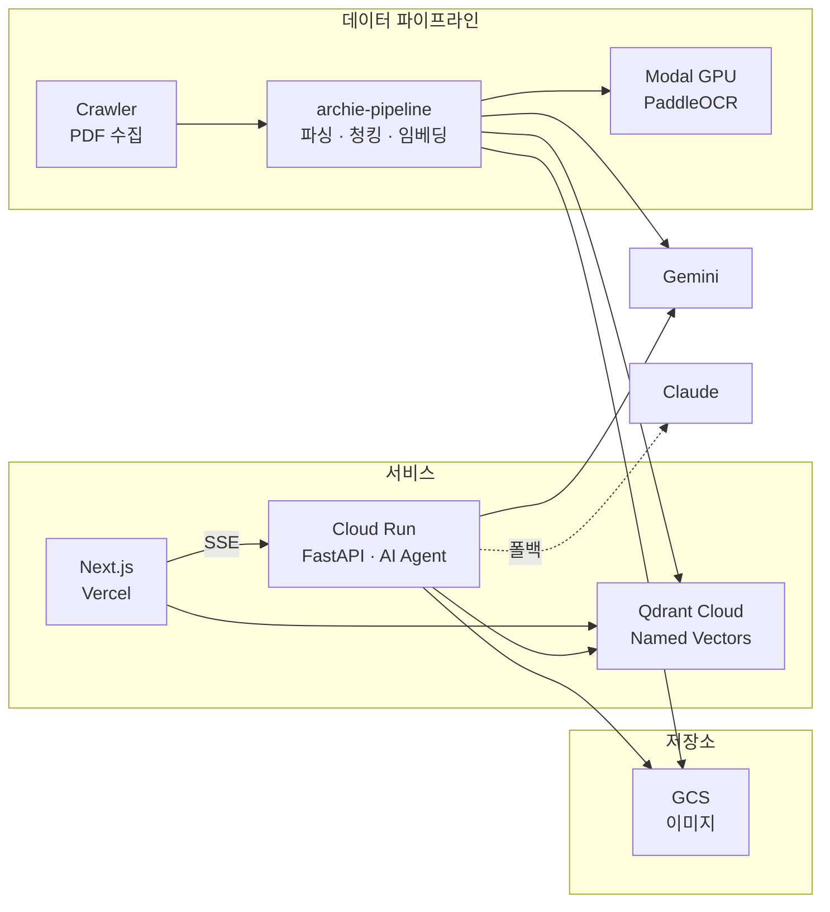

# 왜 이 스택인가 — FastAPI + Next.js + Qdrant

Bonda는 문화재 발굴보고서를 AI로 검색 가능하게 만드는 시스템이다. 스택을 결정할 때 출발점은 의외로 **LLM 모델 선택**이었다. 모델이 인프라를 결정하고, 인프라가 나머지 스택을 결정했다.

## Gemini를 선택하니 GCP가 따라왔다

LLM으로 Gemini를 선택했다. 발굴보고서의 유물 사진, 도면, 현장 전경 같은 **Vision 데이터를 다뤄야 하는 요구**가 컸고, Gemini의 Vision 성능이 이 용도에 적합했다. 임베딩, Vision, 텍스트 생성을 하나의 API 체계에서 처리할 수 있다는 점도 장점이었다. 다만 한때 Gemini API가 불안정한 시기가 있어서, 폴백으로 Claude도 함께 사용하는 멀티모델 구조를 가져갔다.

Gemini를 쓰기로 하니 **GCP 생태계로 통일**하는 게 자연스러웠다. AI 백엔드는 Cloud Run에 서버리스로 올리고, 보고서에서 추출한 이미지는 GCS(Google Cloud Storage)에 저장한다. 같은 GCP 안에서 움직이니 인증, 네트워크, 과금이 단순해졌다.

Cloud Run을 선택한 이유는 **사용량에 비례하는 비용 구조**다. Bonda는 연구자들이 간헐적으로 사용하는 서비스라 트래픽이 일정하지 않다. 요청이 없으면 인스턴스가 0으로 줄어들고, 요청이 오면 자동으로 스케일업된다. 상시 서버를 유지할 이유가 없었다.

GCS는 발굴보고서에서 추출한 수천 장의 유물 사진, 도면, 현장 전경을 저장한다. 이미지 검색 결과에서 Signed URL로 접근하기 때문에 별도 이미지 서버가 필요 없다.

## 벡터 DB — pgvector가 아니라 Qdrant인 이유

벡터 DB 선택에서 가장 많이 고민한 것은 **pgvector vs Qdrant**였다.

pgvector는 PostgreSQL 확장이라 별도 인프라 없이 기존 DB에 붙일 수 있다는 장점이 있다. 관계형 데이터와 벡터를 같은 테이블에서 JOIN할 수도 있다. 소규모 프로젝트라면 pgvector가 합리적이었을 거다.

하지만 Bonda의 데이터 구조는 좀 더 복잡했다. 하나의 보고서를 **메타데이터로도, 요약으로도** 검색할 수 있어야 했다. 하나의 이미지를 **텍스트 설명으로도, 이미지 유사도로도** 찾을 수 있어야 했다. 같은 데이터에 대해 여러 관점의 벡터가 필요한 상황이었다.

Qdrant의 **Named Vector**가 이 문제를 해결했다. 하나의 포인트에 여러 벡터를 이름으로 구분해서 저장하고, 검색 시 어떤 벡터를 쿼리할지 선택할 수 있다. pgvector로 이걸 구현하려면 같은 데이터를 여러 테이블에 나눠 저장하고 JOIN해야 한다. Named Vector 하나로 아키텍처가 훨씬 단순해졌다.

Qdrant는 벡터 검색에 특화된 전용 엔진이라 필터링 성능도 좋다. 시대, 지역, 유적 유형 같은 메타데이터 필터와 시맨틱 검색을 동시에 걸어야 하는 Bonda의 하이브리드 검색 요구사항에 적합했다. 셀프호스팅이 가능해서 Docker Compose로 로컬에 띄워 개발하고, 프로덕션에서는 Qdrant Cloud를 사용한다.

## 서비스 전체 구조

## Python과 Node.js를 나눈 이유

AI 백엔드는 Python(FastAPI), 프론트엔드는 Node.js(Next.js)로 분리했다. Python을 선택한 이유가 여러 겹이었다.

첫째, **팀원 모두가 Python에 익숙**했다. 둘째, 데이터 크롤링부터 PDF 전처리, 임베딩 파이프라인까지 **전처리 스택이 전부 Python**이다. 이 생태계 안에서 백엔드도 Python으로 가는 게 자연스러웠다. LangChain, qdrant-client, Google GenAI 같은 AI 라이브러리의 1st-class 지원도 Python에 집중되어 있다. 셋째, FastAPI는 **경량 프레임워크라 서버리스(Cloud Run)에 적합**하다. 콜드 스타트가 빠르고, 불필요한 오버헤드가 없다.

Python 백엔드는 순수하게 **LLM 응답을 위한 서비스**다. 에이전트 실행, 도구 호출, SSE 스트리밍 — 이 세 가지만 담당한다. 프론트엔드의 관계형 데이터(사용자, 채팅 세션)는 Next.js 쪽에서 직접 관리한다.

SSE(Server-Sent Events)를 선택한 이유도 있다. 에이전트 응답은 서버 → 클라이언트 단방향 스트리밍이면 충분하다. WebSocket처럼 양방향이 필요하지 않고, SSE는 HTTP 위에서 동작해서 Cloud Run과의 호환성이 좋다. 클라이언트에서 서버로 보내는 건 일반 HTTP 요청으로 처리한다.

## 돌이켜보면

스택 선택의 출발점이 모델이었다는 게 흥미롭다. **Gemini → GCP(Cloud Run, GCS) → Qdrant(Named Vector) → Python(팀 역량, 생태계).** 하나의 선택이 다음 선택을 좁혀갔고, 결과적으로 일관된 스택이 만들어졌다.
