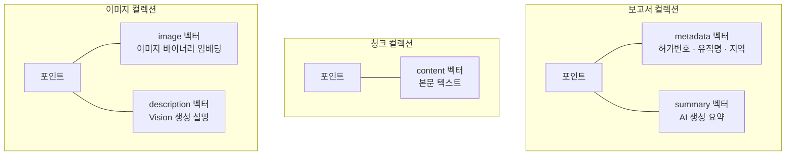

# 하나의 유물을 텍스트로도 이미지로도 찾는다

"토기 사진 보여줘"라고 텍스트로 검색할 수도 있고, 특정 토기 사진을 클릭해서 "이거랑 비슷한 거 찾아줘"라고 이미지로 검색할 수도 있어야 한다. 하나의 데이터를 두 가지 방식으로 찾는 검색 시스템을 만들기 위해, 벡터 DB의 컬렉션을 어떻게 설계했는지 정리한다.

## 검색 단위가 컬렉션을 결정한다

처음에는 "하나의 컬렉션에 다 넣으면 안 되나?"라는 질문에서 시작했다. 정리하다 보니 **찾고 싶은 것의 단위**가 세 가지였다.

| 찾고 싶은 것 | 단위 | 포인트 수 |
|---|---|---|
| 보고서 | 보고서 1건 = 1포인트 | 수백 |
| 본문 구간 | 2,000자 청크 = 1포인트 | 수만 |
| 이미지 | 이미지 1장 = 1포인트 | 수천 |

보고서 1건에 청크는 수십~수백 개다. 이 둘을 같은 컬렉션에 넣으면 "보고서 목록만 가져오기"가 어려워진다. 이미지는 더 명확하다 — 텍스트 벡터와 이미지 벡터의 임베딩 모델과 차원이 다르다. 자연스럽게 **3개 컬렉션**으로 분리됐다.

## 같은 대상을 다른 관점으로 검색한다

Qdrant의 **Named Vector** 기능이 설계의 핵심이다. 하나의 포인트에 여러 벡터를 이름으로 구분해서 저장하고, 검색 시 어떤 벡터를 쿼리할지 선택할 수 있다.

보고서 컬렉션에는 두 벡터가 공존한다. **메타데이터 벡터**는 허가번호, 유적명, 지역 같은 구조화된 정보를 임베딩한 것이고, **요약 벡터**는 AI가 생성한 보고서 요약을 임베딩한 것이다. "경기도 청동기시대 보고서"를 검색하면 메타데이터 벡터에서 매칭하고, "주거지 화재 흔적에 대한 보고서"를 검색하면 요약 벡터에서 매칭한다. 같은 보고서를 **다른 관점**으로 찾을 수 있는 것이다.

## 이미지를 두 가지 방식으로 찾는다

이미지 컬렉션의 듀얼 벡터 설계가 가장 흥미로운 부분이다.

**이미지 벡터**는 이미지 바이너리를 직접 임베딩한 것이다. 사용자가 특정 토기 사진을 보고 "이거랑 비슷한 거 찾아줘"라고 하면, 해당 이미지의 벡터와 가장 가까운 벡터를 찾는다. 형태가 유사한 유물을 시각적으로 찾는 검색이다.

**설명 벡터**는 Gemini Vision이 생성한 텍스트 설명을 임베딩한 것이다. "토기 사진 보여줘"라고 텍스트로 검색하면, 쿼리 텍스트를 임베딩해서 설명 벡터와 매칭한다. 이미지 자체를 보지 않고도 텍스트만으로 이미지를 찾을 수 있다.

두 검색이 같은 컬렉션, 같은 포인트에 공존한다. 검색 시 `using` 파라미터 하나로 어떤 벡터를 대상으로 할지 전환한다. 별도 컬렉션이나 인덱스가 필요 없다.

## 임베딩은 비대칭으로 한다

인덱싱할 때와 검색할 때 같은 모델을 쓰지만, **task type이 다르다.** 인덱싱 시에는 `RETRIEVAL_DOCUMENT`로 문서의 의미를 압축하고, 검색 시에는 `retrieval_query`로 질문의 의도를 압축한다. 같은 모델이라도 task type에 따라 임베딩 벡터의 방향이 달라진다.

이 비대칭 임베딩이 검색 정확도에 영향을 준다. 문서와 질문은 같은 주제를 다루더라도 표현 방식이 다르다. "청동기시대 주거지의 구조적 특징"이라는 질문과 "1호 주거지는 장방형 평면에 노지가 중앙에 위치한다"라는 본문은 같은 내용인데 표현이 다르다. 비대칭 임베딩이 이 간극을 줄여준다.

## 시맨틱 검색과 필터를 동시에 건다

벡터 검색만으로는 부족한 경우가 있다. "전남 삼국시대 토기 출토"처럼 지역·시대 조건과 내용 검색을 동시에 해야 한다.

자주 사용되는 메타데이터 필드에 인덱스를 설정했다. 시대, 지역, 유적 유형은 정확 매칭용 키워드 인덱스, 연도는 범위 검색용 정수 인덱스, 메타데이터 텍스트는 한국어 형태소가 포함된 다국어 텍스트 인덱스를 사용한다.

이걸 바탕으로 3가지 검색 모드가 나왔다.

| 모드 | 동작 | 예시 |
|---|---|---|
| `rag` | 3개 벡터 시맨틱 검색 → 점수순 통합 | "청동기시대 주거지의 특징은?" |
| `filter` | 메타데이터 필터링만 | "경기도 보고서 목록" |
| `hybrid` | 시맨틱 검색 + 메타데이터 필터 동시 적용 | "전남 삼국시대 토기 출토" |

`rag` 모드에서 3개 벡터를 동시에 검색하는 이유가 있다. 본문 청크(content)만 검색하면 "이 보고서가 청동기시대 경기도 보고서인지"를 알 수 없다. 메타데이터(metadata)만 검색하면 본문의 구체적 내용을 놓친다. 요약(summary)은 그 중간이다. **세 관점을 동시에 검색하고 점수순으로 통합 정렬**하니 검색 결과의 다양성과 정확성이 모두 올라갔다.

에이전트가 질문의 성격에 따라 어떤 모드를 쓸지 직접 판단한다.

## 비정규화가 오히려 정답이다

청크 페이로드에 보고서의 메타데이터(허가번호, 시대, 지역)를 중복 저장한다. 관계형 DB라면 JOIN으로 가져오겠지만, **벡터 DB에는 JOIN이 없다.** 청크 레벨에서 바로 "경기도이면서 청동기시대인 청크"를 필터링하려면 메타데이터가 청크에 복제되어 있어야 한다.

페이지 매핑도 마찬가지다. 각 청크에 원본 PDF의 시작/종료 페이지 번호가 붙어 있어서, 검색 결과에 "이 내용은 보고서 42~44페이지에 있습니다"라고 안내할 수 있다. 연구자에게 **"이 정보가 어디에 있는지"를 제시하는 것**이 신뢰의 기반이다.

## 돌이켜보면

벡터 검색 시스템의 설계는 결국 "무엇을, 어떻게 찾고 싶은가"에서 시작한다. 검색 단위가 컬렉션을 결정하고, 검색 관점이 Named Vector를 결정하고, 검색 조건이 필터 인덱스를 결정한다. 기술을 먼저 정하고 데이터를 끼워 맞추는 게 아니라, 검색 시나리오를 먼저 정리하니 구조가 자연스럽게 나왔다.
