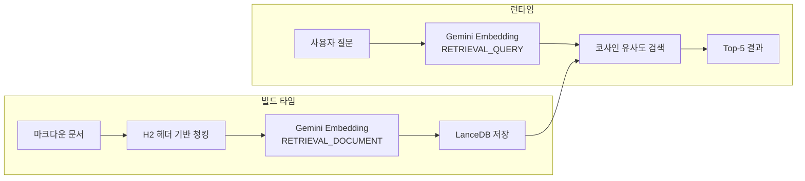

# 질문과 문서는 다르게 임베딩해야 한다

RAG 파이프라인에서 "검색이 잘 안 된다"는 문제의 원인은 대부분 임베딩에 있다. Gemini Embedding의 비대칭 임베딩 전략으로 검색 정확도를 높인 과정을 정리한다.

## 같은 내용인데 표현이 다르다

"핀구에서 멀티 에이전트를 어떻게 설계했나요?"라는 질문과, 문서에 있는 "Supervisor 패턴으로 전문 에이전트를 오케스트레이션하는 구조를 설계했다"라는 텍스트는 같은 내용을 다루지만 표현이 완전히 다르다.

질문은 짧고 의도를 담고 있고, 문서는 길고 사실을 서술한다. 이 둘을 **같은 방식으로 임베딩하면 벡터 공간에서 거리가 멀어진다.** 이것이 대칭 임베딩의 한계다.

## 비대칭 임베딩 — 역할에 따라 다르게 압축한다

Gemini Embedding API는 `taskType` 파라미터로 임베딩 목적을 구분한다.

| taskType | 용도 | 최적화 방향 |
|---|---|---|
| `RETRIEVAL_DOCUMENT` | 문서를 벡터로 변환 | 핵심 의미를 포착 |
| `RETRIEVAL_QUERY` | 질문을 벡터로 변환 | 의도를 파악 |

같은 모델이지만 taskType에 따라 내부 가중치가 달라진다. 문서 임베딩은 핵심 키워드와 개념에 집중하고, 쿼리 임베딩은 의도와 맥락에 집중한다. 이 비대칭 매핑 덕분에 질문의 "어떻게 설계했나요?"가 문서의 "Supervisor 패턴으로 오케스트레이션"과 벡터 공간에서 가까워진다.

구현은 파라미터 하나 차이다. 인덱싱할 때는 `RETRIEVAL_DOCUMENT`로, 검색할 때는 `RETRIEVAL_QUERY`로. 코드 복잡도 증가 없이 검색 품질이 올라간다.

## H2 헤더 기반 청킹과의 시너지

비대칭 임베딩은 **의미 단위 청킹**과 함께 동작할 때 효과가 극대화된다.

마크다운 문서를 H2(`##`) 헤더 기준으로 분할한다. 고정 길이(500자)로 자르면 하나의 개념이 중간에 끊길 수 있다. H2 기반으로 분할하면 각 섹션이 하나의 완결된 개념을 담고 있으므로, `RETRIEVAL_DOCUMENT` 임베딩이 섹션의 핵심 의미를 온전히 포착한다.

질문 의도와 문서 개념이 벡터 공간에서 정확히 매칭되는 구조다.

## 돌이켜보면

비대칭 임베딩의 핵심은 **"질문과 문서는 같은 공간에 있되, 다른 방식으로 압축해야 한다"**는 것이다. 구현은 taskType 파라미터 하나지만, 검색 정확도에 미치는 영향은 크다. 의미 단위 청킹과 결합하면 효과가 더 올라간다.
