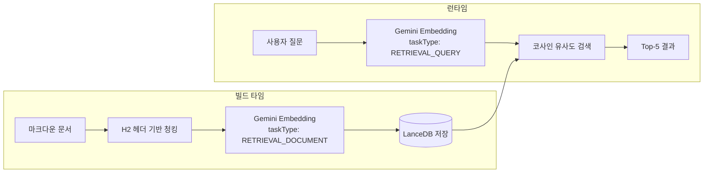

# 질문과 문서는 다르게 임베딩해야 한다

RAG 파이프라인에서 "검색이 잘 안 된다"는 문제의 원인은 대부분 임베딩에 있습니다. 이 프로젝트에서 Gemini Embedding의 비대칭 임베딩 전략으로 검색 정확도를 높인 과정을 정리합니다.

## 문제 정의

"핀구에서 멀티 에이전트를 어떻게 설계했나요?"라는 질문과, 실제 문서에 있는 "Supervisor 패턴으로 5개의 전문 에이전트를 오케스트레이션하는 구조를 설계했다"라는 텍스트는 의미적으로 같은 내용을 다루지만, 표현이 완전히 다릅니다.

질문은 짧고 의도를 담고 있고, 문서는 길고 사실을 서술합니다. 이 둘을 같은 방식으로 임베딩하면 벡터 공간에서 거리가 멀어집니다. 이것이 **대칭 임베딩의 한계**입니다.

## 비대칭 임베딩이란

Gemini Embedding API는 `taskType` 파라미터로 임베딩 목적을 구분합니다.

| taskType | 용도 | 최적화 방향 |
|---|---|---|
| `RETRIEVAL_DOCUMENT` | 문서를 벡터로 변환 | 문서의 핵심 의미를 포착 |
| `RETRIEVAL_QUERY` | 질문을 벡터로 변환 | 질문의 의도를 파악 |

같은 `gemini-embedding-001` 모델이지만, taskType에 따라 내부 가중치가 달라집니다. 문서 임베딩은 핵심 키워드와 개념에 집중하고, 쿼리 임베딩은 의도와 맥락에 집중합니다. 이 비대칭 매핑 덕분에 "어떻게 설계했나요?"라는 질문이 "Supervisor 패턴으로 오케스트레이션"이라는 문서와 벡터 공간에서 가까워집니다.

## 구현: 인덱싱 시점 vs 검색 시점

### 인덱싱 (빌드 타임)

임베딩 스크립트에서 모든 문서를 `RETRIEVAL_DOCUMENT`로 벡터화합니다.

```typescript
// scripts/embed.ts
const response = await ai.models.embedContent({
  model: "gemini-embedding-001",
  contents: batch,               // 문서 청크 배열
  config: { taskType: "RETRIEVAL_DOCUMENT" },
});
```

100개 단위 배치로 처리하며, 배치 사이에 500ms 딜레이를 두어 API rate limit을 방지합니다.

### 검색 (런타임)

사용자 질문은 `RETRIEVAL_QUERY`로 임베딩합니다.

```typescript
// knowledge/retriever.ts
const response = await ai.models.embedContent({
  model: "gemini-embedding-001",
  contents: query,               // 사용자 질문
  config: { taskType: "RETRIEVAL_QUERY" },
});
const vector = response.embeddings![0].values!;
const results = await table.search(vector).limit(topK).toArray();
```

LanceDB의 `search()` 메서드가 코사인 유사도 계산과 Top-K 정렬을 내부에서 처리합니다.

## 전체 흐름



## H2 헤더 기반 청킹과의 시너지

비대칭 임베딩은 H2 기반 청킹과 함께 동작할 때 효과가 극대화됩니다.

```typescript
function splitByH2(content: string, source: string): Chunk[] {
  const sections = content.split(/^## /m);
  // 각 섹션이 하나의 완결된 개념 단위
}
```

고정 길이(예: 500자)로 자르면 "미들웨어 스택" 섹션이 중간에 끊길 수 있습니다. H2 기반으로 분할하면 하나의 섹션이 하나의 완결된 개념을 담고 있으므로, `RETRIEVAL_DOCUMENT` 임베딩이 섹션의 핵심 의미를 온전히 포착합니다.

## 핵심 인사이트

- **대칭 vs 비대칭**: 질문과 문서를 같은 방식으로 임베딩하면 표현 차이 때문에 유사도가 낮아짐. taskType 분리가 이 갭을 메움
- **API 한 줄 차이**: 구현은 `taskType` 파라미터 하나만 다름. 코드 복잡도 증가 없이 검색 품질 향상
- **청킹 전략과의 결합**: H2 기반 의미 단위 청킹 + 비대칭 임베딩이 만나면, 질문 의도와 문서 개념이 벡터 공간에서 정확히 매칭됨
- **배치 처리의 실용성**: 100개 단위 배치 + 500ms 딜레이로 rate limit 방지. 포트폴리오 규모(수십 개 문서)에서는 전체 인덱싱이 수 초면 완료
