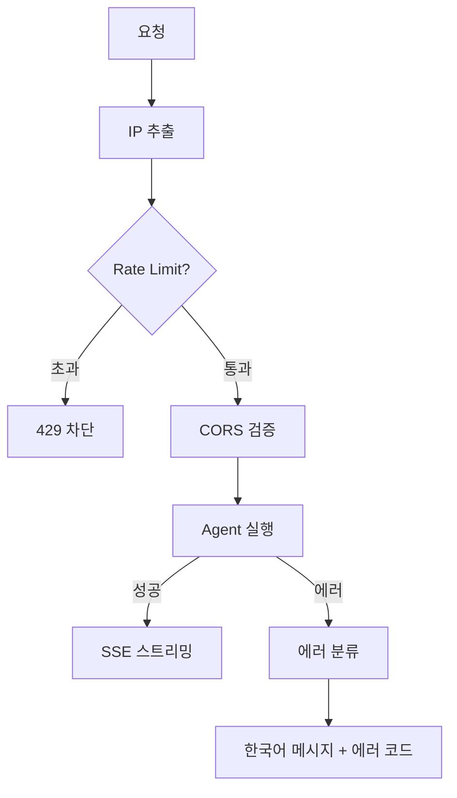

# 퍼블릭 AI 사이트를 안전하게 운영하는 법

포트폴리오 AI 챗봇은 인증 없이 누구나 접근할 수 있는 퍼블릭 서비스다. 로그인 벽이 없으니 편리하지만, LLM API 비용이 무방비로 노출된다. 인증 시스템을 도입하면 해결되지만, 채용 담당자가 로그인해야 챗봇을 쓸 수 있다면 아무도 안 쓴다. **인증 없이도 안전한 설계**가 필요했다.

## IP 기반 Rate Limiting

가장 단순하면서 효과적인 방법인 고정 윈도우 알고리즘을 적용했다. IP별로 1분에 20회까지 요청을 허용하고, 초과하면 차단한다.

20회라는 임계값은 실제 사용 패턴에서 정했다. 채용 담당자가 챗봇을 쓸 때 분당 20개 이상 질문을 보내는 경우는 없다. 이 수치를 넘으면 스크립트에 의한 자동화 요청으로 판단한다.

In-Memory Map으로 구현했다. Redis 없이 Map으로 충분한 이유는 단일 인스턴스 서버이기 때문이다. 만료된 엔트리가 쌓이면 메모리 누수가 생기니, 주기적으로 정리하는 클린업 인터벌을 두었다.

PaaS 환경에서는 클라이언트 IP가 프록시를 거치면서 바뀐다. `x-forwarded-for` 헤더에서 실제 IP를 추출하는 처리가 필요하다.

## LLM 에러를 사용자 언어로 번역한다

LLM API 에러는 예측 가능한 패턴이 있다. 크레딧 소진, rate limit, 서버 에러 — 이 세 가지다. 에러 메시지를 정규식으로 분류해서 한국어 메시지로 변환한다.

영어 스택 트레이스가 그대로 사용자에게 노출되면 UX가 나빠진다. "AI 밥값이 떨어졌어요 곧 충전하고 돌아올게요!" 같은 친근한 메시지를 보여주면, 에러 상황에서도 서비스의 톤앤매너가 유지된다. **에러도 UX다.**

클라이언트는 에러 코드를 받아서 적절한 UI를 보여준다. 코드와 메시지를 분리해서, 프론트엔드가 에러 코드에 따라 재시도 버튼을 보여주거나, 대기 안내를 표시할 수 있다.

## 방어 계층 구조

Rate Limiting이 첫 번째 관문, CORS가 두 번째, 에러 분류가 마지막 안전망이다. 세 레이어가 각각 다른 방식으로 방어한다.

## 돌이켜보면

퍼블릭 AI 서비스의 방어는 **"인증 없이 얼마나 안전할 수 있는가"**의 문제다. Rate Limiting으로 비용 폭발을 막고, CORS로 허용 도메인만 통과시키고, 에러 분류로 장애 상황의 UX를 지킨다. 개인 프로젝트 규모에서는 이 세 레이어면 충분하다.
