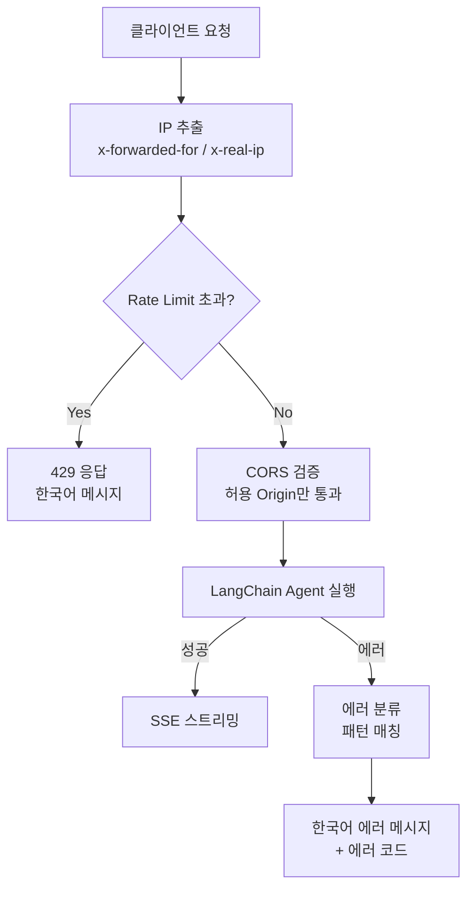

# 퍼블릭 AI 사이트를 안전하게 운영하는 법

포트폴리오 AI 챗봇은 인증 없이 누구나 접근할 수 있는 퍼블릭 서비스입니다. 로그인 벽이 없으니 편리하지만, LLM API 비용이 무방비로 노출됩니다. IP 기반 Rate Limiting과 에러 분류 시스템으로 방어적 운영 설계를 구현한 과정을 정리합니다.

## 문제 정의

퍼블릭 AI 서비스의 위험은 두 가지입니다.

1. **비용 폭발**: 악의적 사용자가 반복 요청으로 LLM API 크레딧을 소진시킬 수 있음
2. **에러 노출**: LLM API의 영어 에러 메시지가 그대로 사용자에게 전달되면 UX가 나빠짐

인증 시스템을 도입하면 해결되지만, 채용 담당자가 로그인해야 챗봇을 쓸 수 있다면 아무도 안 씁니다. 인증 없이도 안전한 설계가 필요합니다.

## IP 기반 고정 윈도우 Rate Limiting

### 설계

가장 단순하면서 효과적인 방식인 고정 윈도우(Fixed Window) 알고리즘을 선택했습니다.

```typescript
const WINDOW_MS = 60_000; // 1분
const MAX_REQUESTS = 20;

const store = new Map<string, Entry>();

export function checkRateLimit(ip: string): {
  allowed: boolean;
  remaining: number;
} {
  const now = Date.now();
  const entry = store.get(ip);

  if (!entry || now > entry.resetAt) {
    store.set(ip, { count: 1, resetAt: now + WINDOW_MS });
    return { allowed: true, remaining: MAX_REQUESTS - 1 };
  }

  entry.count++;
  if (entry.count > MAX_REQUESTS) {
    return { allowed: false, remaining: 0 };
  }
  return { allowed: true, remaining: MAX_REQUESTS - entry.count };
}
```

**1분에 20회**가 임계값입니다. 일반적인 면접관이 챗봇을 쓸 때 분당 20개 이상 질문을 보내는 경우는 없습니다. 이 수치를 넘으면 스크립트에 의한 자동화 요청으로 판단합니다.

### 메모리 관리

In-Memory Map을 사용하므로 만료된 엔트리가 계속 쌓이면 메모리 누수가 발생합니다. 5분마다 만료 엔트리를 정리하는 클린업 인터벌을 설정했습니다.

```typescript
setInterval(() => {
  const now = Date.now();
  for (const [ip, entry] of store) {
    if (now > entry.resetAt) store.delete(ip);
  }
}, 300_000); // 5분마다
```

Redis 없이 Map으로 충분한 이유는 단일 인스턴스 서버이기 때문입니다. 수평 확장이 필요한 서비스라면 Redis가 필요하겠지만, 포트폴리오 사이트에서는 In-Memory가 최적입니다.

### 리버스 프록시 환경 대응

Railway 같은 PaaS에서는 클라이언트 IP가 프록시를 거치면서 바뀝니다. `x-forwarded-for` 헤더에서 실제 IP를 추출합니다.

```typescript
const ip =
  request.headers.get("x-forwarded-for")?.split(",")[0]?.trim() ||
  request.headers.get("x-real-ip") ||
  "unknown";
```

## LLM 에러 패턴 분류

LLM API 에러는 예측 가능한 패턴이 있습니다. 정규식으로 분류해서 한국어 메시지로 변환합니다.

```typescript
function classifyError(err: unknown): { code: string; message: string } {
  const msg = err instanceof Error ? err.message : String(err);

  if (/credits|spending.?limit/i.test(msg)) {
    return {
      code: "CREDITS_EXHAUSTED",
      message: "AI 밥값이 떨어졌어요 곧 충전하고 돌아올게요!",
    };
  }

  if (/too many|rate.?limit|429/i.test(msg)) {
    return {
      code: "API_RATE_LIMITED",
      message: "잠깐, 숨 좀 고를게요... 1분 후 다시 시도해주세요!",
    };
  }

  return {
    code: "UNKNOWN",
    message: "알 수 없는 오류가 발생했어요. 잠시 후 다시 시도해주세요.",
  };
}
```

에러 코드를 `CREDITS_EXHAUSTED`, `API_RATE_LIMITED`, `UNKNOWN` 세 가지로 분류합니다. 클라이언트는 이 코드를 받아서 적절한 UI를 보여줍니다. 영어 스택 트레이스 대신 "AI 밥값이 떨어졌어요" 같은 친근한 메시지를 보여주면, 에러 상황에서도 사이트의 톤앤매너가 유지됩니다.

## 방어 계층 구조



## 핵심 인사이트

- **고정 윈도우의 실용성**: 슬라이딩 윈도우나 토큰 버킷보다 구현이 단순하고, 포트폴리오 규모에서는 충분한 정확도. Map 하나로 완결
- **클린업 인터벌**: In-Memory 방식의 유일한 약점인 메모리 누수를 5분 주기 정리로 해결
- **에러도 UX다**: LLM 에러를 3가지 패턴으로 분류해서 한국어 메시지로 변환하면, 장애 상황에서도 서비스 톤앤매너가 유지됨
- **인증 없는 방어**: Rate Limiting + CORS + 에러 분류, 이 세 가지 레이어로 로그인 벽 없이도 API 비용을 방어할 수 있음
