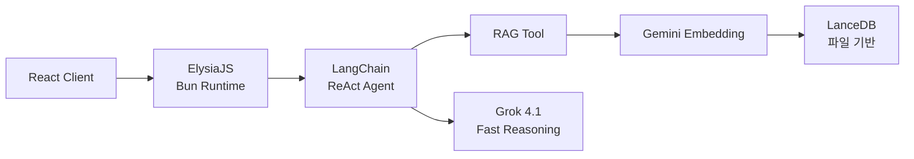

# 왜 이 스택인가 — Bun + ElysiaJS + LanceDB

포트폴리오 AI 챗봇을 만들면서 콘셉트를 하나 정했다. **"가장 가볍게."** Railway 서버 한쪽에 끼워 넣을 수 있는 수준으로 만든다. 별도 DB 서버 없이, 무거운 프레임워크 없이, 의존성 최소한으로. 이 기준에서 스택을 선택했다.

## Bun — 올인원 런타임

Bun 생태계에 관심이 있었고, 개인 프로젝트라 시도해볼 수 있었다.

번들러, 테스트 러너, 패키지 매니저가 내장되어 있어서 webpack, jest, npm 같은 별도 도구가 필요 없다. TypeScript를 트랜스파일러 없이 직접 실행하고, 워크스페이스로 모노레포의 클라이언트·서버·공유 패키지를 관리한다.

전체 서버 의존성이 12개. "가장 가볍게"라는 콘셉트에 올인원 런타임이 적합했다.

## ElysiaJS — Bun 전용 프레임워크

Express나 Fastify 대신 ElysiaJS를 선택했다. Bun을 쓰기로 했으니, Bun 위에서 가장 잘 돌아가는 프레임워크를 고른 거다. Bun의 네이티브 HTTP 서버 위에서 직접 동작하도록 설계된 프레임워크라 호환 레이어의 오버헤드가 없다.

플러그인 체이닝으로 서버 설정이 극도로 간결하다. CORS 설정, 라우트 등록이 각각 한 줄이고, TypeBox 기반 타입 시스템이 내장되어 런타임 검증과 TypeScript 타입 추론이 동시에 동작한다. 전체 서버 설정이 10줄 안쪽이다.

## LanceDB — 서버가 필요 없는 벡터 DB

벡터 DB도 같은 기준으로 골랐다. Pinecone은 클라우드 서비스라 개인 프로젝트에 비용이 과하고, pgvector는 PostgreSQL 서버가 별도로 필요하다. **"서버 하나 더 띄우기 싫다"**가 핵심이었다.

LanceDB는 SQLite처럼 파일 기반으로 동작한다. 배포 시 폴더만 함께 올리면 끝이다. Railway에서 추가 데이터베이스 서비스 없이 바로 동작한다. 문서 수가 수백 개 수준인 포트폴리오 프로젝트에서 클라우드 벡터 DB를 쓰는 건 오버엔지니어링이다.

## Grok — 비용이 가장 낮았다

LLM으로 Grok 4.1 Fast Reasoning을 선택했다. 포트폴리오 챗봇은 복잡한 추론보다 빠른 응답이 중요하고, 사용량이 예측 불가능하다. **비용이 가장 낮은 모델**을 골라야 퍼블릭으로 열어둘 수 있었다.

임베딩은 Gemini Embedding을 사용한다. 인덱싱과 검색 양쪽에서 비대칭 임베딩을 적용하는데, 이건 별도 문서에서 다룬다.

## 돌이켜보면

"가장 가볍게"라는 콘셉트가 모든 선택을 결정했다. Bun이 빌드 도구를 대체하고, LanceDB가 DB 서버를 대체하고, ElysiaJS가 최소한의 코드로 서버를 올린다. 서버 전체가 파일 몇 개로 구성되는 단순함이 개인 프로젝트 유지보수의 핵심이다.
