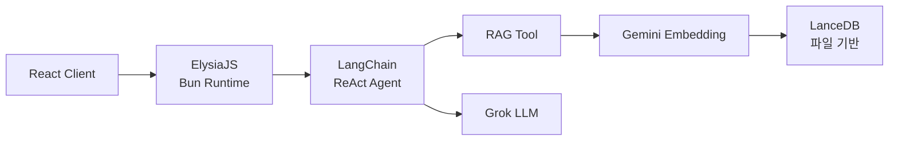

# 왜 이 스택인가 — Bun + ElysiaJS + LanceDB

포트폴리오 AI 챗봇의 스택을 선택하면서 기준을 하나 세웠다. **"개인 프로젝트에 최적화된 경량 AI 서비스."** Node.js, Express, Pinecone 같은 익숙한 조합 대신 Bun + ElysiaJS + LanceDB를 선택한 이유를 정리한다.

## Bun — 올인원 런타임

Node.js 대신 Bun을 런타임으로 선택했다. 번들러, 테스트 러너, 패키지 매니저가 내장되어 있어서 webpack, jest, npm 같은 별도 도구가 필요 없다. TypeScript를 트랜스파일러 없이 직접 실행하고, 워크스페이스로 모노레포의 클라이언트·서버·공유 패키지를 관리한다. 전체 서버 의존성이 12개. devDependencies가 최소화된다.

## ElysiaJS — Bun 전용 프레임워크

Express나 Fastify 대신 ElysiaJS를 선택했다. Bun의 네이티브 HTTP 서버 위에서 동작하도록 설계된 프레임워크라 호환 레이어의 오버헤드가 없다. 플러그인 체이닝으로 서버 설정이 극도로 간결하고, TypeBox 기반 타입 시스템이 내장되어 런타임 검증과 TypeScript 타입 추론이 동시에 동작한다.

## LanceDB — 서버가 필요 없는 벡터 DB

Pinecone이나 pgvector 대신 LanceDB를 선택한 이유는 **인프라가 필요 없다**는 점이다. SQLite처럼 파일 기반으로 동작한다. 배포 시 폴더만 함께 올리면 끝이다.

Pinecone은 클라우드 서비스라 개인 프로젝트에 비용이 과하고, pgvector는 PostgreSQL 서버가 별도로 필요하다. 문서 수가 수백 개 수준인 포트폴리오 프로젝트에서는 파일 기반 벡터 DB가 최적이다. 클라우드 벡터 DB를 쓰는 건 오버엔지니어링이다.

## 돌이켜보면

경량 스택의 핵심은 **"필요한 것만 쓴다"**다. 개인 프로젝트에 Kubernetes, Pinecone, Redis를 쓸 이유가 없다. Bun이 빌드 도구를 대체하고, LanceDB가 DB 서버를 대체하고, ElysiaJS가 최소한의 코드로 서버를 올린다. 전체 서버가 파일 몇 개로 구성되는 단순함이 유지보수의 핵심이다.
