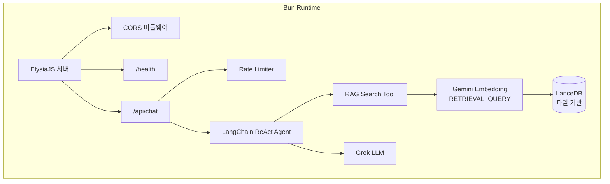

# 왜 이 스택인가 — Bun + ElysiaJS + LanceDB

포트폴리오 AI 챗봇의 기술 스택을 선택하면서 "개인 프로젝트에 최적화된 경량 AI 서비스"라는 기준을 세웠습니다. Node.js, Express, Pinecone 같은 익숙한 조합 대신 Bun + ElysiaJS + LanceDB를 선택한 이유를 정리합니다.

## 왜 Bun인가

Node.js 대신 Bun을 런타임으로 선택한 이유는 세 가지입니다.

첫째, **빌드 도구 통합**입니다. Bun은 번들러, 테스트 러너, 패키지 매니저를 내장하고 있어서 webpack, jest, npm 같은 별도 도구가 필요 없습니다. `bun build src/index.ts --outdir dist --target bun` 한 줄로 서버 빌드가 끝납니다.

둘째, **워크스페이스 지원**입니다. 모노레포에서 `workspaces: ["apps/*", "packages/*"]`로 클라이언트·서버·공유 패키지를 관리합니다. `workspace:*` 프로토콜로 패키지 간 의존성을 선언하면 별도 설정 없이 로컬 패키지를 참조합니다.

셋째, **TypeScript 네이티브 실행**입니다. `bun --watch src/index.ts`로 ts 파일을 직접 실행합니다. ts-node나 tsx 같은 트랜스파일러 없이 개발 서버가 바로 뜹니다.

## 왜 ElysiaJS인가

Express, Fastify 대신 ElysiaJS를 선택한 이유는 **Bun 네이티브 최적화**입니다.

```typescript
// index.ts — 전체 서버 설정이 10줄
const app = new Elysia()
  .use(cors({ origin: env.CORS_ORIGIN }))
  .use(chatRoute)
  .get("/health", () => ({ status: "ok" }))
  .listen(env.PORT);
```

ElysiaJS는 Bun의 네이티브 HTTP 서버 위에서 동작하도록 설계되었습니다. Express가 Node.js의 `http` 모듈에 의존하는 것처럼, ElysiaJS는 Bun의 `Bun.serve()`를 직접 활용합니다. 플러그인 시스템도 `.use()` 체이닝으로 간결합니다. CORS 설정, 라우트 등록이 각각 한 줄입니다.

TypeBox 기반 타입 시스템을 내장하고 있어서 런타임 검증과 TypeScript 타입 추론이 동시에 동작합니다. 별도의 validation 라이브러리 없이 요청/응답 스키마를 정의할 수 있습니다.

## 왜 LanceDB인가

Pinecone, pgvector 대신 LanceDB를 선택한 이유는 **서버가 필요 없다**는 점입니다.

| 대안 | 부적합한 이유 |
|---|---|
| Pinecone | 클라우드 서비스, 무료 티어 제한, 개인 프로젝트에 과도한 비용 |
| pgvector | PostgreSQL 서버 필요, Railway에서 별도 DB 인스턴스 비용 |
| Chroma | Python 생태계 중심, Bun 환경과 불일치 |

LanceDB는 SQLite처럼 파일 기반으로 동작합니다. 연결이 곧 파일 경로 지정입니다.

```typescript
const db = await connect(join(import.meta.dir, "../../db"));
const table = await db.openTable("documents");
```

배포 시 `db/` 폴더만 함께 올리면 됩니다. Railway 같은 PaaS에서 추가 데이터베이스 서비스 없이 바로 동작합니다. 문서 수가 수백 개 수준인 포트폴리오 프로젝트에서는 이것이 최적의 선택입니다.

## 서버 아키텍처



## 핵심 인사이트

- **Bun = 올인원 런타임**: 번들러·테스트·패키지 매니저 내장으로 devDependencies가 최소화됨. 워크스페이스와 TypeScript 네이티브 실행까지 지원
- **ElysiaJS = Bun 전용 프레임워크**: Bun.serve() 위에서 동작하므로 Express 호환 레이어의 오버헤드 없음. 플러그인 체이닝으로 서버 설정이 10줄
- **LanceDB = 인프라 제로**: 파일 기반이라 별도 서버 불필요. 포트폴리오 규모에서는 클라우드 벡터 DB가 오버엔지니어링
- **경량 스택의 실용성**: 전체 서버 의존성이 12개. 빌드·배포·운영 모두 단순하게 유지하는 것이 개인 프로젝트의 핵심 전략
