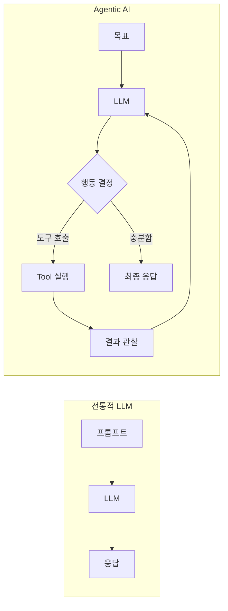
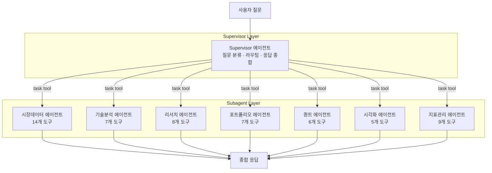
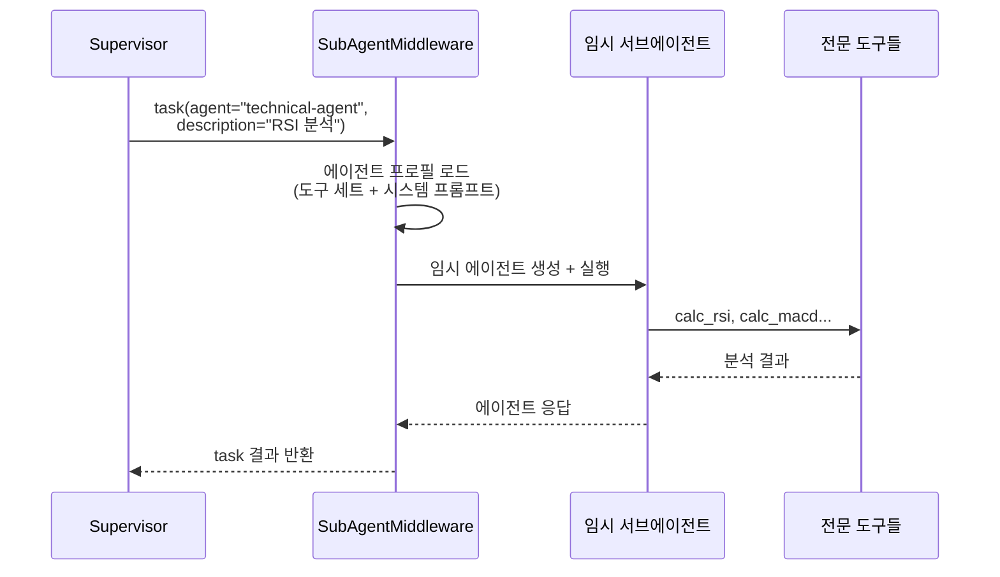
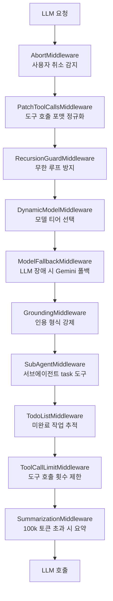
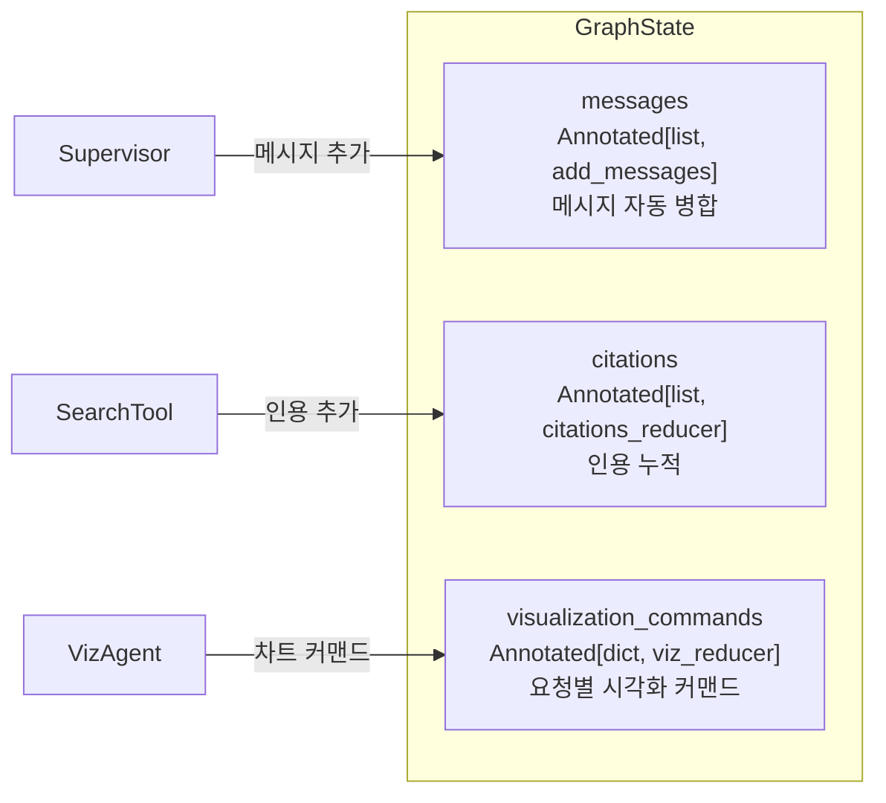

# Agentic AI 설계 — Supervisor·Subagent 패턴

"AI에게 도구를 주고 알아서 하게 하자"는 Agentic AI의 핵심 아이디어를 핀구에서 어떻게 구현했는지, 그리고 왜 Supervisor 패턴을 선택했는지 정리합니다.

## Agentic AI란 무엇인가

전통적 LLM 애플리케이션은 단일 프롬프트 → 단일 응답의 선형 구조입니다. Agentic AI는 LLM이 스스로 판단해 도구를 호출하고, 결과를 보고 다음 행동을 결정하는 **자율적 루프**를 가집니다.

핀구에서 이 패턴이 필요한 이유는 명확합니다. "삼성전자 vs SK하이닉스 비교 분석해줘"라는 질문 하나에 재무제표 조회, 기술적 분석, 시장 데이터 수집, 차트 생성이 모두 필요합니다. 하나의 LLM이 모든 도구를 직접 다루면 컨텍스트가 폭발하고, 도구 선택 정확도가 떨어집니다.

## 왜 Supervisor 패턴인가

LangGraph는 멀티 에이전트 패턴으로 크게 세 가지를 제안합니다.

| 패턴 | 구조 | 장단점 |
|---|---|---|
| Sequential | A → B → C 순차 실행 | 단순하지만 유연성 부족 |
| Supervisor | 관리자가 하위 에이전트에 위임 | 중앙 제어, 병렬 실행 가능 |
| Swarm | 에이전트 간 자유로운 핸드오프 | 유연하지만 제어 어려움 |

핀구는 **Supervisor 패턴**을 선택했습니다. 금융 분석은 정확성이 핵심이라 에이전트 간 자유 핸드오프(Swarm)는 위험하고, 순차 실행(Sequential)은 병렬 분석이 불가능합니다. Supervisor가 질문을 분류하고, 적절한 전문 에이전트에게 위임하는 구조가 가장 적합했습니다.

## 아키텍처

### SubAgentMiddleware — task tool 패턴

Supervisor가 서브에이전트를 호출하는 방식이 독특합니다. 각 서브에이전트를 별도 그래프로 만들지 않고, `SubAgentMiddleware`가 `task`라는 단일 도구를 제공합니다. Supervisor가 `task(agent="market-data-agent", description="삼성전자 시세 조회")`를 호출하면, 미들웨어가 해당 에이전트의 도구 세트와 시스템 프롬프트를 가진 임시 에이전트를 생성해 실행합니다.

이 패턴의 장점은 서브에이전트가 **상태를 공유하지 않는다**는 점입니다. 각 서브에이전트는 독립된 컨텍스트에서 실행되므로, Supervisor의 컨텍스트 윈도우가 서브에이전트의 중간 과정으로 오염되지 않습니다.

## 미들웨어 스택

Supervisor 에이전트에는 10개의 미들웨어가 적용됩니다. 각 미들웨어는 에이전트의 행동을 제어하는 하나의 관심사를 담당합니다.

### 주요 미들웨어 상세

**RecursionGuardMiddleware**: LangGraph의 `remaining_steps`를 모니터링합니다. 병렬로 3개 서브에이전트가 각각 ~2스텝을 사용할 수 있으므로, 30스텝 이하가 남으면 도구를 제거하고 최종 응답을 강제합니다.

**DynamicModelMiddleware**: 요청 컨텍스트의 `model` 필드에 따라 LLM을 동적으로 선택합니다.

| 티어 | 모델 | 용도 |
|---|---|---|
| LITE | Grok (non-reasoning) | 빠른 일반 대화 |
| STANDARD | Grok (reasoning) | 금융 분석, 추론 |
| MAX | Claude Sonnet | 복잡한 고품질 분석 |

**ModelFallbackMiddleware**: 주 모델이 장애(rate limit, 500 에러 등)를 일으키면 자동으로 Gemini로 폴백합니다. 사용자는 응답 품질 차이만 느낄 뿐, 에러를 보지 않습니다.

**SummarizationMiddleware**: 대화가 길어져 100k 토큰을 넘으면, 이전 메시지를 LLM으로 요약해 컨텍스트 윈도우를 확보합니다.

## 상태 관리 — GraphState

LangGraph의 `Annotated` 타입으로 상태 병합 로직을 선언적으로 정의합니다. `add_messages` 리듀서는 같은 ID의 메시지를 자동으로 업데이트하고, `citations_reducer`는 중복 없이 누적합니다.

## 핵심 인사이트

- **컨텍스트 격리가 정확도를 결정한다**: 서브에이전트의 중간 과정(도구 호출 결과, 실패한 시도 등)이 Supervisor에 노출되면, Supervisor의 판단력이 떨어짐. task tool 패턴으로 결과만 전달
- **미들웨어 = 관심사 분리**: 에이전트 로직에 장애 처리, 모델 선택, 재귀 방지를 섞으면 유지보수가 불가능. 미들웨어로 분리하면 각각 독립적으로 테스트 가능
- **폴백은 사치가 아니라 필수**: 금융 서비스에서 "AI가 응답을 못합니다"는 치명적. 모델 폴백 + 요약 미들웨어로 가용성 확보
- **재귀 가드의 마진 계산**: 단순히 "10스텝 남으면 중단"이 아니라, 병렬 서브에이전트 수 × 평균 스텝을 계산해서 마진을 산정
