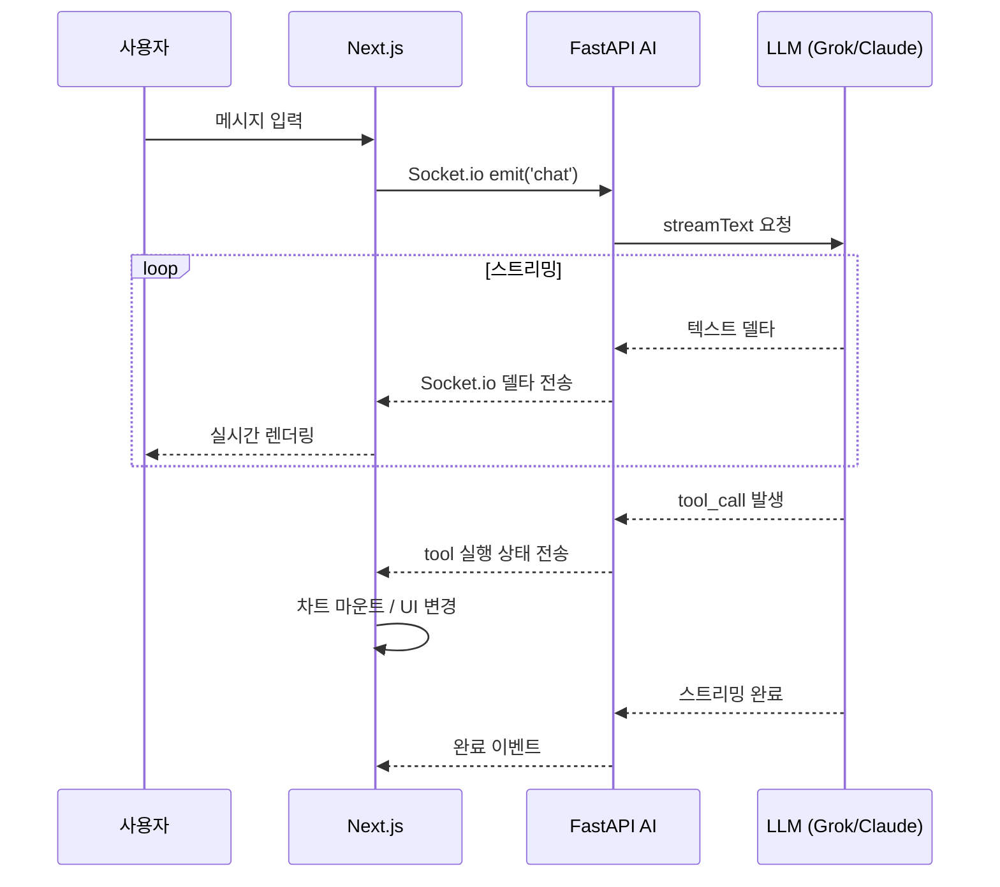
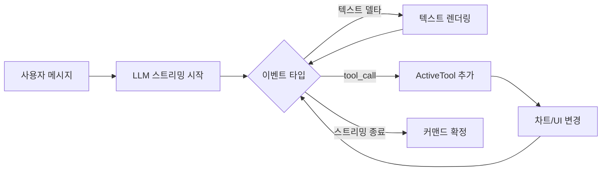
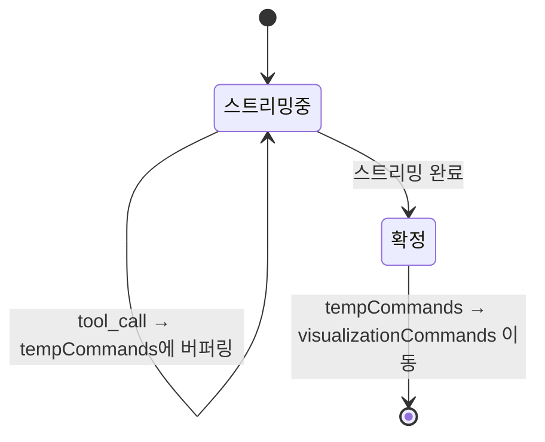

# AI 채팅 UX 설계 — Tool Calling과 스트리밍

핀구에서 LLM의 Tool Calling을 프론트엔드 상태 변경과 직접 연결하는 아키텍처를 설계하고 구현한 과정을 정리합니다.

## 문제 정의

투자 분석 AI 서비스에서 "삼성전자 주가 보여줘"라고 하면 텍스트 답변만으로는 부족합니다. 차트를 그리고, 지표를 추가하고, 화면을 분할하는 등 **AI의 도구 호출이 프론트엔드 UI를 직접 조작**해야 했습니다.

## 멀티 모델 전략

핀구는 단일 LLM이 아닌, 용도별로 다른 모델을 사용합니다.

| 티어 | 모델 | 용도 |
|---|---|---|
| LITE | Grok 4.1 Fast (non-reasoning) | 빠른 응답이 필요한 일반 대화 |
| STANDARD | Grok 4.1 Fast (reasoning) | 금융 분석, 추론이 필요한 작업 |
| MAX | Claude Sonnet 4.6 | 복잡한 분석, 고품질 응답 |

Vercel AI SDK의 `streamText`로 프론트엔드 API 라우트를 구성하고, 실제 에이전트 실행은 Python FastAPI AI 서비스에서 LangChain을 통해 처리합니다.

## 아키텍처 설계

### 전체 채팅 흐름



### 스트리밍 + 도구 실행 병행 패턴

기존의 단순한 채팅 흐름(질문 → 답변)이 아니라, 하나의 요청에서 텍스트 스트리밍과 도구 실행이 동시에 발생합니다.



### 도구 실행 상태 추적

`ActiveTool[]` 상태로 현재 실행 중인 도구를 추적합니다. 각 도구는 `running` → `done` 상태를 거치며, 완료 후 1초 뒤 자동 제거됩니다. 서브에이전트가 있는 경우 `parent_subagent`로 계층 관계를 표현합니다.

```typescript
interface ActiveTool {
  name: string;
  status: 'running' | 'done';
  subagent_type?: string;
  parent_subagent?: string;
}
```

이를 통해 "지표 분석 중..." → "차트 생성 중..." 같은 단계별 진행 상태를 사용자에게 보여줄 수 있었습니다.

### 시각화 커맨드 버퍼링

차트 업데이트 명령을 즉시 실행하지 않고 `tempVisualizationCommands`에 버퍼링했다가, 스트리밍이 완료되면 `visualizationCommands`로 확정합니다. 이렇게 하면 스트리밍 중 차트가 깜빡이는 문제를 방지할 수 있습니다.



## Socket.io 기반 실시간 통신

HTTP 대신 Socket.io를 선택한 이유는 양방향 통신이 필요했기 때문입니다. 사용자가 생성 중인 응답을 중단(interrupt)하면 소켓을 통해 즉시 서버에 전달되고, 서버는 LLM 스트리밍을 중단합니다.

```typescript
// 대화 모드: first(새 대화), continue(이어가기), resume(중단 후 재개)
socket.emit('chat', {
  mode: 'continue',
  humanMessageId: uuid(),
  messages: formattedMessages,
  files: uploadedFiles
});
```

## 핵심 인사이트

- **도구 호출은 UI 액션이다**: Tool Calling의 결과를 텍스트로 보여주는 게 아니라, 프론트엔드 상태를 직접 변경하는 것이 핵심. `predict_indicator` → 차트 컴포넌트 마운트, `split_screen` → 레이아웃 변경 등
- **상태 버퍼링이 UX를 결정한다**: 스트리밍 중 차트가 계속 깜빡이면 사용감이 크게 떨어짐. 커맨드 버퍼링으로 해결
- **멀티 모델 전략**: 속도·비용·품질 트레이드오프에 따라 Grok(빠른 응답), Claude(고품질 분석)를 구분해 사용
- **graceful degradation**: 소켓 연결이 끊어져도 앱이 크래시하지 않도록 모든 emit을 try-catch로 감싸고, 재연결 시 대화 상태를 복원
