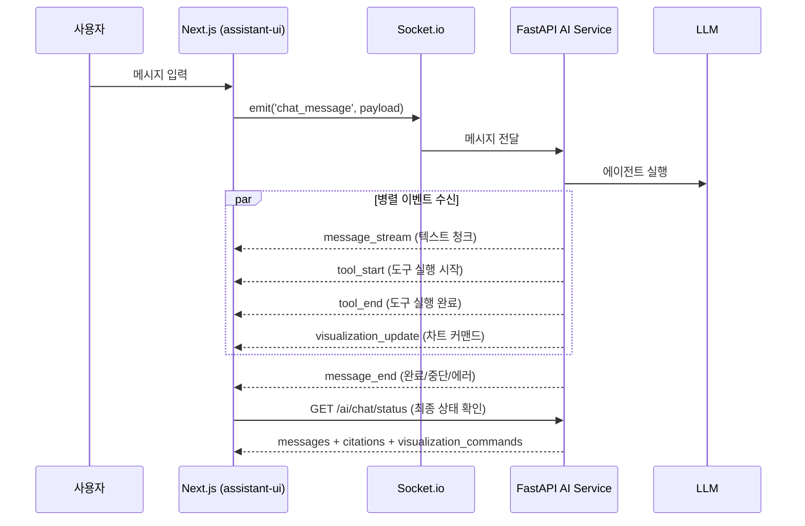
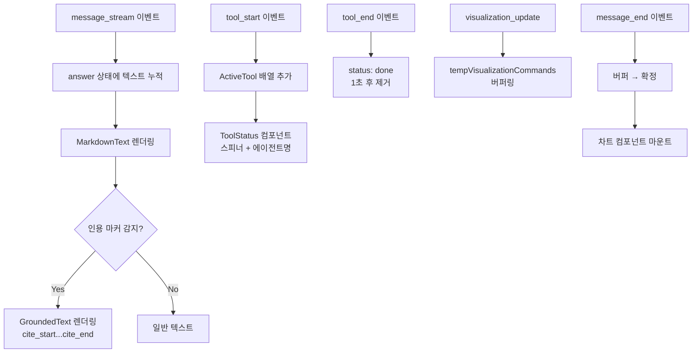
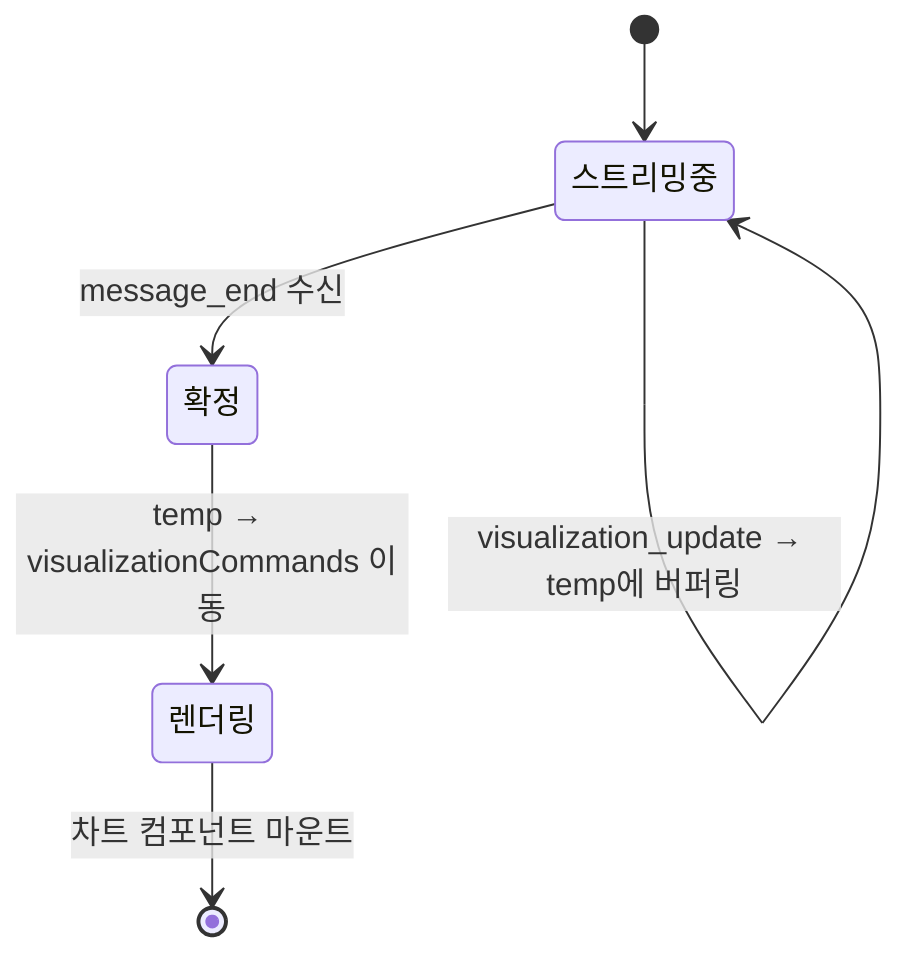
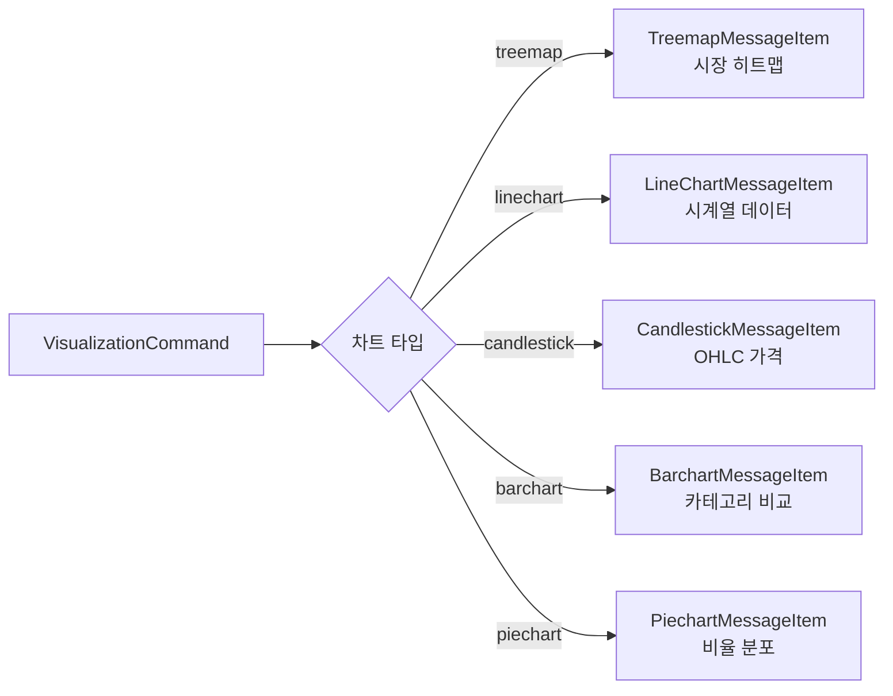

# AI 채팅 요청·응답 렌더링 아키텍처

핀구의 AI 채팅은 단순한 메시지 주고받기가 아니라, 스트리밍 텍스트·도구 실행 상태·시각화 커맨드·인용이 동시에 흐르는 복합 인터페이스입니다. Socket.io 기반 실시간 통신 위에서 이 모든 것을 어떻게 렌더링했는지 정리합니다.

## 전체 통신 흐름



핵심은 하나의 요청에서 여러 종류의 이벤트가 비동기로 도착한다는 점입니다. `message_stream`으로 텍스트가 한 글자씩 쌓이는 동안, `tool_start`/`tool_end`로 에이전트 상태가 업데이트되고, `visualization_update`로 차트 생성 커맨드가 버퍼링됩니다.

## 기술 스택 선택 근거

| 기술 | 선택 이유 | 검토한 대안 |
|---|---|---|
| Socket.io | 양방향 통신 (파일 업로드, interrupt resume), 자동 재연결, room 기반 라우팅 | SSE (단방향만 가능), raw WebSocket (재연결 로직 직접 구현 필요) |
| assistant-ui | React 기반 채팅 UI 프레임워크, 커스텀 렌더러와 어댑터 패턴 제공 | Vercel AI SDK (스트리밍은 강하나 커스텀 렌더링 유연성 부족) |
| 자체 MarkdownText + GroundedText | 인용 마커 파싱과 금융 데이터 시각화를 위한 커스텀 렌더링 필요 | react-markdown 단독 (인용 시스템 통합 어려움) |

SSE 대신 Socket.io를 선택한 핵심 이유는 **양방향 통신**입니다. 채팅 메시지 전송뿐 아니라, 파일 업로드 상태 동기화, Human-in-the-Loop interrupt에 대한 사용자 응답 전송, 대화 취소(abort) 시그널 등 클라이언트 → 서버 방향의 이벤트가 빈번합니다. SSE는 서버 → 클라이언트 단방향만 지원하므로, 이러한 역방향 이벤트마다 별도 HTTP 요청을 보내야 하는 비효율이 발생합니다.

Socket.io의 자동 재연결은 모바일 환경에서 특히 중요합니다. 네트워크 전환(Wi-Fi ↔ LTE) 시 평균 세션당 2-3회 재연결이 발생하는데, raw WebSocket이었다면 이 재연결 로직과 메시지 큐잉을 직접 구현해야 했습니다.

## 채팅 모드와 대화 연속성

```typescript
// 세 가지 대화 모드
socket.emit('chat_message', {
  mode: 'first',     // 새 대화 시작
  // mode: 'continue',  // 같은 스레드에서 이어가기
  // mode: 'resume',    // interrupt 후 재개
  query: userMessage,
  model: 'STANDARD',  // LITE | STANDARD | MAX
  files: uploadedFiles
});
```

`first`로 시작된 대화는 `message_thread_id` 이벤트로 스레드 ID를 받고, 이후 `continue`로 같은 스레드에서 대화를 이어갑니다. AI가 차트 조작을 위해 사용자 확인을 요청하면 `interrupt`로 멈추고, 사용자 응답 후 `resume`으로 재개합니다.

## 응답 렌더링 파이프라인



### 텍스트 스트리밍과 일시 정지 감지

스트리밍 중 1초 이상 새 텍스트가 없으면 "일시 정지" 상태로 전환합니다. 이는 AI가 내부적으로 도구를 실행하고 있거나, 서브에이전트 응답을 기다리는 중일 수 있기 때문입니다.

```typescript
useEffect(() => {
  if (isLoading && answer !== '') {
    streamTimeoutRef.current = setTimeout(() => {
      setIsStreamPaused(true);  // Thinking 인디케이터 표시
    }, 1000);
  }
}, [answer, isLoading]);
```

### 시각화 커맨드 버퍼링

차트 업데이트 명령을 즉시 실행하면 스트리밍 중 차트가 깜빡입니다. `tempVisualizationCommands`에 모았다가 `message_end`에서 확정하는 이중 버퍼 패턴을 적용했습니다.



## 도구 실행 상태 추적

20개 이상의 도구(에이전트)가 계층적으로 실행됩니다. 부모-자식 관계를 추적해 UI에서 트리 형태로 보여줍니다.

```typescript
interface ActiveTool {
  name: string;
  status: 'running' | 'done';
  subagent_type?: string;
  parent_subagent?: string;
}

// 도구명 → 한글 라벨 매핑
const TOOL_LABELS: Record<string, string> = {
  'research-agent': '기업/재무 데이터 조사',
  'market-data-agent': '시장 데이터 조회',
  'technical-agent': '기술적 분석',
  'portfolio-agent': '포트폴리오 분석',
  'quant-agent': '금융공학 계산',
  'indicator-manager': '지표 관리',
  'visualization-agent': '데이터 시각화',
};
```

## 시각화 렌더링

AI가 생성한 차트 커맨드는 타입별로 전용 컴포넌트에 매핑됩니다.



## 인용 시스템

AI 응답에 출처를 표시하는 인용 시스템을 구현했습니다. 서버에서 `[cite_start]...내용...[cite_end id1 id2]` 형태로 마킹하면, 프론트엔드의 `GroundedText` 컴포넌트가 이를 파싱해 클릭 가능한 출처 링크로 변환합니다.

```typescript
// 인용 마커 예시
"삼성전자의 PER은 [cite_start]12.3배로 업종 평균 대비 저평가[cite_end src_a1_1 src_a1_2] 상태입니다."

// Citation 타입
interface Citation {
  id: string;     // src_a1_1
  title: string;  // 검색 결과 제목
  url: string;    // 원본 URL
  content: string; // 스니펫
}
```

## 트러블슈팅: 스트리밍 이벤트 순서 문제

### 문제 발견

스트리밍 중 간헐적으로 도구 상태 UI가 깜빡이는 현상이 보고되었습니다. `tool_start` 이벤트가 도착하기 전에 해당 도구의 결과를 참조하는 `message_stream` 텍스트가 먼저 렌더링되는 경우였습니다.

### 원인 분석

AI 서비스에서 이벤트를 emit하는 순서는 보장되지만, 네트워크 지연으로 인해 클라이언트 도착 순서가 뒤바뀔 수 있었습니다. 특히 `tool_start`와 `message_stream`이 거의 동시에 발생하면 (수 ms 차이), 패킷 순서가 역전되는 경우가 있었습니다.

### 해결

각 이벤트에 시퀀스 번호를 부여하고, 클라이언트에서 순서가 맞지 않는 이벤트를 버퍼링한 후 정렬하여 처리하는 방식을 적용했습니다.

```typescript
// 서버: 이벤트 시퀀스 번호 부여
let seq = 0;
socket.emit('tool_start', { seq: ++seq, ...toolData });
socket.emit('message_stream', { seq: ++seq, ...streamData });

// 클라이언트: 순서 보장 처리
const eventBuffer: Map<number, SocketEvent> = new Map();
let expectedSeq = 1;

function processEvent(event: SocketEvent) {
  eventBuffer.set(event.seq, event);
  while (eventBuffer.has(expectedSeq)) {
    const next = eventBuffer.get(expectedSeq)!;
    eventBuffer.delete(expectedSeq);
    expectedSeq++;
    handleEvent(next); // 실제 처리
  }
}
```

이 버퍼링으로 이벤트 순서 역전으로 인한 UI 글리치를 완전히 제거했습니다.

## 핵심 인사이트

- **이중 버퍼링으로 UI 안정성 확보**: 시각화 커맨드를 temp → confirmed로 이중 버퍼링하면 스트리밍 중 UI 깜빡임을 완전히 제거할 수 있음. 게임 엔진의 더블 버퍼링과 동일한 원리
- **스트림 일시 정지 감지 = 체감 성능**: 실제 응답 속도는 같지만, 1초 타임아웃으로 "분석 중..." 상태를 표시하면 사용자의 체감 대기 시간이 크게 줄어듦. UX에서 **피드백은 속도보다 중요**
- **assistant-ui 어댑터 패턴**: 자체 Socket.io 메시지 포맷을 assistant-ui의 ThreadMessage로 변환하는 어댑터 레이어를 두면, 라이브러리의 UI 컴포넌트를 그대로 활용하면서 커스텀 통신 레이어를 유지할 수 있음. 7개 에이전트의 56개+ 도구 상태를 모두 추적하면서도 UI 코드는 깔끔하게 유지
- **인용 = 금융 서비스의 신뢰 기반**: "AI가 말했으니 맞겠지"가 아니라 "이 출처에서 확인 가능합니다"를 제공하는 것이 금융 도메인에서 사용자 신뢰의 핵심. 인용 시스템은 기술적으로는 텍스트 파싱이지만, 비즈니스적으로는 서비스 신뢰도의 근간
- **이벤트 순서 보장은 선택이 아닌 필수**: Socket.io가 순서를 보장한다고 가정하면 안 됨. 네트워크 레이어에서의 순서 역전을 클라이언트 버퍼링으로 해결하는 것이 방어적 프로그래밍의 핵심
