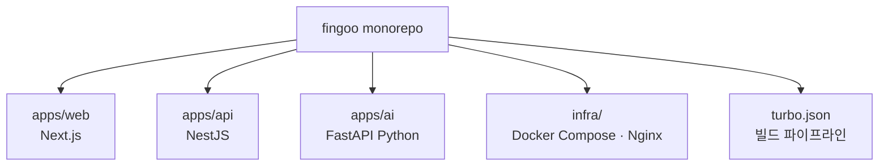
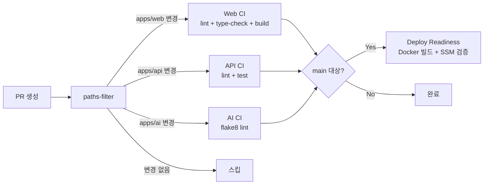
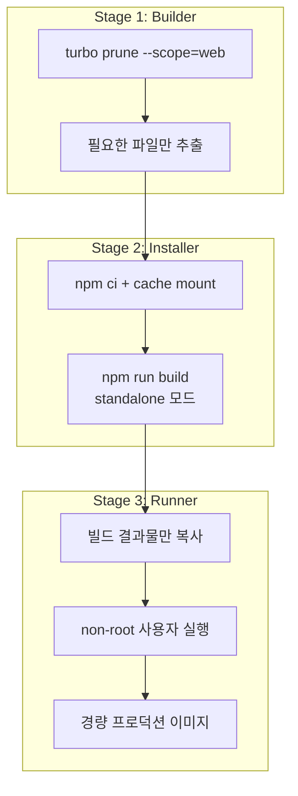
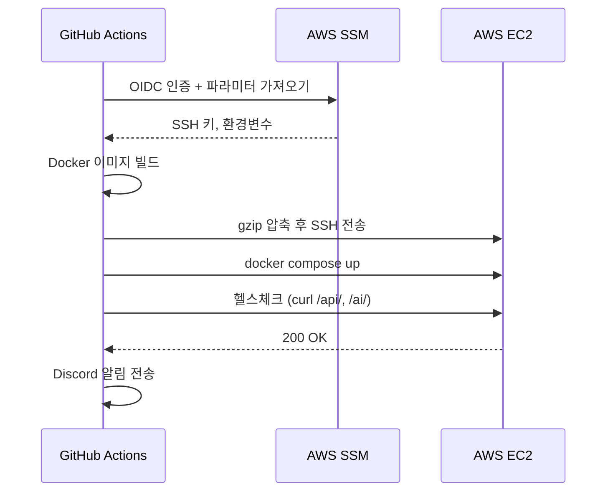

# 모노레포 CI/CD 파이프라인 구축기

Turbo 모노레포 환경에서 3개 서비스(Next.js, NestJS, FastAPI)의 CI/CD 파이프라인을 설계하고 구축한 과정을 정리합니다.

## 모노레포 구조



Node.js 2개 + Python 1개의 이기종 서비스를 하나의 레포에서 관리합니다. Turbo를 사용해 의존성 관리와 빌드 캐싱을 처리합니다.

## PR CI: 변경 감지 기반 조건부 빌드

모든 PR에서 3개 서비스를 전부 빌드하면 시간과 비용이 낭비됩니다. `dorny/paths-filter`를 사용해 변경된 파일 경로를 감지하고, 해당 서비스만 CI를 실행합니다.



추가로 `main` 브랜치 대상 PR에서는 **deploy readiness** 검증을 수행합니다. Docker 이미지 빌드와 웹 번들링이 정상적으로 되는지, AWS SSM의 프로덕션 파라미터가 모두 존재하는지 확인합니다.

## Docker 멀티스테이지 빌드

각 서비스의 Dockerfile을 3단계로 구성했습니다.



### Stage 1: Builder — Turbo Prune

`turbo prune --scope=web`으로 해당 서비스에 필요한 파일만 추출합니다. 모노레포 전체를 COPY하지 않으므로 빌드 컨텍스트가 작아지고, 레이어 캐시 효율이 올라갑니다.

### Stage 2: Installer — 빌드

BuildKit 캐시 마운트로 npm 캐시를 재사용합니다. Next.js는 standalone 모드로 빌드해 node_modules 중복을 제거합니다.

```dockerfile
RUN --mount=type=cache,target=/root/.npm \
    npm ci --production=false
RUN npm run build
```

### Stage 3: Runner — 경량 프로덕션

빌드 결과물만 복사하고 non-root 사용자로 실행합니다. dev dependency를 제거해 이미지 크기를 최소화합니다.

## 배포: EC2 + Docker Compose

프로덕션 배포는 GitHub Actions에서 EC2로 Docker 이미지를 전송하는 방식입니다.



### SSM을 Single Source of Truth로

모든 시크릿과 환경변수를 AWS SSM Parameter Store에서 관리합니다. CI/CD에서 SSM → `.env` 파일 생성 → Docker Compose에 주입하는 흐름입니다. Vercel 환경변수도 SSM에서 동기화하고, SSM에 없는 Vercel 변수는 자동 삭제합니다.

### 프론트엔드: Private Fork 패턴

Vercel 배포는 직접 API를 호출하지 않고, private fork 레포에 push → PR 생성 → auto-merge하는 방식입니다. 이렇게 하면 Vercel의 Git 통합 기능을 그대로 활용하면서 배포 이력을 별도로 관리할 수 있습니다.

## 인사이트

- **변경 감지 + 조건부 빌드**가 모노레포 CI의 핵심. 불필요한 빌드를 건너뛰면 CI 시간이 절반 이하로 줄어듦
- **Turbo prune**으로 Docker 빌드 컨텍스트를 최소화하면 캐시 히트율이 크게 상승
- **SSM 중앙화**로 환경변수 관리 포인트를 하나로 통일. "이 변수 어디에 있지?" 문제 해결
- **헬스체크 자동화**로 배포 직후 장애를 즉시 감지. curl 한 줄이지만 효과는 큼
- **Docker 이미지 gzip 전송**은 레지스트리 없이도 충분히 실용적인 배포 방식
