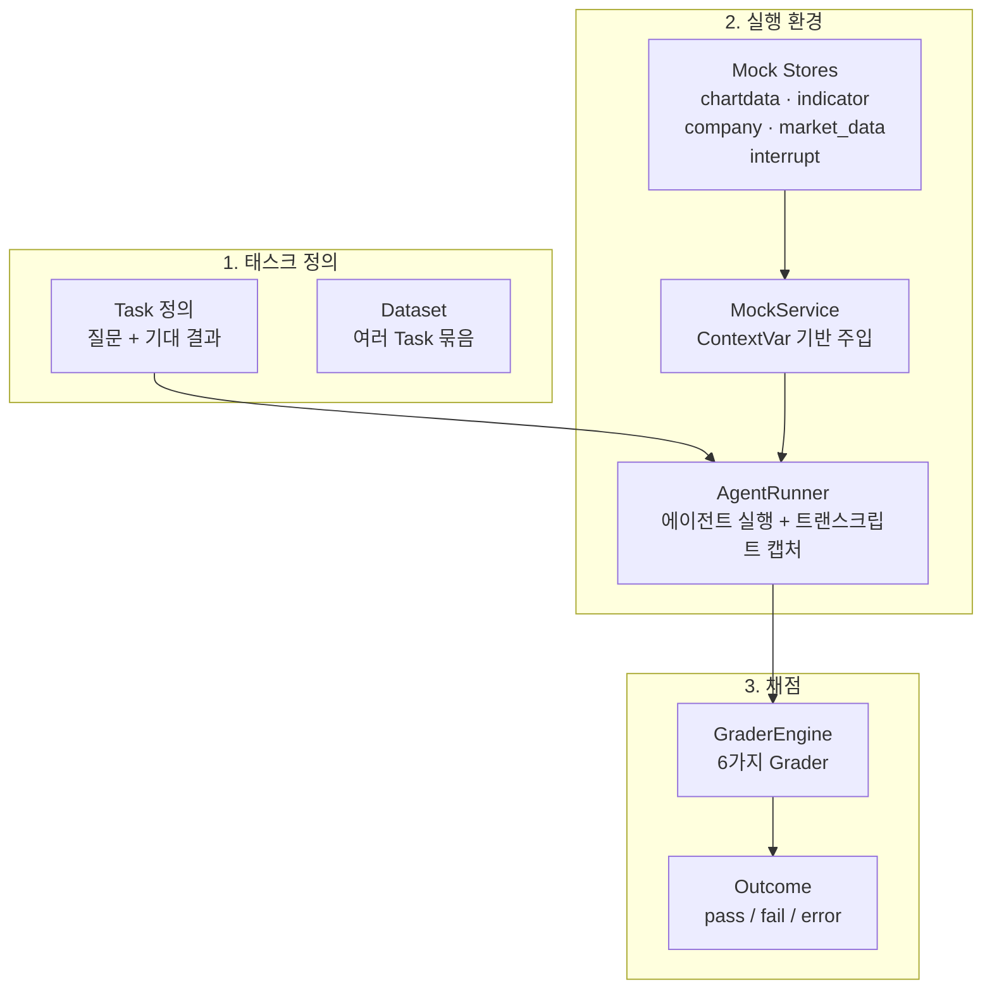
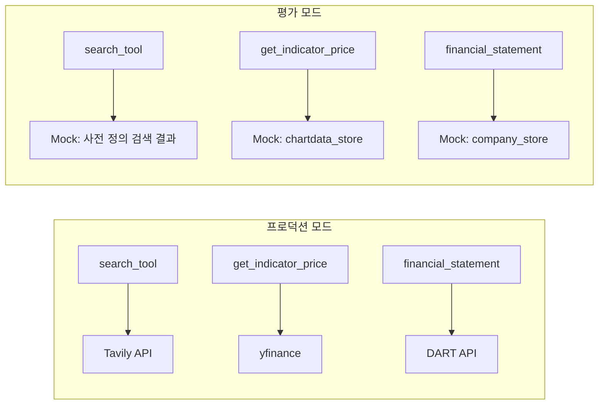
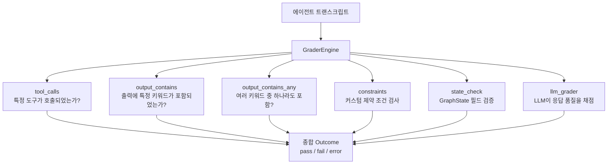
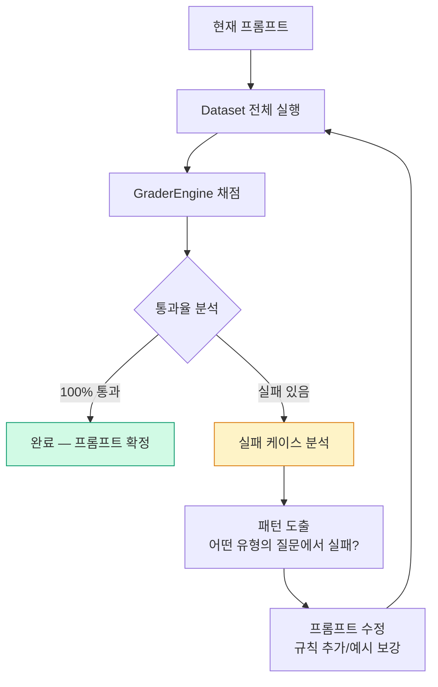

# 에이전트 평가 Harness 구축과 프롬프트 파이프라인

"AI가 올바르게 작동하는지 어떻게 검증할까?" 핀구의 7개 에이전트를 체계적으로 평가하기 위한 Harness를 구축하고, 평가 결과를 바탕으로 프롬프트를 개선하는 자가 피드백 파이프라인을 정리합니다.

## 문제 정의

에이전트 개발의 딜레마: 프롬프트를 수정할 때마다 직접 대화해보며 검증하면 시간이 너무 오래 걸리고, 단위 테스트로는 에이전트의 "판단력"을 테스트할 수 없습니다. 특히 핀구처럼 7개 에이전트가 협업하는 시스템에서는, 한 에이전트의 프롬프트 수정이 전체 시스템에 어떤 영향을 미치는지 예측하기 어렵습니다.

## 평가 아키텍처



### Task 구조

각 태스크는 에이전트에게 보낼 질문과 기대하는 행동을 정의합니다.

```python
Task(
    name="삼성전자_기술분석",
    query="삼성전자의 RSI와 MACD를 분석해줘",
    expected=Expected(
        tool_calls=["calc_rsi", "calc_macd"],
        output_contains=["RSI", "MACD"],
        state_check={"citations": lambda c: len(c) > 0}
    )
)
```

### MockService — 외부 의존성 격리

실제 API(yfinance, DART, Tavily)를 호출하면 느리고, 결과가 매번 달라져 재현성이 없습니다. `ContextVar` 기반으로 MockService를 주입해 외부 의존성을 완전히 격리합니다.



도구 코드 내부에서 `is_eval_mode()`를 체크해 분기합니다. 이렇게 하면 도구 코드 자체는 수정 없이, 평가 환경에서는 결정론적 결과를 반환합니다.

## 6가지 Grader

GraderEngine은 6가지 채점 기준을 지원합니다.



### Grader 상세

| Grader | 입력 | 판정 기준 |
|---|---|---|
| `tool_calls` | 기대 도구 목록 | 트랜스크립트에서 해당 도구가 호출되었는지 |
| `output_contains` | 필수 키워드 목록 | 최종 응답에 모든 키워드가 포함되었는지 |
| `output_contains_any` | 키워드 목록 | 하나라도 포함되면 통과 |
| `constraints` | 커스텀 함수 | 함수가 True를 반환하면 통과 |
| `state_check` | 상태 필드별 검증 함수 | GraphState의 특정 필드가 조건을 만족하는지 |
| `llm_grader` | 채점 프롬프트 | LLM이 응답을 읽고 점수를 매김 |

`llm_grader`는 가장 유연하지만, 비결정론적이라 다른 Grader로 검증 가능한 항목은 먼저 rule-based로 체크하고, "응답이 전문적인가?", "설명이 충분한가?" 같은 주관적 품질은 llm_grader로 평가합니다.

## 자가 피드백 프롬프트 개선 파이프라인

평가 결과를 바탕으로 프롬프트를 개선하는 루프입니다.



### 실패 분석 예시

```
Task: "삼성전자 vs SK하이닉스 비교 분석"
Expected tool_calls: [calc_rsi, calc_macd, get_financial_statements]
Actual tool_calls: [calc_rsi, calc_macd]  ← get_financial_statements 누락!

원인: Supervisor가 비교 분석 시 리서치 에이전트를 호출하지 않음
수정: Supervisor 프롬프트에 "비교 분석 요청 시 반드시 리서치 에이전트 포함" 규칙 추가
```

이 과정을 반복하면서 프롬프트가 점진적으로 정교해집니다. 핵심은 "감으로 수정하지 않는 것"입니다. 모든 수정은 실패한 테스트 케이스에 근거합니다.

## Dataset 관리

```python
# datasets/samsung_analysis.py
DATASET = [
    Task(
        name="기본_주가_분석",
        query="삼성전자 주가 분석해줘",
        expected=Expected(
            tool_calls=["search_symbol_tool", "get_indicator_price"],
            output_contains=["삼성전자"]
        )
    ),
    Task(
        name="기술적_분석",
        query="삼성전자 RSI, MACD 분석",
        expected=Expected(
            tool_calls=["calc_rsi", "calc_macd"],
            output_contains=["RSI", "MACD"]
        )
    ),
    # ...
]
```

## 핵심 인사이트

- **ContextVar 주입이 테스트의 핵심**: 도구 코드에 `if test:` 분기를 넣지 않고, ContextVar로 MockService를 주입하면 프로덕션 코드가 깨끗하게 유지됨
- **Rule-based 먼저, LLM 나중에**: 도구 호출 여부, 키워드 포함 같은 객관적 기준은 rule-based로, 응답 품질 같은 주관적 기준만 llm_grader로
- **실패 기반 개선**: "프롬프트가 좀 더 좋아질 것 같아서" 수정하면 다른 곳이 깨짐. 반드시 실패한 테스트 케이스를 근거로 수정
- **재현성 = Mock + 결정론적 데이터**: 같은 태스크를 같은 조건에서 반복 실행할 수 있어야 프롬프트 A/B 비교가 의미 있음
