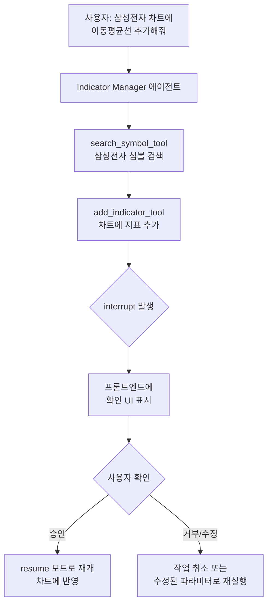
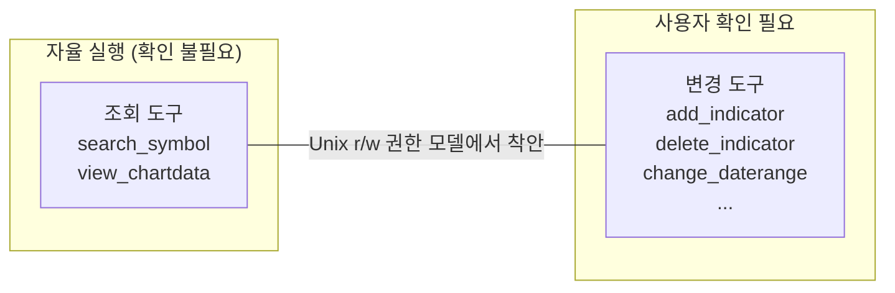
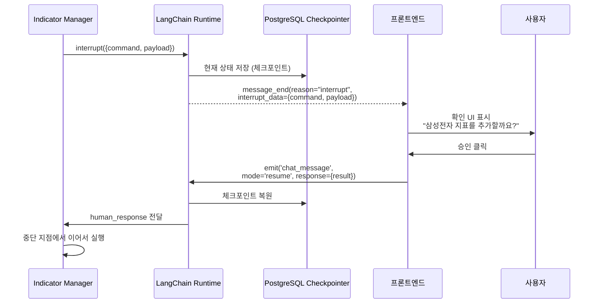
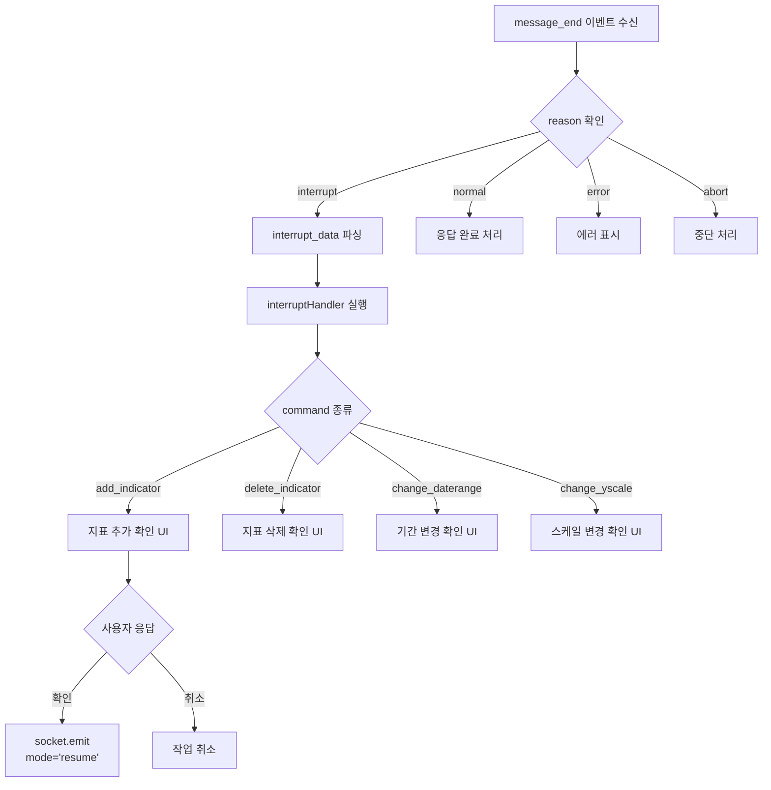
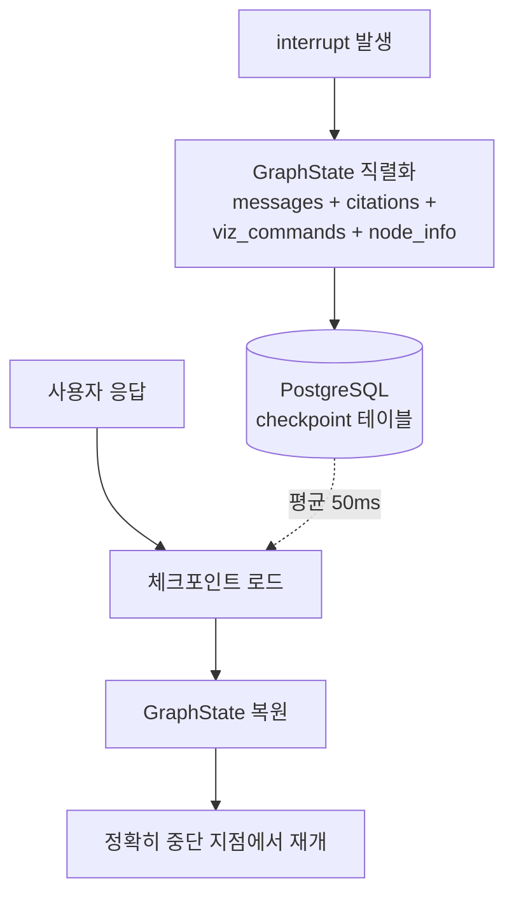
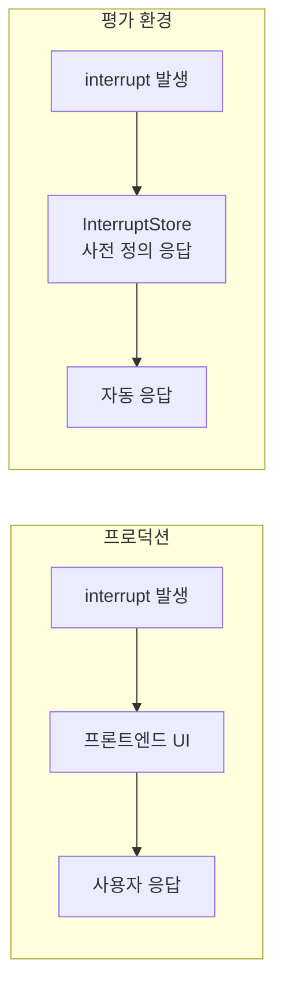

# AI야 기다려봐 사용자 심심하잖아

AI가 혼자 다 하는 동안 사용자는 구경만 합니다. 심심하죠. 핀구에서는 에이전트 워크플로우를 중간에 멈추고, 사용자가 차트 UI를 직접 조작한 뒤 그 결과에 따라 에이전트가 이어서 동작하게 만들었습니다. AI의 정확한 실행과 사용자 경험을 동시에 높인 Human-in-the-Loop 패턴의 설계 과정을 정리합니다.

## 왜 Human-in-the-Loop인가

AI가 "삼성전자 차트에 볼린저밴드 추가해줘"라는 요청을 받으면 차트를 바로 수정할 수 있습니다. 하지만 "포트폴리오에서 삼성전자 삭제해줘"라면? AI가 잘못 판단해 의도하지 않은 데이터를 삭제할 수 있습니다. **AI의 자율성과 사용자의 통제권 사이의 균형**이 핵심입니다.



## 설계 원칙: 자율성 vs 통제의 스펙트럼

모든 도구에 사용자 확인을 거치면 UX가 파괴되고, 모든 도구를 자율 실행하면 위험합니다. 핵심은 **어디에 선을 긋는가**입니다.



이 분류 기준은 Unix의 **read/write 권한 모델**에서 착안했습니다. 파일을 읽는 것은 안전하지만, 쓰는 것은 확인이 필요합니다. 마찬가지로 차트 데이터를 **조회**하는 것은 부작용이 없지만, **변경**하는 것은 사용자의 분석 환경을 바꿉니다.

이 기준으로 9개 도구를 분류한 결과: 조회 2개(즉시 실행), 변경 7개(interrupt). 사용자는 데이터 탐색 시에는 끊김 없이 대화하다가, 차트를 실제로 수정할 때만 확인 팝업을 봅니다.

## LangChain interrupt 메커니즘

LangChain의 `interrupt()` 함수를 사용해 에이전트 실행을 일시 정지합니다. 에이전트 상태는 PostgreSQL 체크포인터에 저장되어, 사용자 응답 후 정확히 중단 지점에서 재개됩니다.

```python
# add_indicator_tool 내부
def add_indicator(symbols: list[str]) -> str:
    # 프론트엔드에 interrupt 커맨드 전송
    human_response = interrupt({
        "command": "add_indicator",
        "payload": {"symbols": symbols}
    })

    # 사용자가 응답하면 여기서 재개
    result = human_response["result"]
    return f"지표가 추가되었습니다: {result}"
```



## Interrupt 대상 도구들

9개의 차트 제어 도구 중 대부분이 interrupt를 사용합니다.

| 도구 | 동작 | interrupt |
|---|---|---|
| `add_indicator_tool` | 차트에 지표 추가 | O — 사용자에게 추가할 심볼 확인 |
| `delete_indicator_tool` | 차트에서 지표 삭제 | O — 삭제 대상 확인 |
| `change_daterange_tool` | 차트 기간 변경 | O — 기간 범위 확인 |
| `change_yscale_tool` | Y축 스케일 변경 (선형/로그) | O |
| `change_unittype_tool` | 단위 변경 (%, 절대값) | O |
| `change_interval_tool` | 일/주/월 간격 변경 | O |
| `change_data_aggregation_tool` | 데이터 집계 방식 변경 | O |
| `search_symbol_tool` | 심볼 검색 | X — 조회만 |
| `view_current_chartdata_tool` | 현재 차트 상태 조회 | X — 조회만 |

조회 도구는 interrupt 없이 즉시 실행되고, 변경 도구만 사용자 확인을 거칩니다.

## 프론트엔드 Interrupt 처리



`interrupt-handler.ts`에서 커맨드별로 프론트엔드 액션을 매핑합니다. `add_indicator` 커맨드를 받으면 IndicatorBoard 컴포넌트에 추가할 심볼 목록을 표시하고, 사용자가 확인/수정하면 결과를 `resume` 모드로 서버에 전달합니다.

## 배치 처리와 병렬 호출 제한

중요한 설계 결정: interrupt 도구는 **병렬 호출을 금지**합니다. LLM이 동시에 여러 interrupt를 발생시키면 프론트엔드에서 처리 순서가 꼬이기 때문입니다. 대신 배치 입력을 지원합니다.

```python
# 잘못된 패턴: 병렬 interrupt
add_indicator("삼성전자")  # interrupt 1
add_indicator("SK하이닉스")  # interrupt 2 ← 충돌!

# 올바른 패턴: 배치 입력
add_indicator(["삼성전자", "SK하이닉스"])  # interrupt 1번만 발생
```

시스템 프롬프트에서 이 규칙을 명시적으로 강제하고, `ToolCallLimitMiddleware`가 실행 시점에서도 검증합니다.

## 체크포인트 복원의 기술적 도전

interrupt 상태를 안정적으로 저장/복원하는 것은 간단하지 않습니다.

LangChain의 PostgreSQL checkpointer는 interrupt 발생 시 전체 `GraphState`를 JSON으로 직렬화하여 저장합니다. 여기에는 메시지 히스토리, 인용 데이터, 시각화 커맨드, 현재 실행 중인 노드 정보가 모두 포함됩니다.



체크포인트 저장/복원이 평균 50ms 이내로 완료되어, 사용자는 interrupt 재개가 거의 즉시 이루어지는 것처럼 느낍니다. 대화가 길어지면 체크포인트 크기도 커지지만, SummarizationMiddleware와 연계하여 100k 토큰 초과 시 이전 메시지를 요약해 체크포인트 크기를 관리합니다.

interrupt 중 서버가 재시작되더라도 PostgreSQL에 체크포인트가 보존되므로, 사용자는 다시 접속해 대화를 이어갈 수 있습니다.

## 평가 환경에서의 Interrupt 처리

실제 사용자 없이 에이전트를 테스트할 때는 `InterruptStore`가 미리 정의된 응답을 제공합니다.



```python
# 평가용 InterruptStore
interrupt_store = {
    "add_indicator": {"result": {"symbols": ["005930"]}},
    "delete_indicator": {"result": {"confirmed": True}},
}
```

## 트러블슈팅: 병렬 Interrupt 충돌

### 문제 발견

"삼성전자와 SK하이닉스 차트에 볼린저밴드 추가해줘"라는 요청에서, LLM이 `add_indicator`를 2번 병렬 호출했습니다. 2개의 interrupt가 동시에 발생하자, 프론트엔드에서 첫 번째 interrupt만 처리되고 두 번째는 유실되었습니다.

### 원인 분석

프론트엔드의 interrupt handler가 **하나의 pending interrupt만 관리**하는 구조였습니다. 두 번째 interrupt가 도착했을 때 첫 번째를 덮어쓰면서 유실이 발생했습니다.

### 시도한 접근들

1. **Interrupt 큐** (기각): 여러 interrupt를 큐에 쌓고 순차 처리 → 사용자에게 연쇄 팝업이 표시되어 UX 나쁨
2. **배치 입력 지원** (채택): 단일 interrupt에 여러 종목을 포함하도록 도구 인터페이스 변경

### 최종 해결

세 겹의 방어를 적용했습니다:

1. **시스템 프롬프트**: interrupt 도구는 반드시 배치 입력으로 한 번만 호출하도록 명시
2. **ToolCallLimitMiddleware**: 런타임에서 interrupt 도구의 병렬 호출을 감지하면 하나로 병합
3. **배치 인터페이스**: `add_indicator(["삼성전자", "SK하이닉스"])` — 한 번의 interrupt로 여러 종목 처리

**결과**: interrupt 유실률 0%, 배치 처리로 사용자 확인 횟수 60% 감소 (종목별 개별 확인 → 한 번에 여러 종목 확인).

## 핵심 인사이트

- **Read/Write 분리가 UX의 핵심**: Unix 권한 모델에서 착안한 조회/변경 분리로, 데이터 탐색은 끊김 없이, 차트 수정만 확인. 모든 도구에 interrupt를 걸면 대화가 끊겨 사용자가 이탈
- **체크포인트 = 분산 시스템의 안전망**: PostgreSQL 체크포인터 덕분에 interrupt 중 서버 재시작, 네트워크 단절에도 대화 상태 보존. 50ms 이내 복원으로 사용자는 지연을 느끼지 못함
- **배치 > 병렬**: interrupt 도구의 병렬 호출을 금지하고 배치 입력을 지원하는 것이 UX(확인 횟수 60% 감소)와 안정성(유실률 0%) 모두에서 우월
- **3중 방어 설계**: 프롬프트(지시) + 미들웨어(런타임 검증) + 인터페이스(배치 설계)로 같은 문제를 세 레벨에서 방어. LLM의 비결정론적 특성상 단일 방어선은 불충분
- **평가와 프로덕션의 대칭**: InterruptStore로 같은 도구 코드가 프로덕션에서는 실제 사용자 확인을, 평가에서는 사전 정의 응답을 사용. 코드 분기 없이 환경만 바꾸는 설계
