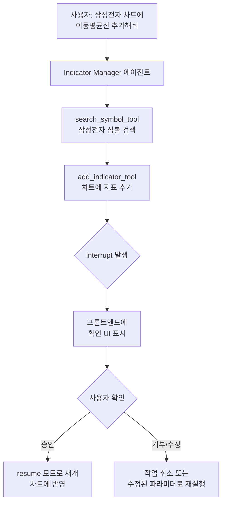
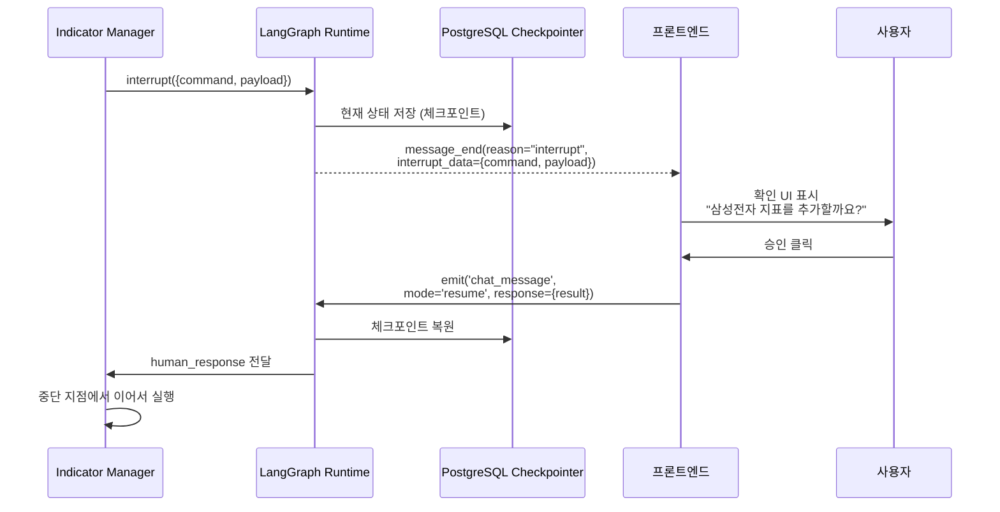
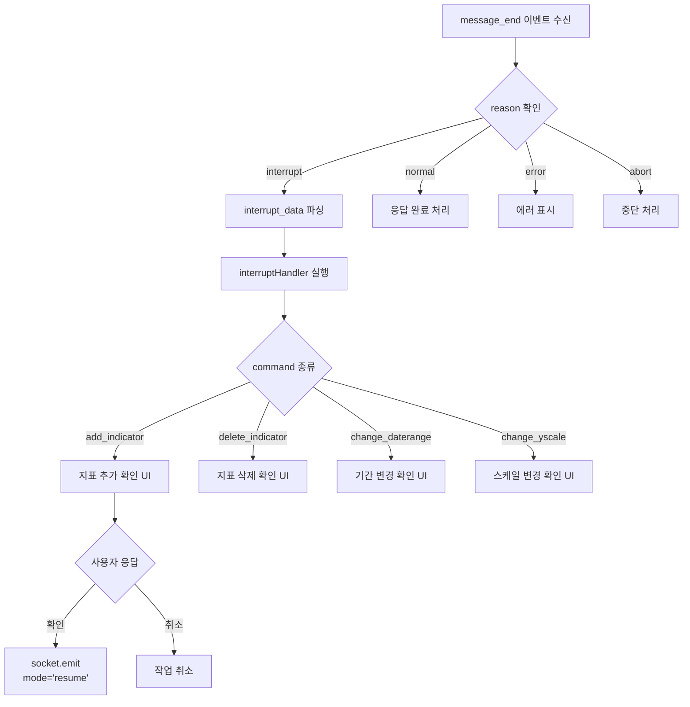
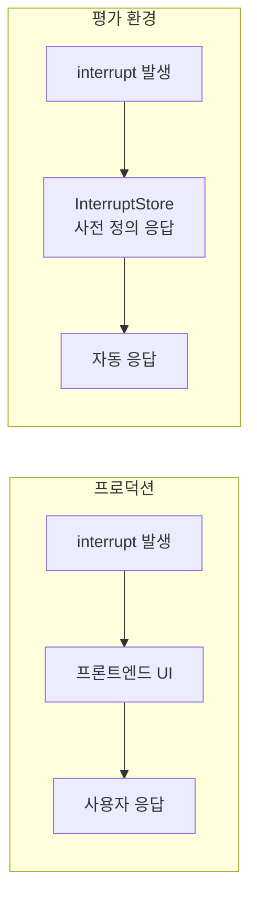

# Human-in-the-Loop 차트 제어

핀구에서 AI가 사용자 차트를 직접 조작하되, 위험한 작업은 사용자 확인을 거치도록 한 Human-in-the-Loop 패턴의 설계와 구현을 정리합니다.

## 왜 Human-in-the-Loop인가

AI가 "삼성전자 차트에 볼린저밴드 추가해줘"라는 요청을 받으면 차트를 바로 수정할 수 있습니다. 하지만 "포트폴리오에서 삼성전자 삭제해줘"라면? AI가 잘못 판단해 의도하지 않은 데이터를 삭제할 수 있습니다. **AI의 자율성과 사용자의 통제권 사이의 균형**이 핵심입니다.



## LangGraph interrupt 메커니즘

LangGraph의 `interrupt()` 함수를 사용해 에이전트 실행을 일시 정지합니다. 에이전트 상태는 PostgreSQL 체크포인터에 저장되어, 사용자 응답 후 정확히 중단 지점에서 재개됩니다.

```python
# add_indicator_tool 내부
def add_indicator(symbols: list[str]) -> str:
    # 프론트엔드에 interrupt 커맨드 전송
    human_response = interrupt({
        "command": "add_indicator",
        "payload": {"symbols": symbols}
    })

    # 사용자가 응답하면 여기서 재개
    result = human_response["result"]
    return f"지표가 추가되었습니다: {result}"
```



## Interrupt 대상 도구들

9개의 차트 제어 도구 중 대부분이 interrupt를 사용합니다.

| 도구 | 동작 | interrupt |
|---|---|---|
| `add_indicator_tool` | 차트에 지표 추가 | O — 사용자에게 추가할 심볼 확인 |
| `delete_indicator_tool` | 차트에서 지표 삭제 | O — 삭제 대상 확인 |
| `change_daterange_tool` | 차트 기간 변경 | O — 기간 범위 확인 |
| `change_yscale_tool` | Y축 스케일 변경 (선형/로그) | O |
| `change_unittype_tool` | 단위 변경 (%, 절대값) | O |
| `change_interval_tool` | 일/주/월 간격 변경 | O |
| `change_data_aggregation_tool` | 데이터 집계 방식 변경 | O |
| `search_symbol_tool` | 심볼 검색 | X — 조회만 |
| `view_current_chartdata_tool` | 현재 차트 상태 조회 | X — 조회만 |

조회 도구는 interrupt 없이 즉시 실행되고, 변경 도구만 사용자 확인을 거칩니다.

## 프론트엔드 Interrupt 처리



`interrupt-handler.ts`에서 커맨드별로 프론트엔드 액션을 매핑합니다. `add_indicator` 커맨드를 받으면 IndicatorBoard 컴포넌트에 추가할 심볼 목록을 표시하고, 사용자가 확인/수정하면 결과를 `resume` 모드로 서버에 전달합니다.

## 배치 처리와 병렬 호출 제한

중요한 설계 결정: interrupt 도구는 **병렬 호출을 금지**합니다. LLM이 동시에 여러 interrupt를 발생시키면 프론트엔드에서 처리 순서가 꼬이기 때문입니다. 대신 배치 입력을 지원합니다.

```python
# 잘못된 패턴: 병렬 interrupt
add_indicator("삼성전자")  # interrupt 1
add_indicator("SK하이닉스")  # interrupt 2 ← 충돌!

# 올바른 패턴: 배치 입력
add_indicator(["삼성전자", "SK하이닉스"])  # interrupt 1번만 발생
```

시스템 프롬프트에서 이 규칙을 명시적으로 강제하고, `ToolCallLimitMiddleware`가 실행 시점에서도 검증합니다.

## 평가 환경에서의 Interrupt 처리

실제 사용자 없이 에이전트를 테스트할 때는 `InterruptStore`가 미리 정의된 응답을 제공합니다.



```python
# 평가용 InterruptStore
interrupt_store = {
    "add_indicator": {"result": {"symbols": ["005930"]}},
    "delete_indicator": {"result": {"confirmed": True}},
}
```

## 핵심 인사이트

- **변경 = 확인, 조회 = 즉시**: 모든 도구에 interrupt를 걸면 UX가 번거로워짐. 사이드 이펙트가 있는 도구만 선별적으로 적용
- **체크포인트 = 안전망**: PostgreSQL 체크포인터 덕분에 interrupt 중 서버가 재시작되어도 대화 상태가 보존됨
- **배치 > 병렬**: interrupt 도구의 병렬 호출을 금지하고 배치 입력을 지원하는 것이 UX와 안정성 모두에서 우월
- **평가와 프로덕션의 분기점**: `is_eval_mode()` 체크로 같은 도구 코드가 프로덕션에서는 실제 interrupt를, 평가에서는 mock 응답을 사용
