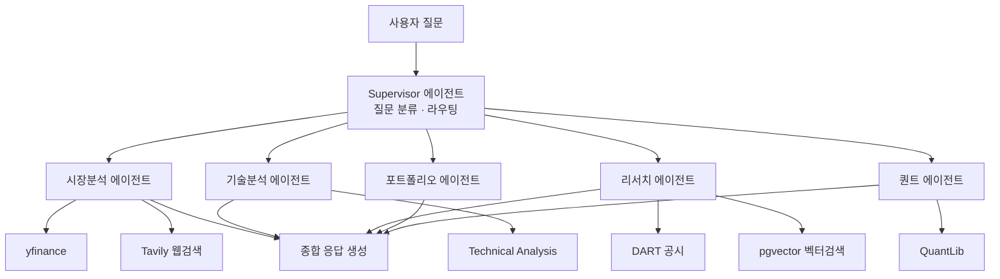
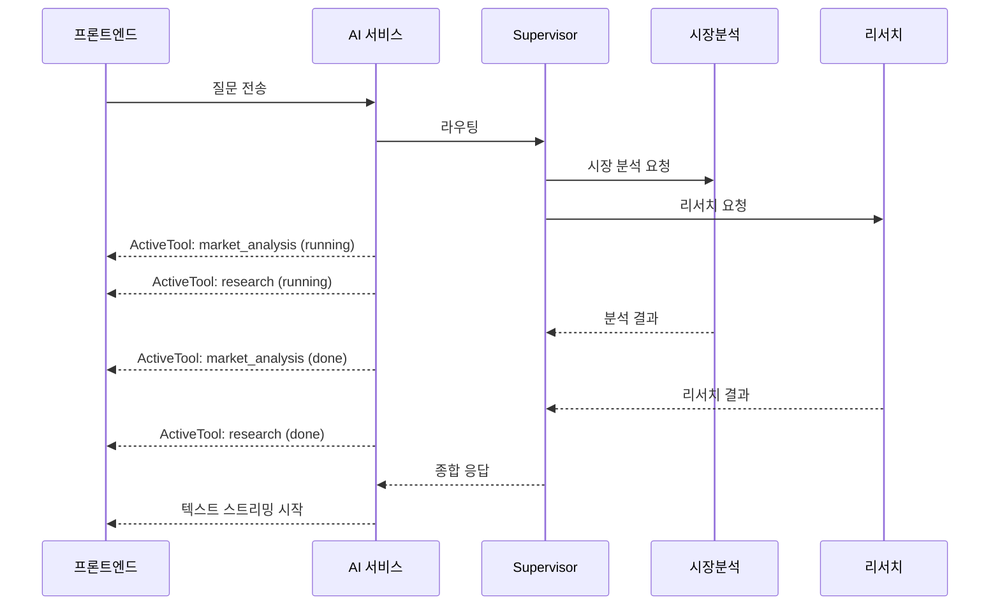
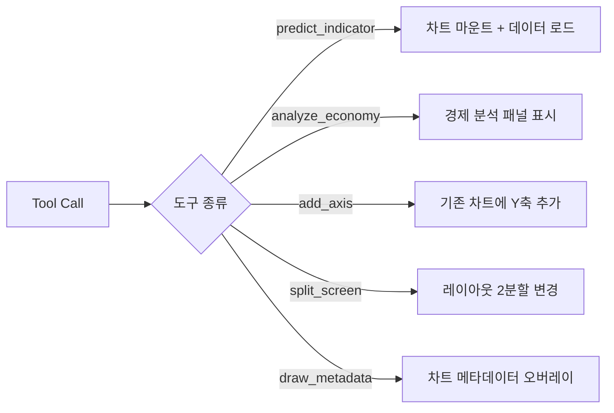
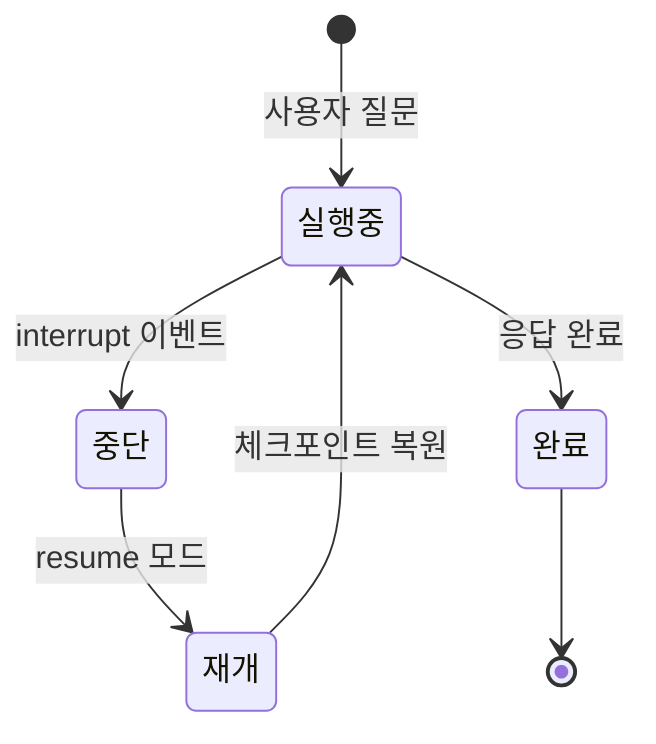

# LangGraph 멀티 에이전트 프론트엔드 연동

핀구의 Python AI 서비스에서 LangGraph로 구성된 멀티 에이전트 시스템을 Next.js 프론트엔드에서 실시간으로 추적하고 시각화한 과정을 정리합니다.

## 멀티 에이전트 구조

핀구의 AI 서비스는 단일 LLM 호출이 아닌, 여러 전문 에이전트가 협업하는 구조입니다.



각 에이전트는 자체 도구(yfinance, Tavily 웹 검색, pgvector 벡터 검색, DART 공시 등)를 가지고 있고, LangGraph의 StateGraph로 실행 흐름이 제어됩니다. Supervisor 패턴을 사용해 하위 에이전트를 오케스트레이션합니다.

## 프론트엔드에서의 실시간 추적

### 문제: 멀티 에이전트 실행은 시간이 걸린다

단일 LLM 호출은 1~3초면 응답이 시작되지만, 멀티 에이전트는 여러 단계를 거치므로 10~30초가 걸릴 수 있습니다. 이 동안 사용자에게 "로딩 중..."만 보여주면 이탈률이 급격히 올라갑니다.

### 해결: 도구 실행 단계별 시각화

Socket.io를 통해 서버에서 각 에이전트의 실행 상태를 실시간으로 전달합니다. 프론트엔드에서는 `ActiveTool[]` 상태로 현재 어떤 에이전트가 무슨 작업을 하고 있는지 추적합니다.



서브에이전트 간의 계층 관계도 표현합니다. 예를 들어 "시장 분석 에이전트"가 내부적으로 "뉴스 검색"과 "시장 상황 조회"를 병렬로 실행하면, UI에서 트리 형태로 보여줍니다.

```typescript
// 서브에이전트 관계 추적
{
  name: 'search_news',
  status: 'running',
  parent_subagent: 'market_analysis'
}
```

### Tool Calling → UI 상태 변경 매핑

각 도구 호출은 단순히 텍스트 결과를 반환하는 게 아니라, 프론트엔드의 특정 액션을 트리거합니다.



이 매핑은 `use-fingoo-function-response` 훅에서 관리합니다. 각 도구별로 전용 커스텀 훅(`use-predict-indicator`, `use-analyze-economy` 등)이 있어 관심사가 분리됩니다.

## 인터럽트 처리

멀티 에이전트 실행 중 사용자가 대화를 중단하면, 소켓을 통해 즉시 서버에 전달됩니다. 서버는 현재 실행 중인 에이전트 그래프를 중단하고, 프론트엔드는 버퍼링된 시각화 커맨드를 롤백합니다.



중단 후 "이어서 분석해줘"라고 하면 `resume` 모드로 중단 지점의 상태를 복원하고 대화를 이어갑니다. LangGraph의 체크포인팅 기능을 활용해 에이전트 상태를 보존합니다.

## 핵심 인사이트

- **단계별 진행 상태 표시**가 멀티 에이전트 UX의 핵심. 사용자가 "AI가 뭘 하고 있는지" 볼 수 있으면 30초도 기다릴 수 있음
- **Tool Calling을 UI 액션으로 매핑**하면 채팅이 단순한 텍스트 인터페이스를 넘어 인터랙티브 도구가 됨
- **관심사 분리**: 도구별 커스텀 훅으로 분리하면 새 에이전트 추가 시 기존 코드를 건드리지 않아도 됨
- **인터럽트 + 재개 패턴**: LangGraph 체크포인팅과 소켓 양방향 통신의 조합으로 자연스러운 대화 흐름 유지
- **이기종 서비스 연동**: Python AI 서비스와 Next.js 프론트엔드 사이의 실시간 통신은 Socket.io가 HTTP보다 훨씬 적합
