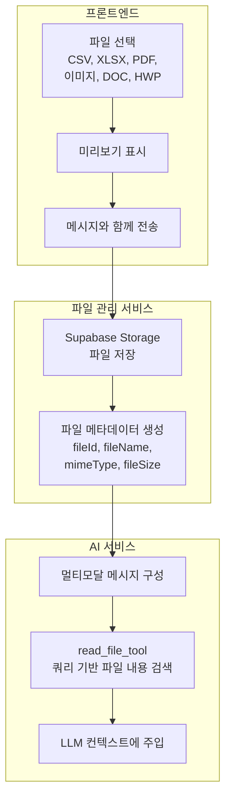
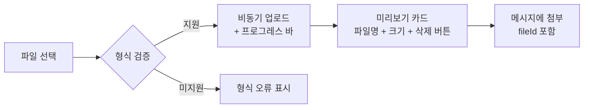
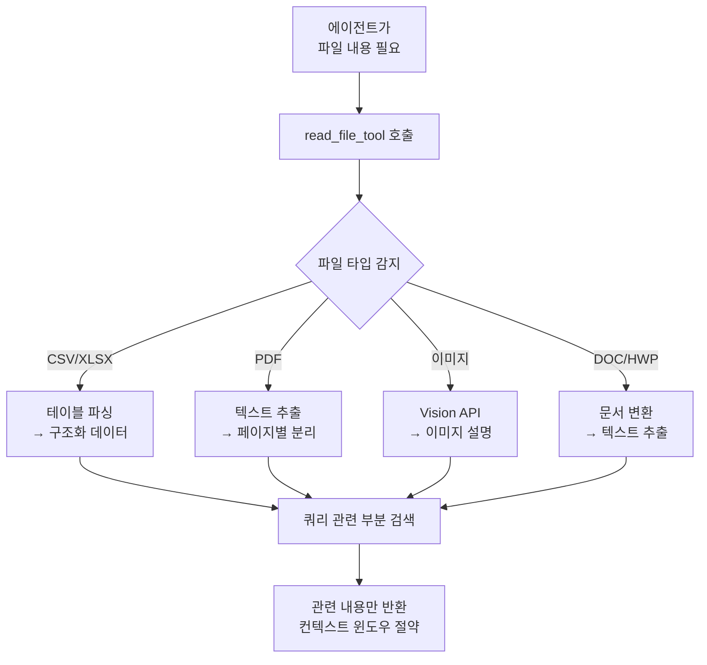
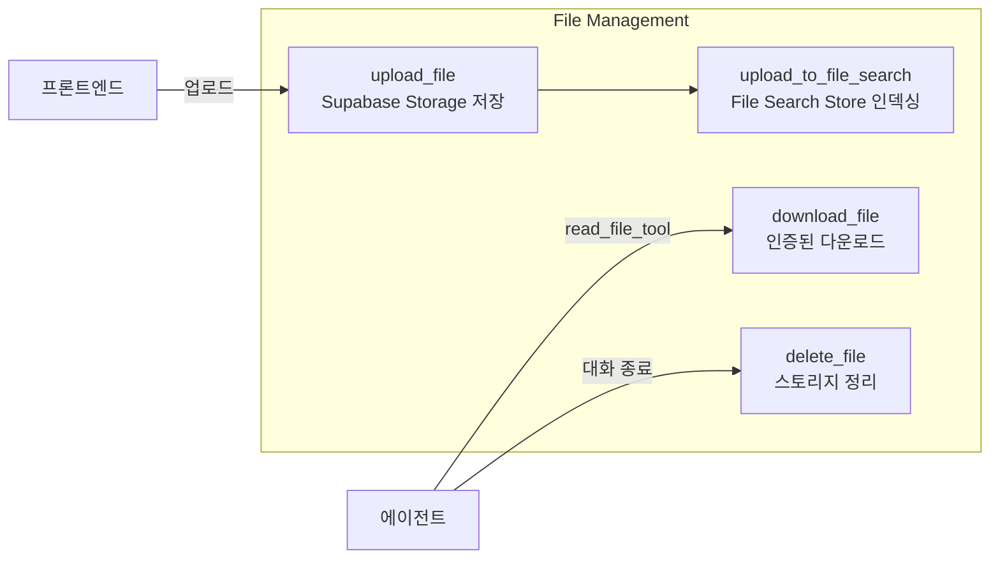
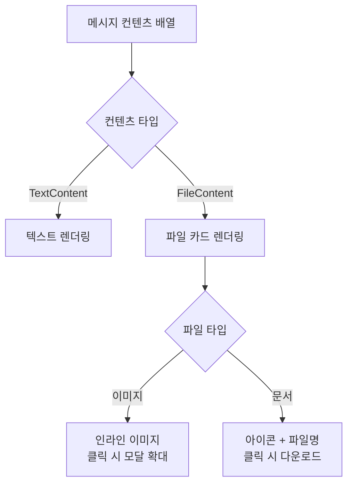

# 멀티모달 입력 처리 — 파일 업로드부터 AI 이해까지

핀구에서 사용자가 CSV 재무 데이터, PDF 리포트, 차트 스크린샷 등을 업로드하면 AI가 이를 이해하고 분석에 활용하도록 구현한 과정을 정리합니다.

## 문제 정의

텍스트만으로 투자 분석을 요청하는 것은 한계가 있습니다. "이 엑셀 데이터를 분석해줘", "이 차트 이미지를 보고 패턴을 설명해줘", "이 PDF 리포트를 요약해줘" 같은 멀티모달 요청을 처리해야 합니다.

핵심 과제는 **다양한 파일 형식을 LLM이 이해할 수 있는 형태로 변환**하는 것입니다. LLM은 직접 파일 바이너리를 읽지 못하므로, 파일 내용을 추출·가공해서 컨텍스트에 주입해야 합니다.

## 전체 파이프라인



## 프론트엔드: 파일 업로드 UX

Composer 컴포넌트에서 파일 첨부를 처리합니다. 지원 형식별로 아이콘과 미리보기를 다르게 표시합니다.

```typescript
// 지원 파일 형식
const SUPPORTED_FORMATS = [
  'text/csv',
  'application/vnd.openxmlformats-officedocument.spreadsheetml.sheet', // XLSX
  'application/pdf',
  'image/png', 'image/jpeg', 'image/webp',
  'application/msword',
  'application/haansofthwp',  // HWP
];

interface PreviewFile {
  file: File;
  preview: string;    // 이미지 미리보기 URL
  uploading: boolean;
  fileId?: string;     // 업로드 완료 후 서버 ID
}
```



이미지 파일은 `URL.createObjectURL()`로 인라인 미리보기를 표시하고, 문서 파일은 아이콘 + 파일명으로 표시합니다. 업로드 중에는 프로그레스 인디케이터를 보여줘 사용자가 대기 상태를 인지할 수 있게 합니다.

## AI 서비스: 파일 → 컨텍스트 변환

### 메시지 구성

파일이 첨부된 메시지는 텍스트와 파일 참조를 함께 담는 멀티 컨텐츠 구조로 변환됩니다.

```python
def build_human_messages_with_files(query: str, files: list) -> list:
    """멀티모달 메시지 구성"""
    human_content = [
        {"type": "text", "text": query},
    ]

    if files:
        file_refs = convert_files(files)
        human_content.append({
            "type": "text",
            "text": json.dumps(file_refs)  # 파일 메타데이터 JSON
        })

    return human_content
```

중요한 설계 결정: 파일 바이너리를 메시지에 직접 포함하지 않습니다. 대신 파일 메타데이터(fileId, fileName, mimeType)만 전달하고, AI가 필요할 때 `read_file_tool`로 내용을 가져옵니다.

### read_file_tool — 쿼리 기반 파일 읽기



`read_file_tool`의 핵심은 **파일 전체를 LLM 컨텍스트에 넣지 않는다**는 점입니다. 쿼리를 받아 파일 내용 중 관련된 부분만 추출해 반환합니다. 재무제표 CSV에서 "영업이익" 관련 행만 가져오는 식으로, 컨텍스트 윈도우를 효율적으로 사용합니다.

### MIME 타입 기반 처리 분기

```python
def get_mime_type_by_filename(file_name: str) -> str:
    """파일 확장자로 MIME 타입 추론"""
    mime_type, _ = mimetypes.guess_type(file_name)
    return mime_type or "application/octet-stream"
```

파일 업로드 시 클라이언트가 제공하는 MIME 타입을 신뢰하지 않고, 서버에서 파일명 기반으로 재검증합니다. 이는 보안과 정확성을 위한 조치입니다.

## 파일 관리 서비스



파일은 Supabase Storage에 저장되고, File Search Store에도 인덱싱됩니다. 에이전트가 `read_file_tool`을 호출하면 인증 헤더와 함께 파일을 다운로드하고, 내용을 추출합니다.

## 프론트엔드 파일 메시지 렌더링

채팅 내에서 파일 첨부를 표시할 때, 텍스트 메시지와 파일 카드를 분리해 렌더링합니다.



이미지 파일은 인라인으로 표시하고 클릭하면 모달에서 확대됩니다. 문서 파일은 파일 아이콘 + 이름 + 크기를 카드 형태로 보여주고, 클릭하면 인증 헤더가 포함된 다운로드 요청을 보냅니다.

## 핵심 인사이트

- **Lazy Loading 원칙**: 파일을 메시지에 직접 포함하지 않고, 에이전트가 필요할 때 `read_file_tool`로 가져오는 방식이 컨텍스트 윈도우를 크게 절약
- **쿼리 기반 추출**: 1000행짜리 CSV를 전부 넣는 대신, 질문과 관련된 행만 추출하면 토큰 비용이 1/10로 줄어듦
- **MIME 타입 이중 검증**: 클라이언트 제공 MIME을 그대로 신뢰하면 보안 취약점. 서버에서 파일명 기반으로 재검증
- **프리뷰 UX**: 업로드 → 미리보기 → 전송의 3단계를 분리하면 사용자가 실수로 잘못된 파일을 보내는 것을 방지
