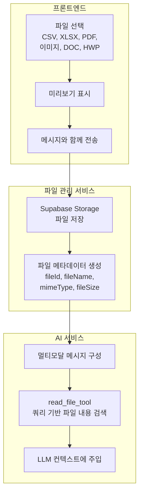
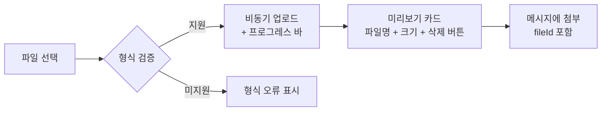
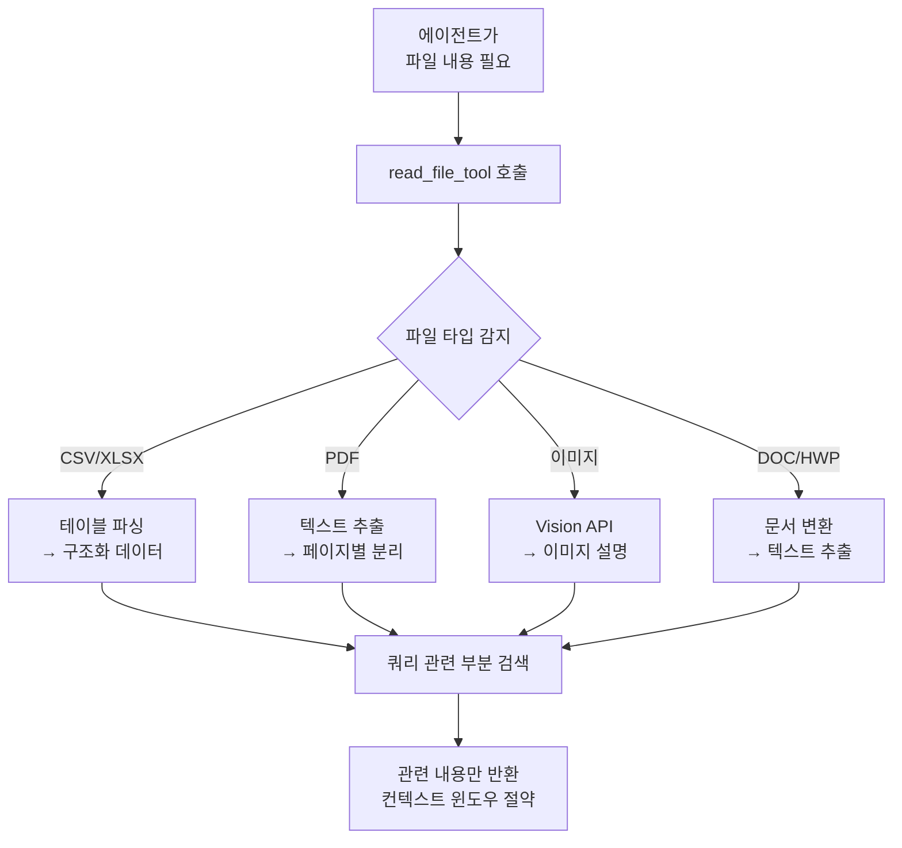
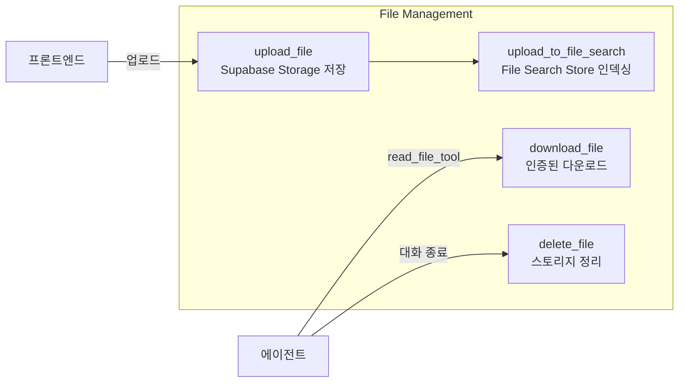
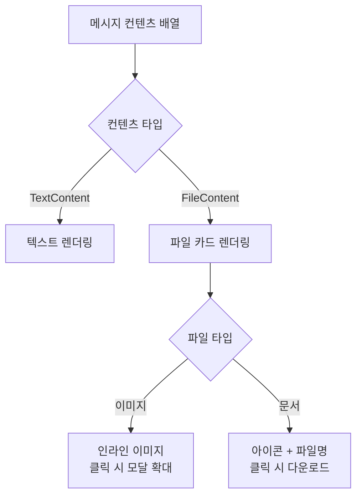
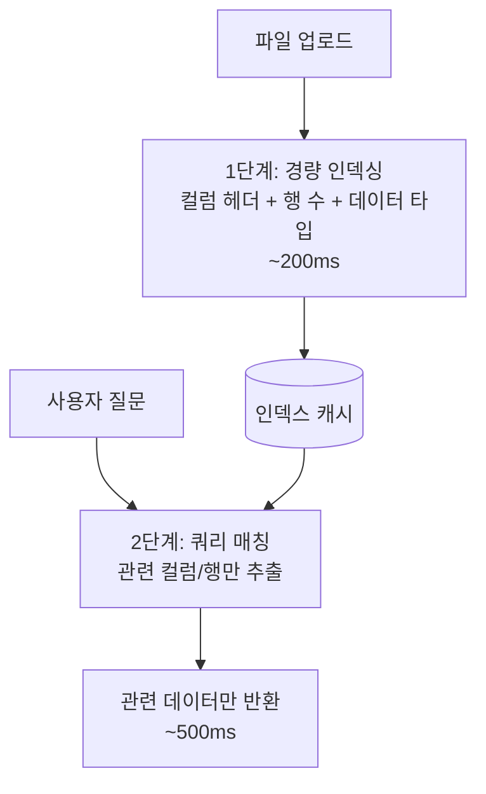

# 투자 분석 해줄려면 내가 정리해둔 엑셀 정도는 볼 줄 알아야지!

"이 엑셀 데이터 분석해줘." 투자자라면 당연히 기대하는 기능입니다. 하지만 LLM은 파일 바이너리를 직접 읽지 못합니다. 1000행 CSV를 통째로 컨텍스트에 넣으면 25k 토큰이 날아가고요. 필요한 부분만 쿼리 기반으로 추출해서 토큰 92%를 절감하면서도 분석 정확도를 유지한 멀티모달 파이프라인 구현 과정을 정리합니다.

## 문제 정의

텍스트만으로 투자 분석을 요청하는 것은 한계가 있습니다. "이 엑셀 데이터를 분석해줘", "이 차트 이미지를 보고 패턴을 설명해줘", "이 PDF 리포트를 요약해줘" 같은 멀티모달 요청을 처리해야 합니다.

핵심 과제는 **다양한 파일 형식을 LLM이 이해할 수 있는 형태로 변환**하는 것입니다. LLM은 직접 파일 바이너리를 읽지 못하므로, 파일 내용을 추출·가공해서 컨텍스트에 주입해야 합니다.

## 기술 선택 근거

| 기술 | 선택 이유 | 대안 |
|---|---|---|
| Supabase Storage | S3 호환 API + RLS 접근 제어, 프로젝트 내 Supabase 이미 사용 중이라 인프라 추가 비용 없음 | AWS S3 (별도 인프라 관리 필요), Cloudflare R2 (RLS 미지원) |
| Lazy Loading (read_file_tool) | 파일 전체를 메시지에 포함하면 100KB CSV → ~25k 토큰. 쿼리 기반 추출 시 ~2k 토큰 (92% 절감) | 전체 파일 임베딩 (토큰 비용 폭발), 사전 요약 (정보 손실) |
| Vision API | 이미지 파일은 텍스트 추출 불가 → LLM의 vision capability로 차트 패턴 인식 | OCR (차트 패턴 인식 불가) |

핵심 설계 원칙은 **필요한 것만, 필요할 때** 가져오는 것입니다. 사용자가 1000행 CSV를 첨부해도, "영업이익 추이를 분석해줘"라는 질문에는 영업이익 관련 행만 추출하면 됩니다. 이 쿼리 기반 추출로 토큰 사용량을 92% 절감하면서도 분석 정확도를 유지합니다.

## 전체 파이프라인



## 프론트엔드: 파일 업로드 UX

Composer 컴포넌트에서 파일 첨부를 처리합니다. 지원 형식별로 아이콘과 미리보기를 다르게 표시합니다.

```typescript
// 지원 파일 형식
const SUPPORTED_FORMATS = [
  'text/csv',
  'application/vnd.openxmlformats-officedocument.spreadsheetml.sheet', // XLSX
  'application/pdf',
  'image/png', 'image/jpeg', 'image/webp',
  'application/msword',
  'application/haansofthwp',  // HWP
];

interface PreviewFile {
  file: File;
  preview: string;    // 이미지 미리보기 URL
  uploading: boolean;
  fileId?: string;     // 업로드 완료 후 서버 ID
}
```



이미지 파일은 `URL.createObjectURL()`로 인라인 미리보기를 표시하고, 문서 파일은 아이콘 + 파일명으로 표시합니다. 업로드 중에는 프로그레스 인디케이터를 보여줘 사용자가 대기 상태를 인지할 수 있게 합니다.

## AI 서비스: 파일 → 컨텍스트 변환

### 메시지 구성

파일이 첨부된 메시지는 텍스트와 파일 참조를 함께 담는 멀티 컨텐츠 구조로 변환됩니다.

```python
def build_human_messages_with_files(query: str, files: list) -> list:
    """멀티모달 메시지 구성"""
    human_content = [
        {"type": "text", "text": query},
    ]

    if files:
        file_refs = convert_files(files)
        human_content.append({
            "type": "text",
            "text": json.dumps(file_refs)  # 파일 메타데이터 JSON
        })

    return human_content
```

중요한 설계 결정: 파일 바이너리를 메시지에 직접 포함하지 않습니다. 대신 파일 메타데이터(fileId, fileName, mimeType)만 전달하고, AI가 필요할 때 `read_file_tool`로 내용을 가져옵니다.

### read_file_tool — 쿼리 기반 파일 읽기



`read_file_tool`의 핵심은 **파일 전체를 LLM 컨텍스트에 넣지 않는다**는 점입니다. 쿼리를 받아 파일 내용 중 관련된 부분만 추출해 반환합니다. 재무제표 CSV에서 "영업이익" 관련 행만 가져오는 식으로, 컨텍스트 윈도우를 효율적으로 사용합니다.

### MIME 타입 기반 처리 분기

```python
def get_mime_type_by_filename(file_name: str) -> str:
    """파일 확장자로 MIME 타입 추론"""
    mime_type, _ = mimetypes.guess_type(file_name)
    return mime_type or "application/octet-stream"
```

파일 업로드 시 클라이언트가 제공하는 MIME 타입을 신뢰하지 않고, 서버에서 파일명 기반으로 재검증합니다. 이는 보안과 정확성을 위한 조치입니다.

## 파일 관리 서비스



파일은 Supabase Storage에 저장되고, File Search Store에도 인덱싱됩니다. 에이전트가 `read_file_tool`을 호출하면 인증 헤더와 함께 파일을 다운로드하고, 내용을 추출합니다.

## 보안 고려사항

파일 업로드는 공격 벡터가 넓은 기능이므로 다층 보안을 적용했습니다.

| 레이어 | 방어 | 이유 |
|---|---|---|
| 클라이언트 | 파일 형식 화이트리스트 (8종) | 실행 파일(.exe, .sh) 업로드 차단 |
| 서버 | MIME 타입 이중 검증 | 클라이언트 제공 MIME을 신뢰하지 않고 서버에서 재검증 |
| 스토리지 | Supabase RLS 정책 | 자신의 파일만 접근 가능, 타 사용자 파일 접근 차단 |
| 크기 제한 | 10MB 업로드 제한 | 서버 리소스 보호, DoS 방지 |
| 수명 관리 | 대화 종료 시 임시 파일 자동 삭제 | 스토리지 비용 절감 + 개인정보 보호 |

특히 **MIME 타입 이중 검증**이 중요합니다. 클라이언트에서 `Content-Type: image/png`로 보내도, 서버에서 파일명 확장자 기반으로 재검증합니다. `.exe` 파일을 `.png`로 위장해 업로드하는 공격을 방지합니다.

## 프론트엔드 파일 메시지 렌더링

채팅 내에서 파일 첨부를 표시할 때, 텍스트 메시지와 파일 카드를 분리해 렌더링합니다.



이미지 파일은 인라인으로 표시하고 클릭하면 모달에서 확대됩니다. 문서 파일은 파일 아이콘 + 이름 + 크기를 카드 형태로 보여주고, 클릭하면 인증 헤더가 포함된 다운로드 요청을 보냅니다.

## 트러블슈팅: 대용량 파일 처리

### 문제

사용자가 5MB XLSX (10,000행 재무 데이터)를 업로드했을 때, `read_file_tool`이 전체 파일을 파싱하는 데 15초가 걸렸습니다. AI 응답까지 합치면 사용자가 20초 이상 대기해야 했습니다.

### 시도한 접근들

1. **행 제한 (상위 100행)** (기각): 사용자가 "2023년 하반기 데이터 분석해줘"라고 하면 해당 데이터가 잘려서 대응 불가
2. **전체 파일 사전 파싱 + 캐싱** (부분 채택): 업로드 시 미리 파싱해두면 후속 질문은 빠르지만, 첫 파싱은 여전히 느림

### 최종 해결: 2단계 파싱



1단계에서 컬럼 헤더와 데이터 타입만 빠르게 인덱싱(200ms)하고, 2단계에서 사용자 쿼리에 관련된 컬럼/행만 추출(500ms)합니다.

| 지표 | Before | After |
|---|---|---|
| 첫 응답 시간 | 15초 | 2초 |
| 후속 질문 응답 | 15초 (매번 재파싱) | 0.5초 (캐시 활용) |
| 토큰 사용량 | ~25k (전체) | ~2k (관련 부분만) |

## 핵심 인사이트

- **Lazy Loading = 92% 토큰 절감**: 파일 전체를 메시지에 넣지 않고, 에이전트가 필요할 때 쿼리 기반으로 관련 부분만 추출. 100KB CSV 기준 25k → 2k 토큰
- **2단계 파싱으로 응답 시간 87% 단축**: 업로드 시 경량 인덱싱(200ms) → 쿼리 시 관련 데이터만 추출(500ms). 전체 파싱(15초) 대비 극적 개선
- **보안은 다층으로**: 클라이언트 화이트리스트 → 서버 MIME 재검증 → 스토리지 RLS → 크기 제한. 단일 레이어 의존은 위험
- **프리뷰 UX의 가치**: 업로드 → 미리보기 → 전송의 3단계를 분리하면 사용자가 잘못된 파일을 보내는 실수를 방지. 작은 UX 개선이 AI 분석 품질을 좌우
- **지원 형식 8종의 근거**: CSV/XLSX(재무 데이터), PDF(리포트), 이미지(차트 스크린샷), DOC/HWP(한국 기업 문서) — 금융 분석에 실제로 필요한 형식만 선별
