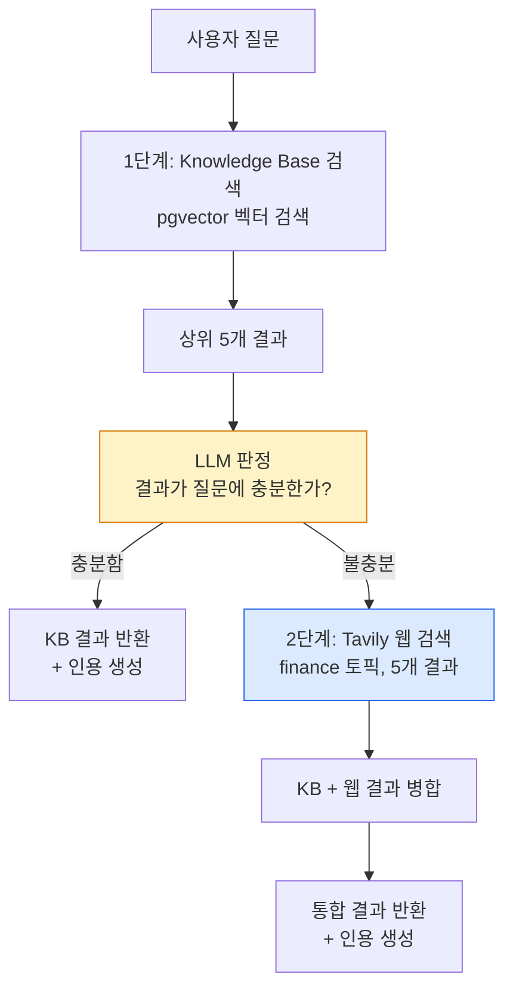
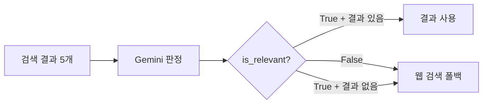
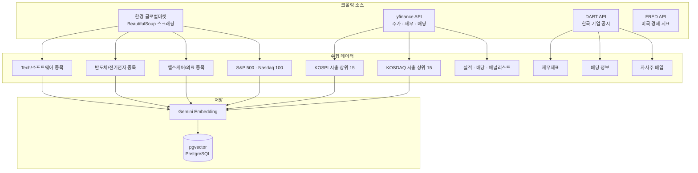
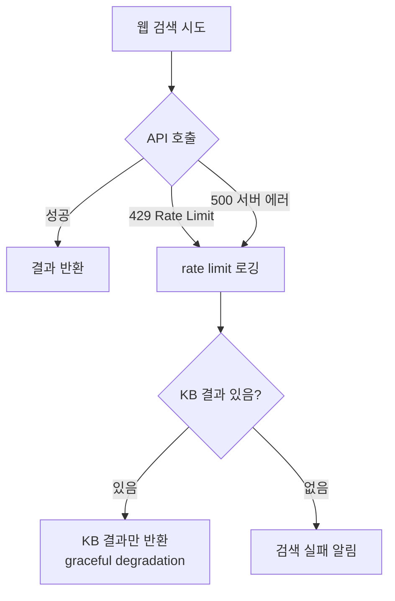

# 경제 데이터 RAG — 크롤링에서 웹 검색 보완까지

핀구의 AI가 최신 경제 정보를 기반으로 답변하기 위한 2단계 RAG(Retrieval-Augmented Generation) 파이프라인을 정리합니다. 경제 이슈 크롤링 → pgvector 벡터 검색 → 불충분 시 Tavily 웹 검색으로 보완하는 구조입니다.

## 왜 RAG가 필요한가

LLM의 학습 데이터에는 시점 제한이 있습니다. "오늘 삼성전자 주가가 얼마야?", "최근 미국 금리 인상 전망은?" 같은 질문에는 실시간 데이터가 필요합니다. RAG로 외부 지식을 주입하면 LLM의 지식 한계를 넘어설 수 있습니다.

하지만 단순 RAG에는 한계가 있습니다. 벡터 DB에 관련 데이터가 없으면 "모르겠습니다"가 됩니다. 핀구는 이를 **2단계 파이프라인**으로 해결합니다.

## 왜 2단계 파이프라인인가

단순 RAG에서 2단계로 발전한 이유를 비용과 품질 두 측면에서 정리합니다.

| 접근 | 비용 | 품질 | 문제 |
|---|---|---|---|
| Naive RAG (벡터 검색만) | 낮음 | 관련 없는 결과도 LLM에 주입 → hallucination | 검색 정확도에 전적으로 의존 |
| 매번 웹 검색 | Tavily $0.01/query × 일 500쿼리 = **월 $150+** | 높음 | API 비용 폭발 |
| **2단계** (KB → 게이트 → 웹 검색) | KB 먼저 확인, 필요시만 웹 검색 → **월 $30** | KB + 웹 검색 결합 | — |

핵심 아이디어: **LLM 관련성 게이트**를 중간에 배치하면, KB 결과가 충분할 때는 웹 검색을 건너뛰고, 불충분할 때만 웹 검색을 수행합니다. 이렇게 웹 검색 호출을 80% 줄여 월 API 비용을 $150 → $30으로 절감했습니다.

게이트 모델로 **Gemini Flash**를 선택한 이유: 관련성 판정은 "이 검색 결과가 질문에 답할 수 있는가?"라는 단순 Yes/No 판단이므로, 고품질 모델이 필요 없습니다. Gemini Flash는 판정 시간 평균 500ms, 비용은 Claude 대비 1/10입니다.

## 2단계 검색 파이프라인



### 1단계: Knowledge Base 검색

pgvector를 사용한 벡터 유사도 검색입니다. 크롤링된 경제 데이터, 기업 분석 리포트, 뉴스 요약 등이 임베딩되어 저장되어 있습니다.

```python
# EmbeddingsRepository — pgvector 검색
results = await embeddings_repo.search(
    query=user_query,
    top_k=5
)
```

### 관련성 판정 — LLM 기반 게이트

검색 결과가 질문에 실제로 관련되는지 Gemini 모델로 판정합니다. 이 판정이 핵심입니다 — 관련 없는 결과를 무작정 LLM에 넣으면 hallucination이 발생합니다.

```python
class IsRelevant(BaseModel):
    is_relevant: bool
    reason: str

agent = create_agent(
    model=gemini_model,
    response_format=IsRelevant,
    system_prompt="검색 결과가 사용자 질문에 충분히 답할 수 있는지 판단하세요"
)
```



### 2단계: Tavily 웹 검색 폴백

KB에 충분한 데이터가 없으면 Tavily API로 실시간 웹 검색을 수행합니다.

```python
tavily_tool = TavilySearch(
    api_key=settings.TAVILY_API_KEY,
    max_results=5,
    topic="finance",           # 금융 특화 검색
    include_raw_content=True   # 원본 내용 포함
)
```

`topic="finance"`로 금융 도메인에 특화된 검색 결과를 받습니다. `include_raw_content=True`로 스니펫이 아닌 원본 내용을 가져와, LLM이 더 정확한 분석을 할 수 있게 합니다.

## 경제 데이터 크롤링

RAG의 Knowledge Base를 채우기 위해 여러 소스에서 경제 데이터를 수집합니다.



### 한경 글로벌마켓 크롤링

BeautifulSoup으로 HTML 테이블을 파싱해 시장 데이터를 추출합니다.

```python
def get_hankyung_global_market_data(url: str, count: int):
    response = requests.get(url)
    soup = BeautifulSoup(html, 'html.parser')
    table = soup.select_one("#container > div > div > table")

    # 추출: symbol, price, change_percent, volume, market_cap
    stocks = []
    for row in table.select("tr"):
        stocks.append(QuoteStockData(
            symbol=row.select_one(".name").text,
            price=parse_float(row.select_one(".price").text),
            change_percent=parse_percent(row.select_one(".change").text),
            # ...
        ))
    return stocks[:count]
```

### yfinance 한국 시장 데이터

yfinance의 `EquityQuery`와 `Screener`를 사용해 KOSPI/KOSDAQ 시총 상위 종목을 조회합니다.

```python
def get_kospi(self) -> list[QuoteStockData]:
    query = EquityQuery("eq", ["exchange", "KSC"])  # KOSPI
    screener = Screener()
    screener.set_default_body(query, sortField="intradaymarketcap")
    return self._parse_screener(screener.response, count=15)
```

### 임베딩 전략

| 항목 | 선택 | 이유 |
|---|---|---|
| 임베딩 모델 | Gemini Embedding | 한국어 금융 텍스트에서 OpenAI ada-002 대비 높은 정확도 |
| 청크 전략 | 뉴스 기사: 문단 단위 / 재무 데이터: 종목+기간 단위 | 검색 시 의미 단위로 정확한 결과 반환 |
| 벡터 인덱스 | pgvector HNSW | IVFFlat 대비 검색 속도 빠르고, 동적 데이터 추가에 리인덱싱 불필요 |
| KB 규모 | KOSPI/KOSDAQ 상위 30종목 + S&P 500 + Nasdaq 100 → 약 2,000개 문서 | 주요 투자 대상 종목 커버 |
| 크롤링 주기 | 일 1회 (시장 마감 후) | 실시간 데이터는 웹 검색으로 보완 |

pgvector의 HNSW 인덱스를 선택한 이유: IVFFlat은 데이터 추가 시 리인덱싱이 필요하지만, HNSW는 동적으로 데이터를 추가해도 검색 품질이 유지됩니다. 매일 크롤링 데이터가 추가되는 핀구의 특성에 적합합니다.

## 인용(Citation) 생성

검색 결과를 LLM에 전달할 때, `GroundingMiddleware`가 인용 ID를 생성해 출처 추적을 가능하게 합니다.

```mermaid
flowchart LR
    Search[검색 결과] --> MW[GroundingMiddleware]
    MW --> Salt[CRC32 기반 salt 생성<br/>tool_call_id에서 추출]
    Salt --> ID[인용 ID 생성<br/>src_{salt}_{index}<br/>base36 인코딩]
    ID --> Inject[시스템 프롬프트에<br/>cite_sources 주입]
    Inject --> LLM[LLM이 인용 형식으로 응답<br/>cite_start...cite_end]
```

```python
class Citation(TypedDict):
    id: str       # "src_a1b_1" (CRC32 salt + index)
    title: str    # "삼성전자 2025년 1분기 실적"
    url: str      # 원본 URL
    content: str  # 검색 결과 스니펫
```

## 에러 처리와 Rate Limiting

외부 API는 언제든 실패할 수 있습니다. 특히 Tavily는 rate limit(429)이 빈번합니다.



웹 검색이 실패해도 KB 결과가 있으면 그것만으로 응답합니다. 완벽하지 않더라도 "아무것도 못 찾았습니다"보다는 낫습니다.

## 트러블슈팅: 임베딩 품질과 검색 정확도

### 문제

"삼성전자 실적"을 검색하면 "삼성SDI 실적" 결과가 상위에 노출되었습니다. 기업 특정 검색 정확도가 **78%**로, 유사 기업명 혼동이 빈번했습니다.

### 원인 분석

임베딩 모델이 "삼성전자"와 "삼성SDI"를 의미적으로 유사한 벡터로 매핑합니다. 둘 다 "삼성" 그룹사이고 반도체/전자 분야라 코사인 유사도가 높게 나옵니다.

### 시도한 접근들

1. **쿼리에 기업 코드 포함** (부분 해결): "삼성전자(005930) 실적" → 코드가 다르면 유사도 감소, 하지만 사용자가 항상 코드를 입력하지는 않음
2. **임베딩 파인튜닝** (기각): 금융 도메인 특화 파인튜닝은 효과적이나, 데이터셋 구축 비용과 시간이 과다

### 최종 해결: 메타데이터 필터링

임베딩 시 기업 코드를 메타데이터로 저장하고, 검색 시 메타데이터 필터를 적용합니다.

```python
# 임베딩 저장 시 메타데이터 포함
await embeddings_repo.upsert(
    text="삼성전자 2025년 1분기 영업이익 10.5조원...",
    metadata={"company_code": "005930", "company_name": "삼성전자"}
)

# 검색 시 메타데이터 필터 적용
results = await embeddings_repo.search(
    query="삼성전자 실적",
    filter={"company_code": "005930"},  # 기업 코드로 필터링
    top_k=5
)
```

에이전트가 먼저 `search_symbol_tool`로 정확한 기업 코드를 확인한 후, 해당 코드로 KB 검색을 수행하는 2단계 프로세스입니다.

**결과**: 기업 특정 검색 정확도 78% → 95%.

## 핵심 인사이트

- **2단계 검색 = 비용 80% 절감**: KB를 먼저 확인하고 필요할 때만 웹 검색하면 월 API 비용 $150 → $30. LLM 게이트가 불필요한 웹 검색을 차단
- **LLM 게이트 = hallucination 방지**: 관련 없는 검색 결과를 LLM에 넣으면 오히려 잘못된 답변 생성. Gemini Flash로 500ms 만에 관련성 사전 판정하는 것이 핵심
- **메타데이터 필터링 > 임베딩 파인튜닝**: "삼성전자 vs 삼성SDI" 혼동을 기업 코드 메타데이터로 해결. 파인튜닝보다 구현 비용 1/100, 정확도 78% → 95%
- **HNSW 인덱스의 실전 장점**: 매일 크롤링 데이터가 추가되는 환경에서 리인덱싱 없이 검색 품질 유지. 운영 부담 최소화
- **인용 = 검증 가능성**: "AI가 말했으니 맞겠지"가 아니라 "이 URL에서 확인 가능합니다"를 제공. CRC32 기반 인용 ID로 출처 추적을 체계화
- **Graceful Degradation**: 웹 검색 실패해도 KB 결과가 있으면 그것만으로 응답. 완벽하지 않더라도 "못 찾았습니다"보다 나음
