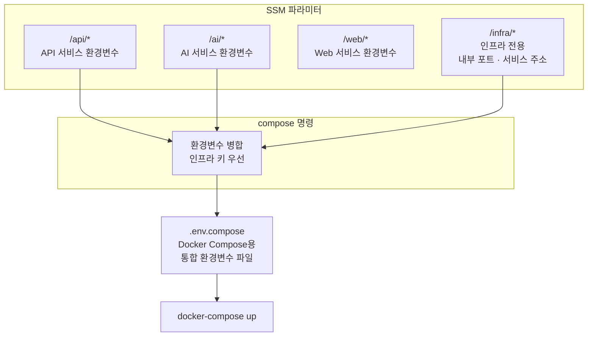
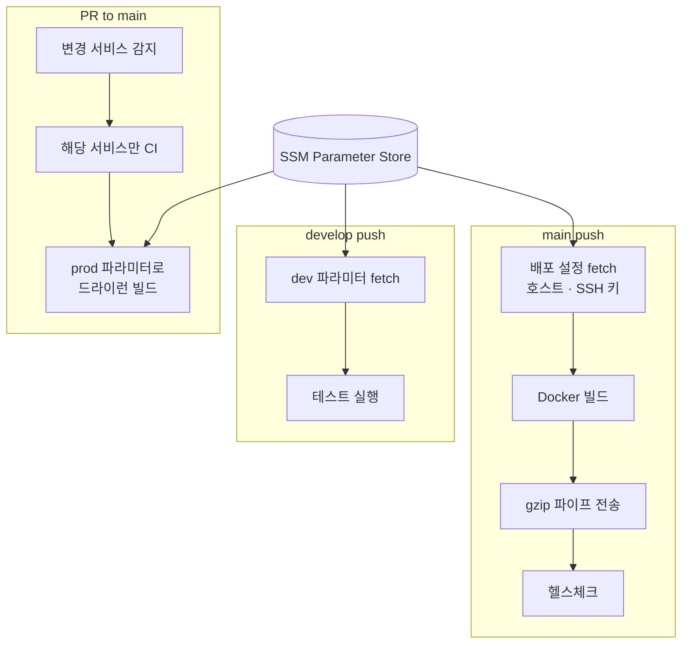

# 환경변수 어디에 정의돼 있지?

모노레포에 서비스 3개, 환경변수 50개. `.env` 파일로 관리하다 보면 이 질문에 답할 수 없게 된다. 실제로 환경변수 동기화가 안 맞아 배포 후 서비스가 뻗는 사고를 겪었다. AWS SSM Parameter Store를 Single Source of Truth로 삼고, CLI 도구를 만들고, CI/CD에 통합해서 "환경변수 때문에 터지는" 사고를 없앤 과정을 정리한다.

## .env 파일의 한계

GitHub Secrets에 넣으면 서비스 간 키 이름이 충돌하고, `.env` 파일을 공유하면 시크릿이 유출 위험이 있고, 서비스별로 따로 관리하면 동기화가 깨진다. 환경변수가 분산되면 **"이 키 어디에 있지?"에 답할 수 없다.** 그게 관리 체계가 잘못된 거다.

SSM Parameter Store를 선택한 이유는 단순하다. **무료이면서 충분한 기능.** Standard 티어(무료)로 모든 파라미터를 관리한다. KMS 암호화, IAM 접근 제어, CLI 조회 — 소규모 팀에 필요한 건 다 있다.

## 경로 하나로 환경을 격리한다

`/프로젝트/환경/서비스/키` 형태의 경로 규칙을 정했다. 같은 키 이름이라도 서비스별로 다른 값을 가질 수 있고, 환경(prod/dev)도 경로로 분리된다. "이 환경변수 어디에 있지?"에 대한 답은 항상 "SSM"이다.

로컬 개발에서는 하나의 `.env` 파일 안에 **블록 방식**으로 dev와 prod를 함께 관리한다. `## [dev]` 블록과 `## [prod]` 블록이 한 파일에 있고, 명령어 하나로 활성 환경을 전환한다. 파일을 두 개 관리하는 것보다 한 파일에서 블록을 나누는 게 실수가 적었다. dev 환경에서 작업하다가 prod 환경변수를 실수로 쓰는 사고를 이 구조가 방지한다.

## CLI 도구를 직접 만들었다

매번 AWS 콘솔에 들어가서 파라미터를 하나씩 수정하는 건 현실적이지 않다. SSM과 양방향으로 동기화하는 **TypeScript CLI 도구**를 만들었다.

`pull`은 SSM에서 로컬로 가져오고, `push`는 로컬에서 SSM으로 올린다. `switch`는 활성 환경을 전환하고, `status`는 로컬과 SSM의 차이를 보여주고, `doctor`는 설정 상태를 진단한다. `compose`는 모든 서비스의 환경변수를 모아 Docker Compose용 파일을 생성한다.

AWS API는 rate limit이 있다. 파라미터가 많으면 요청이 몰려서 스로틀링에 걸린다. CLI에 지수 백오프(exponential backoff) 재시도를 넣어서, 스로틀링이 걸리면 대기 시간을 점점 늘리며 재시도한다.

## 3개의 환경변수를 1개로 합친다

서비스 3개가 각각 환경변수를 가지고 있다. 로컬 개발에서는 서비스별 `.env` 파일을 따로 쓰면 되지만, Docker Compose로 묶어서 올릴 때는 이야기가 달라진다.

같은 키가 서비스마다 다른 값을 가질 수 있다. 예를 들어 API 서비스에서 `REDIS_URL=localhost:6379`인데, Docker Compose 안에서는 `REDIS_URL=redis:6379`가 되어야 한다. 로컬에서는 `localhost`로 접근하지만, 컨테이너 네트워크에서는 서비스 이름으로 접근하기 때문이다.

이 문제를 해결하기 위해 **인프라 전용 환경변수**를 별도로 관리한다. Docker Compose 환경에서만 필요한 내부 포트, 서비스 이름 기반 주소, 컨테이너 간 통신 설정을 인프라 파라미터로 분리했다.

CLI의 `compose` 명령이 이 병합을 수행한다. 인프라 키를 먼저 수집하고, 각 서비스 키 중 인프라에 없는 것만 추가한다. **인프라 설정이 항상 우선**한다. 서비스에서 `REDIS_URL=localhost:6379`로 정의되어 있어도, 인프라에 `REDIS_URL=redis:6379`가 있으면 인프라 값이 쓰인다. 이렇게 하면 로컬 개발용 `.env`를 건드리지 않고도 Docker Compose 환경에 맞는 설정이 자동으로 생성된다.

## CI/CD에 통합한다

환경변수 관리가 배포 파이프라인과 분리되어 있으면 결국 동기화가 깨진다. SSM을 CI/CD의 핵심 축으로 만들었다.

**개발 브랜치**에 푸시하면 SSM에서 dev 파라미터를 가져와 테스트를 돌린다. Turbo Remote Cache 토큰도 SSM에서 가져오기 때문에, 모노레포의 빌드 캐시가 CI에서도 동작한다.

**PR이 올라오면** 변경된 서비스만 테스트한다. API만 수정했는데 프론트엔드까지 테스트하면 시간 낭비다. 변경 경로를 감지해서 필요한 서비스만 CI를 돌린다. main 브랜치로의 PR에는 한 단계가 더 있다 — **배포 전 드라이런.** prod SSM 파라미터를 가져와서 Docker 이미지를 실제로 빌드하고, 프론트엔드도 빌드한다. 머지한 뒤에 "환경변수가 없어서 빌드 실패"하는 상황을 머지 전에 잡는다.

**main에 머지되면** 프로덕션 배포가 시작된다. SSM에서 배포 설정(호스트, SSH 키, 포트)을 가져오고, Docker 이미지를 빌드하고, 서버에 전송하고, 헬스체크를 돌린다.

## Docker 이미지는 gzip 파이프로 보낸다

Docker Registry(ECR)를 사용하지 않는다. 빌드한 이미지를 gzip으로 압축해서 SSH로 직접 전송한다.

| 방식 | 월 비용 | 멀티 노드 |
|---|---|---|
| ECR + docker pull | $10-30 | 가능 |
| gzip 파이프 | **$0** | 불가 |

현재 단일 인스턴스에 배포하므로 gzip 파이프로 충분하다. 이미지 크기도 gzip 압축으로 평균 70% 줄어 전송 시간이 약 1분이다. **인프라는 필요할 때 확장하는 것**이 소규모 팀에 맞다.

SSH 키는 SSM에 한 줄 형태로 저장해두고, 배포 시 원래 PEM 형태로 복원한다. 장기 크레덴셜을 파일로 보관하지 않는다.

## 장기 크레덴셜을 쓰지 않는다

GitHub Actions에서 AWS에 접근할 때 Access Key를 저장하지 않는다. OIDC(OpenID Connect) 토큰으로 임시 크레덴셜을 발급받는다. 임시 토큰은 15분 후 만료되므로, 유출되어도 피해 범위가 제한된다. 장기 크레덴셜은 최악의 경우 무제한 노출이다. **보안 사고의 blast radius를 최소화**하는 것이 핵심이다.

배포 로그에서도 민감한 값(호스트 주소, SSH 키, 토큰)은 마스킹 처리한다. CI 로그를 누군가 보더라도 크레덴셜이 노출되지 않는다.

## 돌이켜보면

환경변수 관리의 핵심은 **"여기만 보면 됨"**이었다. SSM 하나를 진실의 원천으로 삼고, CLI 도구로 양방향 동기화하고, CI/CD가 매 배포마다 SSM에서 가져가는 구조. 로컬 개발, 테스트, 드라이런, 프로덕션 배포까지 — 모든 단계에서 SSM이 환경변수의 출발점이다. "이 키 어디에 있지?"라는 질문이 사라진 것이 가장 큰 성과다.
