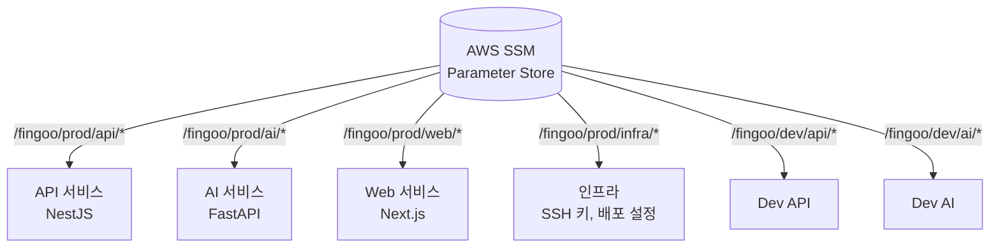
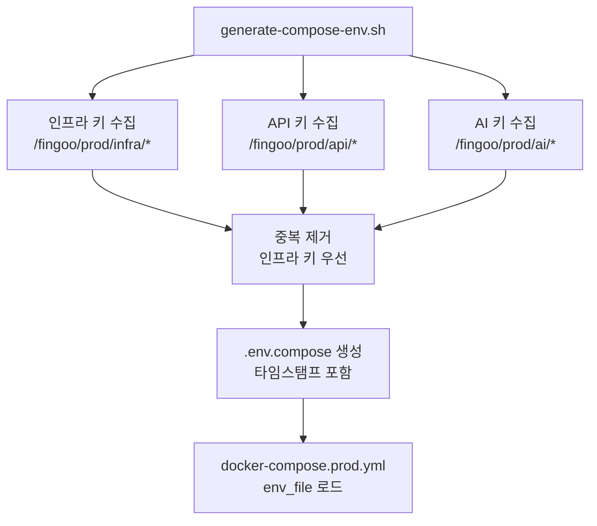
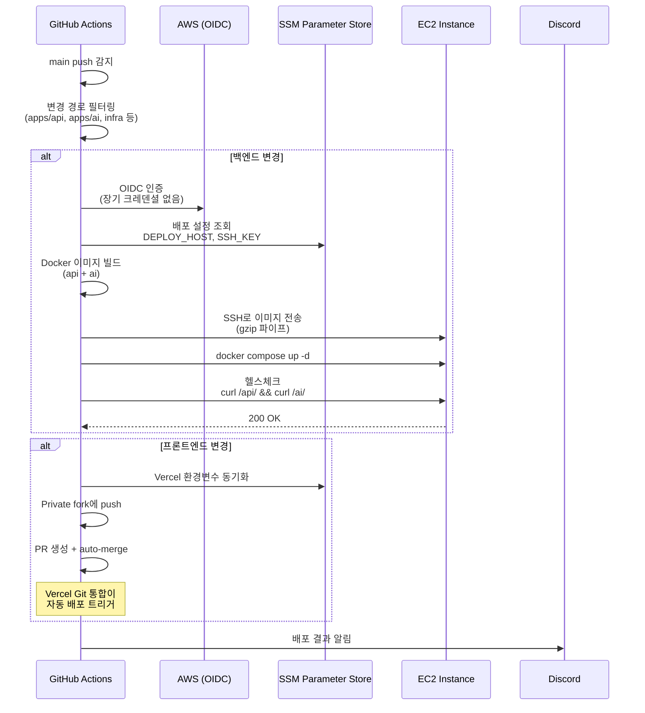
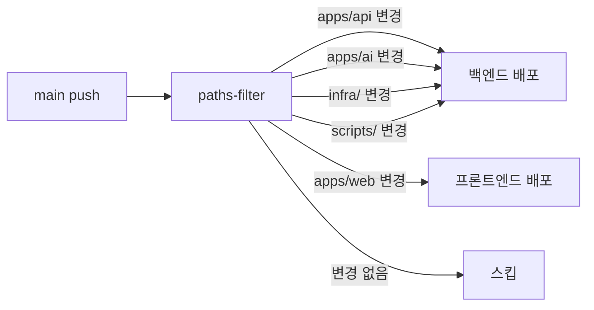
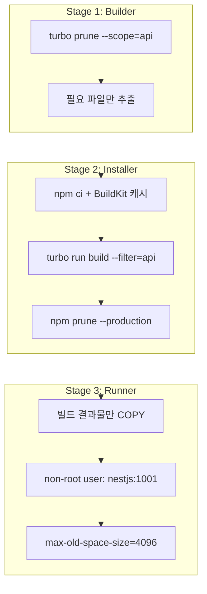
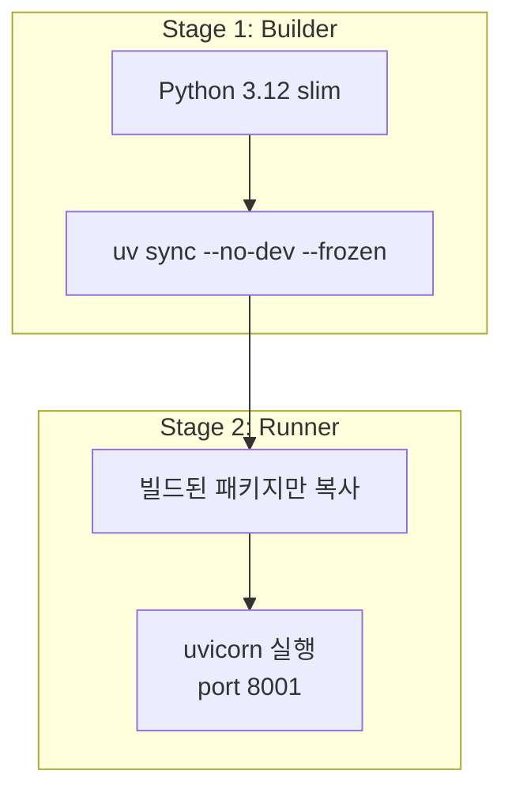
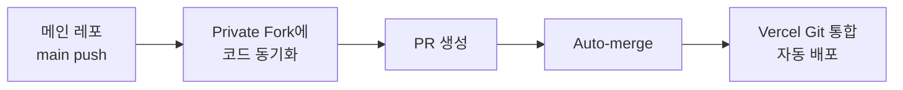
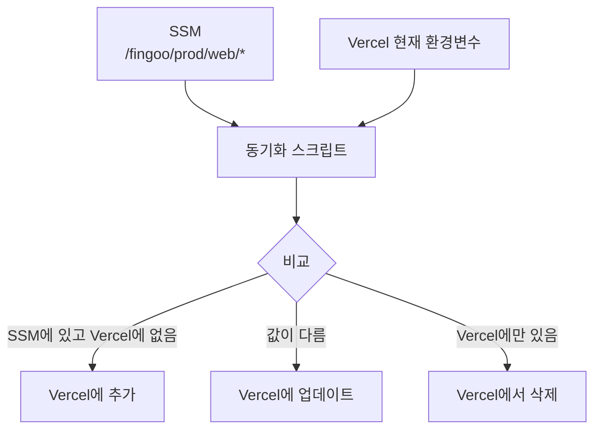

# AWS Parameter Store 기반 환경변수 관리와 배포 파이프라인

핀구의 모노레포 3개 서비스(Next.js, NestJS, FastAPI)에 걸친 환경변수를 AWS SSM Parameter Store로 중앙 관리하고, CI/CD 파이프라인에 통합한 전략을 정리합니다.

## 문제 정의

모노레포에 3개 서비스가 있으면 환경변수 관리가 복잡해집니다. GitHub Secrets에 넣으면 키 이름이 충돌하고, `.env` 파일을 공유하면 시크릿이 유출 위험이 있고, 서비스별로 따로 관리하면 동기화가 깨집니다. "이 API 키가 어디에 정의되어 있지?"라는 질문에 즉답할 수 없다면 관리 체계가 잘못된 것입니다.

## SSM을 Single Source of Truth로



### 파라미터 경로 규칙

```
/fingoo/{env}/{service}/{KEY}

예시:
/fingoo/prod/api/DATABASE_URL
/fingoo/prod/ai/ANTHROPIC_API_KEY
/fingoo/prod/infra/DEPLOY_HOST
/fingoo/dev/api/DATABASE_URL
```

`env`(prod/dev)와 `service`(api/ai/web/infra)로 네임스페이스를 분리합니다. 같은 키 이름이라도 서비스별로 다른 값을 가질 수 있습니다.

### fetch-params.sh — SSM에서 환경변수 추출

```bash
#!/bin/bash
PREFIX="/fingoo/${ENV}/${SERVICE}/"

aws ssm get-parameters-by-path \
  --path "$PREFIX" \
  --with-decryption \
  --recursive \
  --region "ap-northeast-2" \
  --query 'Parameters[*].[Name,Value]' \
  --output text |
while IFS=$'\t' read -r name value; do
  key="${name#$PREFIX}"
  echo "${key}=${value}"
done
```

`--with-decryption`으로 SecureString 타입 파라미터도 복호화해서 가져옵니다. DB 비밀번호, API 키 같은 민감 정보는 SecureString으로 저장되어 암호화 상태로 보관됩니다.

### generate-compose-env.sh — Docker Compose 환경변수 생성



인프라 키를 먼저 수집하고, 각 서비스 키 중 인프라에 없는 것만 추가합니다. 이렇게 하면 공통 키(예: `REDIS_URL`)가 중복 정의되지 않습니다.

## CI/CD 파이프라인 통합

### 프로덕션 배포 (main → EC2)



### 핵심 보안: AWS OIDC 인증

GitHub Actions에서 AWS에 접근할 때 장기 Access Key를 사용하지 않습니다. OIDC(OpenID Connect) 토큰으로 임시 크레덴셜을 발급받아 사용합니다.

```yaml
- uses: aws-actions/configure-aws-credentials@v4
  with:
    role-to-assume: arn:aws:iam::role/github-actions-role
    aws-region: ap-northeast-2
```

이 방식의 장점:
- GitHub Secrets에 AWS 키를 저장할 필요 없음
- 임시 토큰이므로 유출되어도 만료 후 무효화
- IAM Role로 최소 권한 원칙 적용

### 변경 감지 기반 조건부 배포



API만 수정했는데 프론트엔드까지 재배포하면 시간과 비용이 낭비됩니다. `dorny/paths-filter`로 변경된 경로를 감지해 필요한 서비스만 배포합니다.

## Docker 멀티스테이지 빌드

### API (NestJS) Dockerfile



### AI (FastAPI) Dockerfile



Python 서비스는 `uv`를 패키지 매니저로 사용합니다. `--frozen`으로 lockfile을 엄격히 따르고, `--no-dev`로 개발 의존성을 제외합니다.

### 프론트엔드: Private Fork 배포 패턴

Vercel 배포를 위해 Private Fork를 활용하는 독특한 패턴입니다.



왜 직접 Vercel API를 호출하지 않는가? Vercel의 Git 통합 기능(Preview Deploy, 브랜치별 환경변수 등)을 그대로 활용하면서, 배포 트리거를 CI/CD에서 제어하기 위함입니다.

## Vercel 환경변수 SSM 동기화

Vercel의 환경변수도 SSM에서 관리합니다. CI/CD에서 SSM의 web 파라미터를 Vercel에 동기화하고, SSM에 없는 Vercel 변수는 자동 삭제합니다.



이렇게 하면 SSM이 유일한 진실의 원천(Single Source of Truth)이 됩니다. "이 환경변수 어디에 있지?"에 대한 답은 항상 "SSM"입니다.

## 핵심 인사이트

- **SSM 중앙화**: 환경변수가 GitHub Secrets, Vercel, EC2 `.env` 등에 분산되면 관리 불가능. SSM을 유일한 출처로 삼으면 "여기만 보면 됨"
- **OIDC > Access Key**: 장기 크레덴셜은 유출 위험. OIDC 임시 토큰은 만료 후 무효화되어 안전
- **변경 감지 = 비용 절감**: 모노레포에서 전체 빌드/배포는 낭비. paths-filter로 변경된 서비스만 처리
- **gzip 파이프 전송**: Docker Registry 없이도 `docker save | gzip | ssh` 파이프로 충분히 실용적인 배포 가능
- **Private Fork 패턴**: Vercel의 Git 통합과 CI/CD 제어를 양립시키는 실용적 방법
