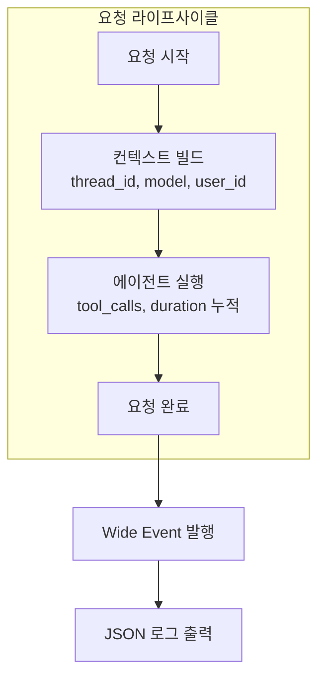
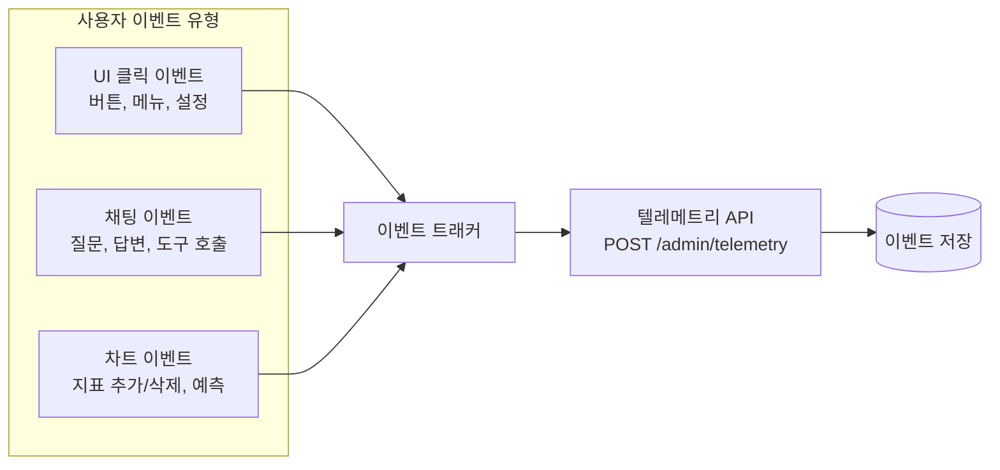
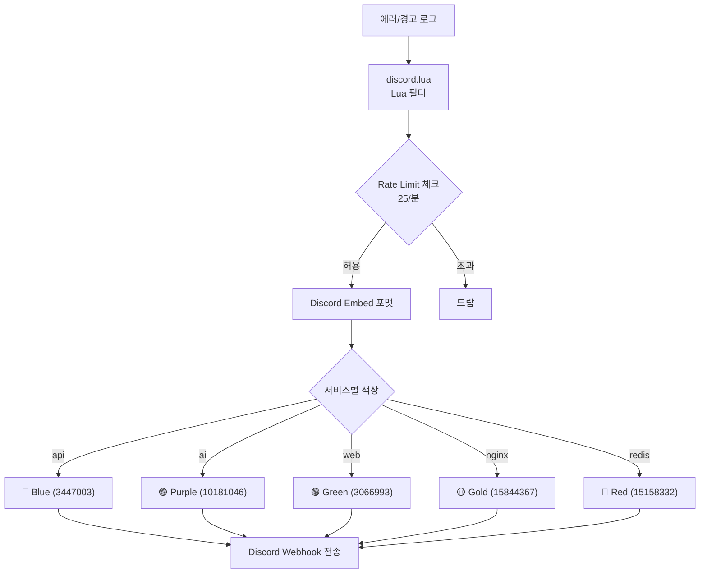

# Wide Event 로깅 전략과 FluentBit 기반 로그 파이프라인

[loggingsucks.com](https://loggingsucks.com/)의 Wide Event 철학을 핀구에 적용한 구조화 로깅 전략과, FluentBit으로 로그를 수집해 Discord 웹훅으로 주요 이벤트를 알림하는 파이프라인을 정리합니다.

## Wide Event란 무엇인가

전통적 로깅은 코드가 무엇을 하는지를 기록합니다.

```
[INFO] Starting request handler
[INFO] Fetching user from database
[INFO] User found: userId=123
[INFO] Processing payment
[ERROR] Payment failed: timeout
```

Wide Event는 **요청에 무슨 일이 일어났는지**를 하나의 포괄적 이벤트로 기록합니다.

```json
{
  "time": "2025-03-01T12:00:00.000+0900",
  "level": "error",
  "msg": "request completed",
  "service": "fingoo-api",
  "method": "POST",
  "path": "/api/chat",
  "status": 500,
  "duration_ms": 3200,
  "user_id": "usr_abc123",
  "subscription_tier": "premium",
  "model": "STANDARD",
  "agent_count": 3,
  "tools_called": ["calc_rsi", "search_tool"],
  "error": "Payment gateway timeout",
  "trace_id": "tr_xyz789"
}
```

핵심 차이점:

| 전통적 로깅 | Wide Event |
|---|---|
| 코드 실행 과정 기록 | 요청의 전체 맥락 기록 |
| 여러 줄의 산발적 로그 | **서비스 홉당 1개 이벤트** |
| 문자열 grep으로 검색 | 구조화 필드로 쿼리 |
| 디버깅 시 로그를 조합해야 함 | 하나의 이벤트에 모든 정보 |

## 전통 로깅의 한계 — 실제 사례

Wide Event 도입의 계기가 된 실제 문제입니다.

### 사례: "특정 사용자의 AI 응답이 느리다"

프로덕션에서 특정 premium 사용자가 "AI 응답이 10초 이상 걸린다"고 보고했습니다.

**전통 로깅으로 디버깅 (30분)**:
1. 사용자 ID로 API 서버 로그 grep → 요청 로그 발견
2. request_id 추출 → AI 서버 로그에서 같은 request_id grep
3. 여러 줄의 로그를 수동으로 조합 → "어떤 에이전트에서 얼마나 걸렸는지" 파악 불가
4. 결국 AI 서버에 직접 접속해 실시간 로그 확인

**Wide Event로 디버깅 (5분)**:
```json
{
  "user_id": "usr_abc123",
  "subscription_tier": "premium",
  "model": "STANDARD",
  "duration_ms": 12400,
  "agent_count": 5,
  "tools_called": ["calc_rsi", "search_tool", "get_financial_statements"],
  "slowest_agent": "research-agent",
  "slowest_agent_ms": 8200,
  "error": null
}
```

한 줄의 Wide Event에서 즉시 확인: research-agent가 8.2초 소요 → 해당 에이전트의 search_tool이 Tavily rate limit에 걸려 재시도 중이었음.

**디버깅 시간 30분 → 5분 (83% 단축)**. 이 경험이 Wide Event 전면 도입의 결정적 계기였습니다.

## 핀구의 Wide Event 구현

### AI 서비스 (Python) — 구조화 JSON 로깅



loguru를 사용해 구조화 JSON 로그를 출력합니다.

```python
def _json_sink(message):
    record = message.record
    log_entry = {
        "time": record["time"].isoformat(),
        "level": record["level"].name.lower(),
        "msg": record["message"],
        "service": "fingoo-ai",
        "caller": f"{record['module']}:{record['function']}:{record['line']}"
    }

    # bind()로 주입된 컨텍스트 필드를 플랫하게 펼침
    if record["extra"]:
        log_entry.update(record["extra"])

    # 예외 정보 포함
    if record["exception"]:
        log_entry["exception"] = {
            "type": record["exception"].type.__name__,
            "value": str(record["exception"].value),
            "traceback": format_traceback(record["exception"].tb)
        }

    sys.stdout.write(json.dumps(log_entry) + "\n")
```

`bind()`를 사용해 요청 처리 중 컨텍스트를 누적합니다.

```python
# 요청 시작 시 기본 컨텍스트 바인딩
logger = logger.bind(
    thread_id=thread_id,
    model=model_tier,
    request_id=request_id
)

# 에이전트 실행 후 결과 추가
logger = logger.bind(
    tools_called=tool_names,
    agent_count=len(subagents),
    duration_ms=elapsed
)

# 요청 완료 시 1개의 Wide Event
logger.info("request completed")
```

### 프론트엔드 — 사용자 행동 이벤트



프론트엔드에서도 Wide Event 원칙을 적용합니다. 각 이벤트에 풍부한 속성을 포함합니다.

```typescript
type UserEvent =
  | 'chat.question'           // 채팅 질문
  | 'chat.answer'             // AI 답변
  | 'chat.tool_request'       // 도구 호출 요청
  | 'chat.tool_response'      // 도구 호출 응답
  | 'click_button_forecast.*' // 예측 관련 버튼
  | 'click_button_share';     // 공유 버튼

// 이벤트별 속성
interface ChatQuestionEvent {
  chat_session_id: string;
  content: string;
}

interface ChatAnswerEvent {
  chat_session_id: string;
  content: string;
  loading_time: number;  // ms
}
```

## 로그 설계 원칙

### High Cardinality 필드 설계

Wide Event의 핵심은 **High Cardinality 필드** — 특정 요청을 유일하게 식별할 수 있는 필드입니다.

| 필드 | Cardinality | 용도 |
|---|---|---|
| trace_id | 요청마다 고유 | 서비스 간 요청 추적 |
| user_id | 사용자마다 고유 | 특정 사용자 문제 추적 |
| thread_id | 대화마다 고유 | 대화 맥락 추적 |
| request_id | 요청마다 고유 | API 레벨 추적 |

Low Cardinality 필드(level, service, model)로 **필터링**하고, High Cardinality 필드로 **특정 요청을 핀포인트**합니다.

### 로그 레벨 전략

| 레벨 | 사용 시점 | Discord 알림 |
|---|---|---|
| info | 요청 정상 완료 | X |
| warn | rate limit 접근, 느린 응답 (>5초) | O |
| error | 요청 실패, API 에러 | O |
| critical | 서비스 다운, DB 연결 실패 | O (즉시) |

warn 이상만 Discord로 전송하여 전체 로그의 약 5%만 알림으로 보냅니다. 나머지 95%는 stdout으로 출력되어 필요 시 조회합니다.

## FluentBit 로그 수집 파이프라인

Docker 컨테이너의 로그를 FluentBit으로 수집하고, 에러/경고를 Discord로 전달합니다.

```mermaid
flowchart TB
    subgraph "Docker 컨테이너"
        API[api 컨테이너<br/>JSON 로그]
        AI[ai 컨테이너<br/>JSON 로그]
        Nginx[nginx 컨테이너<br/>액세스 로그]
        Redis[redis 컨테이너]
    end

    subgraph "FluentBit"
        Input[INPUT: forward<br/>port 24224]
        ErrorFilter[FILTER: rewrite_tag<br/>error|exception|critical → error.*]
        WarnFilter[FILTER: rewrite_tag<br/>warn|warning → warn.*]
        LuaFilter[FILTER: lua<br/>Discord 포맷 변환]
    end

    subgraph "출력"
        Stdout[OUTPUT: stdout<br/>모든 로그]
        Discord[OUTPUT: http<br/>Discord Webhook<br/>error.* + warn.* 만]
    end

    API -->|fluentd driver| Input
    AI -->|fluentd driver| Input
    Nginx -->|fluentd driver| Input
    Redis -->|fluentd driver| Input

    Input --> ErrorFilter --> LuaFilter --> Discord
    Input --> WarnFilter --> LuaFilter
    Input --> Stdout
```

### FluentBit 설정

모든 컨테이너가 Docker의 fluentd 로깅 드라이버로 FluentBit에 로그를 전송합니다.

```
[INPUT]
  Name     forward
  Listen   0.0.0.0
  Port     24224

[FILTER]
  Name     rewrite_tag
  Match    docker.*
  Rule     $log "(?i)(error|exception|traceback|critical|fatal)" error.$TAG true

[FILTER]
  Name     rewrite_tag
  Match    docker.api|docker.ai
  Rule     $log "(?i)(warn|warning)" warn.$TAG true
```

`rewrite_tag` 필터로 에러 키워드가 포함된 로그에 `error.` 태그를 붙이고, 경고 키워드에는 `warn.` 태그를 붙입니다. 이 태그로 Discord 전송 대상을 필터링합니다.

## Discord 웹훅 알림



### Rate Limiting

Discord API는 30 req/min 제한이 있습니다. 에러가 폭주하면 웹훅이 차단될 수 있으므로, Lua 스크립트에서 자체 rate limiting을 구현합니다.

```lua
local RATE_LIMIT = 25         -- 마진 포함 (Discord 제한: 30)
local WINDOW_SECONDS = 60

-- 슬라이딩 윈도우 rate limiting
local function is_rate_limited()
    local now = os.time()
    -- WINDOW_SECONDS 이전 기록 제거
    -- 현재 윈도우 내 카운트가 RATE_LIMIT 이상이면 제한
end
```

### 서비스별 색상 코딩

Discord Embed에 서비스별 색상을 적용해 어떤 서비스에서 문제가 발생했는지 한눈에 파악할 수 있습니다.

```lua
local service_colors = {
    ["api"]   = 3447003,   -- Blue
    ["ai"]    = 10181046,  -- Purple
    ["web"]   = 3066993,   -- Green
    ["nginx"] = 15844367,  -- Gold
    ["redis"] = 15158332,  -- Red
}
```

### 로그 메시지 처리

```lua
function cb_discord(tag, timestamp, record)
    local service = extract_service(tag)  -- "error.docker.api" → "api"
    local severity = tag:match("^error") and "ERROR" or "WARN"
    local log_text = record["log"] or ""

    -- Discord embed 제한: 4096자, 3500에서 잘라서 안전 마진
    if #log_text > 3500 then
        log_text = log_text:sub(1, 3500) .. "\n... (truncated)"
    end

    -- Discord Embed 구성
    return 1, timestamp, {
        payload = json.encode({
            embeds = {{
                title = severity .. " - " .. service,
                description = "```\n" .. log_text .. "\n```",
                color = service_colors[service],
                timestamp = os.date("!%Y-%m-%dT%H:%M:%SZ", timestamp),
                footer = { text = "Fingoo Log Monitor" }
            }}
        })
    }
end
```

## 트러블슈팅: Discord 웹훅 Rate Limit 폭주

### 문제

AI 서비스 배포 직후, 초기화 과정에서 연쇄 에러가 발생했습니다. 분당 50개 이상의 에러 로그가 Discord 웹훅으로 전송되면서 Discord rate limit(30 req/min)을 초과. **이후 정작 중요한 에러 알림을 받지 못하는** 상황이 발생했습니다.

### 원인 분석

FluentBit의 `rewrite_tag` 필터가 모든 에러 로그를 Discord로 전송하도록 설정되어 있었고, rate limiting이 없었습니다. 배포 직후 초기화 에러가 폭주하면 Discord API가 429를 반환하고, 이후 중요 에러도 전송 실패합니다.

### 시도한 접근들

1. **단순 카운터** (부분 채택): 분당 30개 제한 → 중요한 에러(critical)가 덜 중요한 에러(warn)에 밀려 드랍될 수 있음
2. **에러 집계 후 배치 전송** (기각): 5분마다 에러 요약 전송 → 실시간성 상실

### 최종 해결: 슬라이딩 윈도우 + 우선순위

```lua
local RATE_LIMIT = 25  -- Discord 30/min에서 5개 마진
local WINDOW_SECONDS = 60

-- 심각도 우선순위: critical > error > warn
local function should_send(severity)
    local count = get_window_count()
    if severity == "critical" then return true end  -- critical은 항상 전송
    if count >= RATE_LIMIT then return false end
    return true
end
```

- 슬라이딩 윈도우로 분당 25개 제한 (Discord 30/min 대비 5개 마진)
- critical 레벨은 rate limit 무시하고 항상 전송
- 일반 error/warn은 rate limit 내에서만 전송

**결과**: 배포 직후 에러 폭주에도 critical 알림은 100% 수신, rate limit 내에서 가장 중요한 에러 우선 전달.

## 핵심 인사이트

- **디버깅 시간 83% 단축**: Wide Event 도입 전 30분 → 도입 후 5분. 요청당 평균 15-20개 필드로 한 줄에서 문제 원인 파악
- **서비스 홉당 1개 이벤트**: 10줄의 산발적 로그보다 50개 필드를 가진 1개의 Wide Event가 디버깅에 훨씬 효과적. 로그의 양이 아니라 **밀도**가 중요
- **High Cardinality 필드 = 핀포인트 디버깅**: user_id, trace_id, thread_id 같은 고유값 필드가 있어야 수만 건의 로그에서 특정 요청 하나를 정확히 추적 가능
- **Rate Limiting은 알림 시스템의 생명선**: 에러 폭주 시 Discord 웹훅이 차단되면 정작 중요한 알림을 못 받음. 슬라이딩 윈도우 + critical 우선순위로 보호
- **FluentBit의 경량성**: 30MB 메모리로 전체 컨테이너 로그 수집. 애플리케이션 코드 변경 없이 Docker 레벨에서 로그를 수집하는 것이 가장 침습성이 낮은 방법
- **색상 코딩 = 인지 부하 감소**: Discord Embed에 서비스별 색상을 적용하면, 알림을 읽지 않고도 어떤 서비스 문제인지 0.5초 만에 파악. 작은 디테일이 운영 효율을 결정
