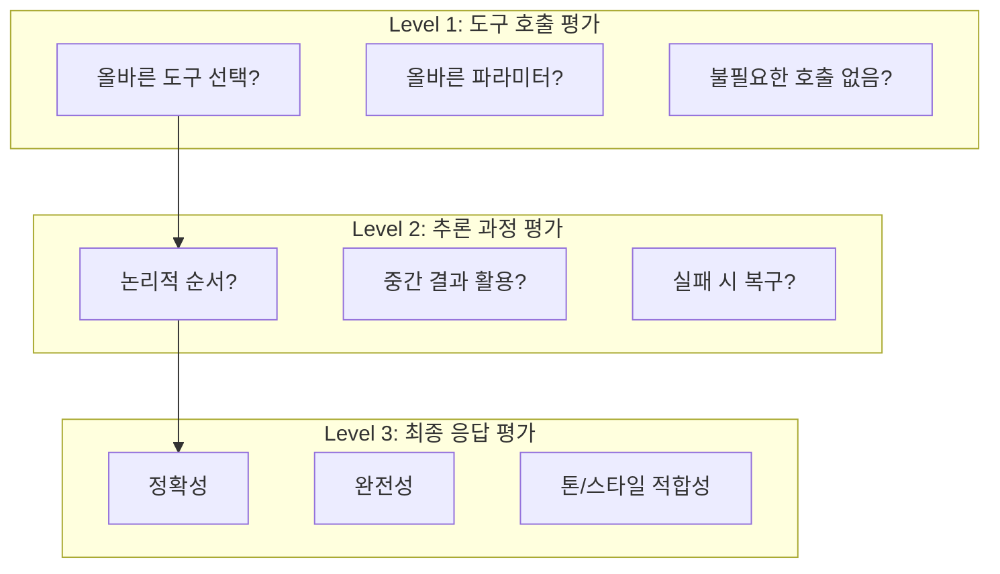
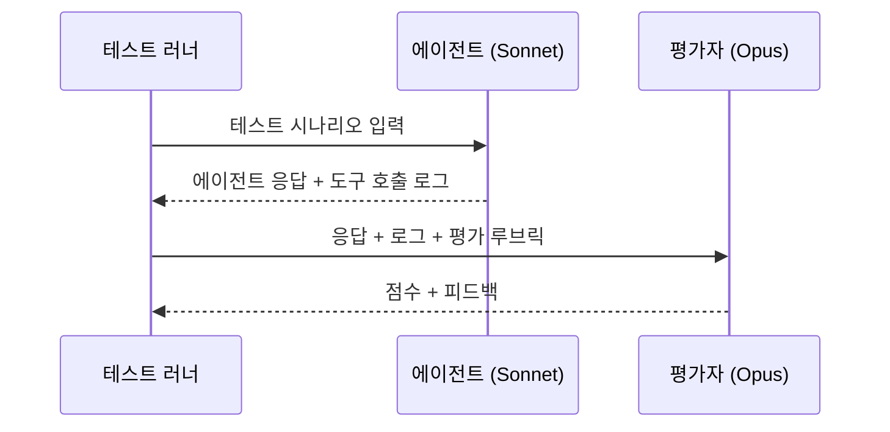
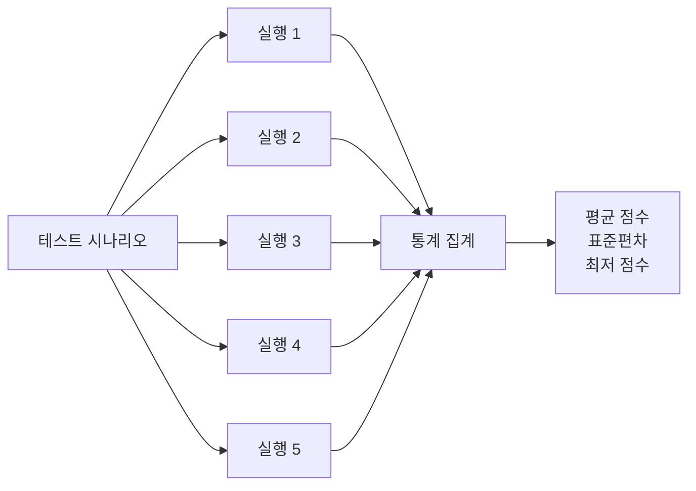
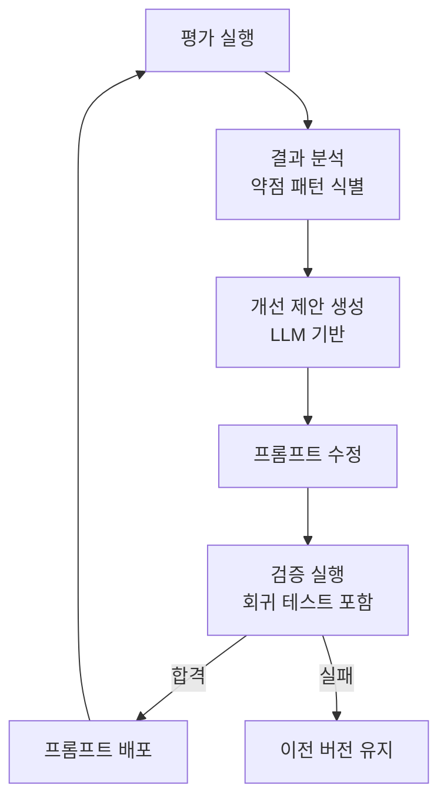
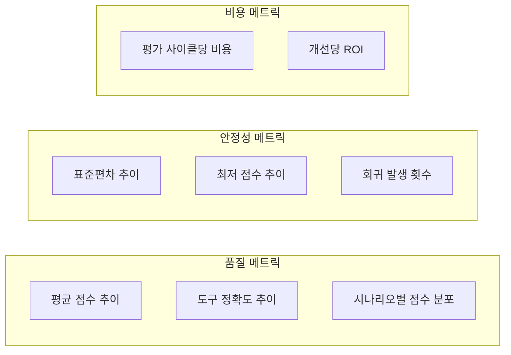

# 이 에이전트 진짜 잘하고 있는 거 맞아?

에이전트를 만들고 프롬프트를 튜닝하면 "감"으로 좋아졌다고 느낍니다. 하지만 정말 좋아진 건지, 특정 케이스에서만 잘 되는 건지, 어제 고친 프롬프트가 다른 시나리오를 망가뜨린 건 아닌지 확신할 수 없습니다. LLM 출력은 비결정적이라 같은 입력에 다른 결과가 나옵니다. 전통적 소프트웨어처럼 "입력 A면 출력 B"를 기대할 수 없는 상황에서, 에이전트 품질을 어떻게 측정하고 자동으로 개선할 것인가? 킴프로 에이전트 시스템에 적용한 평가 체계와 자동화 루프를 정리합니다.

## 에이전트 평가가 특별히 어려운 이유

전통적 ML 모델 평가와 에이전트 평가의 근본적 차이가 있습니다.

| 차원 | 분류 모델 | LLM 에이전트 |
|---|---|---|
| 출력 형태 | 라벨 (cat/dog) | 자연어 텍스트 + 도구 호출 시퀀스 |
| 정답 정의 | 명확 (ground truth) | 모호 ("좋은 응답"의 기준?) |
| 결정론 | 동일 입력 = 동일 출력 | 동일 입력 != 동일 출력 |
| 평가 단위 | 단일 예측 | 멀티스텝 추론 체인 |
| 실패 모드 | 오분류 | 잘못된 도구 선택, 불완전한 추론, 환각 |

에이전트는 "결과"만 평가하면 안 됩니다. 올바른 도구를 선택했는지, 도구를 올바른 순서로 호출했는지, 결과를 올바르게 종합했는지, 사용자에게 적절히 전달했는지를 모두 평가해야 합니다.

## 평가 프레임워크 설계

### 3계층 평가 구조

**Level 1 - 도구 호출 평가**: 에이전트가 올바른 도구를 올바른 파라미터로 호출했는지를 검증합니다. 이 단계는 비교적 결정론적으로 평가할 수 있습니다. 특정 질문에 대해 반드시 호출해야 하는 도구 목록(expected tools)을 정의하고, 실제 호출된 도구 목록과 비교합니다.

**Level 2 - 추론 과정 평가**: 도구 호출 순서와 중간 결과 활용을 평가합니다. 예를 들어, "캠페인 상태를 확인한 후 적절한 행동을 취했는가?"를 판단합니다. 이 단계부터 LLM-as-a-Judge 패턴이 필요합니다.

**Level 3 - 최종 응답 평가**: 사용자에게 전달되는 최종 텍스트의 품질을 평가합니다. 정확성, 완전성, 도메인 톤 적합성을 종합적으로 판단합니다.

### LLM-as-a-Judge 패턴

Level 2, 3 평가에는 사람이 직접 평가하거나 다른 LLM이 평가하는 방식이 필요합니다. 매번 사람이 평가하는 것은 확장 불가능하므로, 더 강력한 모델(예: Claude Opus)이 평가자 역할을 수행합니다.

### 평가 루브릭 설계

평가자 LLM에게 명확한 채점 기준(rubric)을 제공합니다.

| 평가 항목 | 5점 (우수) | 3점 (보통) | 1점 (미흡) |
|---|---|---|---|
| 도구 선택 정확도 | 필요한 도구만 정확히 호출 | 대부분 정확하나 1-2개 불필요한 호출 | 잘못된 도구 선택 또는 필수 도구 누락 |
| 정보 완전성 | 질문에 필요한 모든 정보 포함 | 핵심 정보 포함, 일부 누락 | 핵심 정보 누락 |
| 추론 논리성 | 논리적 순서로 도구 호출, 결과 적절히 종합 | 대체로 논리적이나 불필요한 단계 존재 | 비논리적 순서 또는 결과 무시 |
| 도메인 톤 | 도메인 전문가 수준의 적절한 톤 | 일반적으로 적절하나 때때로 부자연스러움 | 부적절한 톤 또는 비전문적 표현 |
| 에러 핸들링 | 도구 실패 시 적절히 대응, 사용자에게 안내 | 에러를 인지하나 대응이 미흡 | 에러 무시 또는 에러 메시지 그대로 전달 |

## 자동 평가 파이프라인

### 테스트 데이터셋 구성

실제 사용자 대화 로그에서 대표적 시나리오를 추출하여 테스트 데이터셋을 구성합니다.

| 카테고리 | 예시 시나리오 | 평가 포커스 |
|---|---|---|
| 정보 조회 | "현재 캠페인 상태 알려줘" | 올바른 도구 호출, 정확한 정보 전달 |
| 분석 요청 | "이 캠페인의 성과를 분석해줘" | 복합 도구 호출, 종합적 분석 |
| 수정 요청 | "캠페인 제목을 변경해줘" | 서브에이전트 위임, 변경 확인 |
| 복합 요청 | "기획서를 만들고 크리에이터도 찾아줘" | 병렬 서브에이전트, 결과 종합 |
| 엣지 케이스 | 존재하지 않는 캠페인 조회 | 에러 핸들링, 사용자 안내 |

### 비결정성 대응 — N회 실행 통계

LLM 출력의 비결정성을 다루기 위해, 동일 시나리오를 N회(통상 5회) 실행하고 통계적으로 평가합니다.

| 메트릭 | 의미 | 합격 기준 |
|---|---|---|
| 평균 점수 | 전반적 품질 | >= 4.0 / 5.0 |
| 표준편차 | 일관성 (낮을수록 좋음) | <= 0.8 |
| 최저 점수 | 최악의 경우 | >= 3.0 / 5.0 |
| 도구 정확도 | 올바른 도구 호출 비율 | >= 90% |

평균 점수가 높아도 표준편차가 크면 문제입니다. "10번 중 8번은 훌륭하지만 2번은 완전히 엉뚱한 답을 한다"면, 사용자 입장에서는 신뢰할 수 없는 시스템입니다.

## 자동 프롬프트 개선 루프

### 피드백 루프 설계

평가 결과를 바탕으로 프롬프트를 자동으로 개선하는 루프를 구성합니다.

### 약점 패턴 식별

평가 결과에서 반복되는 실패 패턴을 자동으로 분류합니다.

| 패턴 | 증상 | 개선 방향 |
|---|---|---|
| 도구 선택 오류 | 불필요한 도구 반복 호출 | 도구 설명 명확화, 사용 조건 추가 |
| 정보 누락 | 필수 정보 빠뜨림 | 체크리스트 패턴 프롬프트 추가 |
| 과잉 응답 | 질문에 없는 정보까지 장황하게 답변 | 범위 제한 지시 강화 |
| 톤 불일치 | 지나치게 격식체 또는 반말 | 톤 예시 추가 |
| 에러 무시 | 도구 에러를 인지하지 못함 | 에러 처리 지시 명시화 |

### 회귀 테스트의 중요성

프롬프트 수정의 가장 위험한 점은 "한 시나리오를 개선하면 다른 시나리오가 망가진다"는 것입니다. 새 프롬프트는 반드시 전체 테스트 데이터셋에 대해 회귀 테스트를 통과해야 합니다.

| 검증 단계 | 기준 |
|---|---|
| 대상 시나리오 개선 | 이전 대비 평균 점수 >= +0.5 |
| 전체 회귀 테스트 | 기존 점수 대비 -0.2 이내 |
| 최저 점수 하한 | 어떤 시나리오도 3.0 미만 아님 |

## 평가 비용과 트레이드오프

### 비용 구조

LLM-as-a-Judge 방식은 평가 자체에 LLM 호출 비용이 발생합니다.

| 구성 요소 | 비용 요인 | 예상 비용 (50 시나리오 x 5회) |
|---|---|---|
| 에이전트 실행 | Sonnet 250회 호출 | ~$15-25 |
| Judge 평가 | Opus 250회 호출 | ~$30-50 |
| 개선 제안 | Opus 1회 분석 | ~$0.5 |
| **합계** | | **~$45-75 / 평가 사이클** |

### 비용 최적화 전략

| 전략 | 설명 | 절감 효과 |
|---|---|---|
| Level 1만 자동 실행 | 도구 호출 평가는 LLM 없이 규칙 기반 | Judge 비용 -60% |
| 변경 관련 시나리오만 재실행 | 프롬프트 수정 영향 범위 분석 후 해당 시나리오만 | 에이전트 비용 -70% |
| 캐시된 도구 응답 | 동일 도구 호출에 캐시 응답 반환 | 도구 비용 -90% |
| 주간 전체 평가 + 일일 스모크 테스트 | 핵심 5개 시나리오만 매일 실행 | 전체 비용 -80% |

## 메트릭 대시보드

평가 결과를 추적하는 핵심 메트릭입니다.

## 핵심 인사이트

- **비결정성은 버그가 아니라 특성이다**: LLM 에이전트의 비결정성을 제거하려 하지 말고, N회 실행의 통계적 평가로 대응. 평균 점수뿐 아니라 표준편차(일관성)와 최저 점수(최악의 경우)를 함께 추적해야 신뢰할 수 있는 평가
- **3계층 평가로 실패 원인을 특정할 수 있다**: 도구 호출 -> 추론 과정 -> 최종 응답 순으로 평가하면, "도구는 맞게 골랐는데 결과 종합이 잘못됐다"처럼 정확한 실패 지점을 파악 가능
- **LLM-as-a-Judge는 확장 가능한 유일한 방법이다**: 사람이 매번 평가하는 것은 확장 불가능. 더 강력한 모델이 평가자 역할을 하되, 명확한 루브릭(채점 기준)을 제공해야 평가 일관성 확보
- **회귀 테스트 없는 프롬프트 수정은 도박이다**: 하나의 시나리오를 개선하는 프롬프트 수정이 다른 시나리오를 망가뜨릴 수 있음. 전체 데이터셋에 대한 회귀 테스트를 자동화해야 안전한 프롬프트 진화 가능
- **Level 1 평가의 가성비가 가장 높다**: 도구 호출 평가는 LLM 없이 규칙 기반으로 가능하면서도, 에이전트 실패의 60% 이상을 잡아낼 수 있음. 비용 대비 효과가 가장 큰 평가 단계
- **평가 비용은 투자다**: 평가 사이클당 $45-75의 비용은, 품질 저하로 인한 사용자 이탈이나 잘못된 도구 호출로 인한 데이터 오류 비용에 비하면 미미함. 체계적 평가 없이 프로덕션에 배포하는 것이 진짜 비용
