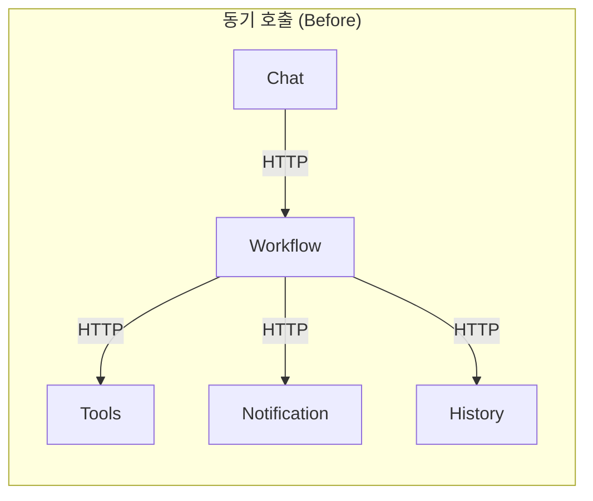
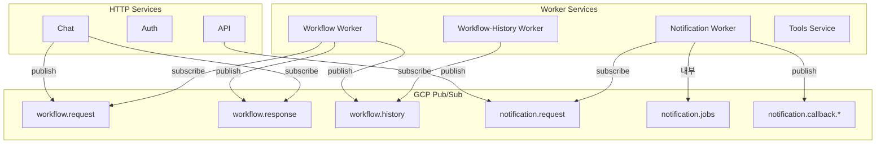
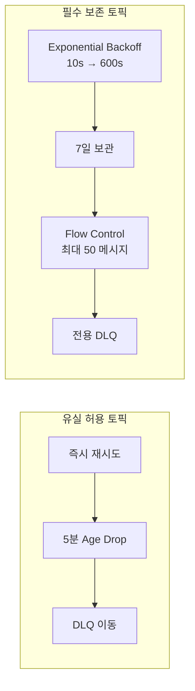
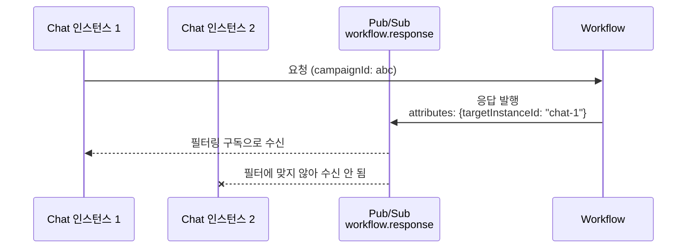
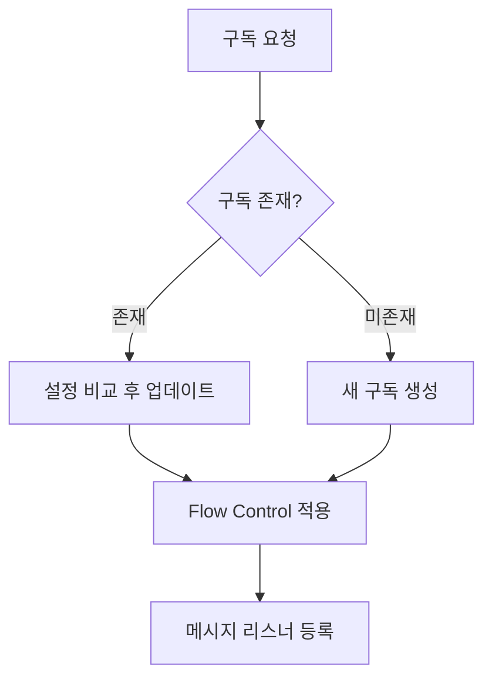
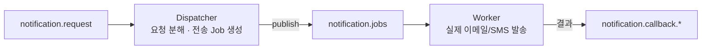
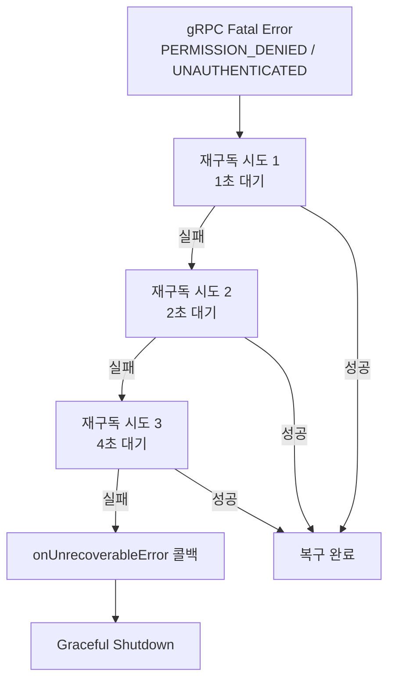

# 서비스 7개가 서로 직접 호출하면 어떻게 될까?

처음에는 서비스 간 통신이 단순했습니다. Chat 서비스가 Workflow 서비스를 HTTP로 호출하고, 결과를 받아 사용자에게 전달합니다. 서비스가 3개일 때는 문제없었습니다. 그런데 Auth, Tools, Notification, Workflow-History까지 추가되면서 서비스가 7개로 늘어나자, 서비스 간 의존성이 폭발했습니다. Chat이 Workflow를 호출하고, Workflow가 Tools를 호출하고, 결과를 Notification에 보내고, History에도 기록해야 하고... 하나의 요청이 4-5개 서비스를 체인으로 연결합니다. 한 서비스가 느려지면 전체 체인이 느려지고, 한 서비스가 죽으면 전체가 멈춥니다. GCP Pub/Sub 기반 이벤트 드리븐 아키텍처로 전환한 과정을 정리합니다.

## 동기 호출의 문제 — 왜 이벤트 드리븐인가

| 문제 | 설명 | 실제 영향 |
|---|---|---|
| 시간적 결합 | Chat이 Workflow 응답을 기다려야 함 | LLM 처리 30초 동안 HTTP 커넥션 점유 |
| 장애 전파 | Notification 장애 시 Workflow 전체 실패 | 알림 실패가 채팅 응답 실패로 이어짐 |
| 배포 의존성 | Workflow 재배포 시 Chat이 연결 끊김 | 무중단 배포 불가 |
| 수평 확장 어려움 | 특정 서비스만 스케일아웃 불가 | Workflow 부하 시 전체 시스템 영향 |

이벤트 드리븐 아키텍처는 이 네 가지 문제를 한 번에 해결합니다. 서비스는 메시지를 발행할 뿐, 누가 소비하는지 알 필요가 없습니다.

## 전체 아키텍처

7개 서비스가 GCP Pub/Sub 토픽을 통해 느슨하게 연결됩니다. 각 서비스는 자신이 관심 있는 토픽만 구독하고, 발행자는 구독자의 존재를 알 필요가 없습니다.

## 토픽 설계 — 9개 토픽의 역할 분담

전체 시스템에서 사용하는 주요 토픽들의 설계 의도와 특성을 정리합니다.

| 토픽 | 발행자 | 구독자 | 유실 허용 | 순서 보장 | 재시도 정책 |
|---|---|---|---|---|---|
| workflow.request | Chat | Workflow | O (사용자 재시도) | X | 즉시 재시도, 10회 |
| workflow.response | Workflow | Chat | O (REST 복구) | O (campaignId) | 즉시 재시도, 10회|
| workflow.history | Workflow | History | **X (필수 보존)** | O (campaignId) | Exponential, 10s~600s |
| notification.request | API, Workflow | Notification | **X** | X | Exponential, 5s~300s |
| notification.jobs | Dispatcher | Worker | **X** | X | Exponential, 5s~60s |
| notification.callback.* | Notification | 요청 서비스 | O (best-effort) | X | 즉시, DLQ 없음 |

### 유실 허용 vs 필수 보존

토픽 설계의 가장 중요한 의사결정은 "이 메시지를 잃어버려도 되는가?"입니다.

**유실 허용 토픽** (workflow.request, workflow.response): 실시간성이 중요합니다. 5분(300초) 이상 된 메시지는 age drop으로 폐기합니다. 사용자가 재시도하거나 REST API로 복구할 수 있기 때문입니다.

**필수 보존 토픽** (workflow.history, notification.request): 데이터 유실이 비즈니스 손실로 이어집니다. 7일간 메시지를 보관하고, Flow Control로 처리 속도를 제한해 과부하를 방지합니다. 실패 시 exponential backoff로 재시도합니다.

## 메시지 라우팅 — targetInstanceId 패턴

### 문제: 응답을 누구에게 보내야 하나?

Workflow 서비스가 처리 결과를 `workflow.response` 토픽에 발행하면, 어떤 Chat 인스턴스가 이 메시지를 받아야 할까요? Chat 서비스가 수평 확장되어 3개 인스턴스가 돌고 있으면, 요청을 보낸 Chat 인스턴스에만 응답이 전달되어야 합니다.

### 해결 — 필터링 구독 + Workflow Response Router

GCP Pub/Sub의 메시지 속성(attributes) 필터링을 활용합니다. 각 Chat 인스턴스는 자신의 instanceId로 필터링된 구독을 생성합니다. 구독명은 `workflow-response-chat-1-sub` 형태로, 토픽명과 속성값을 조합해 만듭니다.

Workflow Response Router는 Redis 기반으로 "어떤 캠페인의 응답을 어떤 Chat 인스턴스에 보내야 하는지"를 관리합니다. 세션이 시작되면 `addTarget(campaignId, instanceId)`로 등록하고, Workflow가 응답을 보낼 때 `getTargets(campaignId)`로 대상을 조회합니다.

| 구성 요소 | 역할 |
|---|---|
| Messaging Node Registry | 서비스 인스턴스 등록/해제, 하트비트 기반 생존 확인 |
| Workflow Response Router | 캠페인별 응답 라우팅 대상 관리, 세션 카운트 추적 |
| 필터링 구독 | GCP Pub/Sub attributes 기반 메시지 필터링 |

### 세션 카운트

같은 캠페인을 여러 탭에서 열 수 있습니다. Router는 인스턴스별 세션 수를 Redis HINCRBY로 카운트합니다. 세션이 종료되면 카운트를 감소시키고, 0이 되면 해당 인스턴스를 라우팅 대상에서 제거합니다.

## Optimistic Subscribe 패턴

### 문제

GCP Pub/Sub 구독 생성은 비동기 작업입니다. 토픽이 존재하는지, 구독이 이미 있는지, 설정이 변경되었는지를 확인해야 합니다. 이를 매번 순차적으로 처리하면 서비스 시작 시간이 느려집니다.

### 해결 — 존재 확인 후 분기

`ensureSubscription` 메서드가 이 로직을 캡슐화합니다. 구독이 있으면 현재 설정과 비교해 변경분만 업데이트하고, 없으면 생성합니다. ackDeadlineSeconds, Dead Letter Policy, Retry Policy, Message Retention Duration 네 가지 설정을 비교합니다.

이 패턴의 장점은 **인프라 코드에서 구독을 사전 생성할 필요가 없다**는 것입니다. 서비스가 시작되면 자동으로 필요한 구독이 만들어지고, 설정이 변경되면 자동으로 업데이트됩니다.

## Notification/History 워커 분리

### 왜 별도 워커인가

Workflow 서비스가 에이전트 실행과 히스토리 저장을 모두 담당하면, 히스토리 DB 장애 시 에이전트 실행까지 영향을 받습니다. Notification도 마찬가지로, 이메일 발송 장애가 핵심 워크플로우를 중단시켜서는 안 됩니다.

| 워커 | 구독 토픽 | 역할 | 장애 영향 |
|---|---|---|---|
| Workflow Worker | workflow.request | LLM 에이전트 실행 | 채팅 응답 불가 (핵심) |
| History Worker | workflow.history | 메시지/변경사항 영구 저장 | 히스토리 기록 지연 (비핵심) |
| Notification Worker | notification.request | 이메일/알림 발송 | 알림 지연 (비핵심) |

### Notification 내부 아키텍처 — Dispatcher/Worker 분리

Notification Worker 내부도 이벤트 드리븐으로 분리됩니다.

하나의 알림 요청이 여러 수신자에게 전송되어야 할 수 있습니다. Dispatcher가 요청을 개별 전송 Job으로 분해해 `notification.jobs` 토픽에 발행하면, Worker가 실제 발송을 담당합니다. 이 분리 덕분에 이메일 발송 지연이 Dispatcher를 블로킹하지 않습니다.

## 장애 복구 — Fatal Error에서 Graceful Shutdown까지

### gRPC Fatal Error 처리

GCP Pub/Sub SDK는 내부적으로 gRPC StreamingPull을 사용합니다. PERMISSION_DENIED(7), UNAUTHENTICATED(16) 같은 fatal error가 발생하면 SDK가 자동 복구하지 못합니다.

브로커는 exponential backoff(1s -> 2s -> 4s)로 최대 3회 재구독을 시도합니다. 모든 시도가 실패하면 `onUnrecoverableError` 콜백을 호출해 워커가 graceful shutdown을 수행합니다. 이 과정에서 진행 중인 메시지 처리를 완료하고, 노드 등록을 해제하고, 연결을 정리합니다.

### 토픽 Prefix — 환경 격리

개발/스테이징/프로덕션 환경을 같은 GCP 프로젝트에서 운영할 때, 토픽 prefix로 격리합니다. `dev-john-workflow.request`처럼 prefix가 붙어, 개발자 John의 로컬 서비스가 프로덕션 메시지를 소비하는 사고를 방지합니다.

## Before vs After

| 지표 | 동기 HTTP 호출 | GCP Pub/Sub 이벤트 드리븐 |
|---|---|---|
| 서비스 간 결합도 | 강결합 (직접 호출) | 약결합 (토픽 기반) |
| 장애 전파 범위 | 체인 전체 | 해당 토픽 구독자만 |
| 수평 확장 | 전체 재배포 필요 | 서비스별 독립 스케일링 |
| 무중단 배포 | 불가 (커넥션 끊김) | 가능 (메시지 버퍼링) |
| 메시지 유실 대응 | 없음 (에러 전파) | DLQ + Age Drop + 재시도 |
| 모니터링 | 분산 트레이싱 필요 | 토픽별 메트릭 독립 수집 |

## 핵심 인사이트

- **토픽 설계의 핵심은 유실 허용 여부다**: 모든 메시지를 "절대 잃으면 안 되는" 것으로 취급하면 성능이 떨어지고, 모두 "잃어도 되는" 것으로 취급하면 데이터 정합성이 깨짐. 토픽별로 유실 허용 수준을 명확히 정의하고, 그에 맞는 재시도/보관 정책을 적용하는 것이 설계의 본질
- **필터링 구독으로 Fan-out 없이 라우팅 가능**: 인스턴스별 토픽을 만들면 토픽 수가 폭발함. 단일 토픽 + attributes 필터링 구독으로 정확한 라우팅을 달성하면서 토픽 관리 부담을 제거
- **워커 분리는 장애 도메인 분리**: History Worker가 죽어도 채팅은 정상 동작하고, Notification이 지연되어도 워크플로우는 계속 진행됨. "핵심 경로"와 "부가 경로"를 물리적으로 분리하는 것이 시스템 안정성의 핵심
- **Optimistic Subscribe가 인프라 운영 부담을 줄인다**: 서비스가 시작될 때 필요한 구독을 자동으로 생성/업데이트하므로, Terraform이나 수동 설정으로 구독을 사전 관리할 필요가 없음
- **Graceful Shutdown 체인 설계**: Fatal Error -> 재구독 시도 -> 콜백 -> 워커 shutdown -> 노드 해제 순으로 이어지는 복구 체인이 메시지 유실 없는 안전한 종료를 보장
- **환경 격리는 prefix 하나로**: 별도 GCP 프로젝트를 운영하지 않고도 토픽 prefix만으로 개발/스테이징/프로덕션을 안전하게 격리. 운영 비용을 줄이면서 격리 수준은 유지
