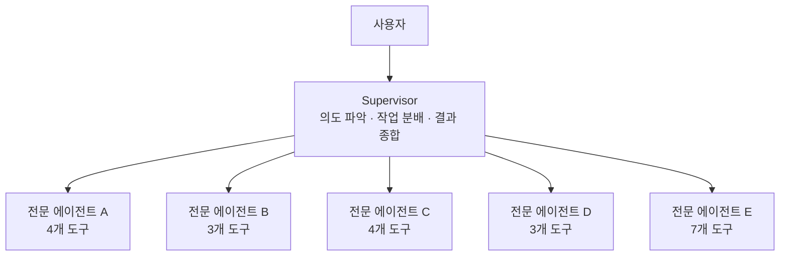
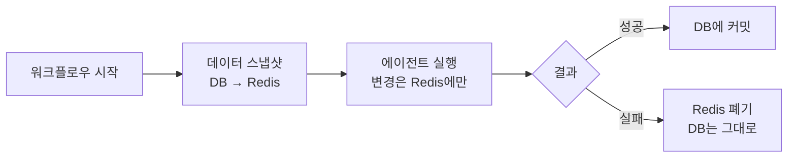

# 여긴 너를 위한 들판이야, 마음껏 뛰어 AI야

도구 20개를 쥐어주면 AI는 오히려 못한다. 그렇다고 도구를 줄이면 할 수 있는 일이 없다. 결국 문제는 모델이 아니라 **모델이 뛰어노는 환경**이었다. 에이전트가 마음껏 시도하고, 틀려도 복구되는 구조를 만들기까지의 과정을 정리한다.

## 도구 20개를 든 만능 AI의 한계

처음에는 하나의 에이전트에 모든 도구를 넣었다. 캠페인 자동화에 필요한 도구가 20개 이상이었는데, 분석, 전략, 콘텐츠, 매칭, 계약까지 영역이 전부 달랐다.

결과는 참담했다.

- **도구 선택 오류** — 20개 중 올바른 도구를 고르는 정확도가 급락했다
- **프롬프트 충돌** — "간결하게 작성해"와 "상세하게 분석해"가 하나의 프롬프트에 공존했다
- **컨텍스트 폭발** — 모든 도구 호출 결과가 하나의 컨텍스트에 누적되면서 판단력이 흐려졌다

모델을 바꿔봐도, 프롬프트를 다듬어봐도 근본적인 해결이 안 됐다. **프롬프트가 아니라 구조의 문제**였다.

## 팀장 하나, 전문가 다섯

실제 마케팅 팀을 생각해보면 답이 보였다. 팀장이 모든 실무를 직접 하지 않는다. 상황을 판단하고, 적절한 전문가에게 일을 맡긴다.

같은 구조를 에이전트에 적용했다. **Supervisor(팀장) 에이전트** 하나가 사용자 의도를 파악하고, **5명의 전문 에이전트**에게 작업을 위임한다. 각 전문 에이전트는 자기 영역의 도구 3~7개만 가지고 있다.

핵심은 **Tool Calling 기반 라우팅**이다. Supervisor가 별도의 라우팅 로직 없이 LLM의 Function Calling으로 서브에이전트를 호출한다. LLM이 한 번의 응답에서 여러 서브에이전트를 동시에 호출할 수도 있어서, "분석과 전략을 병렬로" 같은 판단을 모델이 스스로 내린다.

Supervisor에는 고성능 모델(Sonnet)을, 서브에이전트에는 경량 모델(Haiku)을 배치했다. Supervisor는 "누구에게 무엇을 시킬지" 판단하는 추론 능력이 중요하고, 서브에이전트는 "정해진 도구를 정확히 호출"하는 실행 능력이 중요하다. 역할에 따라 모델 티어를 다르게 배치하면 비용 대비 성능이 극적으로 개선된다.

## 그런데 서브에이전트의 잡음이 팀장을 혼란시켰다

구조를 나누니 도구 선택 정확도는 올라갔다. 그런데 새로운 문제가 생겼다.

서브에이전트가 도구를 3~5번 호출하는 동안의 **중간 과정** — 실패, 재시도, 중간 결과 — 이 전부 Supervisor의 컨텍스트에 쌓였다. 5개 서브에이전트가 각각 3~5번씩 도구를 호출하면, Supervisor 컨텍스트가 순식간에 80~120k 토큰으로 불어난다.

Supervisor 입장에서는 최종 결과만 알면 되는데, 서브에이전트의 시행착오까지 전부 보게 된 것이다. **정보가 많아지니 오히려 판단이 흐려졌다.**

## Ephemeral 서브에이전트 — 결과만 남기고 사라진다

서브에이전트를 **일회성** (ephemeral)으로 설계했다. 서브에이전트는 독립된 컨텍스트에서 실행되고, 작업이 끝나면 중간 과정은 모두 폐기된다. Supervisor에게는 최종 결과만 반환된다.

| | 컨텍스트 공유 (Before) | 컨텍스트 격리 (After) |
|---|---|---|
| Supervisor 컨텍스트 | 80~120k 토큰 | 15~25k 토큰 |
| 노출되는 정보 | 모든 중간 과정 | 최종 결과만 |
| Supervisor 판단력 | 잡음에 혼란 | 결과에 집중 |

컨텍스트를 **약 80% 절감**하면서, Supervisor가 판단에 필요한 정보(최종 결과)는 그대로 유지됐다.

## 에이전트가 데이터를 잘못 수정하면?

서브에이전트들은 도구를 통해 캠페인 데이터를 직접 수정한다. 한 번의 워크플로우에서 수정 횟수가 10~20번에 달한다. 5개 서브에이전트가 동시에 실행되면 더 늘어난다.

여기서 에이전트가 잘못된 값을 넣거나, 워크플로우 중간에 에러가 나거나, 사용자가 "잠깐, 방향을 바꿀게"라고 하면? **이미 수정된 데이터를 어떻게 되돌릴 것인가.**

DB에 직접 쓰면 "반쯤 수정된" 불완전한 상태가 영속된다. 이게 가장 위험하다.

## 스냅샷 + 롤백 — 틀려도 복구되는 구조

해결은 의외로 단순했다. **DB에 직접 쓰지 않는다.** 워크플로우 시작 시 데이터를 Redis에 복사(스냅샷)하고, 모든 변경을 Redis에만 기록한다. 워크플로우가 정상 완료되면 DB에 커밋하고, 실패하면 Redis를 폐기한다.

에이전트 입장에서는 아무런 제약이 없다. 마음껏 데이터를 수정할 수 있다. 틀려도 괜찮다. **롤백은 Redis 키 삭제 한 번이면 끝**이고, 원본 DB는 커밋 전까지 손대지 않는다.

한 가지 재밌는 판단이 있었다. 워크플로우 중간에 에러가 나도 **바로 롤백하지 않고 커밋을 먼저 시도**한다. 5개 서브에이전트 중 4개가 성공하고 1개가 실패했다면, 4개의 결과라도 저장하는 것이 처음부터 다시 하는 것보다 사용자에게 유리하기 때문이다.

## 서버가 죽어도 이어서 한다

워크플로우 중간에 서버가 재시작되면? Redis 스냅샷이 살아 있다. 스냅샷에는 현재 워크플로우 단계와 각 서브에이전트의 완료 상태가 기록되어 있다. 서버가 다시 뜨면 미완료 스냅샷을 감지하고, **중단된 단계부터 이어서 실행**한다.

LangGraph의 체크포인트와 비슷한 개념이지만, 우리 스냅샷은 **캠페인 데이터의 중간 상태까지 포함**한다는 점이 다르다. LangGraph 체크포인트는 그래프의 실행 위치만 기억하지만, 스냅샷은 "3단계까지 수정된 캠페인 데이터 + 현재 실행 위치"를 함께 담는다. 덕분에 재개 시 DB에서 데이터를 다시 로드할 필요 없이, 스냅샷 상태 그대로 이어갈 수 있다.

## 미들웨어 파이프라인 — 환경을 코드로 제어한다

에이전트의 행동을 제어하는 방법은 크게 두 가지다. 프롬프트로 "이렇게 해"라고 말하거나, **코드로 강제**하거나.

프롬프트 지시는 모델이 무시할 수 있다. 미들웨어는 무시할 수 없다. 미들웨어 파이프라인으로 에이전트의 매 실행 단계를 가로채서, 동적으로 컨텍스트를 주입하고, 에러를 처리하고, 서브에이전트를 생성한다.

Supervisor와 서브에이전트의 미들웨어 구성이 다르다. Supervisor에는 서브에이전트 호출 기능을, 서브에이전트에는 종료 시 미완료 작업 정리 기능을 넣는 식이다. **역할에 따라 환경이 달라지는 것**이다.

## 에러는 실패가 아니라 힌트다

도구를 설계할 때 의도적으로 에러를 많이 발생시켰다. 도메인 권한이 없는 필드에 쓰려 하면 "이 필드는 네 담당이 아니야"라고 알려주고, 타입이 틀리면 "숫자여야 하는데 문자열을 받았어"라고 알려주고, 날짜 형식이 다르면 "UTC로 변환해서 다시 보내"라고 알려준다.

**명확한 에러는 AI에게 결정적인 힌트**다. "잘못된 값입니다"라는 모호한 에러는 에이전트를 멈추게 하지만, "이 필드는 number 타입이어야 하는데 string을 받았습니다"라는 구체적인 에러는 에이전트가 스스로 수정해서 재시도할 수 있게 만든다.

들판에서 뛰다 넘어졌을 때, "나가"라고 하는 게 아니라 **"왼쪽으로 가면 돼"**라고 알려주는 것이다. 에이전트는 이런 피드백을 받을수록 더 정확해진다.

## 돌이켜보면

결국 만든 것은 **에이전트가 마음껏 뛰어놀 수 있는 들판**이었다. 도구를 영역별로 나누고, 컨텍스트를 격리하고, 틀려도 롤백되는 안전망을 깔고, 미들웨어로 환경을 제어한다.

모델 성능을 올리는 것보다, **모델이 일하는 환경을 설계하는 것**이 더 큰 차이를 만들었다. 같은 모델이라도 하네스에 따라 결과가 완전히 달라진다.
