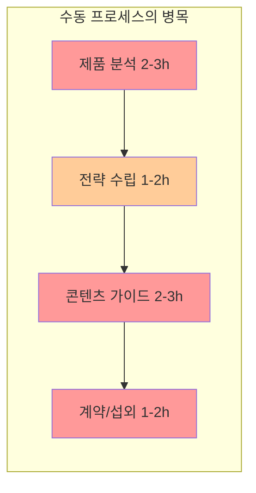
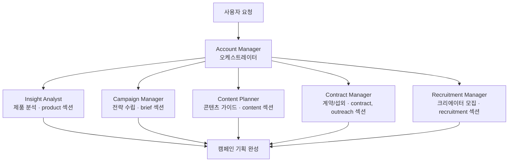
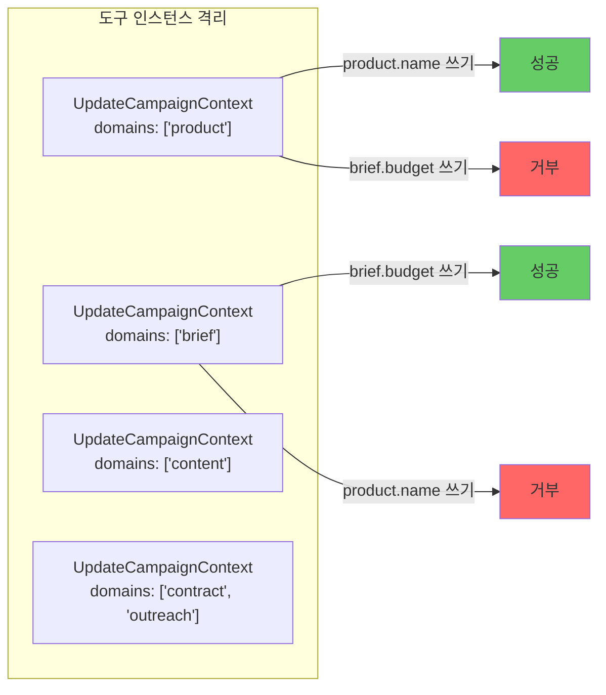
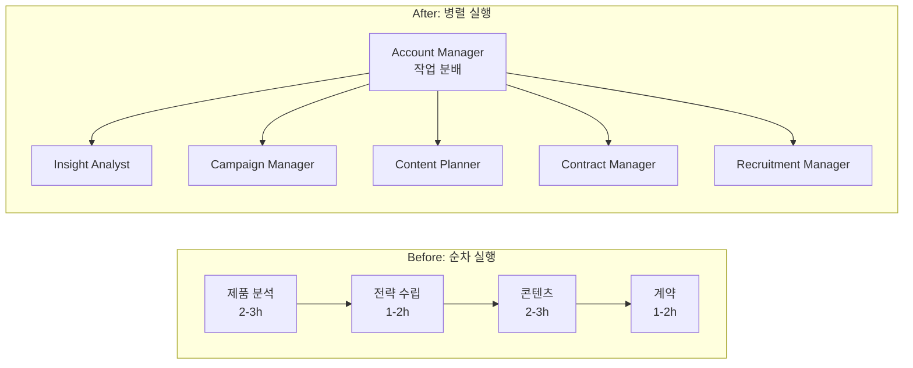
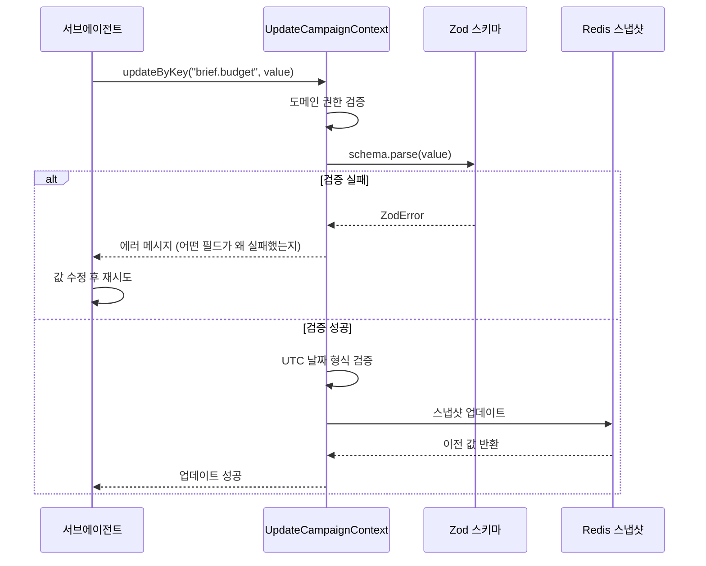
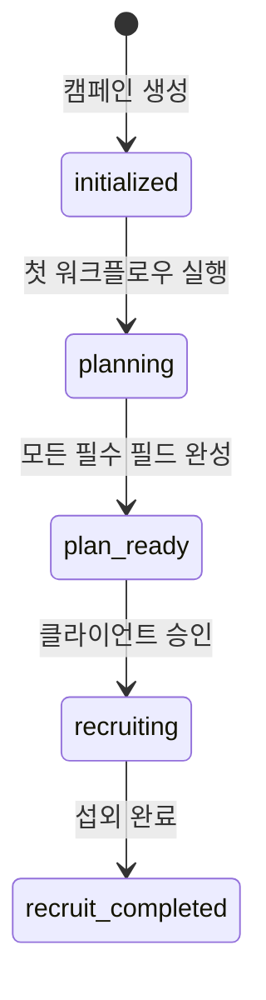

# 매번 똑같은 일을 왜 사람이 해야 하지?

인플루언서 마케팅 캠페인 하나를 기획하려면, 담당자는 제품 분석 → 전략 수립 → 콘텐츠 가이드 작성 → 계약 조건 정리를 매번 반복합니다. 캠페인 50개를 동시에 운영하면? 사람은 지치고, 빠지는 항목이 생기고, 품질이 들쭉날쭉해집니다. 이 반복 업무를 Agent 워크플로우로 전환한 과정을 정리합니다.

## 기존 수동 프로세스 분석

캠페인 기획의 수동 프로세스를 관찰하면, 4단계로 나뉩니다.

| 단계 | 담당자 행동 | 소요 시간 | 반복성 |
|---|---|---|---|
| 1. 제품 분석 | 제품 페이지 방문, USP 정리, 경쟁사 조사 | 2-3시간 | 높음 |
| 2. 전략 수립 | 타겟 오디언스, 예산 배분, KPI 설정 | 1-2시간 | 중간 |
| 3. 콘텐츠 가이드 | 톤앤매너, 레퍼런스 포스트 수집, 가이드라인 작성 | 2-3시간 | 높음 |
| 4. 계약/섭외 | 계약 조건 정의, 섭외 메시지 템플릿 작성 | 1-2시간 | 높음 |

총 6-10시간. 캠페인마다 거의 같은 구조의 작업을 반복하지만, 제품과 브랜드에 따라 내용은 달라집니다. 전형적인 "구조는 같고 내용은 다른" 업무 -- Agent 자동화의 최적 대상입니다.

### 수동 프로세스의 핵심 문제

문제는 세 가지였습니다.

1. **순차 의존성**: 제품 분석이 끝나야 전략을 세울 수 있고, 전략이 있어야 콘텐츠 가이드를 쓸 수 있음
2. **컨텍스트 전환 비용**: 담당자가 50개 캠페인을 돌아가며 작업하면 매번 "이 캠페인이 어디까지 했더라?" 파악에 시간 소모
3. **품질 편차**: 피로도에 따라 마지막 캠페인의 기획 품질이 첫 번째보다 현저히 낮음

## Agent 워크플로우로 전환

### 설계 원칙: 단계별 전문 Agent

수동 프로세스의 4단계를 그대로 Agent 노드로 매핑했습니다. 핵심 원칙은 "하나의 Agent는 하나의 단계만 담당"입니다.

수동 프로세스에는 없던 5번째 단계 -- 크리에이터 모집(Recruitment Manager)도 추가했습니다. 기존에는 별도 플랫폼에서 수동으로 진행하던 작업을 AI 기반 매칭으로 통합한 것입니다.

### 각 Agent의 도구 설계

Agent별로 "읽기"와 "쓰기"의 범위를 엄격히 제한했습니다.

| Agent | 읽기 범위 | 쓰기 범위 | 전용 도구 |
|---|---|---|---|
| Account Manager | 전체 캠페인 | 없음 (읽기 전용) | GenerateChecklist |
| Insight Analyst | 전체 캠페인 | product 섹션만 | ProductAnalyzeFromWeb |
| Campaign Manager | 전체 캠페인 | brief 섹션만 | - |
| Content Planner | 전체 캠페인 | content 섹션만 | ReferencePosts |
| Contract Manager | 전체 캠페인 | contract, outreach 섹션만 | - |
| Recruitment Manager | 전체 캠페인 | recruitment 섹션만 | KeywordScoring, RecruitmentMatch 등 4개 |

핵심 설계 결정은 **Account Manager에게 쓰기 권한을 주지 않은 것**입니다. 오케스트레이터가 직접 데이터를 수정하면, 어떤 Agent가 무엇을 변경했는지 추적이 불가능해집니다. Account Manager는 "지시만 하고 실행은 전문가에게" 위임합니다.

### 도메인 격리 패턴

쓰기 범위를 제한하는 방식이 독특합니다. UpdateCampaignContext 도구를 Agent마다 다른 설정으로 인스턴스화합니다.

같은 도구 클래스이지만 생성 시 `domains` 파라미터로 허용 섹션을 지정합니다. Agent가 자신의 담당 섹션 밖에 쓰려고 하면 도구 레벨에서 즉시 거부됩니다. LLM의 판단에 의존하지 않고, 코드 레벨에서 강제하는 것이 핵심입니다.

## 자동화 전후 비교

### 프로세스 변화

| 지표 | Before (수동) | After (Agent) | 변화 |
|---|---|---|---|
| 캠페인 1건 기획 시간 | 6-10시간 | 대화 3-5회 (약 10-15분) | 약 95% 단축 |
| 동시 진행 가능 캠페인 수 | 담당자당 3-5개 | 제한 없음 | 확장성 확보 |
| 필수 항목 누락률 | 관리자 수동 검수 필요 | Zod 스키마 자동 검증 | 누락 원천 차단 |
| 품질 편차 | 담당자 피로도에 비례 | 일관된 품질 | 편차 제거 |

### 사용자 경험 변화

기존: 담당자가 빈 문서에 직접 작성 → 상사 검수 → 수정 → 재검수

변경 후: 사용자가 "화장품 브랜드 X의 신제품 캠페인 기획해줘"라고 입력 → Account Manager가 5개 서브에이전트에 병렬 위임 → 각 Agent가 담당 섹션 자동 완성 → 사용자는 결과를 검토하고 대화로 수정 요청

## 검증 체계

캠페인 데이터의 각 필드에는 Zod 스키마 기반의 검증 규칙이 적용됩니다. Agent가 값을 업데이트할 때마다 실시간으로 검증이 실행됩니다.

Agent가 잘못된 형식으로 데이터를 쓰려고 하면 즉시 실패하고, 구체적인 에러 메시지를 받아 스스로 수정합니다. 날짜 값은 UTC 형식만 허용하여 타임존 혼동을 방지합니다.

## 캠페인 상태 자동 전환

Agent가 모든 필수 필드를 채우면 캠페인 상태가 자동으로 전환됩니다.

"planning → plan_ready" 전환이 자동화의 핵심입니다. 워크플로우 종료 시점에 모든 섹션의 필수 필드를 검사하고, 전부 채워져 있으면 자동으로 `plan_ready`로 전환합니다. 담당자가 "이 캠페인 기획 다 됐나?" 확인할 필요가 없어집니다.

## 핵심 인사이트

- **수동 프로세스를 그대로 Agent 노드로 매핑하면 자연스럽다**: 4단계 수동 프로세스를 5개 Agent로 1:1 매핑하니, 각 Agent의 책임 범위가 명확하고 도구 설계가 자연스럽게 도출됨
- **오케스트레이터에게 쓰기 권한을 주지 않는 것이 핵심 설계 결정**: Account Manager가 직접 데이터를 수정하면 변경 추적이 불가능. "지시만 하고 실행은 전문가에게" 원칙으로 감사 추적(audit trail) 확보
- **도메인 격리는 LLM이 아닌 코드 레벨에서 강제해야 한다**: 프롬프트로 "이 섹션만 수정하세요"라고 지시하는 것은 불안정. 도구 인스턴스의 domains 파라미터로 물리적으로 차단하면 100% 보장
- **Zod 스키마 검증으로 AI 출력 품질을 기계적으로 보장**: Agent가 잘못된 형식을 쓰면 즉시 실패 + 구체적 에러 메시지로 자가 수정 유도. 사람이 검수할 필요 없음
- **자동 상태 전환이 "다 됐나?" 확인 비용을 제거한다**: 필수 필드 완성 여부를 코드가 판단하므로, 관리자가 캠페인마다 수동 확인하는 오버헤드 제거
- **병렬 Agent 실행이 순차 프로세스 대비 95% 시간 단축의 핵심**: 기존에 순차적으로 6-10시간 걸리던 작업을 5개 Agent가 동시에 처리하여 10-15분으로 압축
