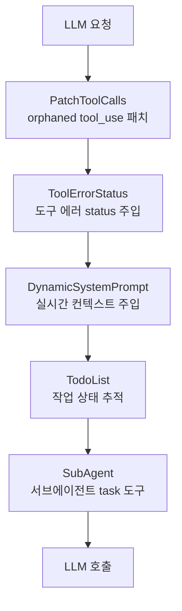
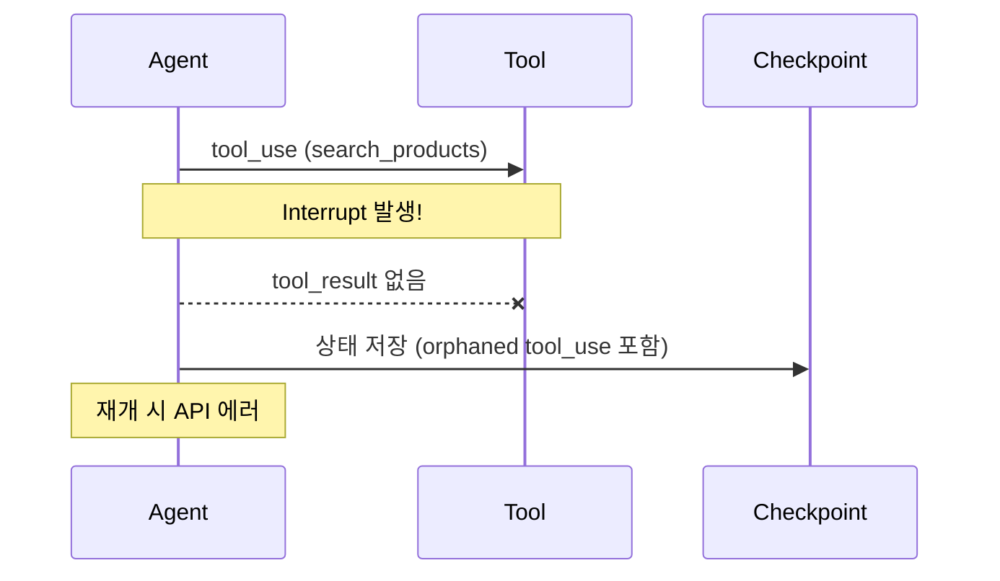
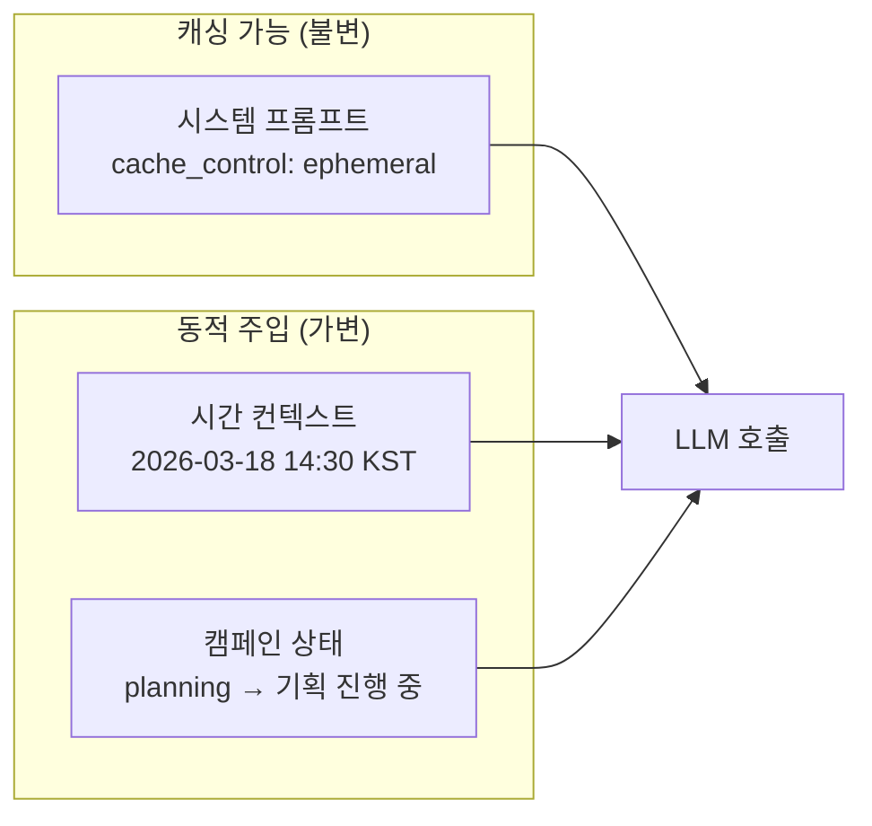
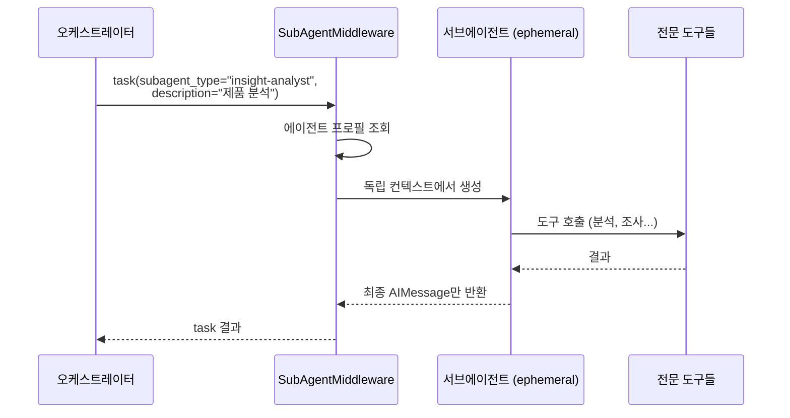
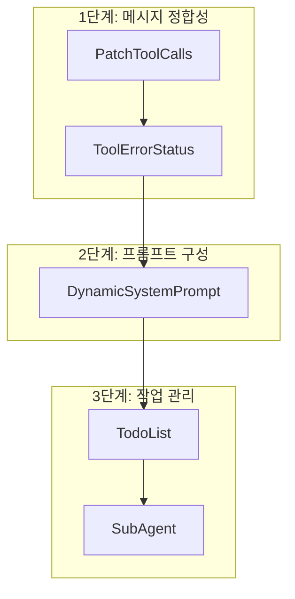

# 에이전트한테 맥락 없이 일 시키면 당연히 못하지

LangChain으로 에이전트를 만들면 "모델 + 도구 + 프롬프트"로 끝이라고 생각하기 쉽습니다. 하지만 실제 프로덕션에서는 에이전트가 도구를 호출하다 에러가 나고, 워크플로우가 중단되었다 재개되면 메시지 포맷이 깨지고, 시스템 프롬프트에 실시간 컨텍스트가 빠져서 엉뚱한 답을 하는 문제가 연쇄적으로 터집니다. 에이전트 "주변"을 얼마나 잘 다듬느냐가 에이전트 품질의 80%를 결정합니다. 이 글은 킴프로 워크플로우 서비스에서 5개의 미들웨어로 에이전트 실행을 제어하는 파이프라인 설계를 다룹니다.

## 왜 미들웨어인가

에이전트 실행에 필요한 횡단 관심사(cross-cutting concerns)를 에이전트 로직 안에 직접 넣으면 어떻게 될까요?

| 방식 | 문제점 |
|---|---|
| 에이전트 코드에 직접 삽입 | 도구 에러 처리, 프롬프트 주입, 서브에이전트 관리가 한 파일에 뒤섞여 유지보수 불가 |
| 유틸 함수로 분리 | 실행 순서 보장이 안 되고, 호출 누락 시 사일런트 실패 |
| **미들웨어 파이프라인** | 각 관심사를 독립 모듈로 분리, 순서 보장, 토글 가능 |

Express.js/Koa에서 HTTP 요청을 미들웨어 체인으로 처리하듯, LLM 호출 전후에도 동일한 패턴을 적용할 수 있습니다. LangChain의 `createMiddleware` API가 이 구조를 네이티브로 지원합니다.

## 5개 미들웨어 파이프라인

각 미들웨어는 LangChain의 `createMiddleware` 훅 포인트를 통해 에이전트의 다른 단계를 가로챕니다.

| 미들웨어 | 훅 포인트 | 역할 |
|---|---|---|
| PatchToolCalls | `wrapModelCall` | 모델 호출 전 메시지 검사 |
| ToolErrorStatus | `wrapToolCall` | 도구 실행을 감싸서 결과 가공 |
| DynamicSystemPrompt | `wrapModelCall` | 시스템 메시지에 동적 컨텍스트 추가 |
| TodoList | `afterAgent` | 에이전트 종료 후 상태 정리 |
| SubAgent | `tools` + `wrapModelCall` | 도구 주입 + 시스템 메시지 확장 |

## 미들웨어 1: PatchToolCalls — 유령 도구 호출 패치

### 문제 상황

Anthropic API는 엄격한 메시지 순서 규칙이 있습니다. 모든 `tool_use` 블록에는 바로 뒤에 대응하는 `tool_result`가 있어야 합니다. 하지만 워크플로우가 interrupt로 중단된 뒤 재개되면, 체크포인트에 "호출은 했지만 결과가 없는" orphaned tool_use 메시지가 남습니다.

### 해결 — 합성 ToolMessage 주입

이 미들웨어는 `wrapModelCall` 훅에서 모델 호출 직전에 메시지 배열을 순회합니다. `tool_calls`가 있는 AIMessage를 발견하면, 뒤따르는 ToolMessage들의 `tool_call_id`를 수집하고, 대응하는 결과가 없는 tool call에 합성 ToolMessage를 주입합니다.

주의할 점은 체크포인트에서 역직렬화된 메시지는 `instanceof` 체크가 실패할 수 있다는 것입니다. 그래서 `_getType()` 메서드와 `type` 프로퍼티를 함께 확인하는 삼중 판별 로직을 사용합니다.

### 왜 이게 중요한가

이 미들웨어 없이는 "interrupt 후 재개"가 불가능합니다. Human-in-the-Loop 패턴을 구현하려면 워크플로우를 중단/재개할 수 있어야 하는데, 이 미들웨어가 그 기반입니다.

## 미들웨어 2: ToolErrorStatus — 에러에 지위를 부여하다

### 문제 상황

LangChain의 내장 ToolNode가 도구 에러 발생 시 ToolMessage에 `status` 필드를 설정하지 않습니다. LLM 입장에서는 도구 응답이 성공인지 실패인지 구분할 수 없어, 에러 메시지를 정상 결과로 오해하고 그대로 사용자에게 전달하는 문제가 발생합니다.

| status 없음 | status 있음 |
|---|---|
| LLM이 에러 메시지를 정상 데이터로 해석 | LLM이 에러를 인지하고 재시도 또는 안내 |
| "Error: timeout"을 분석 결과로 인용 | "해당 정보를 조회하는 데 문제가 있었습니다" |

### 해결 — wrapToolCall로 감싸기

`wrapToolCall` 훅을 통해 모든 도구 실행을 감쌉니다. 성공 시 `status: 'success'`를, 실패 시 `status: 'error'`와 에러 메시지를 포함한 ToolMessage를 반환합니다. 예외가 throw되지 않으므로 에이전트 루프가 중단되지 않으면서도, LLM이 에러 상황을 정확히 인지할 수 있습니다.

## 미들웨어 3: DynamicSystemPrompt — 프롬프트 캐싱을 지키면서 동적 정보 주입

### 설계 딜레마

시스템 프롬프트에 현재 시간, 캠페인 상태 같은 동적 정보가 필요합니다. 하지만 시스템 프롬프트가 매번 바뀌면 Anthropic Prompt Caching이 무효화됩니다. 프롬프트 캐싱은 시스템 프롬프트의 해시가 동일해야 캐시 히트가 발생하기 때문입니다.

### 해결 — 분리된 메시지 블록

기존 시스템 프롬프트는 `cache_control: { type: 'ephemeral' }` 태그로 캐싱 대상임을 명시하고, 동적 컨텍스트는 미들웨어가 별도 텍스트 블록으로 뒤에 추가합니다. Anthropic의 캐싱 메커니즘은 `cache_control`이 태그된 블록까지만 캐시 키로 사용하므로, 뒤에 추가된 동적 부분은 캐시 무효화를 일으키지 않습니다.

이 미들웨어는 런타임 컨텍스트에서 사용자 타임존과 캠페인 상태를 읽어 적절한 텍스트를 생성합니다. 타임존이 없으면 UTC를 기본값으로 사용합니다.

## 미들웨어 4: TodoList — 서브에이전트의 미완료 작업 추적

### 문제 상황

서브에이전트는 ephemeral(일회성)입니다. 작업 중 `in_progress` 상태로 표시한 todo 항목이 있는데 서브에이전트가 완료하지 못하고 종료되면, 그 항목은 영원히 `in_progress` 상태로 남습니다. 오케스트레이터는 이 항목이 "진행 중"이라고 오해하고, 해당 작업을 다시 시도하지 않습니다.

### 해결 — afterAgent 훅으로 상태 정리

`afterAgent` 훅은 에이전트 실행이 완전히 끝난 후 호출됩니다. 이 시점에서 `in_progress` 상태인 todo가 있으면 `pending`으로 되돌려, 오케스트레이터가 다시 할당할 수 있게 합니다.

| 상태 | 의미 | 서브에이전트 종료 후 |
|---|---|---|
| `pending` | 아직 시작 안 됨 | 유지 |
| `in_progress` | 작업 중 | `pending`으로 롤백 |
| `completed` | 완료됨 | 유지 |

## 미들웨어 5: SubAgent — task 도구로 서브에이전트 위임

### 설계 — task 도구 패턴

오케스트레이터(AccountManager)가 서브에이전트를 호출하는 방식입니다. 각 서브에이전트를 LangGraph의 별도 노드로 만들지 않고, `task`라는 단일 도구를 통해 호출합니다.

### 핵심 — 컨텍스트 격리

서브에이전트는 독립된 컨텍스트 윈도우에서 실행됩니다. 중간 과정(도구 호출, 실패한 시도, 내부 추론)은 오케스트레이터에 노출되지 않고, 최종 AIMessage의 content만 반환됩니다.

| 방식 | 오케스트레이터 컨텍스트 | 정보 손실 |
|---|---|---|
| 같은 그래프에서 실행 | 서브에이전트 전체 메시지 누적 | 없음 (하지만 컨텍스트 폭발) |
| **task 도구 패턴** | 최종 결과만 수신 | 중간 과정 (의도적) |

### 병렬 실행

오케스트레이터는 하나의 메시지에서 여러 task 도구를 동시에 호출할 수 있습니다. 예를 들어, "캠페인 기획"이라는 요청에 insight-analyst, campaign-manager, content-planner를 동시에 호출하면, 3개 서브에이전트가 병렬로 실행됩니다. 각각 독립 컨텍스트이므로 서로의 작업에 영향을 주지 않습니다.

## 미들웨어 합성 — 순서가 중요하다

5개 미들웨어의 적용 순서는 의도적으로 설계되었습니다.

**1단계**: 메시지 정합성부터 보장합니다. orphaned tool call이 패치되고, 도구 에러에 status가 부여된 "깨끗한" 메시지 상태가 만들어집니다.

**2단계**: 깨끗한 메시지 위에 동적 컨텍스트를 주입합니다. 시간, 캠페인 상태 등 실시간 정보가 시스템 프롬프트에 추가됩니다.

**3단계**: 완성된 컨텍스트 위에서 작업 관리가 이루어집니다. 서브에이전트 task 도구와 todo 추적이 활성화됩니다.

순서를 바꾸면? PatchToolCalls가 SubAgent 뒤에 오면, 서브에이전트가 만든 orphaned tool call을 패치하지 못합니다. DynamicSystemPrompt가 SubAgent 뒤에 오면, 서브에이전트 시스템 프롬프트가 동적 컨텍스트를 덮어쓸 수 있습니다.

## 테스트 전략

미들웨어 패턴의 최대 장점은 **격리된 단위 테스트**가 가능하다는 점입니다.

| 미들웨어 | 테스트 방식 |
|---|---|
| PatchToolCalls | orphaned tool_use가 포함된 메시지 배열을 입력으로 주고, 합성 ToolMessage 주입 여부 검증 |
| ToolErrorStatus | 성공/실패 도구를 mock하고, 반환된 ToolMessage의 status 필드 검증 |
| DynamicSystemPrompt | 다양한 timezone/campaignStatus 조합으로 생성된 텍스트 검증 |
| TodoList | in_progress 상태의 todo 배열을 입력으로 주고, pending 롤백 검증 |
| SubAgent | mock 서브에이전트를 주입하고, task 도구 호출 시 결과 반환 검증 |

각 미들웨어는 다른 미들웨어 없이 독립적으로 테스트할 수 있습니다. 이것이 에이전트 코드에 로직을 직접 넣었을 때와의 결정적 차이입니다.

## 핵심 인사이트

- **미들웨어는 에이전트의 "인프라"다**: 에이전트 품질은 모델이나 프롬프트만으로 결정되지 않음. 도구 에러 처리, 메시지 정합성, 동적 컨텍스트 주입 같은 횡단 관심사를 체계적으로 관리하는 인프라가 필수
- **훅 포인트의 정확한 선택이 핵심**: wrapModelCall은 모델 호출 전후, wrapToolCall은 도구 실행 전후, afterAgent는 에이전트 종료 후. 각 미들웨어를 올바른 훅에 연결해야 의도한 시점에 개입 가능
- **프롬프트 캐싱과 동적 컨텍스트는 양립 가능하다**: 불변 시스템 프롬프트에 cache_control 태그를 붙이고, 동적 정보는 별도 블록으로 추가하면 캐시 히트를 유지하면서 실시간 정보 주입 가능
- **서브에이전트 컨텍스트 격리가 확장성을 결정**: ephemeral 서브에이전트가 독립 컨텍스트에서 실행되어 오케스트레이터의 컨텍스트 윈도우를 오염시키지 않음. 서브에이전트 수를 늘려도 오케스트레이터 품질 저하 없음
- **미들웨어 순서는 아키텍처 의사결정**: 메시지 정합성 -> 프롬프트 구성 -> 작업 관리 순서가 깨지면 하위 미들웨어가 상위 미들웨어의 전제 조건을 충족하지 못함. 순서 자체가 설계 문서
- **격리된 테스트가 가능한 구조가 장기적으로 승리**: 각 미들웨어를 독립적으로 테스트할 수 있어, 새 미들웨어 추가나 기존 미들웨어 수정 시 회귀 테스트 부담이 최소화됨
