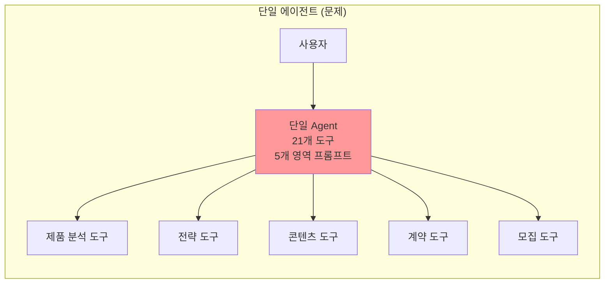
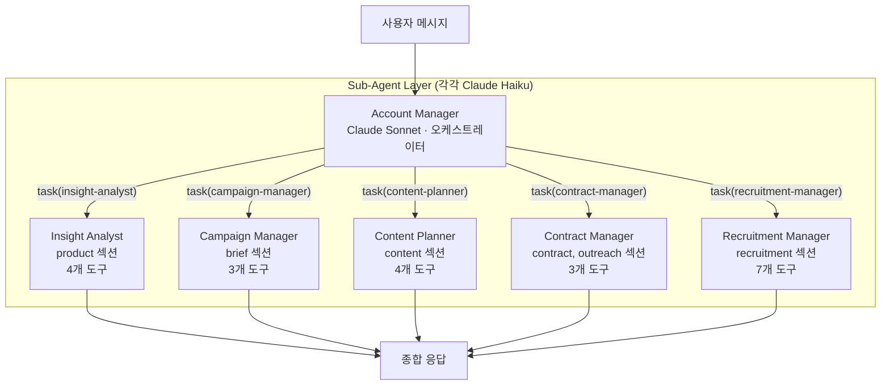
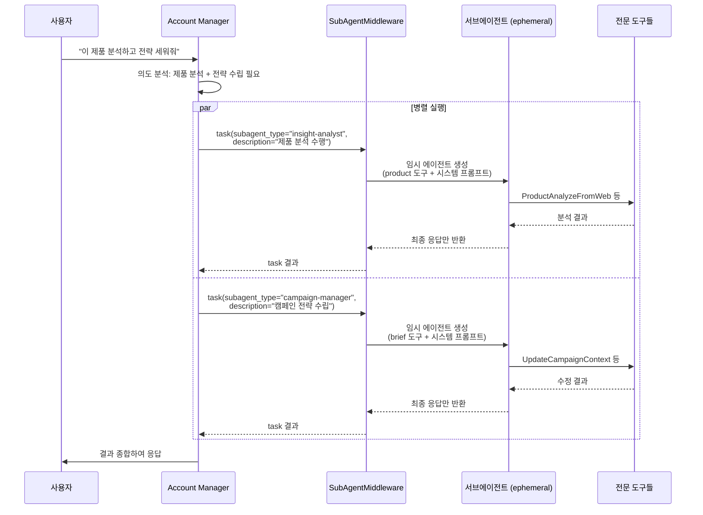
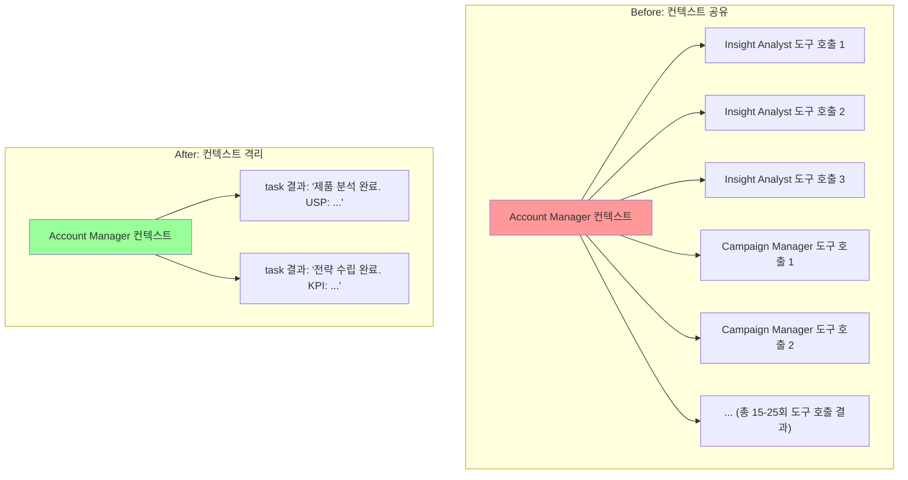
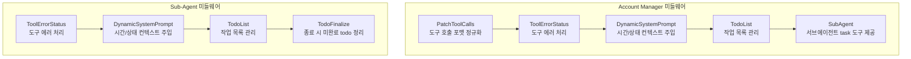
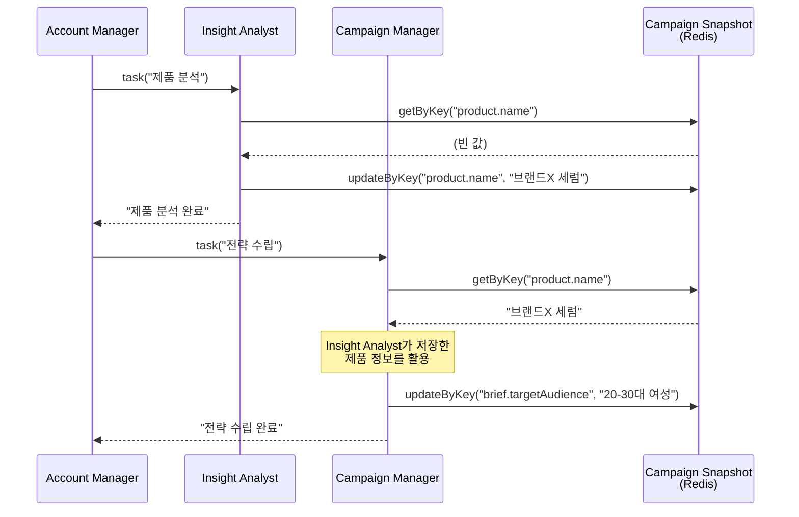

# 혼자 다 하는 AI는 없다 -- 팀장과 전문가 5명의 협업 구조

하나의 LLM에 모든 도구를 넣으면 어떻게 될까요? 도구가 20개를 넘어가면 잘못된 도구를 선택하는 빈도가 급증하고, 컨텍스트가 폭발하고, 응답 품질이 불안정해집니다. 킴프로에서는 Account Manager(팀장) 1명이 5명의 전문가 Agent를 지휘하는 멀티 에이전트 구조를 설계했습니다. 그 과정에서 만난 문제들과 해결책을 정리합니다.

## 왜 멀티 에이전트인가

인플루언서 마케팅 캠페인 기획에는 최소 5개 영역의 전문성이 필요합니다.

| 영역 | 필요한 전문성 | 사용 도구 수 |
|---|---|---|
| 제품 분석 | 웹 크롤링, USP 도출, 시장 조사 | 4개 |
| 전략 수립 | 타겟 오디언스, 예산 배분, KPI | 3개 |
| 콘텐츠 기획 | 톤앤매너, 레퍼런스 수집 | 4개 |
| 계약/섭외 | 계약 조건, 섭외 메시지 | 3개 |
| 크리에이터 모집 | 키워드 스코어링, 매칭, 성과 예측 | 7개 |

총 21개 도구. 하나의 Agent에 모두 넣으면 도구 선택 정확도가 떨어지고, 각 영역의 시스템 프롬프트가 서로 충돌합니다. "제품 분석할 때는 이렇게, 계약 조건 작성할 때는 저렇게" 같은 조건부 지시가 프롬프트를 비대하게 만듭니다.

### 단일 에이전트의 한계

단일 에이전트의 문제를 구체적으로 정리하면 다음과 같습니다.

1. **도구 선택 오류**: 21개 도구 중 올바른 도구를 고르는 정확도 하락
2. **프롬프트 충돌**: 영역별로 상반되는 지시("간결하게 작성" vs "상세하게 분석")가 공존
3. **컨텍스트 폭발**: 모든 도구 호출 결과가 하나의 컨텍스트에 누적

## 아키텍처 설계

### Account Manager + 5 Sub-Agent

### 역할 분리 원칙

**Account Manager (오케스트레이터)**
- 모델: Claude Sonnet (고성능 추론)
- 역할: 사용자 의도 파악, 작업 분배, 결과 종합
- 도구: GetCampaignContext (읽기 전용), GenerateChecklist, task (서브에이전트 호출)
- 특징: **데이터 쓰기 권한 없음**

**Sub-Agents (전문가)**
- 모델: Claude Haiku (빠른 실행)
- 역할: 담당 섹션 데이터 분석 및 업데이트
- 도구: GetCampaignContext, UpdateCampaignContext (도메인 제한), 영역별 전문 도구
- 특징: 각자 할당된 섹션만 수정 가능

오케스트레이터에 고성능 모델(Sonnet)을, 서브에이전트에 경량 모델(Haiku)을 배치한 것은 의도적입니다. 오케스트레이터는 "어떤 Agent에게 무엇을 시킬지" 판단하는 추론 능력이 중요하고, 서브에이전트는 도구를 정확히 호출하는 실행 능력이 중요합니다.

## Tool Calling 기반 서브에이전트 라우팅

### task 도구 패턴

서브에이전트를 호출하는 방식이 독특합니다. 별도의 라우팅 로직 없이, LLM의 Tool Calling 능력을 활용합니다.

Account Manager가 `task(subagent_type="insight-analyst", description="...")` 형태로 Tool Calling을 하면, SubAgentMiddleware가 해당 서브에이전트의 도구 세트와 시스템 프롬프트를 가진 **임시 에이전트**를 생성해서 실행합니다. 서브에이전트는 작업 완료 후 소멸하고, 최종 응답만 Account Manager에게 반환됩니다.

### 왜 Tool Calling인가

서브에이전트 라우팅 방식에는 여러 선택지가 있었습니다.

| 방식 | 장점 | 킴프로에 부적합한 이유 |
|---|---|---|
| 분류기 기반 라우팅 | 명시적 분류, 예측 가능 | 자연어 의도가 복잡할 때 분류기 한계 |
| Swarm (자유 핸드오프) | 유연한 에이전트 간 소통 | 제어 어려움, 무한 루프 위험 |
| Tool Calling | LLM이 자연스럽게 판단, 병렬 호출 가능 | -- |

Tool Calling의 결정적 장점은 **병렬 호출**입니다. LLM이 한 번의 응답에서 여러 `task` 호출을 동시에 생성할 수 있어, "제품 분석과 전략 수립을 병렬로" 같은 판단을 LLM 스스로 내립니다. 분류기 기반에서는 이런 병렬 판단을 하드코딩해야 합니다.

## 컨텍스트 격리

### 문제: 컨텍스트 오염

초기에는 서브에이전트가 Account Manager의 컨텍스트 내에서 직접 실행되었습니다. 5개 서브에이전트가 각각 3-5번씩 도구를 호출하면, 모든 중간 과정이 Account Manager의 메시지 히스토리에 쌓였습니다.

### 해결: Ephemeral Sub-Agent

서브에이전트는 **ephemeral(일회성)**으로 설계됩니다. SubAgentMiddleware가 서브에이전트를 생성할 때 체크포인터를 전달하지 않습니다. 즉, 서브에이전트는 독립된 컨텍스트에서 실행되고, 작업이 끝나면 중간 과정은 모두 폐기됩니다.

| 지표 | 컨텍스트 공유 | 컨텍스트 격리 |
|---|---|---|
| AM 컨텍스트 크기 (5개 에이전트 실행) | 80-120k 토큰 | 15-25k 토큰 |
| 도구 호출 결과 노출 | 전체 중간 과정 | 최종 응답만 |
| AM 판단력 | 중간 과정에 혼란 | 결과에 집중 |
| 토큰 비용 | 높음 (중간 과정 반복 전송) | 낮음 |

컨텍스트 격리로 Account Manager의 컨텍스트를 **약 80% 절감**하면서, 판단에 필요한 정보(최종 결과)는 유지했습니다.

## 미들웨어 기반 에이전트 행동 제어

각 에이전트에는 미들웨어 스택이 적용됩니다. Account Manager와 서브에이전트의 미들웨어 구성이 다릅니다.

### 미들웨어 역할 요약

| 미들웨어 | 역할 | 적용 대상 |
|---|---|---|
| PatchToolCalls | LLM이 반환한 도구 호출 포맷을 정규화 | AM만 |
| ToolErrorStatus | 도구 실행 에러를 LLM이 이해할 수 있는 메시지로 변환 | 전체 |
| DynamicSystemPrompt | 현재 시간, 타임존, 캠페인 상태를 시스템 프롬프트에 동적 주입 | 전체 |
| TodoList | 에이전트가 작업 목록을 관리하고 진행 상황을 추적 | 전체 |
| TodoFinalize | 서브에이전트 종료 시 in_progress 상태의 todo를 pending으로 복원 | Sub-Agent만 |
| SubAgent | task 도구를 제공하여 서브에이전트 호출 가능 | AM만 |

TodoFinalize 미들웨어가 서브에이전트에만 적용되는 이유는, 서브에이전트가 ephemeral이기 때문입니다. 서브에이전트가 작업 중 종료되면 `in_progress` 상태의 todo가 영원히 미완료로 남게 됩니다. TodoFinalize가 종료 시점에 이를 `pending`으로 되돌려서, Account Manager가 "이 작업은 아직 안 끝났구나"를 정확히 파악할 수 있게 합니다.

## 상태 공유 메커니즘

서브에이전트 간에는 직접적인 상태 공유가 없습니다. 대신, **캠페인 스냅샷(Redis)**이 공유 저장소 역할을 합니다.

서브에이전트들은 서로의 존재를 모릅니다. 하지만 캠페인 스냅샷을 통해 간접적으로 정보를 공유합니다. Insight Analyst가 저장한 제품 정보를 Campaign Manager가 읽어서 전략에 반영하는 식입니다. 이 설계의 장점은 **에이전트 간 결합도가 0**이라는 점입니다. 새로운 서브에이전트를 추가하거나 기존 것을 제거해도 다른 에이전트에 영향이 없습니다.

## 모델 선택 전략

| 역할 | 모델 | 선택 이유 |
|---|---|---|
| Account Manager | Claude Sonnet | 복잡한 의도 파악, 다중 task 판단, 결과 종합 |
| Sub-Agents (5개) | Claude Haiku | 도구 호출 정확도 충분, 빠른 실행, 낮은 비용 |

오케스트레이터에 Sonnet, 서브에이전트에 Haiku를 배치하면 비용 효율이 극적으로 개선됩니다. 서브에이전트는 "정해진 도구를 정확히 호출"하는 단순 작업이므로 Haiku로 충분합니다. 반면 Account Manager는 "사용자가 원하는 게 제품 분석인지, 전략 수정인지, 둘 다인지" 판단해야 하므로 추론 능력이 중요합니다.

## 핵심 인사이트

- **도구 수가 10개를 넘으면 멀티 에이전트가 필수**: 단일 에이전트에 21개 도구를 넣으면 선택 정확도가 급락. 영역별 전문 에이전트로 분리하면 각 에이전트가 3-7개 도구만 다루므로 정확도 유지
- **Tool Calling 기반 라우팅이 병렬 실행의 핵심**: LLM이 한 번의 응답에서 여러 task를 동시에 호출할 수 있어, "제품 분석과 전략 수립을 병렬로" 같은 판단을 자동으로 수행. 분류기 기반에서는 이를 하드코딩해야 함
- **Ephemeral 서브에이전트로 컨텍스트 80% 절감**: 서브에이전트의 중간 과정(도구 호출, 실패, 재시도)이 오케스트레이터에 노출되지 않아, 오케스트레이터의 판단력이 보존됨
- **오케스트레이터에 고성능 모델, 서브에이전트에 경량 모델**: 추론(의도 파악, 작업 분배)과 실행(도구 호출)의 난이도가 다르므로, 모델 티어를 다르게 배치하면 비용 대비 성능 최적화 가능
- **캠페인 스냅샷이 에이전트 간 결합도 0의 간접 통신 채널**: 서브에이전트들이 서로의 존재를 모르면서도 Redis 스냅샷을 통해 정보를 공유. 에이전트 추가/제거가 다른 에이전트에 영향 없음
- **미들웨어 구성의 차별화가 역할 분리를 강화**: Account Manager에만 SubAgent 미들웨어, 서브에이전트에만 TodoFinalize 미들웨어를 적용하여 역할에 맞는 행동 제어를 코드 레벨에서 보장
