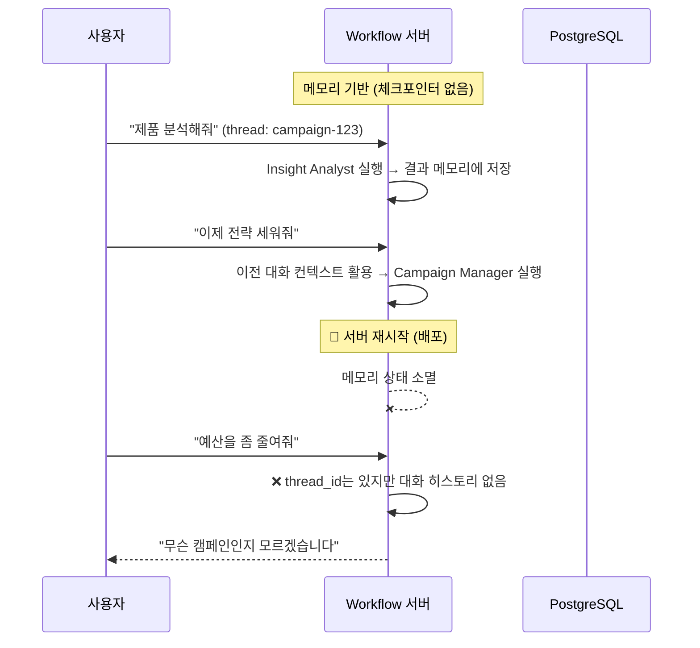
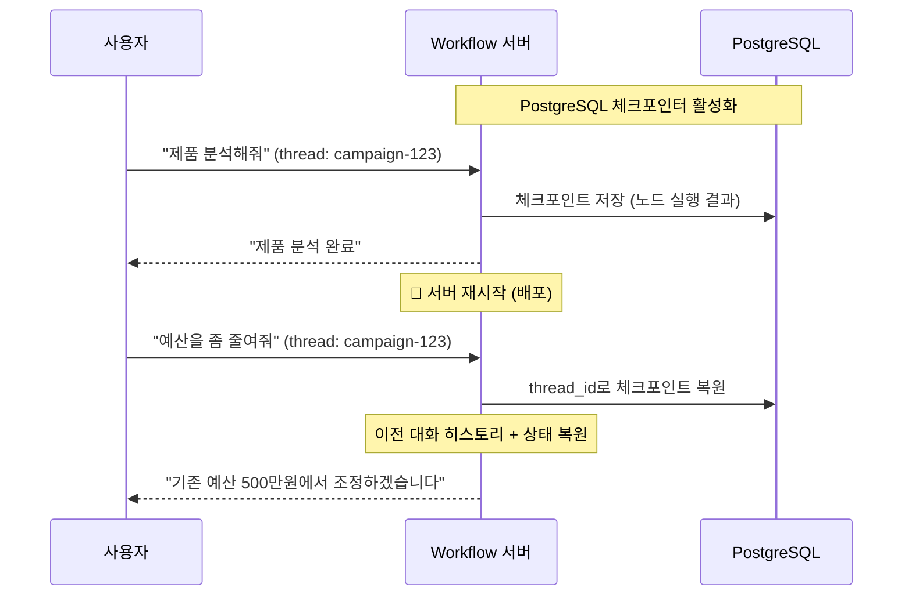
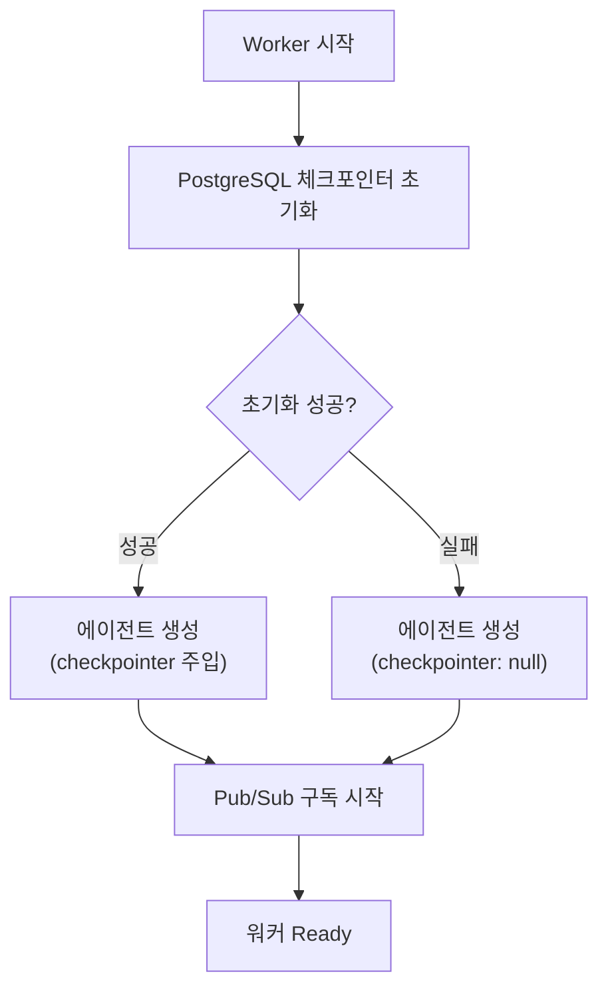

# 서버가 죽어도 워크플로우는 살아있다

Agent 워크플로우 하나가 30초에서 2분까지 걸립니다. 그 사이에 서버가 재시작되면 어떻게 될까요? 사용자가 "제품 분석하고 전략 세워줘"라고 요청했는데, 제품 분석이 끝나고 전략 수립 중에 배포가 일어나면 — 대화 히스토리가 날아가고, 같은 질문을 처음부터 다시 해야 합니다. LangGraph의 PostgreSQL 체크포인터로 이 문제를 해결한 과정을 정리합니다.

## 문제: 메모리 기반 상태의 취약성

LangGraph 에이전트는 기본적으로 상태를 메모리에 보관합니다. `thread_id`로 대화를 구분하고, 각 노드 실행 결과가 그래프 상태에 누적됩니다. 문제는 프로세스가 종료되는 순간 이 상태가 모두 사라진다는 것입니다.



PM2 무중단 배포를 사용하더라도, 워커 프로세스가 교체되는 순간 인메모리 상태는 사라집니다. 캠페인 하나에 대한 대화가 수십 턴 이어질 수 있는 구조에서, 이는 치명적입니다.

## 해결: PostgreSQL 체크포인터

LangGraph는 `CheckpointSaver` 인터페이스를 제공합니다. 이를 구현한 `PostgresSaver`를 에이전트 그래프에 주입하면, 노드가 실행될 때마다 그래프 상태를 PostgreSQL에 자동으로 저장합니다.



### 구현 구조

체크포인터 관리를 전담하는 서비스를 별도로 분리했습니다.

```typescript
// PostgresCheckpointService - 체크포인터 생명주기 관리
export class PostgresCheckpointService {
  private checkpointer: PostgresSaver | null = null;

  async initialize(): Promise<void> {
    const connectionString = this.buildConnectionString();
    this.checkpointer = PostgresSaver.fromConnString(connectionString);
    await this.setupWithRetry(); // 테이블 생성 (최대 3회 재시도)
  }

  getCheckpointer(): PostgresSaver | null {
    return this.checkpointer;
  }
}
```

핵심 설계는 **체크포인터 실패가 서비스 전체를 죽이지 않는다**는 점입니다. PostgreSQL 연결이 실패하면 `checkpointer`를 `null`로 두고 서비스는 계속 실행됩니다. 체크포인터 없이도 에이전트는 동작합니다 — 다만 서버 재시작 시 대화 히스토리가 유지되지 않을 뿐입니다.

### 워커 초기화 흐름

Workflow Worker가 시작될 때 체크포인터를 초기화하고 에이전트에 주입하는 흐름입니다.



### thread_id = campaignId

체크포인터의 `thread_id`로 캠페인 ID를 사용합니다. 이 선택이 자연스러운 이유는, 킴프로에서 하나의 캠페인이 하나의 대화 스레드와 1:1로 대응하기 때문입니다.

```typescript
const config = {
  configurable: { thread_id: campaignId },
  streamMode: ['messages', 'updates', 'tasks'],
  subgraphs: true,
  recursionLimit: 50,
};

const stream = await agentService.graph.stream(input, config);
```

같은 `campaignId`로 스트리밍을 시작하면, PostgreSQL에서 해당 캠페인의 이전 상태를 자동으로 복원합니다. 에이전트는 "이전에 제품 분석을 했고, 전략까지 수립했다"는 컨텍스트를 가진 채로 새 메시지를 처리합니다.

## 서브에이전트는 왜 체크포인트를 안 쓰나

Account Manager(오케스트레이터)에만 체크포인터를 적용하고, 5개 서브에이전트에는 적용하지 않습니다. 서브에이전트는 ephemeral(일회성)으로 설계되어 있기 때문입니다.

| 에이전트 | 체크포인터 | 이유 |
|---|---|---|
| Account Manager | PostgreSQL | 캠페인별 대화 히스토리 유지 필요 |
| Sub-Agents (5개) | 없음 | 호출 시 생성 → 작업 완료 → 소멸. 상태 유지 불필요 |

서브에이전트는 "제품 분석 수행"이라는 단일 작업을 받아 실행하고 결과만 반환합니다. 중간 상태를 저장할 이유가 없습니다. 오히려 체크포인터를 붙이면 불필요한 PostgreSQL 쓰기가 발생하고, 이전 실행의 찌꺼기가 다음 실행에 영향을 줄 위험이 있습니다.

## 핵심 인사이트

- **체크포인터 실패를 치명적 에러로 취급하지 않는 것이 핵심**: PostgreSQL이 일시적으로 불가용해도 에이전트는 동작해야 함. graceful degradation 설계
- **thread_id를 비즈니스 엔티티 ID와 일치시키면 관리가 단순해짐**: 캠페인 = 대화 스레드 = 체크포인트 키. 별도 매핑 테이블 불필요
- **모든 에이전트에 체크포인터를 붙이는 것이 능사가 아님**: 일회성 서브에이전트에는 오히려 부담. 오케스트레이터에만 적용하여 영속화 범위를 최소화
