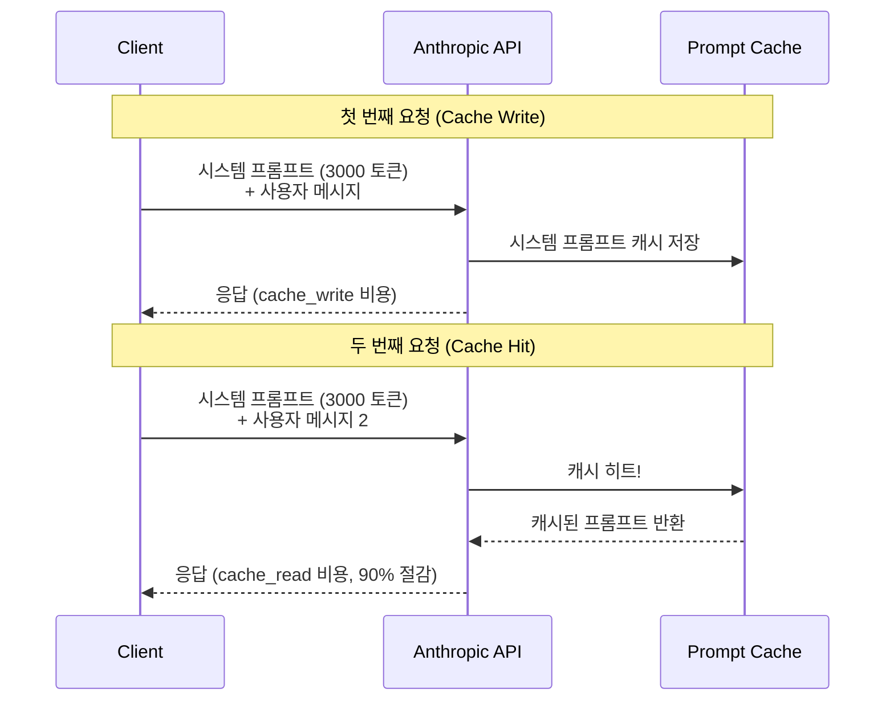
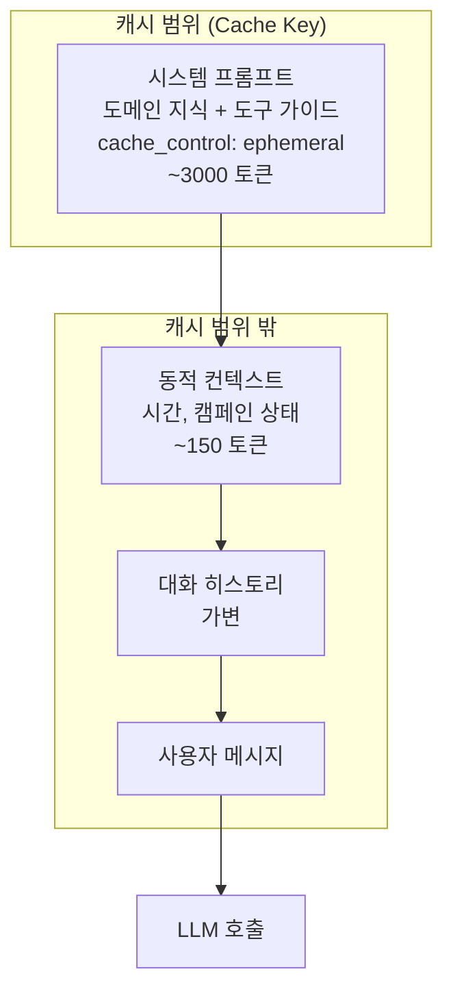
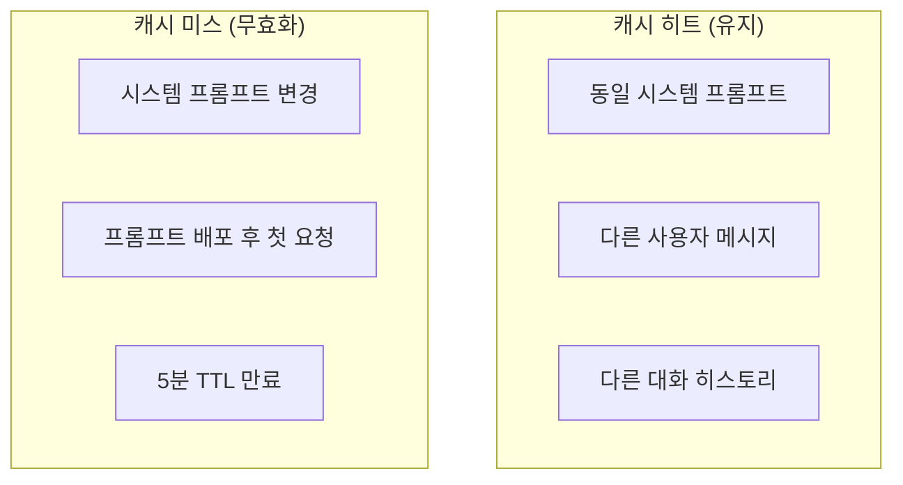
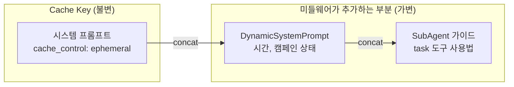

# 매번 같은 프롬프트를 보내는데 매번 돈을 내야 해?

킴프로의 에이전트 시스템은 Claude를 사용합니다. 오케스트레이터 에이전트의 시스템 프롬프트는 도메인 지식, 도구 사용법, 서브에이전트 가이드를 포함해 수천 토큰에 달합니다. 서브에이전트 5개도 각각 도메인별 시스템 프롬프트를 가지고 있습니다. 사용자가 채팅 메시지를 보낼 때마다 이 시스템 프롬프트 전체가 API에 전송되고, 매번 입력 토큰 비용이 발생합니다. 한 세션에서 20번 대화하면, 동일한 시스템 프롬프트를 20번 보내고 20번 과금됩니다. Anthropic Prompt Caching을 적용해 이 비용을 90% 절감한 과정을 정리합니다.

## Anthropic Prompt Caching이란

Prompt Caching은 Anthropic API의 기능으로, 요청 간에 동일한 프롬프트 prefix를 캐시해 재사용합니다. 첫 번째 요청에서 캐시를 생성(write)하고, 이후 요청에서 캐시된 prefix가 일치하면 캐시 히트(read)가 발생해 비용과 지연 시간이 줄어듭니다.



### 가격 구조

캐시 TTL은 5분과 1시간 두 가지 옵션이 있습니다. 킴프로는 에이전트 세션 특성상 대화가 수분 내에 집중되므로, 기본 5분 TTL(`ephemeral`)을 사용합니다.

| 모델 | 일반 입력 | Cache Write (5분) | Cache Read | 절감율 (Read 기준) |
|---|---|---|---|---|
| Claude 4.6 Sonnet | $3 / MTok | $3.75 / MTok | **$0.30** / MTok | **90%** |
| Claude 4.5 Haiku | $1 / MTok | $1.25 / MTok | **$0.10** / MTok | **90%** |
| Claude 4.6 Opus | $5 / MTok | $6.25 / MTok | **$0.50** / MTok | **90%** |

Cache Write는 일반 입력 대비 25% 비싸지만, 이후 Cache Read는 90% 저렴합니다. 한 세션에서 2회 이상 호출하면 손익분기를 넘깁니다.

## 킴프로의 캐싱 전략

### 무엇을 캐시하는가

에이전트 시스템에서 캐시 대상을 선정하는 기준은 "불변성"과 "크기"입니다.

| 구성 요소 | 변경 빈도 | 크기 | 캐시 대상 |
|---|---|---|---|
| 시스템 프롬프트 (도메인 지식) | 배포 시에만 변경 | 2000-4000 토큰 | **O** |
| 서브에이전트 가이드 (task 사용법) | 배포 시에만 변경 | 500-1000 토큰 | **O** |
| 동적 컨텍스트 (시간, 상태) | 매 요청마다 변경 | 100-200 토큰 | X |
| 대화 히스토리 | 매 턴마다 증가 | 가변 | X |

### cache_control 태그 전략

Anthropic의 캐싱은 `cache_control: { type: 'ephemeral' }` 태그가 달린 content 블록까지를 캐시 키로 사용합니다. 태그 이전의 모든 내용이 동일하면 캐시 히트가 발생합니다.



핵심은 **DynamicSystemPrompt 미들웨어와의 협력**입니다. 시스템 프롬프트는 `cache_control` 태그와 함께 불변 블록으로 전송되고, 미들웨어가 추가하는 동적 컨텍스트(시간, 캠페인 상태)는 별도 텍스트로 뒤에 붙습니다. 이 구조 덕분에 시스템 프롬프트의 캐시 키가 매번 동일하게 유지됩니다.

### LangChain에서의 구현 — SystemMessage content 블록

LangChain의 `SystemMessage`에 content를 배열 형태로 전달하면, Anthropic API의 content block 구조에 매핑됩니다.

```
SystemMessage({
  content: [
    {
      type: 'text',
      text: SYSTEM_PROMPT,       // 불변 프롬프트
      cache_control: { type: 'ephemeral' }  // 캐시 태그
    }
  ]
})
```

`createAgent` 호출 시 `systemPrompt` 파라미터에 이 SystemMessage를 전달하면, 모든 LLM 호출에서 동일한 캐시 키로 시스템 프롬프트가 전송됩니다.

## 비용 절감 시뮬레이션

### 시나리오: 오케스트레이터 에이전트 1세션

오케스트레이터(AccountManager)가 Claude Sonnet을 사용하고, 시스템 프롬프트가 3000 토큰이며, 한 세션에서 평균 15회 LLM 호출이 발생한다고 가정합니다.

**캐싱 없이:**

| 항목 | 토큰 | 단가 | 비용 |
|---|---|---|---|
| 시스템 프롬프트 x 15회 | 45,000 | $3/MTok | $0.135 |

**캐싱 적용:**

| 항목 | 토큰 | 단가 | 비용 |
|---|---|---|---|
| Cache Write (1회) | 3,000 | $3.75/MTok | $0.01125 |
| Cache Read (14회) | 42,000 | $0.30/MTok | $0.01260 |
| **합계** | | | **$0.02385** |

**세션당 절감: $0.135 -> $0.024 = 82% 절감**

### 시스템 전체 비용 영향

오케스트레이터뿐 아니라, 5개 서브에이전트도 각각 시스템 프롬프트 캐싱을 적용합니다.

| 에이전트 | 시스템 프롬프트 크기 | 세션당 호출 횟수 | 캐싱 절감율 |
|---|---|---|---|
| AccountManager (오케스트레이터) | ~3000 토큰 | ~15회 | 82% |
| InsightAnalyst | ~2000 토큰 | ~5회 | 75% |
| CampaignManager | ~2000 토큰 | ~5회 | 75% |
| ContentPlanner | ~2500 토큰 | ~4회 | 72% |
| ContractManager | ~2000 토큰 | ~3회 | 66% |
| RecruitmentManager | ~2000 토큰 | ~3회 | 66% |

서브에이전트는 ephemeral이라 세션당 호출 횟수가 적어 절감율이 오케스트레이터보다 낮습니다. 하지만 서브에이전트가 여러 번 spawn되는 복합 요청에서는 캐시가 세션 간에도 히트할 수 있어 추가 절감이 발생합니다.

### 월간 비용 추정

일일 활성 세션 100개, 월 22영업일 기준:

| 항목 | 캐싱 없이 | 캐싱 적용 | 절감액 |
|---|---|---|---|
| 시스템 프롬프트 입력 비용 | ~$660/월 | ~$135/월 | **~$525/월** |

## 지연 시간(Latency) 개선

비용 절감 외에도 캐시 히트 시 TTFT(Time to First Token)가 개선됩니다.

| 측정 | 캐싱 없이 | Cache Hit |
|---|---|---|
| TTFT (시스템 프롬프트 3000 토큰) | ~800ms | ~400ms |
| TTFT 개선율 | - | ~50% 단축 |

Anthropic 공식 문서에 따르면, 캐시 히트 시 긴 프롬프트의 TTFT가 최대 85%까지 줄어들 수 있습니다. 실제 개선율은 프롬프트 크기에 비례합니다.

## 캐싱의 한계와 트레이드오프

### 캐시 무효화 조건



**TTL 만료**: 5분간 해당 프롬프트로 요청이 없으면 캐시가 만료됩니다. 사용자가 5분 이상 입력 없이 대기하면 다음 요청에서 Cache Write가 다시 발생합니다. 하지만 비용은 일반 입력 대비 25%만 추가이므로, 캐시 미스의 페널티는 작습니다.

**프롬프트 변경**: 시스템 프롬프트가 변경되면(배포 시) 캐시가 무효화됩니다. 이는 의도된 동작입니다. 새 프롬프트가 적용되어야 하므로 캐시가 깨지는 것이 올바릅니다.

### 최소 토큰 제한

Anthropic Prompt Caching은 캐시할 content 블록이 최소 1024 토큰 이상이어야 합니다 (Sonnet/Opus 기준, Haiku는 2048 토큰). 시스템 프롬프트가 이 임계값 미만이면 캐싱이 적용되지 않습니다.

| 모델 | 최소 캐시 토큰 | 킴프로 시스템 프롬프트 | 적용 가능 |
|---|---|---|---|
| Sonnet / Opus | 1024 토큰 | 2000-4000 토큰 | O |
| Haiku | 2048 토큰 | 2000-4000 토큰 | O (대부분) |

### 비용 역전 지점

Cache Write가 일반 입력보다 25% 비싸므로, 세션에서 1회만 호출하면 오히려 손해입니다.

| 세션 내 호출 횟수 | 캐싱 없이 비용 | 캐싱 적용 비용 | 손익 |
|---|---|---|---|
| 1회 | $0.009 | $0.01125 (Write만) | -25% (손해) |
| 2회 | $0.018 | $0.01425 | +21% (이득) |
| 5회 | $0.045 | $0.01725 | +62% (이득) |
| 15회 | $0.135 | $0.02385 | +82% (이득) |

2회 이상 호출하면 즉시 이득이 시작됩니다. 킴프로의 에이전트 세션은 평균 15회 이상 호출하므로, 캐싱 적용이 명백히 유리합니다.

## DynamicSystemPrompt 미들웨어와의 시너지

이 캐싱 전략이 동작하려면 DynamicSystemPrompt 미들웨어의 설계가 핵심입니다. 미들웨어 파이프라인 글에서 다뤘듯이, 미들웨어는 기존 시스템 프롬프트를 수정하지 않고 뒤에 텍스트를 추가합니다.



만약 미들웨어가 시스템 프롬프트를 "수정"했다면 (예: 기존 텍스트 앞에 시간 정보를 삽입), 캐시 키가 매번 달라져 캐싱이 무력화됩니다. 뒤에 추가(concat)하는 설계가 캐싱과 동적 컨텍스트 주입을 양립시키는 열쇠입니다.

## 핵심 인사이트

- **프롬프트 캐싱은 가장 ROI 높은 LLM 비용 최적화다**: 코드 한 줄(cache_control 태그)로 시스템 프롬프트 비용 90% 절감. 프롬프트 압축이나 모델 변경 같은 품질 트레이드오프 없이 순수 비용 절감
- **캐싱을 고려한 프롬프트 구조 설계가 필요하다**: 불변 부분과 가변 부분을 명확히 분리하고, cache_control 태그를 불변 부분에만 적용해야 캐시 히트율 극대화. 이 분리는 미들웨어 아키텍처 수준에서 강제됨
- **2회 호출이면 손익분기, 에이전트 세션은 항상 이득**: Cache Write의 25% 추가 비용은 2회 이상 호출 시 즉시 회수됨. 에이전트 세션은 평균 15회 이상 호출하므로 캐싱이 항상 유리
- **비용 절감과 지연 시간 개선이 동시에 달성된다**: 캐시 히트 시 TTFT가 최대 50% 단축되어, 사용자 체감 응답 속도도 개선. 비용과 성능 사이의 트레이드오프가 아니라 둘 다 개선
- **서브에이전트의 ephemeral 특성이 캐싱 효과를 확대**: 서브에이전트가 동일 세션에서 여러 번 spawn되면, 같은 시스템 프롬프트에 대한 캐시 히트가 누적됨. 오케스트레이터-서브에이전트 아키텍처가 캐싱 ROI를 높이는 구조적 이점
- **TTL 5분은 에이전트 세션 패턴에 최적**: 대화가 집중되는 에이전트 세션에서 5분 TTL은 충분하고, 세션이 끝나면 자연스럽게 캐시가 만료되어 메모리 낭비 없음
