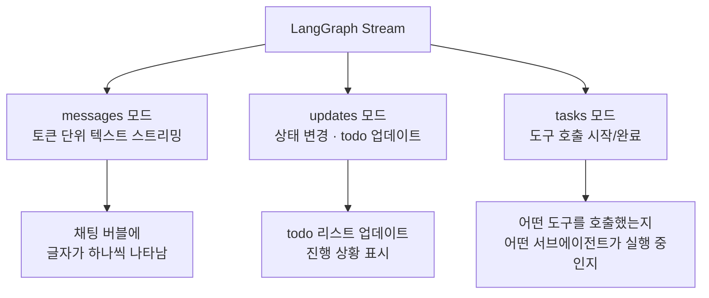
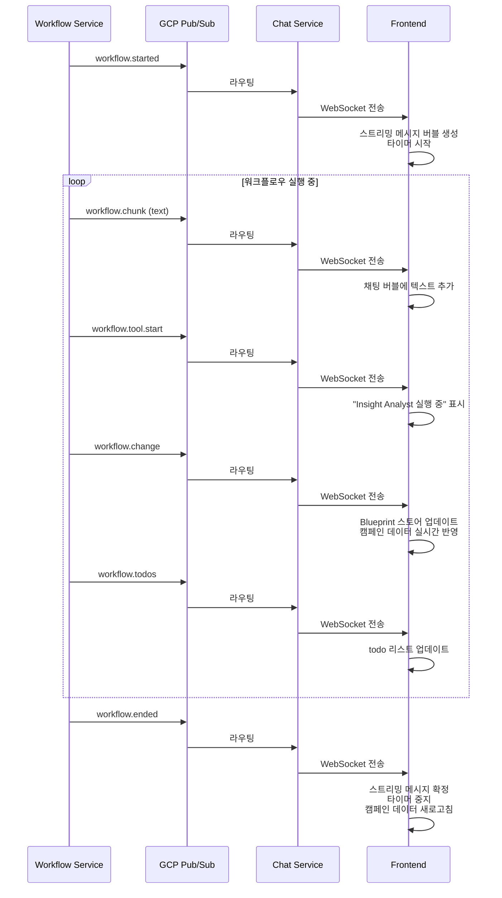
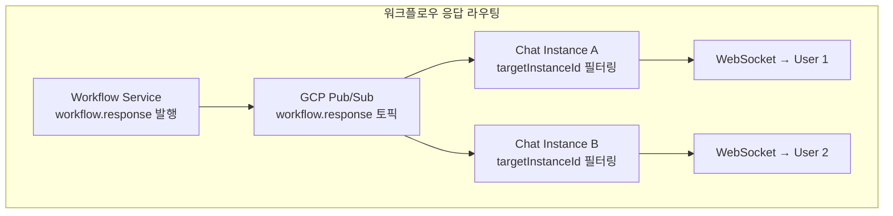
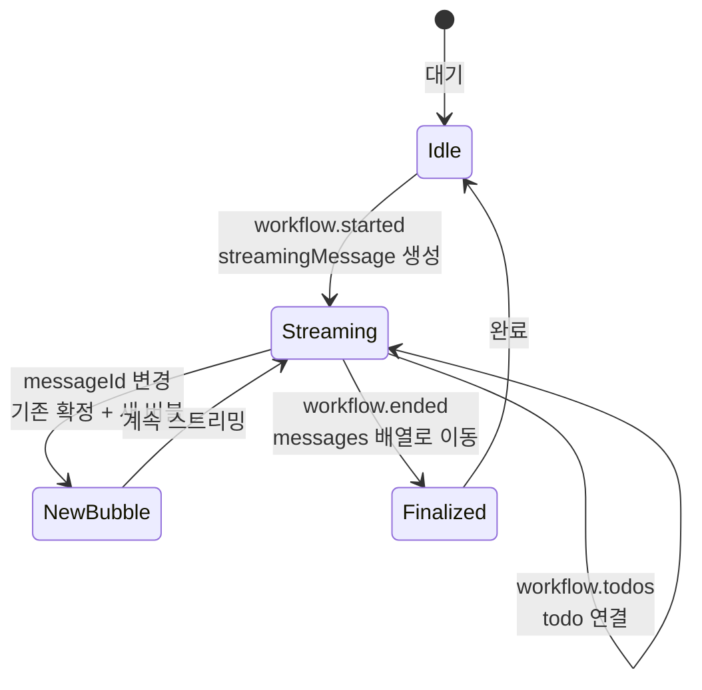
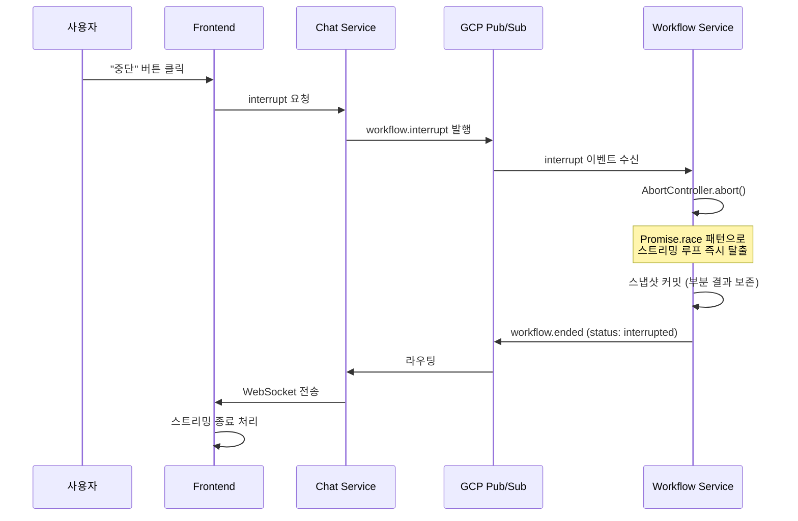
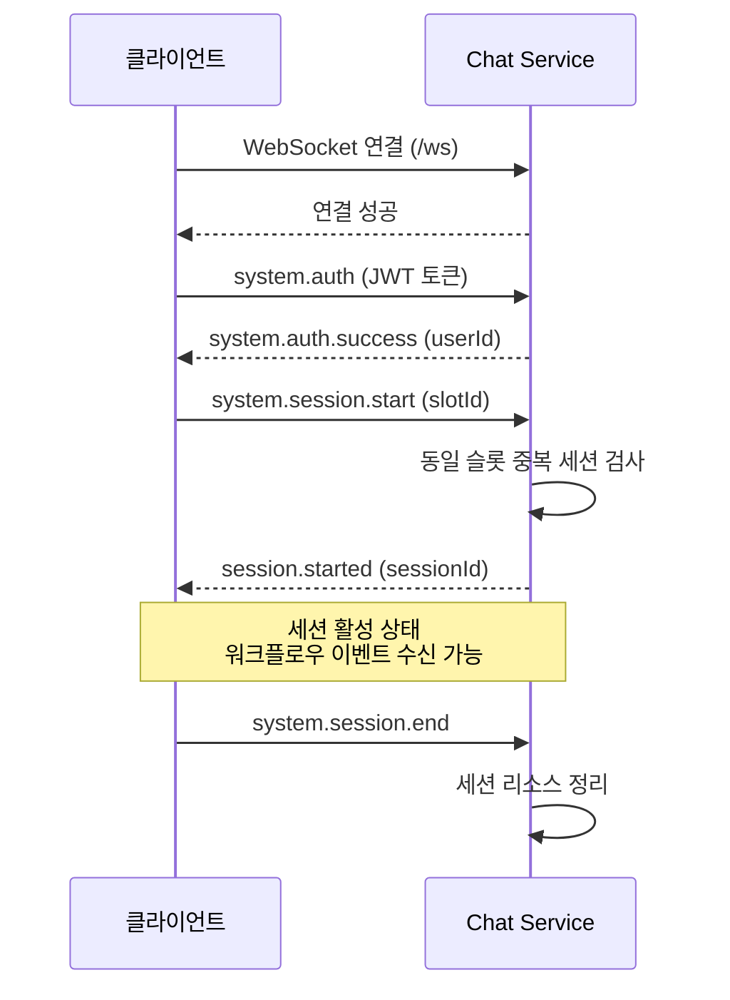

# AI가 일하는 동안 사용자는 뭘 보고 있지?

AI Agent가 캠페인 기획을 완성하는 데 1-3분이 걸립니다. 그 동안 사용자에게 "처리 중..." 스피너만 보여주면? 사용자는 "작동하는 건 맞아?"라고 불안해하고, 30초 뒤에 새로고침을 누릅니다. Agent가 일하는 과정을 실시간으로 스트리밍하여, 사용자가 "지금 어디까지 했는지"를 항상 알 수 있게 만든 과정을 정리합니다.

## 문제 정의: Agent 작업의 불투명성

### Agent 워크플로우의 특성

전통적 API 호출은 보통 1-2초 안에 응답합니다. 하지만 Agent 워크플로우는 다릅니다.

| 특성 | 전통적 API | Agent 워크플로우 |
|---|---|---|
| 응답 시간 | 1-2초 | 30초 - 3분 |
| 중간 과정 | 없음 | 도구 호출, 분석, 데이터 수정 다수 |
| 병렬 작업 | 없음 | 서브에이전트 5개 동시 실행 |
| 진행 상황 | 필요 없음 | 사용자에게 필수 |

Agent가 1분 동안 조용히 작업한 뒤 결과만 보여주면, 사용자는 그 1분을 불안하게 기다려야 합니다. "지금 제품 분석 중입니다", "전략 수립을 시작합니다" 같은 중간 피드백이 있으면 체감 대기 시간이 극적으로 줄어듭니다.

## 3가지 스트리밍 모드

LangGraph의 스트림은 3가지 모드를 동시에 지원합니다. 각 모드가 서로 다른 정보를 전달합니다.

### 모드별 역할 상세

| 모드 | 전달 내용 | 프론트엔드 활용 | 발생 빈도 |
|---|---|---|---|
| messages | AI 응답 텍스트 (토큰 단위) | 채팅 버블에 실시간 타이핑 효과 | 매우 높음 (초당 수십 회) |
| updates | todo 목록 변경, AI 메시지 완성 | 작업 진행률 표시, 히스토리 기록 | 중간 (도구 호출 전후) |
| tasks | 도구 호출 시작/완료, 서브에이전트 매핑 | "Insight Analyst가 제품 분석 중" 표시 | 낮음 (도구 호출 시) |

3가지 모드를 동시에 구독하는 이유는, 각 모드가 **서로 다른 추상 수준의 정보**를 제공하기 때문입니다. messages는 "무슨 말을 하고 있는지", tasks는 "무슨 행동을 하고 있는지", updates는 "상태가 어떻게 변했는지"를 알려줍니다.

## 전체 스트리밍 파이프라인

```mermaid
flowchart LR
    subgraph "Workflow Service"
        Agent[AI Agent<br/>LangGraph] -->|stream| Handler[WorkflowRequestHandler<br/>청크 분류 · 이벤트 생성]
    end

    subgraph "Messaging Layer"
        Handler -->|publish| PubSub[GCP Pub/Sub<br/>workflow.response 토픽]
        PubSub -->|subscribe| Router[WorkflowResponseRouter<br/>캠페인→Chat 인스턴스 매핑]
    end

    subgraph "Chat Service (Ambassador)"
        Router -->|deliver| ChatHandler[WorkflowResponseHandler<br/>이벤트 필터링]
        ChatHandler -->|send| WS[WebSocket<br/>클라이언트 연결]
    end

    subgraph "Frontend"
        WS -->|event| Handlers[이벤트 핸들러<br/>스토어 업데이트]
        Handlers --> ChatUI[채팅 UI<br/>실시간 렌더링]
    end
```

### 왜 직접 WebSocket이 아닌가

Workflow Service가 클라이언트에 직접 WebSocket을 열지 않는 이유는 아키텍처 분리 때문입니다.

| 구조 | 장점 | 단점 |
|---|---|---|
| Workflow → 직접 WebSocket | 단순, 지연 시간 최소 | Workflow가 연결 상태 관리 필요, 스케일링 어려움 |
| Workflow → Pub/Sub → Chat → WebSocket | 서비스 간 결합도 0, 독립 스케일링 | 지연 시간 약간 증가 |

Workflow Service는 PM2로 관리되는 워커 프로세스입니다. 클라이언트 연결을 직접 관리하면 워커 재시작 시 모든 연결이 끊어집니다. Pub/Sub를 중간에 두면, Workflow 워커가 재시작되어도 Chat 서비스의 WebSocket 연결은 유지됩니다.

## 이벤트 타입별 처리

### Workflow 이벤트 흐름

### 이벤트 타입 목록

| 이벤트 | 발생 시점 | 프론트엔드 처리 |
|---|---|---|
| workflow.started | 워크플로우 시작 | 스트리밍 버블 생성, UI 상태를 "running"으로 |
| workflow.chunk | AI 텍스트 출력 시 | 채팅 버블에 텍스트 추가 (타이핑 효과) |
| workflow.tool.start | 도구 호출 시작 | 활성 도구 노드 표시 |
| workflow.tool.end | 도구 호출 완료 | 활성 도구 노드 해제 |
| workflow.change | 캠페인 데이터 수정 시 | Blueprint 스토어 실시간 업데이트 |
| workflow.todos | todo 목록 변경 시 | 작업 진행 상황 표시 |
| workflow.ended | 워크플로우 종료 | 스트리밍 확정, 캠페인 데이터 갱신 |
| workflow.error | 에러 발생 | 에러 메시지 표시 |

## Pub/Sub 기반 서비스 라우팅

### 캠페인 → Chat 인스턴스 매핑

하나의 캠페인에 여러 Chat 인스턴스가 연결될 수 있습니다 (같은 캠페인을 여러 사용자가 동시에 보는 경우). WorkflowResponseRouter가 이 매핑을 관리합니다.

Workflow Service는 응답 발행 시 `targetInstanceId` 속성을 메시지에 포함합니다. 각 Chat 인스턴스는 자신의 인스턴스 ID와 일치하는 메시지만 처리합니다. 이 패턴으로 하나의 Pub/Sub 토픽을 여러 Chat 인스턴스가 공유하면서도, 각자 필요한 메시지만 수신합니다.

### History 토픽 분리

스트리밍 청크(workflow.chunk)는 History 토픽에 발행하지 않습니다. 토큰 단위 텍스트는 저장 가치가 없고, 양이 많아 저장 비용이 높습니다. 대신 updates 모드에서 완성된 AI 메시지를 History 토픽에 발행합니다.

| 이벤트 | workflow.response 발행 | workflow.history 발행 |
|---|---|---|
| workflow.chunk | O | X (저장 불필요) |
| workflow.started | O | O |
| workflow.ended | O | O |
| workflow.change | O | O |
| workflow.tool.start | O | O |

## 프론트엔드 이벤트 처리

### 스트리밍 메시지 관리

프론트엔드에서는 `streamingMessage`라는 개념으로 현재 진행 중인 AI 응답을 관리합니다.

하나의 워크플로우에서 Account Manager가 여러 번 응답할 수 있습니다 (서브에이전트 결과를 종합하며 중간 코멘트를 다는 경우). `messageId`가 변경되면 기존 스트리밍 메시지를 확정하고 새 버블을 시작합니다.

### 서브에이전트 텍스트 필터링

Account Manager의 텍스트만 채팅 버블에 표시합니다. 서브에이전트의 텍스트는 사용자에게 직접 보여주지 않습니다. 서브에이전트의 출력은 Account Manager에게 반환되어 종합된 형태로 사용자에게 전달됩니다.

이 설계의 이유는 UX 일관성입니다. 사용자는 "한 명의 AI 비서"와 대화하는 느낌을 받아야 합니다. 5개 서브에이전트의 메시지가 동시에 쏟아지면 혼란스럽습니다.

## 중단(Interrupt) 처리

사용자가 워크플로우를 중단하면 AbortController 패턴으로 스트리밍을 즉시 종료합니다.

### Promise.race 패턴

스트리밍 루프에서 `Promise.race`를 사용하여 두 가지 promise를 경합시킵니다.
1. 다음 스트림 청크를 가져오는 promise
2. abort 시그널이 발생하면 즉시 resolve되는 promise

abort 시그널이 먼저 resolve되면 스트리밍 루프를 즉시 탈출합니다. 이 패턴으로 "도구 호출이 30초째 실행 중"인 상황에서도 사용자의 중단 요청을 즉시 처리할 수 있습니다.

## WebSocket 세션 라이프사이클

모든 메시지는 Zod 스키마로 검증됩니다. 잘못된 형식의 메시지가 오면 구체적인 에러 코드와 함께 거부합니다. 인증 전에 세션 시작을 요청하면 `NOT_AUTHENTICATED` 에러를 반환합니다.

## 핵심 인사이트

- **3가지 스트리밍 모드가 서로 다른 추상 수준의 정보를 제공**: messages는 "무슨 말을", tasks는 "무슨 행동을", updates는 "상태가 어떻게 변했는지"를 전달. 세 가지를 조합해야 완전한 실시간 경험 가능
- **Pub/Sub 중간 레이어가 서비스 독립 스케일링의 핵심**: Workflow 워커가 재시작되어도 Chat 서비스의 WebSocket 연결은 유지. 워커와 Chat 인스턴스를 독립적으로 증감 가능
- **서브에이전트 텍스트를 필터링하여 "한 명의 AI 비서" UX 유지**: 5개 서브에이전트의 메시지가 동시에 표시되면 혼란. Account Manager의 텍스트만 표시하여 일관된 대화 경험 제공
- **Promise.race 패턴으로 장시간 도구 호출 중에도 즉시 중단 가능**: 일반적인 스트리밍 루프에서는 현재 청크가 끝나야 중단 가능하지만, Promise.race로 abort 시그널과 경합시키면 즉시 탈출
- **스트리밍 청크는 History에 저장하지 않는 것이 비용 최적화**: 토큰 단위 텍스트 청크는 저장 가치 없음. 완성된 메시지만 History 토픽에 발행하여 저장 비용 절감
- **targetInstanceId 기반 메시지 필터링으로 단일 토픽에서 멀티 인스턴스 라우팅**: 캠페인별로 토픽을 만들지 않고, 하나의 workflow.response 토픽에 인스턴스 ID 속성을 붙여 필터링. 토픽 관리 복잡도를 대폭 줄임
