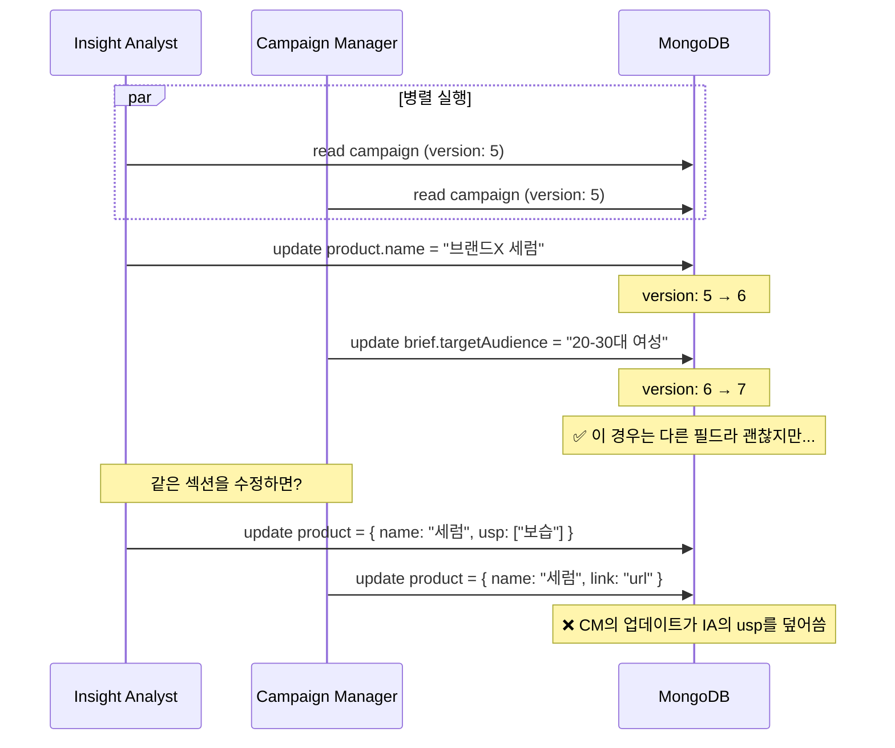
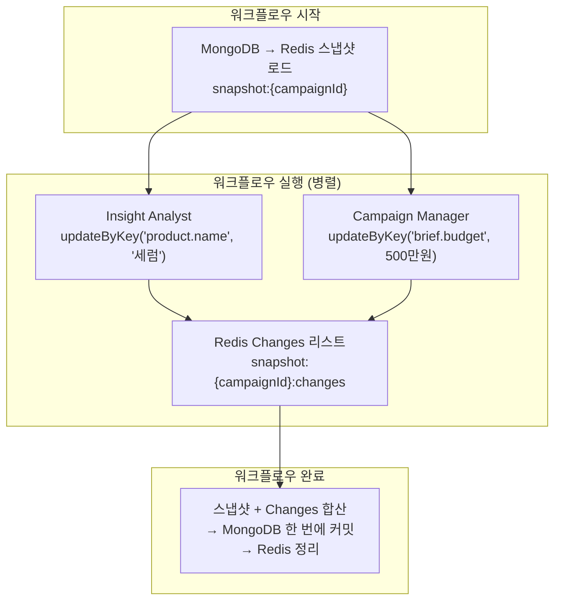
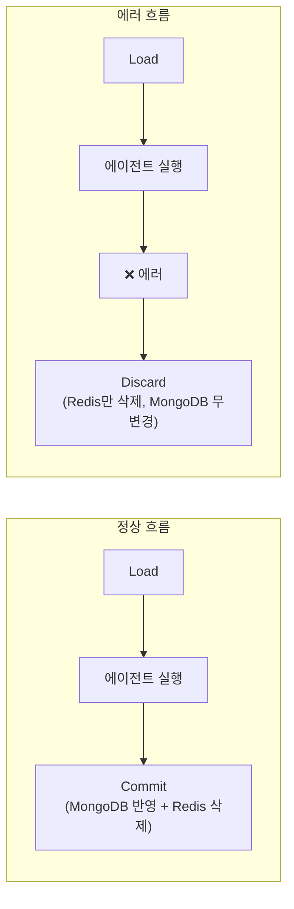

# 에이전트 5명이 동시에 캠페인을 수정하면

Account Manager가 "제품 분석하면서 전략도 세워줘"라고 판단하면, Insight Analyst와 Campaign Manager가 **동시에** 실행됩니다. 둘 다 같은 캠페인 데이터를 읽고 수정합니다. Insight Analyst가 `product.name`을 쓰는 동안 Campaign Manager가 `brief.targetAudience`를 쓰면, 마지막에 쓴 쪽이 다른 쪽의 변경을 덮어쓸 수 있습니다. Redis 기반 스냅샷 패턴으로 이 문제를 해결한 과정을 정리합니다.

## 문제: 동시 쓰기 충돌

멀티에이전트 시스템에서 서브에이전트들은 병렬로 실행됩니다. 각 서브에이전트가 MongoDB의 캠페인 도큐먼트를 직접 수정한다면 어떻게 될까요?



MongoDB의 `$set`으로 필드 단위 업데이트를 하더라도, 섹션 전체를 교체하는 경우에는 충돌이 발생합니다. 그리고 에이전트의 도구 호출 패턴상 섹션 전체를 한 번에 쓰는 경우가 빈번합니다.

## 해결: Redis 스냅샷 + Changes 리스트

직접 MongoDB를 수정하는 대신, 워크플로우 실행 동안 Redis에 스냅샷을 만들고 변경사항을 리스트로 쌓는 패턴을 적용했습니다.



### 핵심 메커니즘: 필드 레벨 Changes

서브에이전트는 `updateByKey(campaignId, key, value)` 형태로 필드 단위 수정만 합니다. 각 수정은 MongoDB에 바로 쓰이지 않고, Redis의 Changes 리스트에 순서대로 쌓입니다.

```typescript
// CampaignSnapshotService.updateByKey
async updateByKey(campaignId: string, key: CampaignKey, value: unknown) {
  const snapshot = await this.getSnapshot(campaignId);

  // 이전 값 기록 (롤백/감사 용도)
  const previousValue = this.getNestedValue(snapshot.data, key);

  const change: Change = {
    key,           // "product.name"
    previousValue, // "이전 제품명"
    newValue: value // "브랜드X 세럼"
  };

  // Redis 리스트에 순서대로 추가
  await this.redis.rpush(changesKey, JSON.stringify(change));
}
```

읽기(`getByKey`)를 할 때는 원본 스냅샷에 Changes를 순서대로 적용한 결과를 반환합니다. 이렇게 하면 Insight Analyst가 `product.name`을 수정한 후 Campaign Manager가 `product.name`을 읽으면, 최신 값을 볼 수 있습니다.

### 왜 충돌이 안 나는가

비밀은 **수정 단위가 dot-notation 키**라는 점입니다. `product.name`과 `brief.budget`은 서로 다른 키이므로 Changes 리스트에 순서대로 쌓여도 충돌하지 않습니다. 같은 키를 두 에이전트가 수정하면? 나중에 쓴 값이 이기지만, 이는 의도된 동작입니다 — 각 서브에이전트는 자신의 담당 섹션만 수정하도록 도메인이 제한되어 있기 때문입니다.

```typescript
// UpdateCampaignContextTool - 도메인 제한
constructor(options: { domains: CampaignSection[] }) {
  // 예: Insight Analyst는 ['product']만,
  //     Campaign Manager는 ['brief']만 수정 가능
  const keyDomain = key.split('.')[0];
  if (!this.domains.includes(keyDomain)) {
    throw new Error(`Cannot update '${key}'. Restricted to [${domainList}]`);
  }
}
```

도구 레벨에서 도메인을 격리하므로, Insight Analyst가 `brief.*`를 건드릴 수 없고 Campaign Manager가 `product.*`를 건드릴 수 없습니다. 동시 쓰기가 일어나도 물리적으로 같은 필드를 수정하는 경우가 발생하지 않습니다.

## 커밋과 버전 관리

워크플로우가 완료되면 스냅샷 + Changes를 합산하여 MongoDB에 한 번에 커밋합니다.

```typescript
// CampaignRepository.updateById - version 자동 증가
const result = await this.collection.findOneAndUpdate(
  { _id: objectId },
  {
    $set: { ...sectionData, updatedAt: nowUTCDate() },
    $inc: { version: 1 },  // 원자적 버전 증가
  },
  { returnDocument: 'after' },
);
```

MongoDB의 `$inc: { version: 1 }`로 커밋할 때마다 버전이 원자적으로 증가합니다. 워크플로우 시작 시 로드한 버전과 커밋 시점의 버전을 비교하면, 그 사이에 다른 워크플로우가 같은 캠페인을 수정했는지 감지할 수 있습니다.

에러가 발생하면 Redis의 스냅샷과 Changes를 그냥 버립니다(`discard`). MongoDB는 아직 건드리지 않았으므로 원본 데이터는 안전합니다.



## 핵심 인사이트

- **동시성 문제를 "잠금"이 아니라 "격리"로 해결**: 비관적 락 대신, 도구 레벨에서 도메인을 분리하여 같은 필드에 동시 접근하는 상황 자체를 제거
- **쓰기를 지연시키면 롤백이 공짜**: Redis에만 쓰고 MongoDB 커밋을 워크플로우 끝까지 미루면, 실패 시 Redis만 정리하면 됨. 복잡한 보상 트랜잭션 불필요
- **Changes 리스트가 감사 로그 역할도 겸함**: 각 Change에 `previousValue`를 기록하므로, 어떤 에이전트가 어떤 값을 어떻게 바꿨는지 추적 가능
- **TTL이 안전망**: Redis 스냅샷과 Changes에 TTL을 설정하여, 워크플로우가 비정상 종료되어 정리 못한 데이터도 자동으로 만료됨
